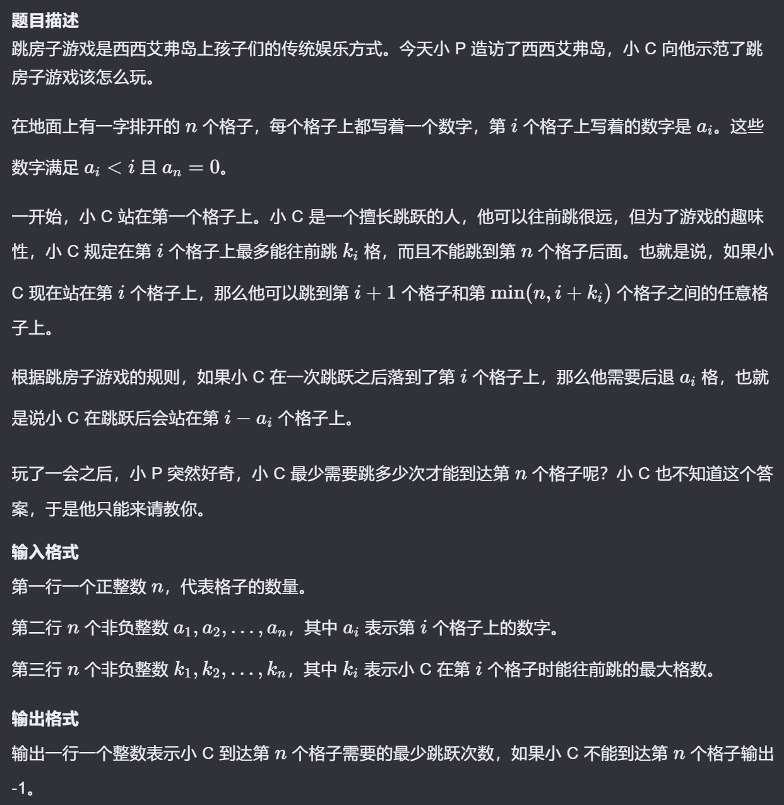

# 算法学习笔记

## 一、用dp数组代替递归

```cpp
#include<iostream>
using namespace std;
int find();
int chess[30][30]={0};
int n,m,x,y;
int output=0;
int nx=0,ny=0;
int main(){
    cin>>n>>m>>x>>y;
    chess[x][y]=-1;
    for(int i=0;i<=n;i++){
        for(int j=0;j<=m;j++){
            if((abs(i-x)+abs(j-y)==3)&&(j!=y)&&(i!=x)) chess[i][j]=-1;
        }
    }
    find();
    cout<<output;
}
int find(){
    if(chess[nx][ny]==-1) return 0;
    if(nx==n&&ny==m){
        output++;
        return 0;
    }
    if(nx<n){
        nx++;
        find();
        nx--;
    }
    if(ny<m){
        ny++;
        find();
        ny--;
    }
    return 0;
}
```

```cpp
#include<iostream>
using namespace std;

int chess[30][30] = {0};
long long dp[30][30] = {0};
int n, m, x, y;

int main() {
    cin >> n >> m >> x >> y;
    chess[x][y] = -1;

    // 标记马的控制范围
    int dx[] = {1, 2, 2, 1, -1, -2, -2, -1};
    int dy[] = {2, 1, -1, -2, -2, -1, 1, 2};
    for (int i = 0; i < 8; i++) {
        int nx = x + dx[i];
        int ny = y + dy[i];
        if (nx >= 0 && nx <= n && ny >= 0 && ny <= m) {
            chess[nx][ny] = -1;
        }
    }

    // 初始化dp数组
    dp[0][0] = 1;
    for (int i = 0; i <= n; i++) {
        for (int j = 0; j <= m; j++) {
            if (chess[i][j] == -1) {
                dp[i][j] = 0;
            } else {
                if (i > 0) dp[i][j] += dp[i-1][j];
                if (j > 0) dp[i][j] += dp[i][j-1];
            }
        }
    }

    cout << dp[n][m];
    return 0;
}
```

若直接使用递归则当数据较大时会出现超时的情况，此时需考虑**DP数组** （动态规划数组，Dynamic Programming Array）

### **DP数组的作用**

1. **记录子问题的解**
    
    动态规划将复杂问题分解为多个重叠的子问题，DP数组用于存储这些子问题的解，后续直接查表复用，避免重复计算。
    
2. **状态转移**
    
    DP数组中的每个元素通常代表某个状态的最优解（如最大值、最小值或可行解）。通过状态转移方程，从已知状态推导出未知状态的值。
    
3. **优化时间复杂度**
    
    通过空间换时间，将指数级复杂度的暴力递归转化为多项式复杂度（如O(n^2)）。
    

### **DP数组的常见形式**

根据问题复杂度，DP数组可以是一维、二维甚至多维：

- **一维数组** ：适用于单变量状态（如斐波那契数列、爬楼梯问题）。
    
    ```cpp
    dp[i] = dp[i-1] + dp[i-2]
    ```
    
- **二维数组** ：适用于双变量状态（如背包问题、最长公共子序列）。
    
    ```cpp
    dp[i][j] = max(dp[i-1][j], dp[i][j-1]) + 1
    ```
    

---

### **经典示例**

1. **斐波那契数列**
    
    递归解法重复计算严重，而DP数组只需线性时间：
    
    ```python
    dp = [0] * (n+1)
    dp[0] = 0
    dp[1] = 1
    for i in range(2, n+1):
        dp[i] = dp[i-1] + dp[i-2]
    ```
    
2. 走迷宫路径总数问题
    
    ```python
    dp[i][j] = dp[i-1][j] + dp[i][j-1]
    ```
    

---

### **关键点**

- **初始化** ：根据问题定义初始条件（如**`dp[0]`**或**`dp[0][0]`**）。
- **遍历顺序** ：确保状态转移时子问题的解已计算。
- **空间优化** ：部分问题可压缩DP数组维度（如用滚动数组将二维转一维）。

DP数组是解决最优化、计数类问题（如最长递增子序列、编辑距离）的重要工具，掌握其设计与状态转移方程是动态规划的关键。

## 二、用数组代替整数进行高精度计算

在C++中处理超大整数的高精度计算通常使用数组来模拟每一位数字，并手动实现算术运算。以下是详细的实现方法：

### **1. 存储方式**

使用`vector<int>`存储数字，​**低位在前**以便于处理进位和借位。例如，数值`1234`存储为`[4,3,2,1]`。

### **2. 输入输出转换**

将字符串转换为数组，并处理前导零：

```cpp
cpp
vector<int> stringToVector(const string& s) {
    vector<int> res;
    for (int i = s.size() - 1; i >= 0; --i) {
        res.push_back(s[i] - '0');
    }
// 去除输入的前导零，例如 "00123" -> "123"
    while (res.size() > 1 && res.back() == 0) {
        res.pop_back();
    }
    return res;
}

string vectorToString(const vector<int>& v) {
    if (v.empty()) return "0";
    string s;
    for (int i = v.size() - 1; i >= 0; --i) {
        s += (v[i] + '0');
    }
    return s;
}
```

### **3. 加法**

逐位相加并处理进位：

```cpp
cpp
vector<int> add(const vector<int>& a, const vector<int>& b) {
    vector<int> res;
    int carry = 0;
    for (int i = 0; i < max(a.size(), b.size()) || carry; ++i) {
        int digitA = (i < a.size()) ? a[i] : 0;
        int digitB = (i < b.size()) ? b[i] : 0;
        int sum = digitA + digitB + carry;
        res.push_back(sum % 10);
        carry = sum / 10;
    }
    return res;
}
```

### **4. 减法（假设a ≥ b）**

逐位相减并处理借位，最后去除前导零：

```cpp
cpp
vector<int> subtract(const vector<int>& a, const vector<int>& b) {
    vector<int> res;
    int borrow = 0;
    for (int i = 0; i < a.size(); ++i) {
        int digitA = a[i] - borrow;
        int digitB = (i < b.size()) ? b[i] : 0;
        borrow = (digitA < digitB) ? 1 : 0;
        if (borrow) digitA += 10;
        res.push_back(digitA - digitB);
    }
// 去除高位零
    while (res.size() > 1 && res.back() == 0) {
        res.pop_back();
    }
    return res;
}
```

### **5. 乘法**

按位相乘并累加，最后处理进位：

```cpp
cpp
vector<int> multiply(const vector<int>& a, const vector<int>& b) {
    vector<int> res(a.size() + b.size(), 0);
    for (int i = 0; i < a.size(); ++i) {
        for (int j = 0; j < b.size(); ++j) {
            res[i + j] += a[i] * b[j];
        }
    }
// 统一处理进位
    int carry = 0;
    for (int k = 0; k < res.size(); ++k) {
        int value = res[k] + carry;
        res[k] = value % 10;
        carry = value / 10;
    }
// 去除高位零
    while (res.size() > 1 && res.back() == 0) {
        res.pop_back();
    }
    return res;
}
```

### **6. 除法（高精度除以低精度）**

此处以高精度数除以普通整数为例：

```cpp
cpp
vector<int> divide(const vector<int>& a, int b, int& remainder) {
    vector<int> res;
    remainder = 0;
    for (int i = a.size() - 1; i >= 0; --i) {// 从高位开始处理
        remainder = remainder * 10 + a[i];
        res.push_back(remainder / b);
        remainder %= b;
    }
    reverse(res.begin(), res.end());
// 去除高位零
    while (res.size() > 1 && res.back() == 0) {
        res.pop_back();
    }
    return res;
}
```

### **7. 高精度比较**

比较两个高精度数的大小：

```cpp
cpp
int compare(const vector<int>& a, const vector<int>& b) {
    if (a.size() != b.size()) {
        return a.size() > b.size() ? 1 : -1;
    }
    for (int i = a.size() - 1; i >= 0; --i) {// 高位在数组末尾
        if (a[i] != b[i]) return a[i] > b[i] ? 1 : -1;
    }
    return 0;
}
```

### **8. 示例用法**

```cpp
cpp
int main() {
    string s1 = "123456789";
    string s2 = "987654321";

    vector<int> num1 = stringToVector(s1);
    vector<int> num2 = stringToVector(s2);

    vector<int> sum = add(num1, num2);
    cout << "Sum: " << vectorToString(sum) << endl;

    if (compare(num1, num2) >= 0) {
        vector<int> diff = subtract(num1, num2);
        cout << "Difference: " << vectorToString(diff) << endl;
    } else {
        cout << "num1 is smaller than num2" << endl;
    }

    vector<int> product = multiply(num1, num2);
    cout << "Product: " << vectorToString(product) << endl;

    int divisor = 123;
    int remainder;
    vector<int> quotient = divide(num1, divisor, remainder);
    cout << "Quotient: " << vectorToString(quotient)
         << ", Remainder: " << remainder << endl;

    return 0;
}
```

### **说明**

- ​**高精度除以高精度**的实现较为复杂，通常涉及试商法或二分查找，需要结合减法、乘法和比较操作。
- 上述代码未处理负数，实际应用中可添加符号位并在运算时处理符号逻辑。
- 除法示例展示了除以普通整数的方法，高精度之间的除法需要更复杂的逻辑，建议参考专门的高精度算法库或进一步学习试商法。

## 三、BFS与并查集路径压缩



```cpp
#include <bits/stdc++.h>
using namespace std;

const int MAXN = 1e5 + 5;

// 并查集相关
int fa[MAXN]; // 并查集数组，用于快速找到未处理的节点

// 路径压缩的查找函数
int find(int x) {
    if (fa[x] != x) fa[x] = find(fa[x]); // 路径压缩优化
    return fa[x];
}

int main() {
    int n;
    cin >> n;
    int a[n+1], k[n+1], dp[n+1]; // 输入数据数组和DP数组

    // 读取输入数据
    for (int i = 1; i <= n; i++) {
        cin >> a[i];
        dp[i] = -1; // 初始化DP为-1（表示未到达）
    }
    for (int i = 1; i <= n; i++) {
        cin >> k[i];
    }

    // 预处理：计算每个位置j跳跃后的实际目标位置
    int pos[n+1]; // pos[j] = j - a[j]
    for (int j = 1; j <= n; j++) {
        pos[j] = j - a[j];
    }

    // 初始化并查集（每个位置指向自己）
    for (int j = 1; j <= n+1; j++) {
        fa[j] = j;
    }

    // BFS初始化
    queue<int> q;
    dp[1] = 0;    // 起点步数为0
    q.push(1);    // 从起点开始搜索

    while (!q.empty()) {
        int i = q.front(); // 当前处理的位置
        q.pop();

        // 确定跳跃范围[i+1, i+k[i]]
        int start = i + 1;
        int end = i + k[i];
        if (end > n) end = n; // 防止越界

        if (start > end) continue; // 无效范围直接跳过

        // 使用并查集快速遍历可到达的节点
        int j = find(start); // 找到第一个未处理的节点
        while (j <= end) {
            int p = pos[j]; // 计算实际目标位置

            // 如果目标位置未到达过
            if (dp[p] == -1) {
                dp[p] = dp[i] + 1; // 更新步数
                q.push(p);         // 加入队列继续搜索
            }

            // 将当前节点标记为已处理（指向下一个位置）
            fa[j] = find(j + 1);
            // 继续查找下一个未处理的节点
            j = find(j);
        }
    }

    cout << dp[n]; // 输出到达终点的最小步数
    return 0;
}
```

### 重点：fa[i]数组与find函数来避免重复处理

考虑使用BFS（广度优先处理），则每个节点只需被处理一次（相同节点的后续处理所用步数一定大于第一次处理）。利用fa数组则可以索引到下一个未被处理过的节点。

在代码中，`fa[i]` 是**并查集（Union-Find）的数据结构**，其核心意义是**动态维护未处理的节点，实现跳跃式遍历的高效性**。以下是具体解析：

---

### **`fa[i]` 的核心意义**

1. **初始状态**：
    - 每个位置 `i` 的 `fa[i]` 初始化为 `i`（即指向自己）。
    - **含义**：所有位置均未被处理，属于独立的集合。
2. **处理过程中的动态更新**：
    - 当处理位置 `i` 的跳跃范围 `[i+1, i+k[i]]` 时，通过 `find` 函数快速找到该范围内第一个未处理的节点 `j`。
    - **处理完 `j` 后**：将 `fa[j]` 指向 `j+1`，即 `fa[j] = find(j+1)`。
    - **效果**：后续再次访问到 `j` 时，`find(j)` 会直接跳过 `j`，返回 `j+1` 的根节点。
3. **路径压缩优化**：
    - `find` 函数通过递归路径压缩，使得每个节点的父节点直接指向根节点。
    - **结果**：`fa[i]` 最终形成一个“指针链”，将所有已处理的节点链接到未处理节点的起始位置。

---

### **`fa[i]` 的具体作用**

**1. 快速定位未处理的节点**

- **问题**：在 BFS 遍历中，每次需要处理 `[i+1, i+k[i]]` 范围内的节点。若逐个检查是否已处理，时间复杂度为 O(n²)。
- **解决方案**：
    - 使用 `find(j)` 找到范围内第一个未被处理的节点。
    - 例如，若 `j=2` 已处理，则 `find(2)` 返回 `3`，直接跳过已处理的 `2`。

**2. 标记已处理的节点**

- **操作**：处理完节点 `j` 后，执行 `fa[j] = find(j+1)`。
- **效果**：
    - 将 `j` 的父节点指向 `j+1` 的根节点。
    - 后续调用 `find(j)` 时，直接返回 `j+1` 的根节点，从而跳过 `j`。

**3. 维护跳跃式遍历**

- **关键逻辑**：
    
    ```cpp
    cpp
    int j = find(start);// 找到第一个未处理的节点
    while (j <= end) {
        process(j);// 处理节点 j
        fa[j] = find(j+1);// 标记 j 为已处理
        j = find(j);// 跳转到下一个未处理的节点
    }
    ```
    
- **过程示意图**：
    
    ```
    初始状态: [1]->1, [2]->2, [3]->3, [4]->4, [5]->5
    处理 j=2 后: [2]->3, [3]->3 → find(2) 返回 3
    处理 j=3 后: [3]->4, [4]->4 → find(3) 返回 4
    ```
    

---

### **示例演算**

假设 `n=5`，初始 `fa[] = [1,2,3,4,5]`：

| **步骤** | **操作** | **`fa[]` 变化** | **说明** |
| --- | --- | --- | --- |
| 1 | 处理 `i=1`，范围 `[2,3]` | `fa[2]=3`, `fa[3]=4` | `find(2)` 直接返回 3 → 跳过 2 |
| 2 | 处理 `i=3`，范围 `[4,6]` | `fa[4]=5`, `fa[5]=6` | `find(4)` 返回 5 → 处理 4 |

最终，所有节点被高效处理，无需重复检查。

---

### **为什么需要 `fa[i]`？**

1. **避免重复处理**：
    - 通过 `fa[i]` 的指针链，确保每个节点仅被处理一次。
2. **时间复杂度优化**：
    - 传统 BFS 遍历需要 O(n²) 时间（每次检查所有跳跃位置）。
    - 使用并查集后，时间复杂度降至 **O(n α(n))**（接近线性）。

---

### **路径压缩的目标**

- **核心问题**：传统的并查集在多次合并后，树可能退化成链状结构（如 `1 → 2 → 3 → 4`），导致查找根节点的复杂度为 **O(n)**。
- **优化目标**：通过压缩查找路径，使得每个节点直接指向根节点，降低后续查找的时间复杂度至 **接近 O(1)**。

---

### **路径压缩的实现**

在代码中，路径压缩通过递归或迭代的查找函数实现。以下是代码中的关键函数：

```cpp
cpp
int find(int x) {
    if (fa[x] != x)
        fa[x] = find(fa[x]);// 递归路径压缩
    return fa[x];
}
```

### **递归压缩过程**

1. **查找根节点**：递归查找 `x` 的父节点，直到找到根节点（`fa[root] = root`）。
2. **压缩路径**：在递归返回时，将路径上的所有节点直接指向根节点。

### **示例演算**

假设初始树结构为 `1 → 2 → 3 → 4`（根节点是1）：

- **调用 `find(4)`**：
    - `fa[4] = 3` → 递归调用 `find(3)`。
    - `fa[3] = 2` → 递归调用 `find(2)`。
    - `fa[2] = 1` → 递归调用 `find(1)`（根节点）。
    - **回溯时更新路径**：
        - `fa[3] = 1`（原指向2，现在直接指向根1）。
        - `fa[4] = 1`（原指向3，现在直接指向根1）。
- **最终树结构**：所有节点直接指向根节点 `1`。

---

### **路径压缩的复杂度分析**

- **单次查找**：接近 **O(1)**（严格来说是 O(α(n))，其中 α 是阿克曼函数的反函数，增长极慢）。
- **多次操作**：经过路径压缩后，N 次操作的均摊时间复杂度接近 **O(N)**。

---

### **路径压缩的适用场景**

1. **频繁查找操作**：需要多次查询根节点的场景（如动态连通性问题）。
2. **大规模数据**：当数据量极大时，路径压缩的优化效果显著。
3. **与 BFS/DFS 结合**：在需要高效跳过已处理节点的算法中（如本题的跳跃问题）。

## 四、线段树

已知一个数列，你需要进行下面两种操作：

1. 将某区间内的每一个数加上k
2. 求出某空间内的所有数的和

使用常规方法则每次操作的时间复杂度均为O(n)，考虑使用线段树将时间复杂度缩短到O(log n) 


线段树模板：

```cpp
#include <bits/stdc++.h>
using namespace std;
using ll=long long;
ll n, a[100005], d[270000], b[270000]; 
// n:数组长度 a:原数组 d:线段树数组 b:懒标记数组
//build:建树 update:更新 getsum:查询
void build(ll l,ll r,ll p){  // l:区间左端点 r:区间右端点 p:节点标号
    if(l==r){
        d[p]=a[l];
        return;
    }
    ll m = l + (r-l)/2;
    build(l,m,p*2);
    build(m+1,r,p*2+1);
    d[p]=d[p*2]+d[p*2+1];
}

void update(ll l,ll r,ll c,ll s,ll t,ll p){  // l:区间左端点 r:区间右端点 c:增加的值 s:修改的区间左端点 t:修改的区间右端点 p:节点标号
    if(l<=s && t<=r){
        d[p]+=(t-s+1)*c;
        b[p]+=c;
        return;
    }
    ll m = s + (t-s)/2;
    if(b[p]){
        d[p*2]+=(m-s+1)*b[p];
        d[p*2+1]+=(t-m)*b[p];
        b[p*2]+=b[p];
        b[p*2+1]+=b[p];
        b[p]=0;
    }
    if(l<=m) update(l,r,c,s,m,p*2);
    if(r>m) update(l,r,c,m+1,t,p*2+1);
    d[p]=d[p*2]+d[p*2+1];
}

ll getsum(ll l,ll r,ll s,ll t,ll p){ // l:区间左端点 r:区间右端点 s:查询的区间左端点 t:查询的区间右端点 p:节点标号  
    if(l<=s && t<=r) return d[p];
    ll m = s + (t-s)/2;
    if(b[p]){
        d[p*2]+=(m-s+1)*b[p];
        d[p*2+1]+=(t-m)*b[p];
        b[p*2]+=b[p];
        b[p*2+1]+=b[p];
        b[p]=0;
    }
    ll sum=0;
    if(l<=m) sum+=getsum(l,r,s,m,p*2);
    if(r>m) sum+=getsum(l,r,m+1,t,p*2+1);
    return sum;
}
int main(){
    ll q,i1,i2,i3,i4;
    cin>>n>>q;
    for(ll i=1;i<=n;i++) cin>>a[i];
    build(1,n,1);
    while(q--){
        cin>>i1>>i2>>i3;
        if(i1==2){
            cout<<getsum(i2,i3,1,n,1)<<endl;
        }else{
            cin>>i4;
            update(i2,i3,i4,1,n,1);
        }
    }
    return 0;
}
```