# 信号与系统

# 第一章 绪论

## 1.1 信号的概念与分类

### 1.1.1 信号的定义

信号是**随着时间变化的某种物理量**。数学上，信号是一个或多个变量的函数；形态上，信号表现为一种波形。

---

### 1.1.2 信号的分类

#### a. 按确定性分类

| 类型 | 特点 |
| :--- | :--- |
| **确定信号** | 可用确定的时间函数表示，给定 $t$ 可确定唯一函数值 |
| **随机信号** | 不是时间的确定函数，只能用概率统计方法描述；工程中绝大多数实际信号（含噪声、干扰）均为此类 |

---

#### b. 按时间变量特性分类

| 类型 | 幅值 | 时间 |
| :--- | :--- | :--- |
| **模拟信号** | 连续 | 连续 |
| **量化信号** | 离散 | 连续 |
| **抽样信号** | 连续 | 离散 |
| **数字信号** | 离散 | 离散 |

---

#### c. 按周期性分类

**连续周期信号**： $f(t) = f(t + T)$，满足上式的最小正数 $T$ 称为周期。

**离散周期信号**： $f(k) = f(k + N)$，满足上式的最小正整数 $N$ 称为周期。

> **判周期例题**：
> - $\cos(10t) - \cos(30t)$：$T_1=2\pi/10,\ T_2=2\pi/30$，有公倍数 → 周期信号
> - $\cos(2t) - \cos(\pi t)$：$T_1=\pi,\ T_2=2$，两周期不可公度 → **非周期信号**
> - $e^{j2t}$：周期信号（$T=\pi$）
> - $[5\sin(8t)]^2$：周期信号（降幂变为 $\frac{25}{2}(1-\cos 16t)$，$T=\pi/8$）

---

#### d. 按能量/功率特性分类

以 $1\Omega$ 电阻上的能量与功率为标准：

**连续信号**：

$$
E = \lim_{T \to \infty} \int_{-\frac{T}{2}}^{\frac{T}{2}} |f(t)|^2 dt, \qquad
P = \lim_{T \to \infty} \frac{1}{T} \int_{-\frac{T}{2}}^{\frac{T}{2}} |f(t)|^2 dt
$$

**离散信号**：

$$
E = \lim_{N \to \infty} \sum_{-N}^{N} |f(k)|^2, \qquad
P = \lim_{N \to \infty} \frac{1}{2N+1} \sum_{-N}^{N} |f(k)|^2
$$

| 类型 | 条件 |
| :--- | :--- |
| **能量信号** | $E$ 为有限值，$P = 0$ |
| **功率信号** | $P$ 为有限值，$E \to \infty$ |
| 两者皆非 | $E \to \infty$ 且 $P \to \infty$（如 $f(k)=0.5^k$） |

> 典型结论：**周期信号是功率信号**。$\cos(\omega t)$ 的 $P = \frac{1}{2}$，$E \to \infty$。

---

## 1.2 信号的运算

| 运算 | 表达式 | 效果 |
| :--- | :--- | :--- |
| 相加/相乘 | $f_1(t) \pm f_2(t)$、$f_1(t) \cdot f_2(t)$ | 调制、解调的基础 |
| **延时** | $f(t - t_0)$ | $t_0>0$ 右移（延迟），$t_0<0$ 左移（超前） |
| **反褶** | $f(-t)$ | 以纵轴为镜像翻转 |
| **尺度变换** | $f(at)$ | $a>1$ 压缩，$0<a<1$ 拉伸 |
| 微分/积分 | $\frac{df}{dt}$、$\int f dt$ | 时域分析基本运算 |

### 复合变换例题

将 $f(-2t)$ 向右平移 $\frac{5}{2}$，得到 $f[-2(t - \frac{5}{2})] = f(-2t + 5)$。

> 处理复合变换时，先写成 $f[a(t - t_0)]$ 形式，$a$ 为尺度 + 反褶，$t_0$ 为平移量。

---

## 1.3 系统的概念与分类

### 1.3.1 系统的定义

系统是由**相互作用和相互依赖**的若干组成部分结合而成的具有**特定功能**的有机整体。

系统的基本模型：

$$
\boxed{\text{激励 } e(t) \longrightarrow \boxed{\text{系统}} \longrightarrow \text{响应 } r(t)}
$$

---

### 1.3.2 系统的分类

#### a. 线性系统与非线性系统

**线性系统**须同时满足：

| 性质 | 定义 |
| :--- | :--- |
| **齐次性** | $e(t) \to r(t)$，则 $ke(t) \to kr(t)$ |
| **叠加性** | $e_1 \to r_1,\ e_2 \to r_2$，则 $e_1+e_2 \to r_1+r_2$ |

> **判定例题**（初始状态为零）：
> - $y(t) = 2e(t) + 10$ → **非线性**（常数项 10 破坏齐次性）
> - $y(t) = 10[e(t)]^2$ → **非线性**（平方不满足叠加）
> - $y(t) = \frac{d}{dt}e(t)$ → **线性** ✓
> - $y(t) = \int_0^t e(t)dt$ → **线性** ✓

#### b. 时不变系统与时变系统

| 判定 | 说明 |
| :--- | :--- |
| $e(t) \to r(t)$，则 $e(t-t_0) \to r(t-t_0)$ | **时不变**：响应形状不随激励施加时间改变 |
| 否则 | **时变** |

#### c. 因果系统与非因果系统

| 判定 | 说明 |
| :--- | :--- |
| 响应**不早于**激励 | **因果系统**（物理可实现） |
| 响应出现于激励之前 | **非因果系统**（物理不可实现） |

> $t=0$ 接入的信号称为**因果信号**（有始信号）。因果系统在因果信号激励下，响应也为因果信号。

#### d. 综合判定例题

试判断以下系统是否为线性、时不变、因果：

| 系统 | 线性 | 时不变 | 因果 |
| :--- | :---: | :---: | :---: |
| $y(t) = e^{x(t)}$ | ✗ | ✓ | ✓ |
| $y(t) = \frac{dx(t)}{dt}$ | ✓ | ✓ | ✓ |
| $y(t) = \sin(6t)x(t)$ | ✓ | ✗ | ✓ |
| $y(t) = \int_{-\infty}^{5t} x(\tau)d\tau$ | ✓ | ✗ | ✗ |
| $y(t) = x(\frac{t}{3})$ | ✓ | ✗ | ✗ |

---

## 1.4 系统分析的三类问题

$$
\text{激励 } e(t) \longrightarrow \boxed{\text{系统 } h(t)} \longrightarrow \text{响应 } r(t)
$$

| 问题类型 | 已知 | 求 |
| :--- | :--- | :--- |
| **系统分析** | 系统特性 + 输入信号 | 输出响应 |
| **系统辨识** | 输入信号 + 输出信号 | 系统特性 |
| **系统综合** | 输入信号 + 期望输出 | 构造系统 |

> 本课程主要研究**系统分析**——已知 LTI 系统特性和输入信号，求系统的输出响应。

---

## 1.5 课程知识体系总览

| | 时域 | 频域 | 复频域(z域) |
| :--- | :---: | :---: | :---: |
| **连续信号与系统** | 第1-2章 | 第3-4章 | 第5-6章 |
| **离散信号与系统** | 第7章 | 第8章 | 第8章 |

核心线索：信号 $\to$ 系统 $\to$ 响应，在三个域中依次展开。


# 第二章 连续时间系统的时域分析

## 2.1 微分方程的求解

### 2.1.1 数学模型求解——经典法

系统响应的经典法求解流程如下：

$$
\begin{aligned}
&\text{系统} \xrightarrow{\text{建立}} \text{系统的微分方程} \xrightarrow{\text{求解}} \text{特征根} \xrightarrow{\text{写出}} \text{齐次通解 } y_{h}(t) \\
&\quad \xrightarrow{\text{由激励函数}} \text{得到特解 } y_{p}(t) \xrightarrow{\text{叠加}} \text{全响应 } y(t) = y_{h}(t) + y_{p}(t)
\end{aligned}
$$

---

### 2.1.2 二阶齐次微分方程的经典解法

#### 1. 标准形式与解算思路

二阶齐次微分方程的标准形式为：

$$
y ^ {\prime \prime} + p y ^ {\prime} + q y = 0
$$

解算思路采用**拼凑法**，猜想方程解的形式为：

$$
y = e ^ {\lambda x}
$$

代入方程，可得：

$$
(\lambda^ {2} + p \lambda + q) e ^ {\lambda x} = 0
$$

$$
\begin{array}{r l} & {\because e ^ {\lambda x} \neq 0} \\ & {\therefore \lambda^ {2} + p \lambda + q = 0} \quad \text{（特征方程）} \end{array}
$$

---

#### 2. 特征根与通解

特征方程的根为： $\lambda_{1,2} = \frac{-p\pm\sqrt{p^2 - 4q}}{2}$

令 $\Delta = \mathrm{p}^2 - 4\mathrm{q}$ ，分三种情况讨论：

---

**情况一： $\Delta > 0$ （两不等实根）**

有两线性无关的特解： $y_{1} = e^{\lambda_{1}t}$ 和 $y_{2} = e^{\lambda_{2}t}$

通解为：

$$
y = c_{1}e^{\lambda_{1}t} + c_{2}e^{\lambda_{2}t}
$$

---

**情况二： $\Delta = 0$ （重根）**

此时 $\lambda_{1} = \lambda_{2} = -\frac{p}{2}$ ，得一个特解为： $y_{1} = e^{\lambda_{1}t}$

设另一特解为 $y_{2}=u(t)e^{\lambda_{1}t}$ ，代入方程并化简：

$$
u ^ {\prime \prime} + (2 \lambda_ {1} + p) u ^ {\prime} + (\lambda_ {1} ^ {2} + p \lambda_ {1} + q) u = 0,
$$

比较等式两边:

$\because u^{\prime \prime} = 0\therefore$ 取 $u = t$ ，得另一特解为： $y_{2} = te^{\lambda_{1}t}$

通解为：

$$
y = (c_{1} + c_{2}t)e^{\lambda_{1}t}
$$

> **疑问1：为什么在重根的时候，还有另一个特解？**
> 由线性微分方程理论，二阶方程通解应含有两个线性无关的特解。重根时仅得到一个指数特解 $e^{\lambda t}$，需通过降阶法寻找另一个与 $e^{\lambda t}$ 线性无关的特解。
>
> **疑问2：为什么可以取 $u = t$ ，而不是 $u = at + b$ ？**
> 推导中利用重根条件 $\lambda_1^2 + p\lambda_1 + q = 0$ 且 $2\lambda_1 + p = 0$，方程退化为 $u'' = 0$。其通解为 $u = at + b$，代入后常数项 $b$ 与已有解 $e^{\lambda_1 t}$ 线性相关（被 $c_1$ 吸收），故只需保留 $u = t$（即 $a=1, b=0$）。

---

**情况三： $\Delta < 0$ （共轭复根）**

有一对共轭的复根：

$$
\lambda_ {1} = \alpha + j \beta , \quad \lambda_ {2} = \alpha - j \beta
$$

因此有特解： $y_{1} = e^{(\alpha + j\beta)t}, \quad y_{2} = e^{(\alpha - j\beta)t}$

利用欧拉公式 $e^{j\theta} = \cos\theta + j\sin\theta$，构造实函数形式的特解：

$$
\bar {y} _ {1} = \frac {1}{2} (y _ {1} + y _ {2}) = e ^ {\alpha t} \cos \beta t
$$

$$
\bar {y} _ {2} = \frac {1}{2 j} (y _ {1} - y _ {2}) = e ^ {\alpha t} \sin \beta t
$$

通解为：

$$
y = e^{\alpha t}(c_{1}\cos \beta t + c_{2}\sin \beta t)
$$

> **疑问：为什么利用欧拉公式？**
> 复指数形式的解虽数学正确，但工程中信号均为实信号。通过欧拉公式将复指数解线性组合为 $\cos$ 和 $\sin$ 形式的实解，其线性组合与原复指数解等价，且更直观地反映了系统的振荡特性。

---

#### 3. 典型例题

**例题1**：求解 $y'' - 2y' - 3y = 0$

- 特征方程： $\lambda^2 - 2\lambda - 3 = 0$
- 特征根： $\lambda_{1} = -1, \quad \lambda_{2} = 3$
- 通解： $y = c_{1}e^{-t} + c_{2}e^{3t}$

---

**例题2**：求解 $y'' + 4y' + 4y = 0$

- 特征方程： $\lambda^2 + 4\lambda + 4 = 0$
- 特征根： $\lambda_{1} = \lambda_{2} = -2$
- 通解： $y = (c_{1} + c_{2}t)e^{-2t}$

---

### 2.1.3 N阶齐次微分方程的经典解法

N阶齐次微分方程的标准形式为：

$$
y ^ {(n)} + P _ {1} y ^ {(n - 1)} + \dots + P _ {n - 1} y ^ {\prime} + P _ {n} y = 0
$$

特征方程为：

$$
\lambda^ {n} + P _ {1} \lambda^ {n - 1} + \dots + P _ {n - 1} \lambda + P _ {n} = 0
$$

通解由特征根的类型与重数确定：

| 特征方程的根 | 通解中的对应项 |
| :--- | :--- |
| 若是 $k$ 重实根 $r$ | $(C_0 + C_1x + \cdots + C_{k-1}x^{k-1})e^{rx}$ |
| 若是 $k$ 重共轭复根 $\alpha \pm j\beta$ | $[(C_0 + C_1x + \cdots + C_{k-1}x^{k-1})\cos\beta x + (D_0 + D_1x + \cdots + D_{k-1}x^{k-1})\sin\beta x]e^{\alpha x}$ |

---

### 2.1.4 二阶非齐次微分方程的经典解法

#### 1. 标准形式与解算思路

二阶非齐次微分方程的标准形式为：

$$
y ^ {\prime \prime} + p y ^ {\prime} + q y = f (x)
$$

解算思路仍采用**拼凑法**，针对不同的激励函数有不同的拼凑方式。

最基本的激励函数类型为：

$$
P _ {m} (x) e ^ {\gamma x}, \quad \text{其中 } P _ {m} (x) \text{ 是 } m \text{ 次代数多项式}
$$

> 常见类型如直流型、正弦型，均可以通过欧拉公式等方法，由基本的指数型组合而成。

---

#### 2. 特解的确定方法

设方程的特解为： $\bar{y} = Q_{m}(t)e^{\gamma t}$ ，其中 $Q_{m}(t)$ 是 $m$ 次待定多项式。

代入方程并化简可得：

$$
Q ^ {\prime \prime} + (2 \gamma + p) Q ^ {\prime} + (\gamma^ {2} + p \gamma + q) Q = P _ {m}
$$

根据 $\gamma$ 与特征根的关系，分以下三种情况：

| $\gamma$ 与特征根的关系 | 特解形式 | $k$ 的值 |
| :--- | :--- | :---: |
| $\gamma$ **不是**特征根 | $\bar{y} = Q_{m}(t)e^{\gamma t}$ | $0$ |
| $\gamma$ 是特征方程的**单根** | $\bar{y} = tQ_{m}(t)e^{\gamma t}$ | $1$ |
| $\gamma$ 是特征方程的**重根** | $\bar{y} = t^2 Q_m(t)e^{\gamma t}$ | $2$ |

将 $\bar{y}$ 代入原方程并化简，比较等式两边多项式同次幂的系数，即可解出 $Q_{m}(t)$ 的待定系数。

---

#### 3. 特殊情况： $P_m(x) = A$ （常系数激励）

当激励为常数 $A$ 时，特解可直接写出：

$$
\bar{y} = \begin{cases}
\dfrac{A}{\gamma^2 + p\gamma + q} e^{\gamma x}, & \gamma \text{ 不是特征方程的根} \\[12pt]
\dfrac{A}{2\gamma + p} x e^{\gamma x}, & \gamma \text{ 是特征方程的单根} \\[12pt]
\dfrac{A}{2} x^2 e^{\gamma x}, & \gamma \text{ 是特征方程的重根}
\end{cases}
$$

> 当 $\gamma$ 等于特征根时，分母趋于零，响应幅度随 $x$ 增长——此即**共振现象**。

---

#### 4. 典型例题

**例题1**：求通解 $y'' + 6y' + 9y = 5xe^{-3x}$

- 特征方程： $\lambda^2 + 6\lambda + 9 = 0$
- 特征根： $\lambda_{1} = \lambda_{2} = -3$
- 齐次通解： $Y = (c_{1} + c_{2}x)e^{-3x}$
- $\because \lambda = -3$ 是重根， $\therefore$ 设特解 $\bar{y} = x^{2}(Ax + B)e^{-3x}$
- 代入原方程并化简： $6Ax + 2B = 5x$
- 比较多项式系数： $A = \frac{5}{6}$ ， $B = 0$
- 通解： $y = Y + \bar{y} = (c_{1} + c_{2}x + \frac{5}{6} x^{3})e^{-3x}$

---

**例题2**：已知某线性时不变连续时间系统的动态方程为：

$$
y^{\prime \prime} + 6y^{\prime} + 8y = e^{-t}, \quad y(0) = 1,\; y^\prime (0) = 2
$$

求系统的完全响应 $y(t)$ 。

- 齐次特征方程： $\lambda^2 + 6\lambda + 8 = 0$，特征根 $\lambda_1 = -2, \lambda_2 = -4$
- 齐次通解： $y_h = c_1 e^{-2t} + c_2 e^{-4t}$
- $\gamma = -1$ 不是特征根，设特解 $y_p = Ae^{-t}$，代入得 $A = \frac{1}{3}$
- 通解： $y(t) = c_1 e^{-2t} + c_2 e^{-4t} + \frac{1}{3} e^{-t}$
- 代入初始条件 $y(0)=1, y'(0)=2$，解方程组得：

$$
c _ {1} = \frac {5}{2}, \quad c _ {2} = - \frac {1 1}{6}
$$

- 完全响应： $y(t) = \frac{5}{2} e^{-2t} - \frac{11}{6} e^{-4t} + \frac{1}{3} e^{-t}$

---

**例题3**：求解 $y'' + 5y' + 6y = e^{-2t}$ ，其中 $y(0) = 1$ ， $y'(0) = 0$

- 特征方程： $\lambda^2 + 5\lambda + 6 = 0$
- 特征根： $\lambda_{1} = -2$ ， $\lambda_{2} = -3$
- 齐次通解： $Y = c_{1}e^{-2t} + c_{2}e^{-3t}$
- $\because$ 激励中的 $\gamma = -2 = \lambda_1$ 是单根， $\therefore$ 设特解 $\bar{y} = t \cdot Ae^{-2t}$（即 $p_2 t e^{-2t}$）
- 代入原方程，求得 $p_2 = 1$
- 通解： $y = (c_1 + p_1) e^{-2t} + c_2 e^{-3t} + t e^{-2t}$
- 代入初始条件，解方程组得： $(c_1 + p_1) = 2, \quad c_2 = -1$
- 全解： $y = 2e^{-2t} - e^{-3t} + te^{-2t}$

---

### 2.1.5 系统方程的算子表示法

#### 1. 基本算子定义

为简化微分/积分方程的书写与运算，引入**微分算子** $p$ 和**积分算子** $\frac{1}{p}$：

| 算子 | 定义 | 作用 |
| :--- | :--- | :--- |
| 一阶微分算子 | $p = \frac{d}{dt}$ | $px = \frac{dx}{dt}$ |
| $n$ 阶微分算子 | $p^n = \frac{d^n}{dt^n}$ | $p^n x = \frac{d^n x}{dt^n}$ |
| 积分算子 | $\frac{1}{p} = \int_{-\infty}^{t} (\cdot) d\tau$ | $\frac{1}{p}x = \int_{-\infty}^{t} x(\tau) d\tau$ |

---

#### 2. 微分方程的算子形式

对于 $n$ 阶线性常系数微分方程：

$$
\begin{array}{r}
\frac {d ^ {n} r (t)}{d t ^ {n}} + a _ {n - 1} \frac {d ^ {n - 1} r (t)}{d t ^ {n - 1}} + \dots + a _ {1} \frac {d r (t)}{d t} + a _ {0} r (t) = \\
b _ {m} \frac {d ^ {m} e (t)}{d t ^ {m}} + b _ {m - 1} \frac {d ^ {m - 1} e (t)}{d t ^ {m - 1}} + \dots + b _ {1} \frac {d e (t)}{d t} + b _ {0} e (t)
\end{array}
$$

用 $p$ 替换微分符号，可写成算子形式：

$$
(p ^ {n} + a _ {n - 1} p ^ {n - 1} + \dots + a _ {1} p + a _ {0}) r (t) = (b _ {m} p ^ {m} + b _ {m - 1} p ^ {m - 1} + \dots + b _ {1} p + b _ {0}) e (t)
$$

记为：

$$
D(p) r(t) = N(p) e(t) \qquad \text{或} \qquad r(t) = \frac{N(p)}{D(p)} e(t)
$$

---

#### 3. 转移算子

定义系统**转移算子** $H(p)$：

$$
H(p) = \frac{N(p)}{D(p)} = \frac{b_m p^m + b_{m-1} p^{m-1} + \dots + b_1 p + b_0}{p^n + a_{n-1} p^{n-1} + \dots + a_1 p + a_0}
$$

此时响应与激励的关系可简写为：

$$
r(t) = H(p) e(t)
$$

> - 由微分方程的算子形式可以很方便地得到方程的解；
> - 算子形式的微分方程与其拉普拉斯变换式形式类似，转移算子也与系统函数的形式类似。

**练习**：写出下列微分方程的转移算子。

$$
\frac {d ^ {2}}{d t ^ {2}} r (t) + 4 \frac {d}{d t} r (t) + 4 r (t) = 2 \frac {d ^ {2}}{d t ^ {2}} e (t) + 9 \frac {d}{d t} e (t) + 11 e (t)
$$

**解**：用微分算子 $p$ 替换 $\frac{d}{dt}$，得：

$$
(p^2 + 4p + 4) r(t) = (2p^2 + 9p + 11) e(t)
$$

转移算子为：

$$
H(p) = \frac{2p^2 + 9p + 11}{p^2 + 4p + 4} = \frac{2p^2 + 9p + 11}{(p+2)^2}
$$

---

### 2.1.6 算子的运算性质

算子 $p$ 不是代数量，其运算规则与代数运算有同有异。

---

**性质1（多项式展开与因式分解）**

以 $p$ 的正幂多项式出现的运算式，在形式上可以像代数多项式那样进行展开和因式分解。例如：

$$
\begin{array}{l}
(p + 2) (p + 3) y (t) = (p ^ {2} + 5 p + 6) y (t) \\
(p ^ {2} - 4) f (t) = (p + 2) (p - 2) f (t)
\end{array}
$$

---

**性质2（乘法交换律）**

设 $A(p)$ 和 $B(p)$ 是 $p$ 的正幂多项式，则：

$$
A(p) B(p) f(t) = B(p) A(p) f(t)
$$

---

**性质3（公因式不可随意消去）**

微分算子方程等号两边 $p$ 的公因式**不能随便消去**。

例如，由 $p y(t) = p f(t)$ 不能随意消去 $p$ 而得到 $y(t) = f(t)$。因为 $y(t)$ 与 $f(t)$ 之间可以相差一个常数 $c$，正确结果是：

$$
y(t) = f(t) + c
$$

同理，由 $(p + a)y(t) = (p + a)f(t)$ 消去 $(p + a)$ 后，正确关系为：

$$
y(t) = f(t) + c e^{-a t}
$$

> 这是因为微分运算会丢失常数信息，消去微分算子相当于忽略积分常数。

---

**性质4（微分与积分的次序不可随意交换）**

$$
D(p) \cdot \frac{A(p)}{D(p) B(p)} f(t) = \frac{A(p)}{B(p)} f(t)
$$

但是：

$$
\frac{A(p)}{B(p) D(p)} \cdot D(p) f(t) \neq \frac{A(p)}{B(p)} f(t)
$$

例如：

$$
p \cdot \frac{1}{p} f(t) = \frac{d}{dt} \int_{-\infty}^{t} f(\tau) d\tau = f(t)
$$

而：

$$
\frac{1}{p} \cdot p f(t) = \int_{-\infty}^{t} \left( \frac{d}{d\tau} f(\tau) \right) d\tau = f(t) - f(-\infty) \neq f(t)
$$

> **结论**：先积分后微分可抵消（结果仍为原函数），但先微分后积分会产生一个积分常数，因此微分和积分的次序不能随意颠倒，等式两边的 $p$ 也不能直接约去。

---

### 2.1.7 算子方程的应用场景

1. **零输入响应求解**：激励 $e(t)=0$，解齐次方程 $D(p)r(t)=0$，形式与代数多项式求根一致，根对应系统特征根。
2. **零状态响应求解**：利用 $r(t)=H(p)e(t)$，结合转移算子与激励的卷积关系求解。
3. **电路建模简化**：
   - 电感： $u_L(t) = L\frac{di_L}{dt} = Lp \cdot i_L(t)$
   - 电容： $u_C(t) = \frac{1}{C}\int_{-\infty}^{t}i_C(\tau)d\tau = \frac{1}{Cp} \cdot i_C(t)$

---

## 2.2 系统的零输入响应

### 2.2.1 基本概念与定义

#### 1. 问题的完整描述

求解一个连续时间系统的响应，通常需要三要素：

| 要素 | 含义 | 示例 |
| :--- | :--- | :--- |
| **系统方程** | 描述输入-输出关系的微分方程 | $\frac{d^2 r}{dt^2} + 4\frac{dr}{dt} + 4r = 2\frac{d^2 e}{dt^2} + 9\frac{de}{dt} + 11e$ |
| **初始条件** | $t=0$ 时刻系统的储能状态 | $r(0) = 2,\; r'(0) = 1$ |
| **激励信号** | 外加输入（激励函数） | $e(t) = 2e^{-3t}$ |

---

#### 2. 零输入响应与零状态响应

系统的全响应可分解为两部分：

- **零输入响应** $r_{zi}(t)$：仅由初始时刻的**储能**（初始条件）引起的响应，此时激励 $e(t) = 0$。
- **零状态响应** $r_{zs}(t)$：仅由**激励信号**所产生的响应，此时初始状态为零。

$$
r(t) = r_{zi}(t) + r_{zs}(t)
$$

---

#### 3. 分解性与线性系统

一个系统若同时满足以下三个条件，则称其为**线性系统**：

1. **分解性**：能把由初始储能引起的响应和由激励引起的响应分离开来。
2. **零输入响应线性**：零输入响应与初始状态之间满足线性关系（叠加性+齐次性）。
3. **零状态响应线性**：零状态响应与激励之间满足线性关系。

> 常系数线性微分方程所描述的系统是线性系统，且是**线性时不变（LTI）系统**。

---

### 2.2.2 零输入响应的求解方法

#### 1. 与经典法齐次解的比较

| | 经典法求齐次解 | 求零输入响应 |
| :--- | :--- | :--- |
| **步骤1** | 建立系统的微分方程 | 建立系统的微分方程 |
| **步骤2** | 由特征方程求特征根 | 由特征方程求特征根 |
| **步骤3** | 由特征根得到齐次通解形式（含待定系数） | 由特征根得到通解形式（含待定系数） |
| **步骤4** | 由激励求特解 | **直接代入初始条件**求出待定系数 |
| **步骤5** | 全响应 = 齐次通解 + 特解，再代入初始条件定系数 | 得到零输入响应 $r_{zi}(t)$ |

> **关键区别**：零输入响应**不需要求特解**，待定系数直接由初始条件确定。因为此时激励 $e(t)=0$，响应仅由齐次方程的通解决定。

---

#### 2. 通解的一般形式

设 $n$ 阶系统的特征方程为：

$$
\lambda^ {n} + a _ {n - 1} \lambda^ {n - 1} + \dots + a _ {1} \lambda + a _ {0} = 0
$$

**单根情况**：若特征根为 $n$ 个单根 $\lambda_1, \lambda_2, \dots, \lambda_n$，则零输入响应形式为：

$$
r _ {zi} (t) = c _ {1} e ^ {\lambda_ {1} t} + c _ {2} e ^ {\lambda_ {2} t} + \ldots + c _ {n} e ^ {\lambda_ {n} t}
$$

**重根情况**：若特征根有重根，零输入响应的形式与齐次通解形式相同（参考 2.1.2 节的重根处理）。

---

#### 3. 待定系数的矩阵求解

$n$ 个待定系数 $c_1, c_2, \dots, c_n$ 由 $n$ 个初始条件 $r(0), r'(0), \dots, r^{(n-1)}(0)$ 唯一确定：

$$
{\begin{bmatrix}
c _ {1} \\ c _ {2} \\ c _ {3} \\ \vdots \\ c _ {n}
\end{bmatrix}} =
{\begin{bmatrix}
1 & 1 & 1 & \dots & 1 \\
\lambda_ {1} & \lambda_ {2} & \lambda_ {3} & \dots & \lambda_ {n} \\
\lambda_ {1} ^ {2} & \lambda_ {2} ^ {2} & \lambda_ {3} ^ {2} & \dots & \lambda_ {n} ^ {2} \\
\vdots & \vdots & \vdots & & \vdots \\
\lambda_ {1} ^ {n - 1} & \lambda_ {2} ^ {n - 1} & \lambda_ {3} ^ {n - 1} & \dots & \lambda_ {n} ^ {n - 1}
\end{bmatrix}} ^ {-1}
{\begin{bmatrix}
r (0) \\ r ^ {\prime} (0) \\ r ^ {\prime \prime} (0) \\ \vdots \\ r ^ {(n - 1)} (0)
\end{bmatrix}}
$$

> 此处的系数矩阵为**范德蒙矩阵**，其可逆性由特征根互异保证（单根情况）。有重根时，矩阵形式需相应调整。

---

### 2.2.3 典型例题

**例1**：系统方程为

$$
\frac {d ^ {2} i (t)}{d t ^ {2}} + 2 \frac {d i (t)}{d t} + i (t) = \frac {d e (t)}{d t}, \quad t > 0
$$

激励 $e(t) = 3e^{-2t}$ ，初始条件为 $i(0) = 0,\; i'(0) = 1$ 。求系统的零输入响应。

**解**：

1. 令 $e(t) = 0$，得齐次方程： $\frac{d^2 i}{dt^2} + 2\frac{di}{dt} + i = 0$
2. 特征方程： $\lambda^2 + 2\lambda + 1 = 0$，特征根 $\lambda_1 = \lambda_2 = -1$（重根）
3. 零输入响应形式： $i_{zi}(t) = (c_1 + c_2 t) e^{-t}$
4. 代入初始条件：
   - $i(0) = c_1 = 0$
   - $i'(t) = c_2 e^{-t} - (c_1 + c_2 t) e^{-t}$，$i'(0) = c_2 - c_1 = 1$，得 $c_2 = 1$
5. 零输入响应： $i_{zi}(t) = t e^{-t}, \quad t \geq 0$

---

**算子法视角**：零输入响应同样可以用算子法求解。

原方程的算子形式为 $(p^2 + 2p + 1) i(t) = p \cdot e(t)$。令激励 $e(t)=0$，得齐次算子方程：

$$
(p^2 + 2p + 1) i(t) = 0 \quad \Longrightarrow \quad D(p) i(t) = 0
$$

将 $p \to \lambda$ 即得特征方程 $\lambda^2 + 2\lambda + 1 = 0$，特征根 $\lambda_1 = \lambda_2 = -1$，后续步骤与经典法完全一致。算子法在此处的优势是——**从系统方程直接读出 $D(p)$，无需重新整理微分方程**，特征方程 $D(\lambda)=0$ 可一步写出。

---

**思考题**：

- 若初始条件改为 $i(0) = 0,\; i'(0) = 2$，零输入响应为 $i_{zi}(t) = 2t e^{-t}$
- 若初始条件改为 $i(0) = 0,\; i'(0) = 0$，零输入响应为 $i_{zi}(t) = 0$

> 初始条件为零时，零输入响应恒为零——因为没有任何初始储能可以释放。

---

### 2.2.4 初始条件的讨论：$0^+$ 与 $0^-$

#### 1. 两类初始状态

在实际问题中，初始条件的给出时刻至关重要：

| 符号 | 含义 | 特点 |
| :--- | :--- | :--- |
| $0^-$ 状态 | 激励接入**前一霎那**的系统状态 | 仅与 $t < 0$ 时系统的储能有关 |
| $0^+$ 状态 | 激励接入**后一霎那**的系统状态 | 需要考虑激励接入带来的影响 |

---

#### 2. 零输入响应与自然响应的区别

| | 零输入响应 | 自然响应 |
| :--- | :--- | :--- |
| **使用状态** | $0^-$ 状态 | $0^+$ 状态 |
| **物理含义** | 仅由初始储能引起 | 包含激励接入瞬间对系统状态的影响 |
| **关系** | 零输入时，$0^-$ 状态和 $0^+$ 状态完全相同 | 自然响应需考虑激励接入后的状态 |

---

#### 3. 由 $0^-$ 状态计算 $0^+$ 状态

- 一般方法：**冲激函数匹配法**、**积分法**等（详见：郑君里《信号与线性系统》）
- 在零输入—零状态分解法中，初始条件的处理相对简化：零输入响应直接使用 $0^-$ 初始条件，零状态响应则假定初始状态为零。

> **核心结论**：使用零输入—零状态法求解微分方程时，初始条件的计算比较简单——零输入响应直接用 $0^-$ 状态，无需复杂的 $0^- \to 0^+$ 转换。

---

## 2.3 奇异函数

### 2.3.1 概述

本节介绍信号与系统分析中几个特定的基本信号：

1. **单位斜变信号** $R(t)$
2. **单位阶跃信号** $\varepsilon(t)$ / $u(t)$
3. **单位冲激信号** $\delta(t)$
4. **冲激偶信号** $\delta'(t)$

这些信号（函数）本身或其各阶导数具有一个或多个间断点，统称为**奇异函数**。它们是描述系统激励、初始状态突变以及信号分解的重要数学工具。

---

### 2.3.2 单位斜变信号 $R(t)$

单位斜变信号定义为：

$$
R(t) = \begin{cases}
t, & t \geq 0 \\
0, & t < 0
\end{cases}
$$

平移 $t_0$ 后的形式：

$$
R(t - t_0) = \begin{cases}
t - t_0, & t \geq t_0 \\
0, & t < t_0
\end{cases}
$$

> $R(t)$ 与单位阶跃信号的关系： $R(t) = t \cdot u(t)$

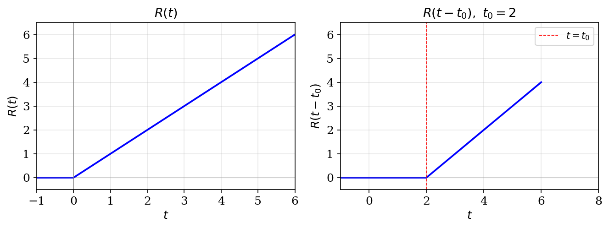

---

### 2.3.3 单位阶跃信号 $u(t)$

#### 1. 定义

$$
u(t) = \begin{cases}
0, & t < 0 \\
1, & t > 0
\end{cases}
$$

平移 $t_0$ 后的形式：

$$
u(t - t_0) = \begin{cases}
0, & t < t_0 \\
1, & t > t_0
\end{cases}
$$

> 注：在 $t = 0$（或 $t = t_0$）处，阶跃信号不定义或取其左右极限的平均值 $\frac{1}{2}$，具体取决于上下文。

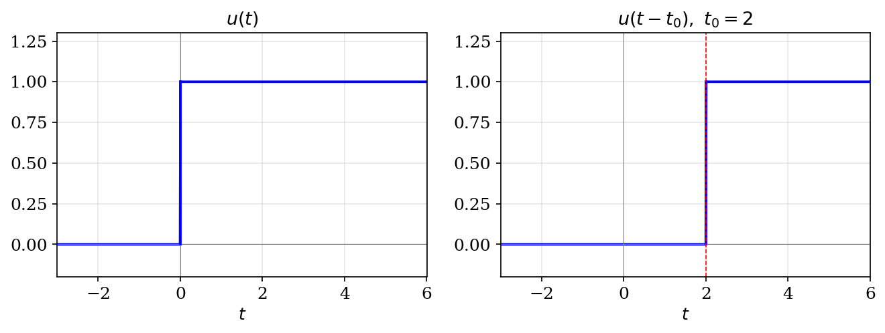

---

#### 2. 物理含义

- **单位阶跃函数**：在 $t = 0$ 时刻接入单位直流电压（或电流）的理想模型。
- **矩形脉冲（门函数）**：突然接通又马上断开电源的理想模型。

矩形脉冲可由两个阶跃信号之差表示：

$$
G(t) = u(t) - u(t - \tau)
$$

$$
G_1(t) = u(t - t_0) - u(t - t_0 - \tau)
$$

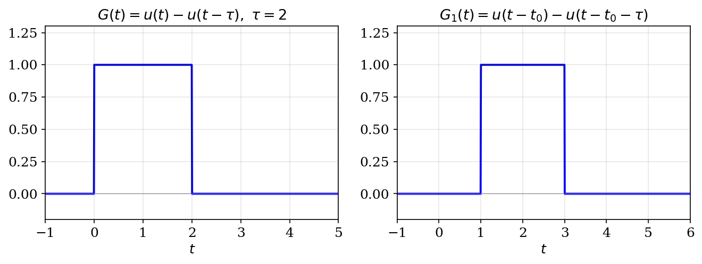

---

#### 3. 用阶跃信号表示其他信号

**(a) 信号取单边（加窗）**

利用阶跃函数可将双边信号截断为指定区间内的信号。例如：

$$
f(t) = e^{-t} [u(t) - u(t - t_0)]
$$

表示 $e^{-t}$ 仅在 $[0, t_0]$ 区间内取值，其余为零。

**(b) 分段信号的紧凑表示**

任意分段定义的信号可用阶跃函数的组合统一写出。例如：

$$
\begin{aligned}
g(t) = &\ t [u(t) - u(t - 1)] + [u(t - 1) - u(t - 2)] \\
       &+ (3 - t) [u(t - 2) - u(t - 3)]
\end{aligned}
$$

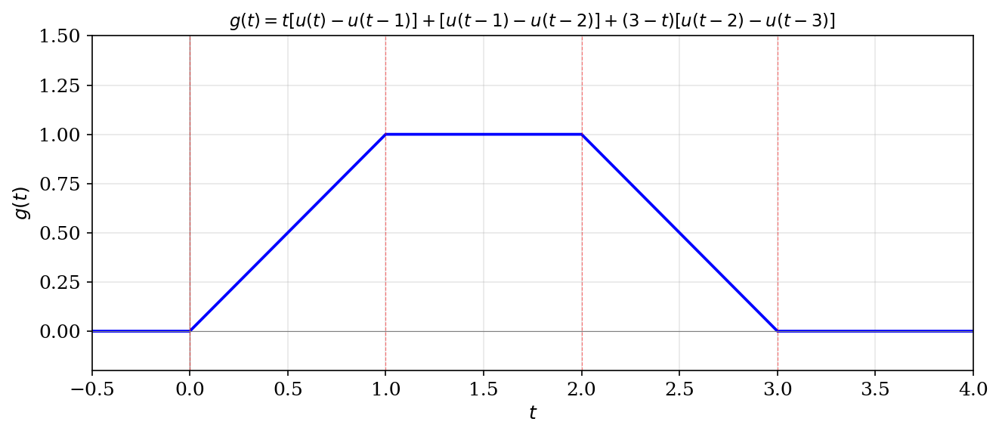

---

### 2.3.4 单位冲激函数 $\delta(t)$

#### 1. Dirac 定义

单位冲激函数 $\delta(t)$ 由 Dirac 提出，满足：

$$
\begin{cases}
\delta(t) = 0, & t \neq 0 \\[6pt]
\displaystyle \int_{-\infty}^{+\infty} \delta(t) \, dt = 1
\end{cases}
$$

$\delta(t)$ 不是通常意义上的函数，而是一种**广义函数**（或分布），其严格定义通过其在积分中的作用给出。

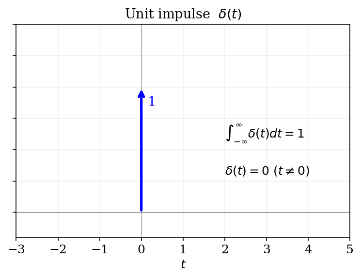

---

#### 2. 抽样性（筛选性）

由 $\delta(t)$ 在 $t \neq 0$ 处为零，有 $f(t)\delta(t) = f(0)\delta(t)$，因此：

$$
\int_{-\infty}^{\infty} f(t) \delta(t) \, dt = f(0) \int_{-\infty}^{\infty} \delta(t) \, dt = f(0)
$$

推广到平移情况：

$$
\boxed{\int_{-\infty}^{\infty} f(t) \delta(t - t_0) \, dt = f(t_0)} \quad (f(t)\ \text{在}\ t = t_0\ \text{处连续})
$$

> 抽样性是 $\delta(t)$ 最核心的性质：**冲激函数从信号中"筛选"出某一时刻的函数值**。

---

#### 3. 极限定义

$\delta(t)$ 可视为一系列普通函数在某种极限意义下的结果。共同特点是：**保持面积为 1，宽度趋于零**。

**(a) 矩形脉冲极限**

宽为 $\tau$、高为 $\frac{1}{\tau}$ 的矩形脉冲，当 $\tau \to 0$ 时的极限：

$$
\delta(t) = \lim_{\tau \to 0} \frac{1}{\tau} \left[ u\left(t + \frac{\tau}{2}\right) - u\left(t - \frac{\tau}{2}\right) \right]
$$

**(b) 三角脉冲极限**

$$
\delta(t) = \lim_{\tau \to 0} \left\{ \frac{1}{\tau} \left(1 - \frac{|t|}{\tau}\right) [u(t + \tau) - u(t - \tau)] \right\}
$$

**(c) 双边指数脉冲极限**

$$
\delta(t) = \lim_{\tau \to 0} \left[ \frac{1}{2\tau} e^{-\frac{|t|}{\tau}} \right]
$$

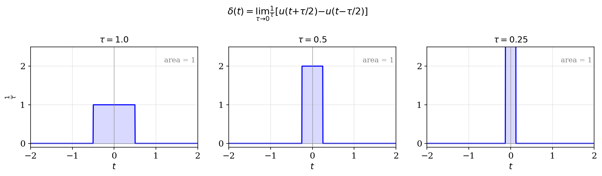

---

#### 4. 物理意义

- 冲激函数可看作是**强度很大而作用时间很短**的物理量的理想模型（如锤击力、静电放电）。
- 由于冲激电流的出现，允许**电容两端的电压跳变**；由于冲激电压的出现，允许**电感电流跳变**。
- 若矩形脉冲面积为 $A$（而非 1），则表示一个冲激强度为 $A$ 倍单位值的 $\delta$ 函数，记为 $A\delta(t)$。图形上用箭头表示，箭头旁标注冲激强度。

---

#### 5. 基本性质

| 性质 | 表达式 |
| :--- | :--- |
| 与 $u(t)$ 的关系（微分） | $\displaystyle \frac{du(t)}{dt} = \delta(t)$ |
| 与 $u(t)$ 的关系（积分） | $\displaystyle \int_{-\infty}^{t} \delta(\tau) d\tau = u(t)$ |
| 抽样性 | $f(t)\delta(t) = f(0)\delta(t)$ |
| 积分筛选 | $\displaystyle \int_{-\infty}^{\infty} f(t)\delta(t) dt = f(0)$ |
| 平移筛选 | $\displaystyle \int_{-\infty}^{\infty} f(t)\delta(t - t_0) dt = f(t_0)$ |
| 偶对称 | $\delta(-t) = \delta(t)$ |
| 尺度变换 | $\displaystyle \delta(at) = \frac{1}{\vert a \vert} \delta(t)$ |

---

### 2.3.5 冲激偶信号 $\delta'(t)$

#### 1. 定义

冲激偶信号是 $\delta(t)$ 的一阶导数：

$$
\delta'(t) = \frac{d}{dt} \delta(t)
$$

其形态可理解为：当 $t$ 从负值趋于零时，它是一个强度为无限大的**正**冲激；当 $t$ 从正值趋于零时，它是一个强度为无限大的**负**冲激。

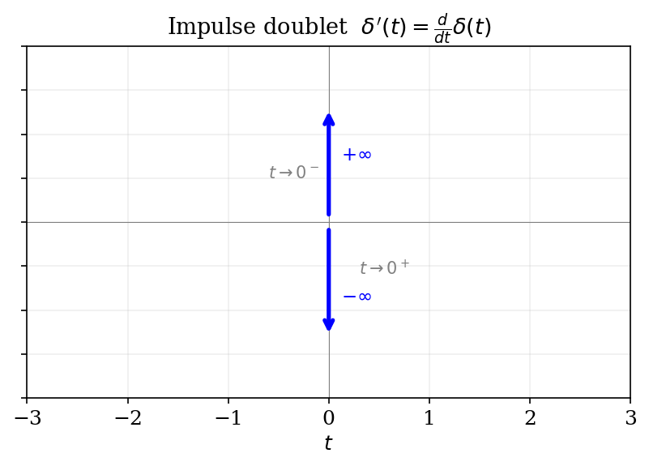

---

#### 2. 基本性质

| 性质 | 表达式 |
| :--- | :--- |
| 积分还原 | $\displaystyle \int_{-\infty}^{t} \delta'(\tau) d\tau = \delta(t)$ |
| 面积为零 | $\displaystyle \int_{-\infty}^{\infty} \delta'(t) dt = 0$ |
| 乘积公式 | $f(t)\delta'(t) = f(0)\delta'(t) - f'(0)\delta(t)$ |
| 抽样性 | $\displaystyle \int_{-\infty}^{\infty} f(t)\delta'(t) dt = -f'(0)$ |
| 平移抽样 | $\displaystyle \int_{-\infty}^{\infty} f(t)\delta'(t - t_0) dt = -f'(t_0)$ |
| 奇对称 | $\delta'(-t) = -\delta'(t)$ |

---

#### 3. $\delta(t)$ 与 $\delta'(t)$ 对比

| 特性 | $\delta(t)$ | $\delta'(t)$ |
| :--- | :--- | :--- |
| **引出** | $\int_{-\infty}^{\infty} \delta(t) dt = 1$，$\delta(t) = 0 \ (t \neq 0)$ | $\delta'(t) = \frac{d}{dt}\delta(t)$，$\int_{-\infty}^{\infty} \delta'(t) dt = 0$ |
| **奇偶性** | $\delta(-t) = \delta(t)$（偶函数） | $\delta'(-t) = -\delta'(t)$（奇函数） |
| **抽样性** | $f(t)\delta(t) = f(0)\delta(t)$ | $f(t)\delta'(t) = f(0)\delta'(t) - f'(0)\delta(t)$ |
| **积分筛选** | $\int_{-\infty}^{\infty} f(t)\delta(t) dt = f(0)$ | $\int_{-\infty}^{\infty} f(t)\delta'(t) dt = -f'(0)$ |
| **积分** | $\int_{-\infty}^{t} \delta(\tau) d\tau = u(t)$ | $\int_{-\infty}^{t} \delta'(\tau) d\tau = \delta(t)$ |

---

## 2.4 信号的时域分解

### 2.4.1 问题的提出：零状态响应怎么求？

通过前面的学习，我们已知：

- 线性系统的全响应可以分解为： $r(t) = r_{zi}(t) + r_{zs}(t)$
- 零输入响应 $r_{zi}(t)$ 的求解方法（见 2.2 节）

余下的核心问题是：**零状态响应 $r_{zs}(t)$ 怎么求？**

求解思路分三步走：

| 步骤 | 对应章节 | 内容 |
| :--- | :--- | :--- |
| **第1步** | §2.4 | 把任意信号分解为**冲激函数的线性组合（积分）** |
| **第2步** | §2.5 | 求激励为冲激函数时的零状态响应——**单位冲激响应** $h(t)$ |
| **第3步** | §2.6~2.7 | 由系统的线性时不变性，得到激励为**任意信号**时的零状态响应 |

> 本节聚焦第1步：如何将任意信号表示为冲激（或阶跃）函数的叠加。

---

### 2.4.2 任意函数表示为冲激函数的积分

#### 1. 离散近似的思想

将时间轴以 $\Delta t$ 为间隔划分为若干小区间。在区间 $[k\Delta t, (k+1)\Delta t]$ 内，用高为 $f(k\Delta t)$、宽为 $\Delta t$ 的窄矩形脉冲 $g_{\Delta t}(t - k\Delta t)$ 来近似 $f(t)$：

$$
f(t) \approx \sum_{k=0}^{n} f(k\Delta t) \, g_{\Delta t}(t - k\Delta t)
$$

将每个窄脉冲写成面积归一化形式：

$$
f(t) \approx \sum_{k=0}^{n} f(k\Delta t) \, \frac{g_{\Delta t}(t - k\Delta t)}{\Delta t} \, \Delta t
$$

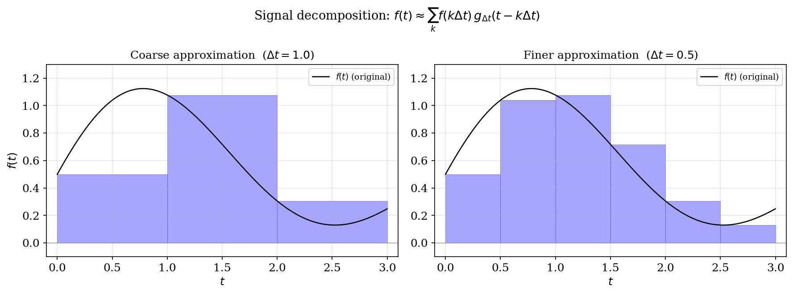

---

#### 2. 取极限——从求和到积分

令 $\Delta t \to d\tau$，$k\Delta t \to \tau$，窄脉冲 $\frac{g_{\Delta t}}{\Delta t} \to \delta$（面积保持为 1 的冲激），求和过渡为积分：

$$
\boxed{f(t) = \int_{0}^{t} f(\tau) \, \delta(t - \tau) \, d\tau}
$$

推广到全时域（考虑因果信号及非因果信号）：

$$
f(t) = \int_{0}^{+\infty} f(\tau) \, \delta(t - \tau) \, d\tau
$$

$$
f(t) = \int_{-\infty}^{+\infty} f(\tau) \, \delta(t - \tau) \, d\tau
$$

---

#### 3. 物理解读

上述积分式表明：**任意连续信号可以表示为无穷多个不同时刻 $\tau$ 处的冲激函数 $\delta(t-\tau)$ 的加权连续和（积分）**，权重即为信号在该时刻的值 $f(\tau)$。

> 这就是冲激函数抽样性的"逆应用"：抽样性是从信号中"提取"某时刻的值，而分解式是用各时刻的值"重建"整个信号。

---

### 2.4.3 任意函数表示为阶跃函数的积分

信号也可用阶跃函数来分解。根据微积分基本定理（或分部积分），有：

$$
\boxed{f(t) = f(0) + \int_{0}^{t} f'(\tau) \, u(t - \tau) \, d\tau}
$$

其含义为：信号 $f(t)$ 可分解为初始值 $f(0)$ 加上各时刻斜率变化 $f'(\tau)$ 所对应的阶跃响应之和。

> 冲激分解与阶跃分解是对偶的两种表示方式。冲激分解更适合卷积分析（接下来几节的核心），阶跃分解则在某些场合计算更为方便。

---

### 2.4.4 小结

截至本节，应掌握以下核心概念：

| 概念 | 要点 |
| :--- | :--- |
| **特征方程与特征根** | 微分方程齐次部分对应的代数方程及其根，决定响应的指数形式 |
| **自由响应与受迫响应** | 自由响应 = 齐次通解（由特征根决定）；受迫响应 = 特解（由激励形式决定） |
| **算子表示与转移算子** | $p = \frac{d}{dt}$，$H(p) = N(p)/D(p)$，将微分方程化为代数形式 |
| **零输入响应** | 仅由初始储能引起，解 $D(p)r(t)=0$，待定系数直接由初始条件确定 |
| **单位冲激函数 $\delta(t)$** | 广义函数，面积=1，核心性质为抽样性 |
| **单位阶跃函数 $u(t)$** | $\delta(t)$ 的积分，用于信号截断与分段表示 |
| **信号的时域分解** | $f(t) = \int f(\tau)\delta(t-\tau)d\tau$，是冲激响应卷积分析法的基础 |

---

## 2.5 阶跃响应和冲激响应

### 2.5.1 单位冲激响应的定义

一线性时不变系统，其**初始状态为零**，输入为单位冲激信号 $\delta(t)$ 所引起的零状态响应，称为**单位冲激响应**，简称冲激响应，用 $h(t)$ 表示。

类似地，输入为单位阶跃信号 $u(t)$ 所引起的零状态响应称为**单位阶跃响应**，用 $r_{\varepsilon}(t)$ 表示。

> 冲激响应 $h(t)$ 只与系统特性相关，反映系统的**内在动态行为**；阶跃响应则包含系统的暂态和稳态特征，反映系统对持续输入的整体响应。

---

### 2.5.2 冲激响应与系统因果性

若系统是因果系统，则其冲激响应必为因果信号，即：

$$
h(t) = 0, \quad t < 0
$$

反之亦然——$h(t)$ 可用来**判断系统的因果性**（将来还可用 $h(t)$ 判断系统的稳定性）。

---

### 2.5.3 冲激响应与阶跃响应的关系

冲激响应与阶跃响应由以下积分/微分关系联系：

$$
\boxed{r_{\varepsilon}(t) = \int_{-\infty}^{t} h(\tau) \, d\tau}
$$

$$
\boxed{h(t) = \frac{d}{dt} r_{\varepsilon}(t)}
$$

> 后面我们只讨论冲激响应的求法，阶跃响应可通过积分由 $h(t)$ 得到。

---

### 2.5.4 冲激响应的求解——部分分式分解法

#### 1. 基本思路

设连续 LTI 系统的转移算子为 $H(p) = N(p)/D(p)$：

1. 对 $H(p)$ 进行**部分分式分解**；
2. 研究**简单系统**的冲激响应 $(p \to h)$ 对应关系；
3. 利用 LTI 系统的齐次性、叠加性、时不变性，将各简单系统的冲激响应叠加，得到总冲激响应。

---

#### 2. 三类简单系统的 $H(p) \to h(t)$ 对应

**类型一**： $H(p) = \frac{k}{p - \lambda}$

此时 $h(t)$ 满足 $(p - \lambda)h(t) = k\delta(t)$，即 $h'(t) - \lambda h(t) = k\delta(t)$。两边同乘 $e^{-\lambda t}$ 并整理：

$$
\left( e^{-\lambda t} h(t) \right)' = k\delta(t) \quad \Longrightarrow \quad h(t) = k e^{\lambda t} u(t)
$$

> **基本变换对**：$\displaystyle \frac{k}{p - \lambda} \longleftrightarrow k e^{\lambda t} u(t)$

---

**类型二**： $H(p) = \frac{k}{(p - \lambda)^n}$

推广到 $n$ 重根情况：

$$
\boxed{H(p) = \frac{k}{(p - \lambda)^n} \quad \longleftrightarrow \quad h(t) = \frac{k}{(n-1)!} \, t^{\,n-1} e^{\lambda t} u(t)}
$$

特别地，$n=2$ 时： $\displaystyle \frac{k}{(p-\lambda)^2} \to h(t) = k t e^{\lambda t} u(t)$

推导思路：$(p-\lambda)[(p-\lambda)h(t)] = k\delta(t)$，逐级求解一阶微分方程。

---

**类型二（续）——复共轭极点**：$H(p) = \dfrac{Ap + B}{(p + \alpha)^2 + \beta^2}$

当特征根为共轭复根 $\lambda = -\alpha \pm j\beta$ 时，分母出现 $p^2 + 2\alpha p + (\alpha^2 + \beta^2) = (p+\alpha)^2 + \beta^2$ 形式。此时 $h(t)$ 含有正弦/余弦振荡分量。

**子类型 1：无阻尼振荡（$\alpha = 0$）**

$$
\boxed{H(p) = \frac{\omega}{p^2 + \omega^2} \quad \longleftrightarrow \quad h(t) = \sin(\omega t)\, u(t)}
$$

$$
\boxed{H(p) = \frac{p}{p^2 + \omega^2} \quad \longleftrightarrow \quad h(t) = \cos(\omega t)\, u(t)}
$$

**子类型 2：阻尼振荡（$\alpha > 0$）**

$$
\boxed{H(p) = \frac{\beta}{(p + \alpha)^2 + \beta^2} \quad \longleftrightarrow \quad h(t) = e^{-\alpha t} \sin(\beta t)\, u(t)}
$$

$$
\boxed{H(p) = \frac{p + \alpha}{(p + \alpha)^2 + \beta^2} \quad \longleftrightarrow \quad h(t) = e^{-\alpha t} \cos(\beta t)\, u(t)}
$$

更一般地，对于 $H(p) = \dfrac{Ap + B}{(p + \alpha)^2 + \beta^2}$，可通过配凑拆分为上述两个标准形式：

$$
\frac{Ap + B}{(p + \alpha)^2 + \beta^2}
= A \cdot \frac{p + \alpha}{(p + \alpha)^2 + \beta^2}
+ \frac{B - A\alpha}{\beta} \cdot \frac{\beta}{(p + \alpha)^2 + \beta^2}
$$

$$
\longleftrightarrow \quad h(t) = \left[ A\, e^{-\alpha t} \cos(\beta t) + \frac{B - A\alpha}{\beta}\, e^{-\alpha t} \sin(\beta t) \right] u(t)
$$

> **物理意义**：$\alpha$ 控制衰减速度（$\alpha > 0$ 则振荡衰减，$\alpha = 0$ 则等幅振荡，$\alpha < 0$ 则发散），$\beta$ 控制振荡频率。

---

**类型三**： $H(p) = k p^n \ (n > 0)$

$$
\boxed{H(p) = k p^n \quad \longleftrightarrow \quad h(t) = k \delta^{(n)}(t)}
$$

特别地，$n=0$ 时： $H(p) = k \ \longleftrightarrow \ h(t) = k\delta(t)$

---

#### 3. 部分分式分解的一般方法

设 $H(p) = N(p)/D(p)$ 为真分式，$\lambda_1, \lambda_2, \dots, \lambda_n$ 为特征根，则 $H(p)$ 总可分解为：

$$
H(p) = \sum_{i=1}^{n} \frac{k_i}{p - \lambda_i}
$$

理由是通分后分子为 $n-1$ 阶多项式 $Q(p)$，含有 $n$ 个待定系数 $k_i$，比较 $Q(p)$ 与 $N(p)$ 的同次幂系数即可唯一确定各 $k_i$。

更一般地，若有重根，展开形式为：

$$
H(p) = \sum_{i=1}^{p} K_i p^i + \sum_{j=1}^{l} \frac{K_j}{(p - \lambda_j)^{r_j}}
$$

---

#### 4. 典型例题

**例题3**：求系统的冲激响应

$$
r''(t) + 4r'(t) + 3r(t) = e'(t) + 2e(t)
$$

- 转移算子： $H(p) = \frac{p + 2}{p^2 + 4p + 3} = \frac{p + 2}{(p + 1)(p + 3)}$
- 部分分式分解： $H(p) = \frac{1}{2} \left( \frac{1}{p + 1} + \frac{1}{p + 3} \right)$
- 冲激响应： $h(t) = \frac{1}{2} (e^{-t} + e^{-3t}) \, u(t)$

---

**例题4**（P.50，例题2-6）：

$$
\frac{d^2}{dt^2} r(t) + 4 \frac{d}{dt} r(t) + 4 r(t) = 2 \frac{d^2}{dt^2} e(t) + 9 \frac{d}{dt} e(t) + 11 e(t)
$$

- 转移算子： $H(p) = \frac{2p^2 + 9p + 11}{p^2 + 4p + 4}$
- 部分分式分解：

$$
\begin{aligned}
H(p) &= 2 + \frac{p + 3}{p^2 + 4p + 4} \\
     &= 2 + \frac{1}{p + 2} + \frac{1}{(p + 2)^2}
\end{aligned}
$$

- 冲激响应：

$$
h(t) = 2\delta(t) + (e^{-2t} + t e^{-2t}) \, u(t)
$$

---

### 2.5.5 部分分式法小结

| 步骤 | 内容 |
| :--- | :--- |
| **①** | 确定系统的转移算子 $H(p) = N(p) / D(p)$ |
| **②** | 将 $H(p)$ 部分分式展开为 $H(p) = \sum K_i p^i + \sum \frac{K_j}{(p - \lambda_j)^{r_j}}$ |
| **③** | 查表得到各分式对应的冲激响应分量 $h_i(t)$ |
| **④** | 将所有分量相加： $h(t) = \sum h_i(t)$ |

---

## 2.6 叠加积分——零状态响应的时域求解

### 2.6.1 从信号分解到零状态响应

回顾前三节的主线：

- **§2.4**：任意信号可分解为冲激函数的积分： $f(t) = \int_0^{+\infty} f(\tau) \delta(t - \tau) d\tau$
- **§2.5**：冲激信号 $\delta(t)$ 作用下系统的零状态响应为 $h(t)$

现在利用 LTI 系统的性质，将此二者连接起来。

---

### 2.6.2 推导过程

| 激励信号 | 响应信号 | 理论依据 |
| :--- | :--- | :--- |
| $\delta(t)$ | $h(t)$ | 定义 |
| $\delta(t - \tau)$ | $h(t - \tau)$ | **时不变性** |
| $[f(\tau) \Delta\tau] \, \delta(t - \tau)$ | $[f(\tau) \Delta\tau] \, h(t - \tau)$ | **齐次性** |
| $\displaystyle \sum_{\tau=-\infty}^{\infty} f(\tau) \delta(t - \tau) \Delta\tau$ | $\displaystyle \sum_{\tau=-\infty}^{\infty} f(\tau) h(t - \tau) \Delta\tau$ | **叠加性** |
| $\displaystyle \int_{-\infty}^{\infty} f(\tau) \delta(t - \tau) d\tau$ | $\displaystyle \int_{-\infty}^{\infty} f(\tau) h(t - \tau) d\tau$ | 求和 $\to$ 积分（$\Delta\tau \to d\tau$） |

---

### 2.6.3 零状态响应的卷积积分公式

令 $\Delta t \to d\tau$，$k\Delta t \to \tau$，得到 LTI 系统零状态响应的核心公式：

$$
\boxed{r_{zs}(t) = \int_{0}^{+\infty} f(\tau) \, h(t - \tau) \, d\tau}
$$

$$
\text{激励 } f(t) \quad \longleftrightarrow \quad \text{冲激响应 } h(t)
$$

这就是**卷积积分**——时域分析中求解零状态响应的基本公式。下一节将深入讨论卷积的运算方法与性质。

---

## 2.7 卷积及其性质

### 2.7.1 卷积积分的定义

设 $f_1(t), f_2(t)$ 是定义在 $(-\infty, +\infty)$ 区间上的两个连续时间信号，定义积分

$$
\boxed{f_1(t) * f_2(t) = \int_{-\infty}^{+\infty} f_1(\tau) \, f_2(t - \tau) \, d\tau}
$$

称为 $f_1(t)$ 与 $f_2(t)$ 的**卷积**（Convolution）。

> **注意**：数学定义中积分限为 $(-\infty, \infty)$，但对于服从因果律的实际系统，若激励信号是有始信号（$t < 0$ 时为零），积分限可缩小为 $(0^-, t)$：
>
> $$
> f_1(t) * f_2(t) = \int_{0^-}^{t} f_1(\tau) \, f_2(t - \tau) \, d\tau
> $$

---

### 2.7.2 卷积的计算方法

| 方法 | 适用场景 |
| :--- | :--- |
| **图解法** | 直观理解卷积的翻转、平移、相乘、积分过程 |
| **解析法** | 信号有明确表达式时直接积分计算 |
| **查卷积表** | 常见信号对的快速求解 |
| **利用性质** | 复杂信号拆分为简单信号的组合 |
| **数值解法** | 离散近似或计算机求解 |

---

### 2.7.3 图解法求卷积积分

**核心步骤**：

1. **换元**：将 $f(t)$ 和 $g(t)$ 中的自变量由 $t$ 改为 $\tau$
2. **翻转/平移**：$g(\tau) \xrightarrow{\text{翻转}} g(-\tau) \xrightarrow{\text{平移 } t} g(t - \tau)$
3. **乘积/积分**：将 $f(\tau)$ 与 $g(t - \tau)$ 相乘，对乘积求积分（关键：确定积分限）

---

**例1**：计算 $f(t) * h(t)$，其中 $f(t) = u(t),\; h(t) = e^{-t} u(t)$

解：

- 当 $t < 0$ 时，$f(\tau)$ 与 $h(t - \tau)$ 无重叠区间 $\implies$ $f(t) * h(t) = 0$

- 当 $t > 0$ 时：

$$
f(t) * h(t) = \int_{0}^{t} e^{-(t - \tau)} d\tau = 1 - e^{-t}
$$

卷积结果： $f(t) * h(t) = (1 - e^{-t}) \, u(t)$

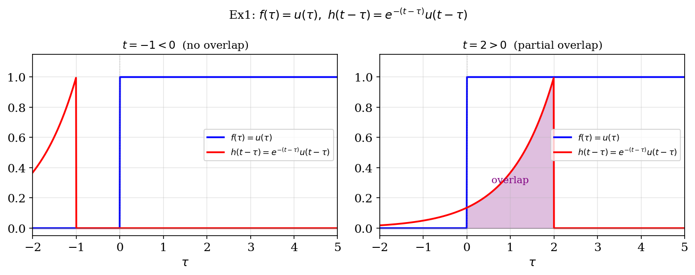

---

**例2**：求 $y(t) = f_1(t) * f_2(t)$，其中

$$
f_1(t) = u(t) - u(t - 3), \qquad f_2(t) = e^{-t} u(t)
$$

解：分三段讨论重叠区间。

- **t < 0**：无重叠 $\implies$ $y(t) = 0$

- **0 < t < 3**：$f_1(\tau)$ 在 $[0, t]$ 内为 1：

$$
y(t) = \int_{0}^{t} e^{-(t - \tau)} d\tau = 1 - e^{-t}
$$

- **t > 3**：$f_1(\tau)$ 仅在 $[0, 3]$ 内为 1：

$$
y(t) = \int_{0}^{3} e^{-(t - \tau)} d\tau = (e^3 - 1) e^{-t}
$$

合并结果：

$$
y(t) = (1 - e^{-t}) u(t) - [1 - e^{-(t-3)}] \, u(t - 3)
$$

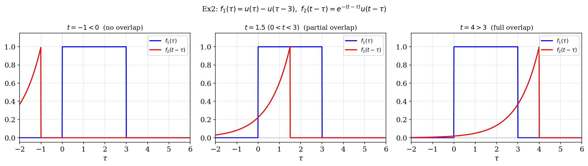

---

### 2.7.4 卷积的基本性质

#### 1. 代数性质

| 性质 | 表达式 |
| :--- | :--- |
| **交换律** | $f_1(t) * f_2(t) = f_2(t) * f_1(t)$ |
| **分配律** | $f_1(t) * [f_2(t) + f_3(t)] = f_1(t) * f_2(t) + f_1(t) * f_3(t)$ |
| **结合律** | $[f_1(t) * f_2(t)] * f_3(t) = f_1(t) * [f_2(t) * f_3(t)]$ |

---

#### 2. 延时性质

若 $f_1(t) * f_2(t) = f(t)$，则：

$$
\boxed{f_1(t - t_1) * f_2(t - t_2) = f(t - t_1 - t_2)}
$$

---

#### 3. 微分与积分性质

**(a) 卷积的微分**：两函数卷积后的导数等于其中一个的导数与另一个卷积。

$$
\frac{d}{dt}[f_1(t) * f_2(t)] = \frac{df_1(t)}{dt} * f_2(t) = f_1(t) * \frac{df_2(t)}{dt}
$$

**(b) 卷积的积分**：两函数卷积后的积分等于其中一个的积分与另一个卷积。

$$
\int_{-\infty}^{t} [f_1(x) * f_2(x)] dx = f_1(t) * \int_{-\infty}^{t} f_2(x) dx = \left[ \int_{-\infty}^{t} f_1(x) dx \right] * f_2(t)
$$

---

#### 4. 与奇异信号的卷积

| 公式 | 说明 |
| :--- | :--- |
| $f(t) * \delta(t) = f(t)$ | $\delta(t)$ 是卷积的单位元 |
| $f(t) * \delta(t - t_0) = f(t - t_0)$ | 与移位冲激卷积 = 移位 |
| $f(t - t_0) * \delta(t - t_1) = f(t - t_0 - t_1)$ | 延时叠加 |
| $f(t) * \delta'(t) = f'(t)$ | 与冲激偶卷积 = 微分 |
| $f(t) * u(t) = \int_{-\infty}^{t} f(\tau) d\tau$ | 与阶跃卷积 = 积分 |

---

### 2.7.5 矩形脉冲的卷积

**结论**：两个不同宽度的矩形脉冲的卷积是**梯形脉冲**。

- 若 $f_1(t)$ 宽度为 $W_1$，$f_2(t)$ 宽度为 $W_2$，则卷积结果宽度 = $W_1 + W_2$
- 卷积结果的面积 = 两脉冲面积之积
- 两个**相同宽度**的矩形脉冲卷积结果是**三角脉冲**

**例3**：求两个不同宽度矩形脉冲的卷积

$$
f(t) = 2[u(t - 4) - u(t - 5)], \quad h(t) = u(t - 1) - u(t - 3)
$$

卷积结果为分段梯形：

$$
f(t) * h(t) = 
\begin{cases}
0, & t < 5 \\
2t - 10, & 5 < t < 6 \\
2, & 6 < t < 7 \\
16 - 2t, & 7 < t < 8 \\
0, & t > 8
\end{cases}
$$

---

**例4**：利用卷积的微积分性质求解

$$
f_1(t) = u(t - t_1) - u(t - t_2), \quad t_2 > t_1
$$
$$
f_2(t) = e^{-t} u(t)
$$

解：

$$
\begin{aligned}
f_1(t) * f_2(t) &= \frac{df_1(t)}{dt} * \int_{-\infty}^{t} f_2(\tau) d\tau \\
&= [\delta(t - t_1) - \delta(t - t_2)] * (1 - e^{-t}) u(t) \\
&= [1 - e^{-(t - t_1)}] u(t - t_1) - [1 - e^{-(t - t_2)}] u(t - t_2)
\end{aligned}
$$

---

### 2.7.6 卷积表

| 序号 | $f_1(t)$ | $f_2(t)$ | $f_1(t) * f_2(t)$ |
| :---: | :--- | :--- | :--- |
| 1 | $f(t)$ | $\delta(t)$ | $f(t)$ |
| 2 | $f(t)$ | $\delta'(t)$ | $\displaystyle \frac{df(t)}{dt}$ |
| 3 | $f(t)$ | $u(t)$ | $\displaystyle \int_{-\infty}^{t} f(\tau) d\tau$ |
| 4 | $\frac{df(t)}{dt}$ | $\int_{-\infty}^{t} g(\tau) d\tau$ | $f(t) * g(t)$ |
| 5 | $e^{\lambda t} u(t)$ | $u(t)$ | $\displaystyle -\frac{1}{\lambda}(1 - e^{\lambda t}) u(t)$ |
| 6 | $u(t)$ | $u(t)$ | $t u(t)$ |
| 7 | $e^{\lambda_1 t} u(t)$ | $e^{\lambda_2 t} u(t)$ | $\displaystyle \frac{e^{\lambda_2 t} - e^{\lambda_1 t}}{\lambda_2 - \lambda_1} u(t),\; \lambda_1 \neq \lambda_2$ |
| 8 | $e^{\lambda t} u(t)$ | $e^{\lambda t} u(t)$ | $t e^{\lambda t} u(t)$ |
| 9 | $t^m u(t)$ | $t^n u(t)$ | $\displaystyle \frac{m!\, n!}{(m+n+1)!} t^{m+n+1} u(t)$ |
| 10 | $e^{-\alpha t} \cos(\beta t + \theta) u(t)$ | $e^{\lambda t} u(t)$ | 见完整卷积表 |

---

### 2.7.7 卷积的物理意义

- **信号层面**：卷积表示了信号之间的**相关性**（相似度），是相关运算的特殊形式： $R_{xy}(t) = x(t) * y(-t)$
- **系统层面**：系统响应 = 激励与冲激响应的卷积，代表了系统对信号的**滤波**（特征提取、调制、平滑等）

---

### 2.7.8 组合系统的冲激响应

**(a) 并联**：

$$
h(t) = h_1(t) + h_2(t)
$$

**(b) 级联**：

$$
h(t) = h_1(t) * h_2(t)
$$

**(c) 反馈连接**：

$$
h(t) = \delta(t) + h_1(t)
$$

> 组合系统的等效冲激响应是分析复杂系统的重要工具。

---

## 2.8 线性系统响应的时域求解

### 2.8.1 全响应求解总流程

```
系统方程 ──→ 转移算子 H(p)
              │
     ┌────────┴────────┐
     ▼                 ▼
  求特征根          求冲激响应 h(t)
     │                 │
     ▼                 ▼
  零输入响应        零状态响应
  y_zi(t)      y_zs(t) = e(t) * h(t)
     │                 │
     └────────┬────────┘
              ▼
     全响应 y(t) = y_zi(t) + y_zs(t)
```

---

### 2.8.2 响应的三重分类

全响应可以从三个不同角度进行分解：

| 分解角度 | 组成 | 说明 |
| :--- | :--- | :--- |
| 区分初始储能与激励作用 | **零输入响应** + **零状态响应** | $r(t) = r_{zi}(t) + r_{zs}(t)$ |
| 微分方程经典法求解 | **自然响应** + **受迫响应** | 齐次通解 + 特解 |
| $t \to \infty$ 的状态 | **瞬态响应** + **稳态响应** | 趋于零的部分 + 保留下来的部分 |


| | 自然响应 | 受迫响应 | 零输入响应 | 零状态响应 |
| :--- | :---: | :---: | :---: | :---: |
| **系统（特征根）** | ✓ | ✓ | ✓ | ✓ |
| **初始状态** | ✓ | | ✓ | |
| **外加激励** | ✓ | ✓ | | ✓ |

---

**各响应间的关系**：

- 自然响应和零输入响应都是**齐次方程的解**，两者模式相同（由特征根决定），但**系数不同**——零输入响应仅由初始储能决定，自然响应同时依赖于初始状态和激励信号。
- 零输入响应是自然响应的**一部分**。
- 零状态响应中又可分出自然响应分量和受迫响应分量。
- 若系统**稳定**，则自然响应就是**瞬态响应**（$t \to \infty$ 时趋于零）；受迫响应中可能包含瞬态和稳态分量。

---

### 2.8.3 综合例题（P.65 例题2-11）

**题目**：已知 RC 电路方程及初始条件、激励如下：

$$
\frac{du_C(t)}{dt} + u_C(t) = e(t), \qquad u_C(0^-) = 1, \qquad e(t) = \big(1 + e^{-3t}\big) u(t)
$$

求全响应 $u_C(t)$，并分别按三种方式分解。

---

#### 1. 零输入响应 $u_{Czi}(t)$

激励为零，解齐次方程：

$$
\frac{du_C}{dt} + u_C = 0
$$

特征方程： $\lambda + 1 = 0 \ \Longrightarrow\ \lambda = -1$

通解： $u_{Czi}(t) = C e^{-t}$

代入初始条件 $u_C(0^-) = 1$：

$$
C = 1 \quad \Longrightarrow \quad \boxed{u_{Czi}(t) = e^{-t} u(t)}
$$

---

#### 2. 零状态响应 $u_{Czs}(t)$

初始状态为零，仅由激励 $e(t) = (1 + e^{-3t})u(t)$ 产生。

转移算子： $H(p) = \frac{1}{p+1}$，冲激响应： $h(t) = e^{-t} u(t)$

$$
\begin{aligned}
u_{Czs}(t) &= h(t) * e(t) = e^{-t}u(t) * (1 + e^{-3t})u(t) \\
           &= \underbrace{e^{-t}u(t) * u(t)}_{(a)} + \underbrace{e^{-t}u(t) * e^{-3t}u(t)}_{(b)}
\end{aligned}
$$

**(a)** $e^{-t}u(t) * u(t) = \displaystyle\int_0^t e^{-(t-\tau)} \cdot 1 \, d\tau = e^{-t}\big[e^{\tau}\big]_0^t = (1 - e^{-t})u(t)$

**(b)** 直接积分：

$$
\begin{aligned}
e^{-t}u(t) * e^{-3t}u(t) &= \int_0^t e^{-(t-\tau)} \cdot e^{-3\tau} \, d\tau
= e^{-t} \int_0^t e^{\tau} \cdot e^{-3\tau} \, d\tau \\
&= e^{-t} \int_0^t e^{-2\tau} \, d\tau
= e^{-t} \left[-\frac{1}{2} e^{-2\tau}\right]_0^t \\
&= e^{-t} \cdot \left(-\frac{1}{2}e^{-2t} + \frac{1}{2}\right)
= \frac{1}{2}(e^{-t} - e^{-3t})u(t)
\end{aligned}
$$

合成：

$$
\boxed{u_{Czs}(t) = \left(1 - e^{-t} + \frac{1}{2}e^{-t} - \frac{1}{2}e^{-3t}\right)u(t) = \left(1 - \frac{1}{2}e^{-t} - \frac{1}{2}e^{-3t}\right)u(t)}
$$

---

#### 3. 全响应

$$
\begin{aligned}
u_C(t) &= u_{Czi}(t) + u_{Czs}(t) \\[6pt]
       &= e^{-t}u(t) + \left(1 - \frac{1}{2}e^{-t} - \frac{1}{2}e^{-3t}\right)u(t) \\[6pt]
       &= \boxed{\left(1 + \frac{1}{2}e^{-t} - \frac{1}{2}e^{-3t}\right)u(t)}
\end{aligned}
$$

---

#### 4. 自然响应与受迫响应

全响应中，由特征根 $\lambda = -1$ 决定的项（$e^{-t}$ 项）为**自然响应**，其余为**受迫响应**：

$$
\boxed{u_{Ch}(t) = \frac{1}{2}e^{-t}u(t)}, \qquad
\boxed{u_{Cp}(t) = \left(1 - \frac{1}{2}e^{-3t}\right)u(t)}
$$

验证： $u_{Ch} + u_{Cp} = \frac{1}{2}e^{-t} + 1 - \frac{1}{2}e^{-3t} = u_C(t)$ ✓

---

#### 5. 三重分解总结

$$
\begin{aligned}
u_c(t) &= \underbrace{e^{-t} u(t)}_{\text{零输入响应}} + \underbrace{\left(1 - \frac{1}{2} e^{-t} - \frac{1}{2} e^{-3t}\right) u(t)}_{\text{零状态响应}} \\[8pt]
       &= \underbrace{\frac{1}{2} e^{-t} u(t)}_{\text{自然响应}} + \underbrace{\left(1 - \frac{1}{2} e^{-3t}\right) u(t)}_{\text{受迫响应}} \\[8pt]
       &= \underbrace{\left(\frac{1}{2} e^{-t} - \frac{1}{2} e^{-3t}\right) u(t)}_{\text{瞬态响应}} + \underbrace{u(t)}_{\text{稳态响应}}
\end{aligned}
$$

| 分解角度 | 分量 1 | 分量 2 |
| :--- | :--- | :--- |
| 区分储能与激励 | $u_{Czi} = e^{-t}u(t)$ | $u_{Czs} = (1 - \frac{1}{2}e^{-t} - \frac{1}{2}e^{-3t})u(t)$ |
| 经典法求解 | $u_{Ch} = \frac{1}{2}e^{-t}u(t)$ | $u_{Cp} = (1 - \frac{1}{2}e^{-3t})u(t)$ |
| $t \to \infty$ 状态 | 瞬态 $= (\frac{1}{2}e^{-t} - \frac{1}{2}e^{-3t})u(t)$ | 稳态 $= u(t)$ |


---

### 2.8.4 本章小结

- **冲激响应 $h(t)$** 是 LTI 系统最核心的特征量，完全描述了系统的零状态行为。
- **卷积**是时域分析的基本运算工具，不要被其形式吓住——本质就是"翻转、平移、相乘、积分"四步。
- **零状态响应 = 激励 * 冲激响应**，这是时域法的终点公式。
- **分解思想**贯穿始终：全响应 = 零输入 + 零状态 = 自然 + 受迫 = 瞬态 + 稳态。

# 第三章 连续信号的正交分解

## 3.1 周期信号的傅里叶级数

### 3.1.1 正交三角函数集

三角傅里叶级数建立在以下完备正交函数集之上：

$$
\{1,\ \cos\Omega t,\ \sin\Omega t,\ \cos 2\Omega t,\ \sin 2\Omega t,\ \dots,\ \cos n\Omega t,\ \sin n\Omega t,\ \dots\}
$$

其中公共周期 $T = \frac{2\pi}{\Omega}$，函数间满足以下正交关系（在区间 $(t_1, t_1 + T)$ 内）：

$$
\begin{cases}
\displaystyle \int_{t_1}^{t_1 + T} \cos^2 (n\Omega t) \, dt = \int_{t_1}^{t_1 + T} \sin^2 (n\Omega t) \, dt = \frac{T}{2} \\[12pt]
\displaystyle \int_{t_1}^{t_1 + T} \cos (m\Omega t) \cos (n\Omega t) \, dt = \int_{t_1}^{t_1 + T} \sin (m\Omega t) \sin (n\Omega t) \, dt = 0, \quad m \neq n \\[12pt]
\displaystyle \int_{t_1}^{t_1 + T} \sin (m\Omega t) \cos (n\Omega t) \, dt = 0, \quad m,n \text{ 为任意整数}
\end{cases}
$$

> 其中 $m,n$ 均为正整数。正交性是推导傅里叶系数公式的基础。

---

### 3.1.2 三角傅里叶级数的两种形式

对于任意周期为 $T$ 的周期信号 $f(t)$，在区间 $(t_1, t_1 + T)$ 内可展开为三角傅里叶级数。

#### 形式一：正弦-余弦形式

$$
\boxed{f(t) = \frac{a_0}{2} + \sum_{n=1}^{\infty} \big[ a_n \cos (n\Omega t) + b_n \sin (n\Omega t) \big]}
$$

- $\frac{a_0}{2}$ —— **直流分量**（信号在一个周期内的平均值）
- $a_1 \cos\Omega t + b_1 \sin\Omega t$ —— **基波分量**，角频率 $\Omega = \frac{2\pi}{T}$
- $a_n \cos n\Omega t + b_n \sin n\Omega t$ —— **n 次谐波分量**，角频率 $n\Omega$

#### 形式二：振幅-相位形式

将同频率的正弦、余弦项合并为单一余弦函数：

$$
\boxed{f(t) = \frac{a_0}{2} + \sum_{n=1}^{\infty} A_n \cos (n\Omega t + \varphi_n)}
$$

其中：

$$
A_n = \sqrt{a_n^2 + b_n^2}, \qquad \varphi_n = -\arctan\left(\frac{b_n}{a_n}\right)
$$

> **奇偶性**：$A_n$ 是频率 $n\Omega$ 的**偶函数**；$\varphi_n$ 是频率 $n\Omega$ 的**奇函数**。

---

### 3.1.3 傅里叶系数的计算

利用正交性，可得系数公式：

$$
\begin{aligned}
a_n &= \frac{\displaystyle \int_{t_1}^{t_1 + T} f(t) \cos (n\Omega t) \, dt}{\displaystyle \int_{t_1}^{t_1 + T} \cos^2 (n\Omega t) \, dt}
     = \frac{2}{T} \int_{t_1}^{t_1 + T} f(t) \cos (n\Omega t) \, dt \\[12pt]
b_n &= \frac{\displaystyle \int_{t_1}^{t_1 + T} f(t) \sin (n\Omega t) \, dt}{\displaystyle \int_{t_1}^{t_1 + T} \sin^2 (n\Omega t) \, dt}
     = \frac{2}{T} \int_{t_1}^{t_1 + T} f(t) \sin (n\Omega t) \, dt
\end{aligned}
$$

当 $n = 0$ 时，$\cos 0 = 1$，得直流分量系数：

$$
a_0 = \frac{2}{T} \int_{t_1}^{t_1 + T} f(t) \, dt
$$

直流分量为：

$$
\overline{f(t)} = \frac{1}{T} \int_{t_1}^{t_1 + T} f(t) \, dt = \frac{a_0}{2}
$$

---

### 3.1.4 狄利克雷（Dirichlet）收敛条件

周期信号 $f(t)$ 的傅里叶级数收敛的**充分条件**（工程中绝大多数信号满足）：

1. 一个周期内，函数**绝对可积**： $\displaystyle \int_{t_1}^{t_1 + T} |f(t)| \, dt$ 为有限值
2. 一个周期内，函数的**极值数目有限**
3. 一个周期内，函数**连续或仅有有限个间断点**，且每个间断点处左右极限均为有限值

> 电子技术中的周期信号大都能满足该条件，以后一般不作特别说明。满足条件时，级数在连续点收敛于 $f(t)$，在间断点收敛于左右极限的平均值。

---

### 3.1.5 指数傅里叶级数

#### 1. 正交复指数函数集

采用复指数正交函数集 $\{e^{jn\Omega t}\},\ n = \dots, -2, -1, 0, 1, 2, \dots$，形式更简洁，与三角傅里叶级数本质等价。

#### 2. 表达式

$$
\boxed{f(t) = \sum_{n=-\infty}^{\infty} c_n \, e^{jn\Omega t}}
$$

#### 3. 复系数 $c_n$

$$
c_n = \frac{1}{T} \int_{T} f(t) \, e^{-jn\Omega t} \, dt
$$

#### 4. 与三角级数的关系

定义**复数幅度** $\dot{A}_n$：

$$
\dot{A}_n = 2c_n = \frac{2}{T} \int_{T} f(t) \, e^{-jn\Omega t} \, dt = A_n e^{j\varphi_n}
$$

于是指数级数也可写为：

$$
f(t) = \frac{1}{2} \sum_{n=-\infty}^{\infty} \dot{A}_n \, e^{jn\Omega t}
$$

> - **负频率**的引入没有物理意义，只是数学推导的结果——将第 $n$ 次谐波的正弦分量拆分为两个共轭复指数项。
> - $c_n$ 一般是**复函数**，称为复数振幅： $c_n = |c_n| e^{j\varphi_n}$。

---

### 3.1.6 三种傅里叶级数形式总结

| 形式 | 表达式 | 特点 |
| :--- | :--- | :--- |
| 正弦-余弦形式 | $\displaystyle f(t) = \frac{a_0}{2} + \sum_{n=1}^{\infty} (a_n \cos n\Omega t + b_n \sin n\Omega t)$ | 物理意义直观 |
| 振幅-相位形式 | $\displaystyle f(t) = \frac{a_0}{2} + \sum_{n=1}^{\infty} A_n \cos(n\Omega t + \varphi_n)$ | 便于画频谱 |
| 复指数形式 | $\displaystyle f(t) = \sum_{n=-\infty}^{\infty} c_n e^{jn\Omega t}$ | 运算最简洁 |

---

### 3.1.7 典型例题

**例1**：求下列周期三角形脉冲的傅里叶级数展开式。

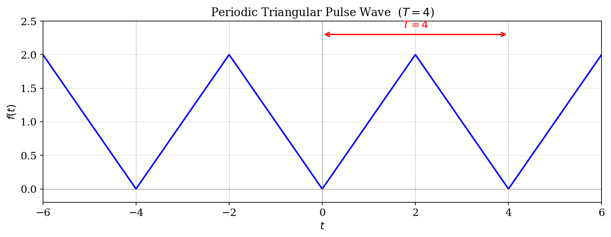

解： $T = 4,\quad \Omega = \frac{2\pi}{T} = \frac{\pi}{2}$

采用正弦-余弦形式：

$$
f(t) = \frac{a_0}{2} + \sum_{n=1}^{\infty} \big( a_n \cos n\Omega t + b_n \sin n\Omega t \big)
$$

**求 a_0**：

$$
a_0 = \frac{2}{T} \int_T f(t) \, dt = \frac{1}{2} \times 2 \int_{-2}^{0} (t + 2) \, dt = 2
$$

**求 b_n**：由于 $f(t)$ 是偶函数，而 $\sin$ 是奇函数，故：

$$
b_n = \frac{1}{2} \int_{-2}^{2} f(t) \sin n\Omega t \, dt = 0
$$

**求 a_n**：

$$
\begin{aligned}
a_n &= \frac{2}{T} \int_T f(t) \cos n\Omega t \, dt
     = \frac{1}{2} \int_{-2}^{2} f(t) \cos n\Omega t \, dt \\[6pt]
    &= \frac{1}{2} \times 2 \int_{-2}^{0} (t + 2) \cos \frac{n\pi t}{2} \, dt \\[6pt]
    &= \frac{2}{n\pi} (t + 2) \sin \frac{n\pi t}{2} \Big|_{-2}^{0}
       - \frac{2}{n\pi} \int_{-2}^{0} \sin \frac{n\pi t}{2} \, dt \\[6pt]
    &= \left(\frac{2}{n\pi}\right)^2 \cos \frac{n\pi t}{2} \Big|_{-2}^{0} \\[6pt]
    &= \begin{cases}
       0, & n \text{ 为偶数} \\[6pt]
       \displaystyle \frac{8}{\pi^2} \cdot \frac{1}{n^2}, & n \text{ 为奇数}
       \end{cases}
\end{aligned}
$$

**展开式**（$\Omega = \frac{\pi}{2}$）：

**形式一：正弦-余弦形式**

$$
\boxed{f(t) = 1 + \frac{8}{\pi^2} \left( \cos\Omega t + \frac{1}{9} \cos 3\Omega t + \frac{1}{25} \cos 5\Omega t + \cdots \right)}
$$

**形式二：振幅-相位形式**

由 $A_n = \sqrt{a_n^2 + b_n^2} = a_n = \frac{8}{\pi^2 n^2}\ (n\text{ 为奇数})$，$\varphi_n = 0$：

$$
\boxed{f(t) = 1 + \frac{8}{\pi^2} \cos(\Omega t) + \frac{8}{9\pi^2} \cos(3\Omega t) + \frac{8}{25\pi^2} \cos(5\Omega t) + \cdots}
$$

**形式三：指数形式**

由 $c_0 = \frac{a_0}{2} = 1$，$c_{\pm n} = \frac{a_n}{2} = \frac{4}{\pi^2 n^2}\ (n\text{ 为奇数})$：

$$
\boxed{f(t) = \sum_{n=-\infty}^{\infty} c_n e^{jn\Omega t},\qquad c_n = \begin{cases}
1, & n = 0 \\[6pt]
\dfrac{4}{\pi^2 n^2}, & n = \pm 1, \pm 3, \pm 5, \dots \\[6pt]
0, & n = \pm 2, \pm 4, \pm 6, \dots
\end{cases}}
$$

> 该三角形脉冲仅含**直流分量**和**奇次余弦谐波**，不含正弦分量——这是偶函数周期信号的典型特征。

---

#### 频谱分析

将展开式写为振幅-相位形式：

$$
f(t) = \frac{a_0}{2} + \sum_{n=1}^{\infty} A_n \cos(n\Omega t + \varphi_n)
$$

其中：

- **幅度谱** $A_n \sim \omega$： $A_0 = 1,\quad A_n = \frac{8}{\pi^2 n^2}\ (n\text{ 为奇数}),\quad A_n = 0\ (n\text{ 为偶数})$
- **相位谱** $\varphi_n \sim \omega$： $\varphi_n = 0$（展开式中全为余弦正系数）

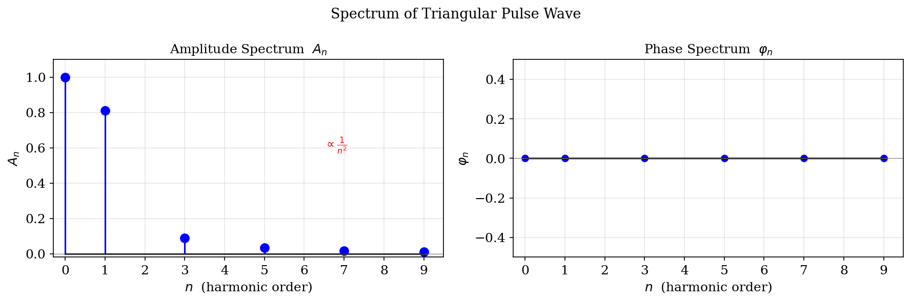

可以看到，三角脉冲波的幅度以 $\frac{1}{n^2}$ 的速率**快速衰减**——信号越平滑，高次谐波衰减越快。这也是为什么在工程中常可以截断高次谐波而不过分失真的原因。

---

## 3.2 周期信号频谱的特点与对称性

### 3.2.1 周期信号频谱的基本特点

周期信号 $f(t)$ 的傅里叶级数展开，对应的是**离散频谱**：

| 特点 | 说明 |
| :--- | :--- |
| **离散性** | 频谱由不连续的谱线组成（区别于非周期信号的连续频谱） |
| **谐波性** | 谱线仅出现在基波频率 $\Omega$ 的整数倍（$n\Omega$，$n$ 为整数）处 |
| **收敛性** | 各次谐波振幅的总趋势随 $n$ 增高而逐渐减小；$n \to \infty$ 时振幅趋于零——物理上体现了**频宽有限性** |

---

### 3.2.2 信号的频带宽度

对于一个信号，从零频率开始到需要考虑的**最高频率分量**之间的频率范围，称为**频带宽度**（带宽），常用以下准则确定：

- **零点准则**：以频谱的第一个零点作为带宽边界
- **能量准则**：以包含信号总能量某百分比（如 90%、95%）的频率范围为带宽

---

### 3.2.3 信号的奇偶分解

任意信号 $f(t)$ 都可分解为**偶分量**和**奇分量**的叠加：

$$
\boxed{f(t) = f_e(t) + f_o(t)}
$$

$$
f_e(t) = \frac{f(t) + f(-t)}{2}, \qquad f_o(t) = \frac{f(t) - f(-t)}{2}
$$

对应到傅里叶级数：

$$
f(t) = \underbrace{\frac{a_0}{2} + \sum_{n=1}^{\infty} a_n \cos n\Omega t}_{\text{偶函数项 } f_e(t)} + \underbrace{\sum_{n=1}^{\infty} b_n \sin n\Omega t}_{\text{奇函数项 } f_o(t)}
$$

---

### 3.2.4 周期偶函数 $f(-t) = f(t)$

**系数简化**：

$$
b_n = \frac{2}{T} \int_{-\frac{T}{2}}^{\frac{T}{2}} f(t) \sin n\Omega t \, dt = 0
$$

$$
\boxed{f(t) = \frac{a_0}{2} + \sum_{n=1}^{\infty} a_n \cos n\Omega t}
$$

指数形式： $c_n = c_{-n} = \frac{1}{2} a_n$（**实偶**）

相位： $\varphi_n = 0 \text{ 或 } \pm\pi$

> 例：全波余弦信号——仅含直流和余弦分量。

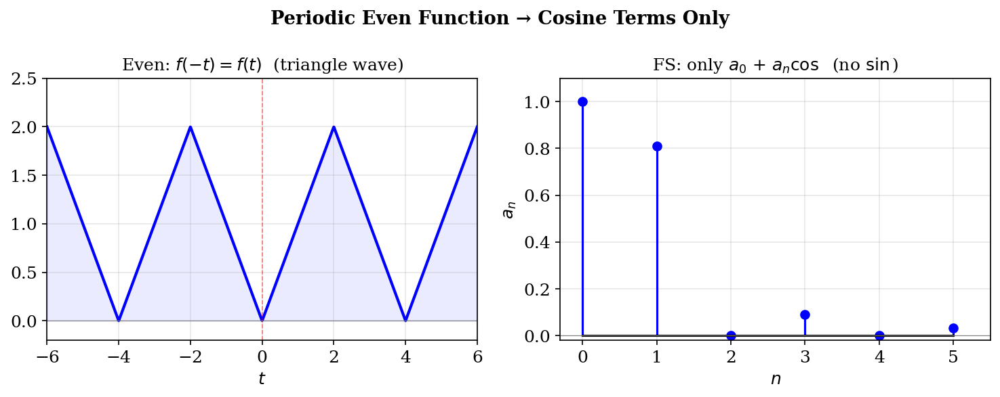

---

### 3.2.5 周期奇函数 $f(-t) = -f(t)$

**系数简化**：

$$
a_0 = a_n = 0
$$

$$
\boxed{f(t) = \sum_{n=1}^{\infty} b_n \sin n\Omega t}
$$

指数形式： $c_{\pm n} = \pm j\frac{2}{T} \int_0^{\frac{T}{2}} f(t) \sin n\Omega t \, dt = \pm \frac{j b_n}{2}$（**虚奇**）

相位： $\varphi_n = \pm\frac{\pi}{2}$

> 例：周期锯齿波 $f(t) = \frac{1}{\pi}(\sin\Omega t - \frac{1}{2}\sin 2\Omega t + \frac{1}{3}\sin 3\Omega t - \cdots)$

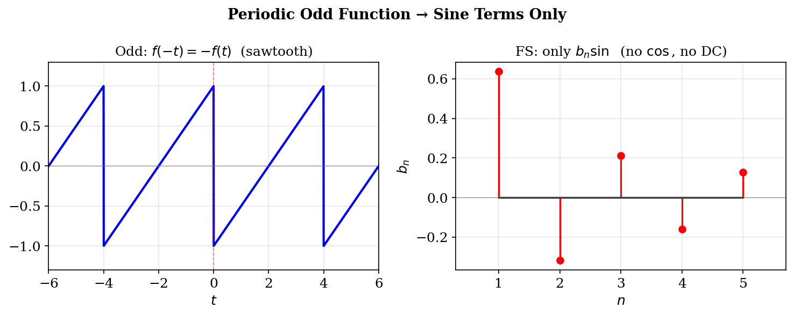

---

### 3.2.6 半波对称——奇谐函数与偶谐函数

#### 1. 奇谐函数

$$
f\left(t + \frac{T}{2}\right) = -f(t)
$$

- 半周期波形是前半个周期波形沿横轴反褶
- **不含直流分量和偶次谐波**，仅含**奇次谐波**

#### 2. 偶谐函数

$$
f\left(t + \frac{T}{2}\right) = f(t)
$$

- 实际周期为 $T/2$，半周期波形完全相同
- **仅含偶次谐波分量**（含直流）

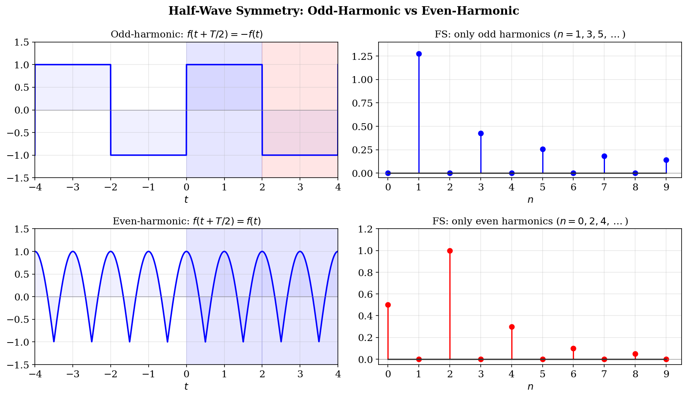

#### 3. 傅里叶级数所含频率分量速查

| 信号类型 | 所含分量 |
| :--- | :--- |
| 偶函数 | 直流 + 余弦分量 |
| 奇函数 | 正弦分量 |
| 奇谐函数 | 仅奇次谐波 |
| 偶谐函数 | 直流 + 偶次谐波 |
| 偶函数 + 奇谐 | 仅奇次谐波的余弦分量 |
| 奇函数 + 奇谐 | 仅奇次谐波的正弦分量 |
| 偶函数 + 偶谐 | 直流 + 偶次谐波的余弦分量 |

---

### 3.2.7 练习：利用对称性定性判断频谱分量

判断下列周期信号傅里叶级数中所含的频率分量类型：

**(1)** 奇函数 + 奇谐 → 只含**基波和奇次谐波的正弦分量**

**(2)** 偶函数 + 奇谐 → 只含**基波和奇次谐波的余弦分量**

**(3)** 偶函数 + 偶谐 → 只含**直流和偶次谐波的余弦分量**

**(4)** 偶谐 → 含**直流和偶次谐波分量**

---

## 3.3 有限逼近与吉布斯（Gibbs）现象

### 3.3.1 有限项截断与误差

实际分析中只能取有限项 $N$ 近似表示信号：

$$
f(t) = \frac{a_0}{2} + \sum_{k=1}^{N} \big[ a_k \cos(k\Omega t) + b_k \sin(k\Omega t) \big] + \varepsilon_N(t)
$$

- 误差 $\varepsilon_N(t)$ 随 $N$ 增大而**减小**（方均收敛）
- 按傅里叶系数计算的近似是**最小均方误差**意义下的最佳近似

---

### 3.3.2 吉布斯现象

**现象描述**：用有限项傅里叶级数表示有**间断点**的信号时，在间断点附近不可避免地出现**振荡和过冲**。

**核心特征**：
- 过冲幅度不随 $N$ 增大而减小，始终约为跳变幅度的 **~9%**
- 随 $N$ 增大，振荡频率变高，向间断点处压缩
- 振荡所占能量随 $N$ 增大而减少

**物理解读**：
- $N$ 越大 → 越接近原波形
- 快变信号（跳变沿） ↔ 高频分量
- 慢变信号（顶部平坦区） ↔ 低频分量
- 任一分量的幅度或相位发生相对变化时，波形将失真

---

### 3.3.3 对称方波有限项逼近示例

| $N$ 取值 | 现象 |
| :--- | :--- |
| $N = 1$ | 只有一个正弦波，与方波差异极大 |
| $N = 3$ | 已有方波雏形，跳变沿较平缓 |
| $N = 5, 7, \dots$ | 逐渐逼近，跳变沿变陡 |
| $N \to \infty$ | 趋于方波，但间断点处仍有 ~9% 过冲 |

---

### 3.3.4 傅里叶级数的三重理解

| 视角 | 含义 |
| :--- | :--- |
| **分析角度** | 用简单函数（正余弦）去逼近复杂函数 |
| **几何观点** | 以正交函数集为基向量，对函数空间作正交分解，系数即坐标 |
| **物理意义** | 将信号分解为一系列简谐波的叠加，从而建立了**频谱理论** |

---

## 3.4 傅里叶变换

### 3.4.1 从傅里叶级数到傅里叶变换

当周期 $T \to \infty$ 时，周期信号变为非周期信号：

- **谱线间隔**： $\Delta\Omega = \frac{2\pi}{T} \to d\omega$，离散谱 → **连续谱**
- **频谱振幅**： $\dot{A}_n = \frac{2}{T} \int_T f(t) e^{-jn\Omega t} dt \to 0$，振幅趋于零

但 $\frac{T\dot{A}_n}{2}$ 保持有限，引出了**频谱密度**的概念。

**推导过程**：

$$
\begin{aligned}
f(t) &= \frac{1}{2} \sum_{n=-\infty}^{\infty} \dot{A}_n e^{jn\Omega t}
     = \frac{1}{2} \sum_{n=-\infty}^{\infty} \frac{2}{T} \left[ \int_{-T/2}^{T/2} f(t) e^{-jn\Omega t} dt \right] e^{jn\Omega t}
\end{aligned}
$$

当 $T \to \infty$： $\Omega \to d\omega$， $n\Omega \to \omega$， $T = \frac{2\pi}{\Omega} \to \frac{2\pi}{d\omega}$，求和 $\to$ 积分：

$$
\boxed{f(t) = \frac{1}{2\pi} \int_{-\infty}^{\infty} \left[ \int_{-\infty}^{\infty} f(t) e^{-j\omega t} dt \right] e^{j\omega t} d\omega}
$$

---

### 3.4.2 傅里叶变换对

$$
\boxed{\begin{aligned}
F(j\omega) &= \int_{-\infty}^{\infty} f(t) e^{-j\omega t} dt \quad &\text{(正变换)} \\[6pt]
f(t) &= \frac{1}{2\pi} \int_{-\infty}^{\infty} F(j\omega) e^{j\omega t} d\omega \quad &\text{(逆变换)}
\end{aligned}}
$$

简记为： $f(t) \leftrightarrow F(j\omega)$

$F(j\omega)$ 具有**单位频带的振幅**的量纲，称为**频谱密度函数**，简称频谱函数。

#### 如何从时间函数得到频谱函数？

以单个矩形脉冲为例，演示完整的 $f(t) \to F(j\omega)$ 流程：

$$
f(t) = \begin{cases} E, & |t| < \frac{\tau}{2} \\ 0, & \text{其他} \end{cases}
$$

**第 1 步**：写出傅里叶正变换积分

$$
F(j\omega) = \int_{-\infty}^{\infty} f(t) e^{-j\omega t} dt
$$

**第 2 步**：代入 $f(t)$，缩窄积分限（只在 $f(t) \neq 0$ 的区间积分）

$$
F(j\omega) = \int_{-\frac{\tau}{2}}^{\frac{\tau}{2}} E \cdot e^{-j\omega t} dt
$$

**第 3 步**：计算定积分

$$
F(j\omega) = E \cdot \frac{e^{-j\omega t}}{-j\omega} \Big|_{-\frac{\tau}{2}}^{\frac{\tau}{2}}
           = \frac{E}{-j\omega} \left( e^{-j\omega\frac{\tau}{2}} - e^{j\omega\frac{\tau}{2}} \right)
$$

**第 4 步**：利用欧拉公式 $\sin\theta = \frac{e^{j\theta} - e^{-j\theta}}{2j}$ 化简

$$
F(j\omega) = \frac{E}{-j\omega} \cdot (-2j) \sin\!\left(\frac{\omega\tau}{2}\right)
           = \frac{2E}{\omega} \sin\!\left(\frac{\omega\tau}{2}\right)
$$

**第 5 步**：写成标准形式（引入 $\mathrm{Sa}$ 函数）

$$
F(j\omega) = E\tau \cdot \frac{\sin(\omega\tau/2)}{\omega\tau/2} = E\tau \, \mathrm{Sa}\!\left(\frac{\omega\tau}{2}\right)
$$

**第 6 步**：分离幅频与相频特性

$$
|F(j\omega)| = E\tau \left|\mathrm{Sa}\!\left(\frac{\omega\tau}{2}\right)\right|, \qquad
\varphi(\omega) = \begin{cases} 0, & \mathrm{Sa} > 0 \\ \pm\pi, & \mathrm{Sa} < 0 \end{cases}
$$

> **总结**：$f(t) \to F(j\omega)$ 的核心就是**代入积分** $\to$ **缩窄积分限** $\to$ **计算积分** $\to$ **三角化简** 四步。所有信号的傅里叶变换都遵循这一流程。

**与周期矩形脉冲的对比**：若将该矩形脉冲以周期 $T$ 延拓为周期信号，其傅里叶级数的复数幅度为：

$$
\dot{A}_n = \frac{2}{T} \int_{-\frac{\tau}{2}}^{\frac{\tau}{2}} E e^{-j n\Omega t} dt = \frac{2}{T} \cdot E\tau\mathrm{Sa}\!\left(\frac{n\Omega\tau}{2}\right)
$$

注意到中间的积分与 $F_0(j\omega)$ 完全一样，只是 $\omega$ 换成了 $n\Omega$，前面多乘了 $\frac{2}{T}$。即：

$$
\boxed{\dot{A}_n = \frac{2}{T} F_0(j n\Omega)}
$$

> 结论：周期信号的离散频谱 = 单周期傅里叶变换连续频谱以 $\frac{2}{T}$ 为比例因子在谐波频率处**采样**。

---

### 3.4.3 傅里叶变换的三角形式

当 $f(t)$ 为实函数时：

$$
f(t) = \frac{1}{\pi} \int_{0}^{\infty} |F(j\omega)| \cos(\omega t + \varphi) \, d\omega
$$

非周期信号也可视为无穷多个不同频率正弦分量的连续叠加。

---

### 3.4.4 常用傅里叶变换表（表 3-1）

#### ⭐ 1. 单位冲激 $\delta(t) \leftrightarrow 1$

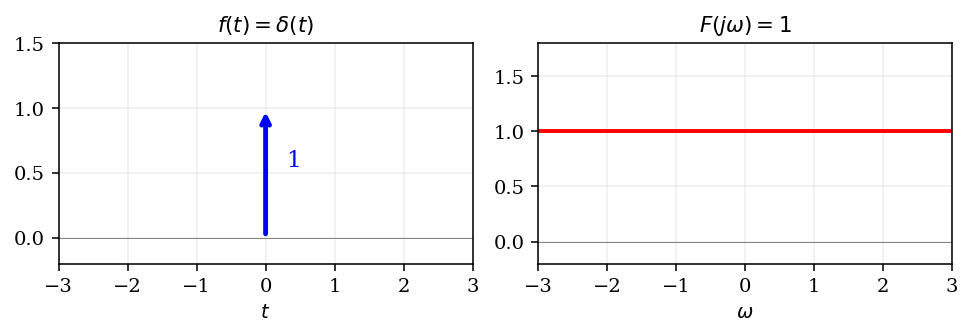

---

#### ⭐ 2. 单位阶跃 $u(t) \leftrightarrow \pi\delta(\omega) + \dfrac{1}{j\omega}$

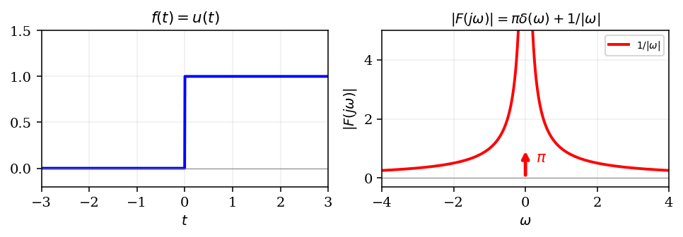

---

#### 3. 符号函数 $\mathrm{sgn}(t) \leftrightarrow \dfrac{2}{j\omega}$

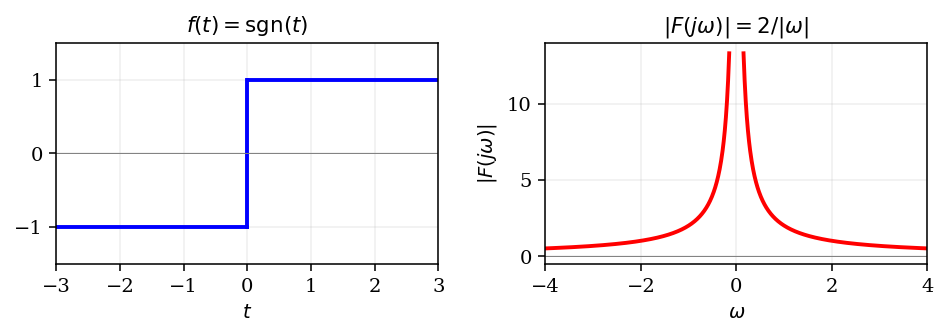

---

#### ⭐ 4. 单位直流 $1 \leftrightarrow 2\pi\delta(\omega)$

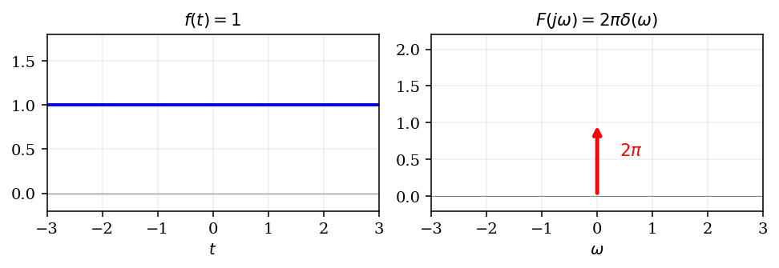

---

#### ⭐ 5. 单边指数 $e^{-\alpha t} u(t) \leftrightarrow \dfrac{1}{\alpha + j\omega}$

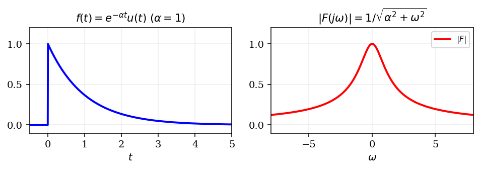

---

#### ⭐ 6. 双边指数 $e^{-\alpha |t|} \leftrightarrow \dfrac{2\alpha}{\alpha^2 + \omega^2}$

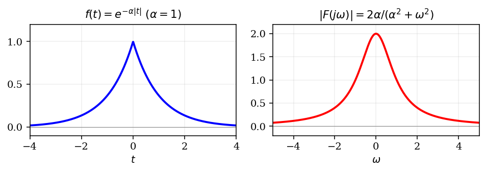

---

#### ⭐ 7. 指数脉冲 $t e^{-\alpha t} u(t) \leftrightarrow \dfrac{1}{(\alpha + j\omega)^2}$

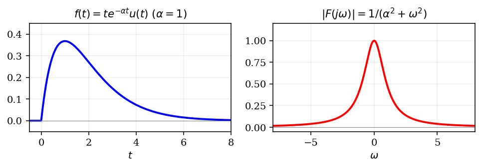

---

#### ⭐ 8. 单位余弦 $\cos\omega_0 t \leftrightarrow \pi[\delta(\omega + \omega_0) + \delta(\omega - \omega_0)]$

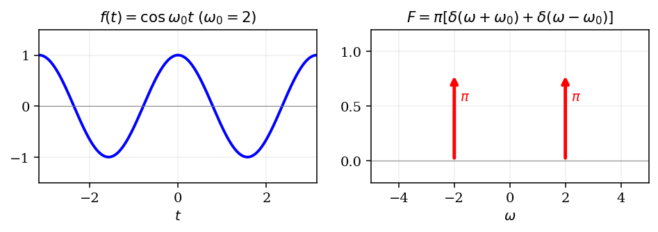

---

#### 9. 单位正弦 $\sin\omega_0 t \leftrightarrow j\pi[\delta(\omega + \omega_0) - \delta(\omega - \omega_0)]$

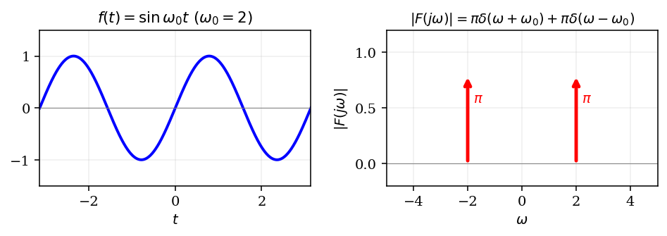

---

#### 10. 减幅正弦 $e^{-\alpha t}\sin\omega_0 t \cdot u(t) \leftrightarrow \dfrac{\omega_0}{(\alpha + j\omega)^2 + \omega_0^2}$

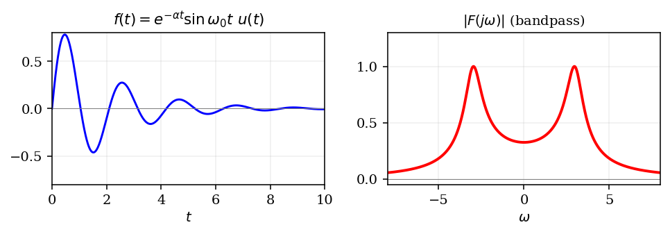

---

#### 11. 阶跃正弦 $\sin\omega_0 t \cdot u(t) \leftrightarrow \dfrac{\pi}{2j}[\delta(\omega - \omega_0) - \delta(\omega + \omega_0)] + \dfrac{\omega_0}{\omega_0^2 - \omega^2}$

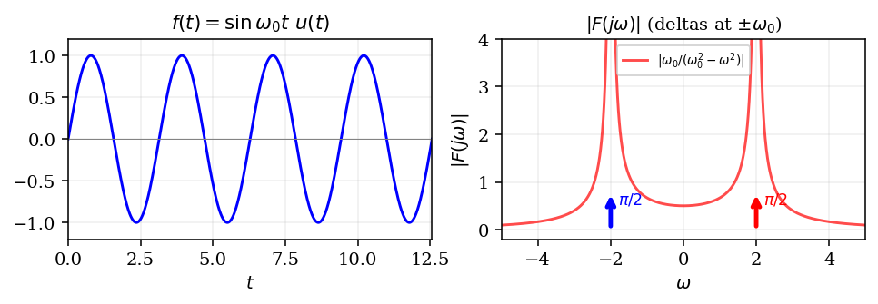

---

#### 12. 阶跃余弦 $\cos\omega_0 t \cdot u(t) \leftrightarrow \dfrac{\pi}{2}[\delta(\omega - \omega_0) + \delta(\omega + \omega_0)] + \dfrac{j\omega}{\omega_0^2 - \omega^2}$

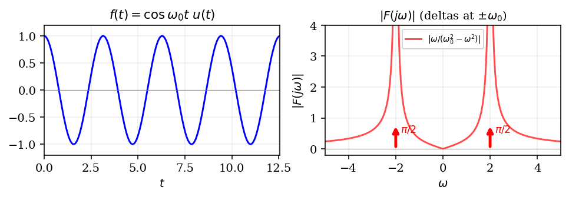

---

#### ⭐ 13. 矩形脉冲（门函数） $G_\tau(t) \leftrightarrow \tau\,\mathrm{Sa}\!\left(\dfrac{\omega\tau}{2}\right)$

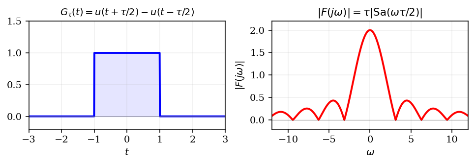

---

#### 14. 抽样函数 $\mathrm{Sa}\!\left(\dfrac{\Omega t}{2}\right) \leftrightarrow \dfrac{2\pi}{\Omega}\!\left[u\!\left(\omega + \frac{\Omega}{2}\right) - u\!\left(\omega - \frac{\Omega}{2}\right)\right]$

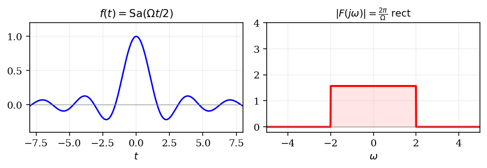

---

#### 15. 升余弦脉冲 $\left[1 + \cos\!\left(\frac{2\pi t}{T}\right)\right] G_T(t) \leftrightarrow \dfrac{8\pi^2 \sin(T\omega/2)}{\omega(4\pi^2 - T^2\omega^2)}$

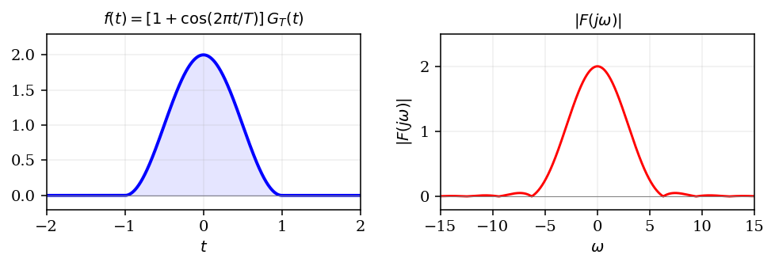

---

#### 16. 半余弦脉冲 $\cos\!\left(\frac{\pi t}{\tau}\right) G_\tau(t) \leftrightarrow \dfrac{2\tau}{\pi} \cdot \dfrac{\cos(\tau\omega/2)}{1 - \tau^2\omega^2/\pi^2}$

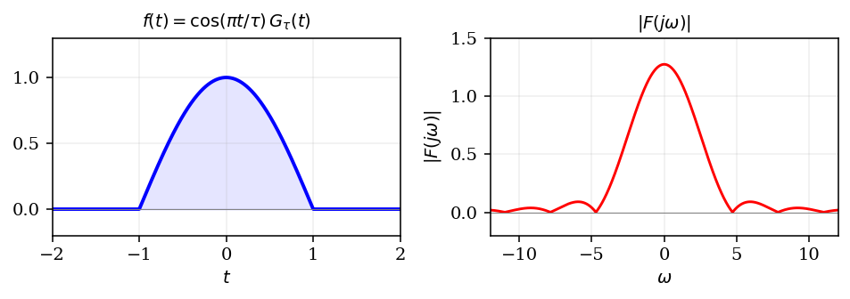

---

#### 17. 三角形脉冲 $f(t) = 1 - \dfrac{|t|}{\tau}\ (|t|<\tau) \leftrightarrow \tau[\mathrm{Sa}(\omega\tau/2)]^2$

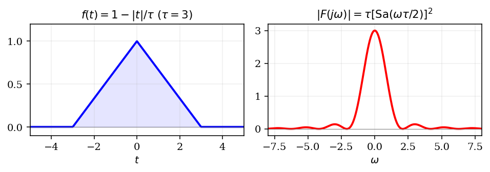

---

#### 18. 高斯脉冲 $e^{-(t/\tau)^2} \leftrightarrow \sqrt{\pi}\,\tau\,e^{-(\tau\omega/2)^2}$

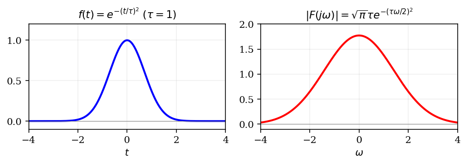

---

#### 19. 冲激序列 $\displaystyle\sum_{n=-\infty}^{\infty} \delta(t - nT) \leftrightarrow \Omega\!\sum_{n=-\infty}^{\infty} \delta(\omega - n\Omega)$

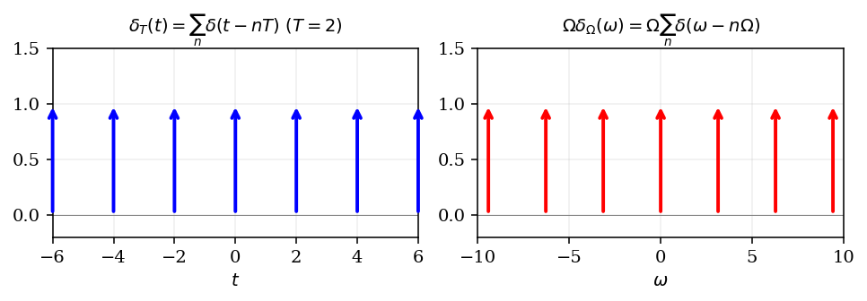

---

> **记忆要点**：
> - $\delta(t) \leftrightarrow 1$ 和 $1 \leftrightarrow 2\pi\delta(\omega)$ 是对偶对，必背
> - $u(t)$ 和 $\mathrm{sgn}(t)$ 的变换含 $\frac{1}{j\omega}$ 项
> - 门函数 ↔ $\mathrm{Sa}$ 函数、三角脉冲 ↔ $\mathrm{Sa}^2$ 在卷积计算中高频使用
> - 正/余弦的变换是 $\delta$ 函数对（位于 $\pm\omega_0$），体现了"单频 ↔ 冲激"
> - $e^{-\alpha t}u(t) \leftrightarrow \frac{1}{\alpha + j\omega}$ 是电路暂态分析中最常用的变换对

### 3.4.4+ 补充：符号函数傅里叶变换的严格推导

符号函数 $\mathrm{sgn}(t)$ 不满足绝对可积条件，其傅里叶变换不能直接由积分定义求得。这里介绍一种**极限构造法**。

**构造思路**：用一个满足绝对可积的函数族逼近 $\mathrm{sgn}(t)$，求出每个成员的 FT，再取极限。

**第 1 步：构造辅助函数**

$$
f_a(t) = e^{-at} u(t) - e^{at} u(-t), \qquad a > 0
$$

该函数的行为：
- 当 $t > 0$：$f_a(t) = e^{-at}$（衰减指数）
- 当 $t < 0$：$f_a(t) = -e^{at} = -e^{-a|t|}$（负的衰减指数）
- 当 $a \to 0^+$：$f_a(t) \to \mathrm{sgn}(t)$

**第 2 步：求 $f_a(t)$ 的傅里叶变换**

由 FT 表第 5 条 $e^{-\alpha t}u(t) \leftrightarrow \dfrac{1}{\alpha + j\omega}$，结合尺度反褶性质：

$$
\begin{aligned}
\mathcal{F}\{e^{at}u(-t)\} &= \mathcal{F}\{g(-t)\} \quad (\,g(t) = e^{-at}u(t)\,) \\
&= G(-j\omega) = \frac{1}{a - j\omega}
\end{aligned}
$$

因此：

$$
\begin{aligned}
F_a(j\omega) &= \mathcal{F}\{e^{-at}u(t)\} - \mathcal{F}\{e^{at}u(-t)\} \\[4pt]
&= \frac{1}{a + j\omega} - \frac{1}{a - j\omega} \\[4pt]
&= \frac{(a - j\omega) - (a + j\omega)}{a^2 + \omega^2} \\[4pt]
&= \boxed{-\frac{2j\omega}{a^2 + \omega^2}}
\end{aligned}
$$

**第 3 步：取极限 $a \to 0^+$**

$$
\lim_{a \to 0^+} F_a(j\omega) = \lim_{a \to 0^+} \left(-\frac{2j\omega}{a^2 + \omega^2}\right) = -\frac{2j\omega}{\omega^2} = \frac{2}{j\omega}
$$

故得：

$$
\boxed{\mathrm{sgn}(t) \leftrightarrow \frac{2}{j\omega}}
$$

**关于 $\omega = 0$ 的注记**：

在 $\omega = 0$ 处，$\frac{2}{j\omega}$ 有一个极点，这反映了 $\mathrm{sgn}(t)$ 不绝对可积的事实。严格来说，这里的 $\frac{1}{j\omega}$ 应理解为**主值分布**。在实际应用中，$\omega = 0$ 处的奇异性通常与 $u(t)$ 的变换中的 $\pi\delta(\omega)$ 项配合处理。

> **另一种视角**：$\mathrm{sgn}(t) = 2u(t) - 1$，利用 $u(t) \leftrightarrow \pi\delta(\omega) + \frac{1}{j\omega}$ 和 $1 \leftrightarrow 2\pi\delta(\omega)$，直接相减亦可得到 $\frac{2}{j\omega}$。但上述极限构造法不依赖 $u(t)$ 的变换（$u(t)$ 的 FT 本身也需要类似技巧推导），在逻辑上更为自洽。

---

---

### 3.4.5 周期信号的傅里叶变换

对于周期信号 $f(t)$，其傅里叶变换由以下联立关系给出：

$$
\begin{cases}
\mathcal{F}\{f(t)\} = \displaystyle \pi \sum_{n=-\infty}^{\infty} \dot{A}_n \,\delta(\omega-n\Omega) \\[6pt]
\dot{A}_n = \displaystyle \frac{2}{T} F_0(jn\Omega)
\end{cases}
$$

其中 $F_0(j\omega)$ 为截取**单周期**波形的傅里叶变换，$\Omega = \dfrac{2\pi}{T}$ 为基波角频率。

将 $\dot{A}_n$ 代入，得到统一形式：

$$
\boxed{\mathcal{F}\{f(t)\} = \frac{2\pi}{T}\sum_{n=-\infty}^{\infty} F_0(jn\Omega)\,\delta(\omega-n\Omega)}
$$

> **物理含义**：周期信号的频谱函数是**冲激序列**——各冲激位于谐波频率 $n\Omega$ 处，强度 $\dfrac{2\pi}{T}F_0(jn\Omega)$ 正比于单周期频谱在谐波频率处的采样值。

---

### 3.4.6 周期信号 vs 非周期信号频谱对比

| | 周期信号 | 非周期信号 |
| :--- | :--- | :--- |
| **频谱性质** | 离散性、谐波性、收敛性 | 连续性、收敛性 |
| **表示方式** | 傅里叶级数（$\dot{A}_n$） | 傅里叶变换（$F(j\omega)$） |
| **量纲** | 实际振幅 | 频谱密度 |
| **典型形式** | $\dot{A}_n = \frac{A\tau}{T} \mathrm{Sa}(\frac{n\Omega\tau}{2})$ | $F(j\omega) = A\tau \mathrm{Sa}(\frac{\omega\tau}{2})$ |

**两者的计算关系**：

设 $f_0(t)$ 为截取一个周期的波形，其 FT 为 $F_0(j\omega)$。周期信号的复数幅度可直接由单周期 FT 得到：

$$
\boxed{\dot{A}_n = \frac{2}{T} F_0(j n\Omega)}
$$

推导：$\dot{A}_n = \frac{2}{T}\int_{-T/2}^{T/2} f(t)e^{-jn\Omega t}dt$，而 $F_0(j\omega) = \int_{-T/2}^{T/2} f(t)e^{-j\omega t}dt$，对比得 $\omega \to n\Omega$ 时代入即得。

> 以矩形脉冲为例：$F_0(j\omega) = A\tau\mathrm{Sa}(\omega\tau/2)$ → $\dot{A}_n = \frac{2}{T} \cdot A\tau\mathrm{Sa}(n\Omega\tau/2)$。注意量纲：$\dot{A}_n$ 是振幅（除以 $T$），$F_0(j\omega)$ 是频谱密度。

### 3.4.7 周期信号频谱的推导实例：周期矩形脉冲

以周期矩形脉冲为例，完整展示从单周期 FT 到离散频谱的三步推导。

**第 1 步**：写出单周期脉冲的 FT（§3.4.4 已完成）。

$$
F_0(j\omega) = A\tau \, \mathrm{Sa}\!\left(\frac{\omega\tau}{2}\right)
$$

**第 2 步**：用采样关系 $\boxed{\dot{A}_n = \frac{2}{T} F_0(j n\Omega)}$ 得到 FS 复数幅度。

$$
\dot{A}_n = \frac{2A\tau}{T} \, \mathrm{Sa}\!\left(\frac{n\Omega\tau}{2}\right), \qquad \Omega = \frac{2\pi}{T}
$$

**第 3 步**：$n$ 次谐波的振幅 $A_n = |\dot{A}_n|$。

$$
\boxed{A_n = \frac{2A\tau}{T} \left|\mathrm{Sa}\!\left(\frac{n\Omega\tau}{2}\right)\right|}
$$

直流分量（$n=0$）：$A_0 = \frac{2A\tau}{T}$（$\mathrm{Sa}(0)=1$）。

---

**$\dot{A}_n$ 与 $c_n$ 的系数差异**（常见易混点）：

指数傅里叶级数有两种写法，差一个 $1/2$ 因子：

| 写法 | 展开式 | 系数 | 与单周期 FT 的关系 |
| :--- | :--- | :--- | :--- |
| $c_n$（$F_n$） | $f(t) = \displaystyle\sum_{n=-\infty}^{\infty} c_n e^{jn\Omega t}$ | $c_n = \frac{1}{T}\int_T f(t)e^{-jn\Omega t}dt$ | $c_n = \frac{1}{T}F_0(jn\Omega)$ |
| $\dot{A}_n$ | $f(t) = \displaystyle\frac{1}{2}\sum_{n=-\infty}^{\infty} \dot{A}_n e^{jn\Omega t}$ | $\dot{A}_n = \frac{2}{T}\int_T f(t)e^{-jn\Omega t}dt$ | $\dot{A}_n = \frac{2}{T}F_0(jn\Omega)$ |

关系：$\dot{A}_n = 2c_n$。两者都正确，取决于展开式前是否有 $\frac{1}{2}$。

以周期矩形脉冲为例：
- 用 $c_n$ 写：$f(t) = \frac{A\tau}{T}\sum c_n \mathrm{Sa}\,e^{jn\Omega t}$
- 用 $\dot{A}_n$ 写：$f(t) = \frac{A\tau}{T}\sum \frac{\dot{A}_n}{2}\mathrm{Sa}\,e^{jn\Omega t}$

两种表达式最终 $f(t)$ 完全一样，差的那一倍在展开式前的系数中抵消。

---

**频谱图参数**：

| 参数 | 公式 | 意义 |
| :--- | :--- | :--- |
| 谱线间隔 | $\Omega = 2\pi/T$ | $T$ 越大 → $\Omega$ 越小 → 谱线越密 |
| 包络形状 | $\mathrm{Sa}$ 函数 | 零点位于 $\frac{n\Omega\tau}{2} = k\pi$ 即 $n\Omega = \frac{2k\pi}{\tau}$ |
| 第一零点位置 | $\omega = 2\pi/\tau$ | 脉宽 $\tau$ 越小 → 第一零点越远 → 带宽越宽 |
| 频带宽度 | $B \approx 1/\tau$ | 脉宽与频宽成反比 |

**数值示例**（$A=1,\ \tau=1,\ T=4$）：

$$
\begin{aligned}
A_0 &= \frac{1}{2} = 0.5 \\[4pt]
A_1 &= \frac{1}{2}\left|\mathrm{Sa}\!\left(\frac{\pi}{4}\right)\right| \approx 0.45 \\[4pt]
A_2 &= \frac{1}{2}\left|\mathrm{Sa}\!\left(\frac{\pi}{2}\right)\right| \approx 0.32 \\[4pt]
A_4 &= \frac{1}{2}\left|\mathrm{Sa}(\pi)\right| = 0 \quad (\text{第一零点})
\end{aligned}
$$

**周期信号的完整频谱函数**（§3.4.5 的实例化）：

$$
F(j\omega) = \pi\sum_{n=-\infty}^{\infty} \dot{A}_n \, \delta(\omega - n\Omega)
           = \frac{2\pi A\tau}{T} \sum_{n=-\infty}^{\infty} \mathrm{Sa}\!\left(\frac{n\Omega\tau}{2}\right) \delta(\omega - n\Omega)
$$

> 画法：在 $\omega = 0, \pm\Omega, \pm 2\Omega, \dots$ 处画箭头，箭头高度 = $A_n$，包络线是 $\mathrm{Sa}$ 函数。

### 3.4.8 利用傅里叶级数求和无穷级数

傅里叶级数有一个巧妙的"副作用"——将一个已知周期信号展开为傅里叶级数后，在特定的 $t$ 值处代入，可以将该点处的信号值与一个无穷级数等式联系起来，从而求出该级数的闭合值。

**基本步骤**：
1. 选择一个周期信号 $f(t)$，其傅里叶级数展开已知（或容易求出）
2. 在 $f(t)$ 的连续点处，FS 收敛于 $f(t)$
3. 取某个特殊的 $t = t_0$，使 FS 退化为一个数值级数
4. 由 $f(t_0)$ 的已知值解出级数和

---

**例 1：莱布尼茨级数（$\pi/4$ 级数）**

取周期方波（$T = 2\pi$，$\Omega = 1$）：

$$
f(t) = \begin{cases}
\; 1, & 0 < t < \pi \\[2pt]
-1, & \pi < t < 2\pi
\end{cases}
$$

该信号是奇谐函数 + 奇函数，FS 仅含奇次正弦项：

$$
f(t) = \frac{4}{\pi} \sum_{k=0}^{\infty} \frac{\sin\big((2k+1)t\big)}{2k+1}
      = \frac{4}{\pi}\left(\sin t + \frac{\sin 3t}{3} + \frac{\sin 5t}{5} + \cdots \right)
$$

在 $t = \pi/2$ 处，$f(\pi/2) = 1$。代入 FS：

$$
\begin{aligned}
1 &= \frac{4}{\pi}\left(\sin\frac{\pi}{2} + \frac{\sin\frac{3\pi}{2}}{3} + \frac{\sin\frac{5\pi}{2}}{5} + \cdots \right) \\[4pt]
  &= \frac{4}{\pi}\left(1 - \frac{1}{3} + \frac{1}{5} - \frac{1}{7} + \cdots \right)
\end{aligned}
$$

因此：

$$
\boxed{1 - \frac{1}{3} + \frac{1}{5} - \frac{1}{7} + \cdots = \frac{\pi}{4}}
$$

这就是著名的**莱布尼茨级数**（Leibniz series for $\pi$）。

---

**例 2：$\pi^2/8$ 级数**

取周期三角波 $f(t) = |t|$，$-\pi \leq t \leq \pi$，周期 $T = 2\pi$（$\Omega = 1$）：

信号为偶函数 → $b_n = 0$。FS 系数：

$$
a_0 = \frac{2}{2\pi}\int_{-\pi}^{\pi} |t|\,dt = \pi, \qquad
a_n = \frac{2}{\pi}\int_{0}^{\pi} t \cos(nt)\,dt = \frac{2}{n^2\pi}\big[(-1)^n - 1\big]
$$

当 $n$ 为偶数时 $a_n = 0$；当 $n$ 为奇数时 $a_n = -\dfrac{4}{n^2\pi}$。

FS 展开（振幅-相位形式，$\Omega = 1$）：

$$
f(t) = \frac{\pi}{2} - \frac{4}{\pi}\sum_{k=1}^{\infty} \frac{\cos\big((2k-1)t\big)}{(2k-1)^2}
      = \frac{\pi}{2} - \frac{4}{\pi}\left(\cos t + \frac{\cos 3t}{9} + \frac{\cos 5t}{25} + \cdots \right)
$$

在 $t = 0$ 处，$f(0) = 0$。代入：

$$
\begin{aligned}
0 &= \frac{\pi}{2} - \frac{4}{\pi}\left(1 + \frac{1}{9} + \frac{1}{25} + \cdots \right) \\[4pt]
\frac{4}{\pi}\left(1 + \frac{1}{3^2} + \frac{1}{5^2} + \cdots \right) &= \frac{\pi}{2}
\end{aligned}
$$

因此：

$$
\boxed{1 + \frac{1}{3^2} + \frac{1}{5^2} + \frac{1}{7^2} + \cdots = \frac{\pi^2}{8}}
$$

> **拓展**：从该结果可进一步推出 $\sum_{n=1}^{\infty} \frac{1}{n^2} = \frac{\pi^2}{6}$（巴塞尔问题）——将全部正整数平方倒数和分解为奇数和偶数两部分，偶数部分提取因子 $1/4$ 即得。

---

**方法小结**：

| 信号类型 | 代入点 | 所得级数 |
| :--- | :--- | :--- |
| 方波（奇函数） | 间断点附近连续点 | 交错级数（$\pi/4$ 型） |
| 三角波（偶函数） | $t=0$ | $\sum 1/n^2$ 型级数 |

核心思想：**用已知信号的时域值反推频谱分量的无穷和**。

---

## 3.5 傅里叶变换的性质

### 3.5.1 线性特性

$$
\mathcal{F}\{a_1 f_1(t) + a_2 f_2(t)\} = a_1 F_1(j\omega) + a_2 F_2(j\omega)
$$

**例**：求 $f(t) = G_\tau(t) + G_{2\tau}(t)$（宽 $\tau$ 和宽 $2\tau$ 两门函数叠加）的 FT。

由门函数 $G_T(t) \leftrightarrow T\,\mathrm{Sa}(\omega T/2)$，线性叠加：

$$
F(\omega) = \tau\,\mathrm{Sa}\!\left(\frac{\omega\tau}{2}\right) + 2\tau\,\mathrm{Sa}(\omega\tau)
$$

> 详见 §3.6 例1。

---

### 3.5.2 延时特性

$$
\boxed{f(t - t_0) \leftrightarrow F(j\omega) e^{-j\omega t_0}}
$$

> 时域延时 → 频域相移（幅度谱不变，相位谱线性相移）。

**例**：已知门函数 $F_0(\omega)=E\tau\mathrm{Sa}(\omega\tau/2)$，求三脉冲 $f(t)=f_0(t)+f_0(t+T)+f_0(t-T)$ 的频谱。

由延时特性 $f(t \pm T) \leftrightarrow F(\omega)e^{\pm j\omega T}$：

$$
F(\omega) = F_0(\omega) + F_0(\omega)e^{j\omega T} + F_0(\omega)e^{-j\omega T} = F_0(\omega)(1 + 2\cos\omega T)
$$

> 详见 §3.6 例2。

---

### 3.5.3 移频特性（调制特性）

$$
\boxed{f(t) e^{j\omega_c t} \leftrightarrow F(j\omega - j\omega_c)}
$$

时域乘以复指数 → 频域搬移 $\omega_c$。在电子技术中这就是**调幅**的原理——用高频正弦波乘调制信号，频谱搬移过程中结构保持不变。

**例**：求余弦脉冲 $f(t) = \cos\omega_0 t \cdot G_\tau(t)$ 的 FT。

$\cos\omega_0 t = \frac{1}{2}(e^{j\omega_0 t}+e^{-j\omega_0 t})$，由移频特性：

$$
F(\omega) = \frac{\tau}{2}\left[\mathrm{Sa}\!\left(\frac{(\omega-\omega_0)\tau}{2}\right) + \mathrm{Sa}\!\left(\frac{(\omega+\omega_0)\tau}{2}\right)\right]
$$

> 详见 §3.6 例6。

---

### 3.5.4 尺度变换特性

$$
\boxed{f(at) \leftrightarrow \frac{1}{|a|} F\!\left(\frac{j\omega}{a}\right)}
$$

**核心结论**：
- **时域压缩** ↔ **频域扩展**
- **时域扩展** ↔ **频域压缩**
- 脉宽与频宽的乘积为常数（由信号类型决定）

**例**：已知 $f_1(t) \leftrightarrow F_1(\omega)$，求 $f_1(t)$ 以 $\frac{t_0}{2}$ 为轴反褶后 $f_2(t)$ 的 FT。

$f_2(t) = f_1[-(t-t_0)]$，由延时 + 反褶（$a=-1$）：

$$
f_2(t) \leftrightarrow F_1(-\omega) e^{-j\omega t_0}
$$

> 详见 §3.6 例3。

---

### 3.5.5 奇偶虚实特性

| 时域 $f(t)$ | 频域 $F(j\omega)$ |
| :--- | :--- |
| 实偶函数 | 实偶函数 |
| 实奇函数 | 虚奇函数 |

> 这与周期信号奇偶性与其谐波分量关系完全对应。

---

### 3.5.6 对称特性

$$
\boxed{F(jt) \leftrightarrow 2\pi \cdot f(-\omega)}
$$

用途：将一个变换对中的 $t$ 和 $\omega$ 互换，可立即得到一个新的变换对。

**例**：求 $\frac{\sin t}{t}$ 的 FT。

门函数 $G_2(t)$ 的 FT 为 $2\,\frac{\sin\omega}{\omega}$（$\tau=2$，$E=1$）。取 $E=\frac{1}{2}$ 使系数归一化为 $\frac{\sin\omega}{\omega}$，由对称性：

$$
\frac{\sin t}{t} \leftrightarrow \pi \cdot G_2(\omega) = \begin{cases} \pi, & |\omega|<1 \\ 0, & |\omega|>1 \end{cases}
$$

> 详见 §3.6 例4。

---

### 3.5.7 微分特性

**时域微分**：

$$
\boxed{\frac{df(t)}{dt} \leftrightarrow j\omega F(j\omega)}
$$

**频域微分**：

$$
\boxed{-jt f(t) \leftrightarrow \frac{dF(j\omega)}{d\omega}}
$$

---

### 3.5.8 积分特性

**时域积分公式一**：若 $f(t) \leftrightarrow F(j\omega)$，则：

$$
\boxed{\int_{-\infty}^{t} f(\tau) d\tau \leftrightarrow \frac{F(j\omega)}{j\omega} + \pi F(0) \delta(\omega)}
$$

时域积分 → 频域除以 $j\omega$ + 直流冲激修正（$F(0) \neq 0$ 时积分引入直流分量）。

---

**时域积分公式二**：若 $\frac{dg(t)}{dt} = f(t)$，且 $f(t) \leftrightarrow F(j\omega)$，则：

$$
\boxed{g(t) \leftrightarrow \frac{F(j\omega)}{j\omega} + \big[g(\infty) + g(-\infty)\big] \pi \delta(\omega)}
$$

$g(\infty) + g(-\infty)$ 为 $g(t)$ 在 $\pm\infty$ 处的跳变总量，当 $g(-\infty)=0,\ g(\infty)=C$ 时退化为公式一。

---

**频域积分**（对偶性质）：

$$
\boxed{\pi f(0)\delta(t) - \frac{f(t)}{jt} \leftrightarrow \int_{-\infty}^{\omega} F(j\Omega) \, d\Omega}
$$

频域积分 → 时域除以 $-jt$ + 冲激修正（由对称性从时域积分导出）。

**例**：求 $f(t) = -u(-t) + u(t-1)$ 的 FT。

先求导消去阶跃： $f'(t) = \delta(t) + \delta(t-1) \leftrightarrow 1 + e^{-j\omega}$

由积分特性（公式二），$f(-\infty)=-1$，$f(\infty)=0$：

$$
f(t) \leftrightarrow \frac{1 + e^{-j\omega}}{j\omega}
$$

> 详见 §3.6 例5。

---

### 3.5.9 卷积定理

**时域卷积定理**：

$$
\boxed{\mathcal{F}\{f_1(t) * f_2(t)\} = F_1(j\omega) \cdot F_2(j\omega)}
$$

**频域卷积定理**：

$$
\boxed{\mathcal{F}\{f_1(t) \cdot f_2(t)\} = \frac{1}{2\pi} F_1(j\omega) * F_2(j\omega)}
$$

> 时域卷积 ↔ 频域乘法；时域乘法 ↔ 频域卷积。这是信号与系统分析中最重要的定理之一。

**例1**：三角脉冲 $f(t) = (1-|t|/\tau)G_{2\tau}(t)$，可视为两个相同门函数的卷积 $\frac{1}{\tau}g(t)*g(t)$。由卷积定理：

$$
F(\omega) = \frac{1}{\tau}\left[\tau\,\mathrm{Sa}\!\left(\frac{\omega\tau}{2}\right)\right]^2 = \tau\left[\mathrm{Sa}\!\left(\frac{\omega\tau}{2}\right)\right]^2
$$

> 详见 §3.6 例7。

**利用卷积定理证明时域积分特性**：

$$
\because f(t) * u(t) = \int_{-\infty}^t f(\tau)u(t-\tau)d\tau = \int_{-\infty}^t f(\tau)d\tau
$$

$$
\therefore \mathcal{F}\!\left[\int_{-\infty}^t f(\tau)d\tau\right] = F(j\omega) \cdot \mathcal{F}[u(t)] = F(j\omega)\!\left[\frac{1}{j\omega} + \pi\delta(\omega)\right]
$$

---

### 3.5.10 Parseval 能量定理

$$
\boxed{\int_{-\infty}^{\infty} |f(t)|^2 dt = \frac{1}{2\pi} \int_{-\infty}^{\infty} |F(\omega)|^2 d\omega}
$$

**实质**：能量守恒——时域能量 = 频域能量。

---

### 3.5.11 性质速查表

| 性质 | 时域 $f(t)$ | 频域 $F(j\omega)$ |
| :--- | :--- | :--- |
| 线性 | $a_1 f_1 + a_2 f_2$ | $a_1 F_1 + a_2 F_2$ |
| 延时 | $f(t - t_0)$ | $F(j\omega) e^{-j\omega t_0}$ |
| 移频 | $f(t) e^{j\omega_c t}$ | $F(j\omega - j\omega_c)$ |
| 尺度 | $f(at)$ | $\frac{1}{\vert a \vert} F(\frac{j\omega}{a})$ |
| 时域微分 | $\frac{df}{dt}$ | $j\omega F(j\omega)$ |
| 时域积分 | $\int_{-\infty}^{t} f(\tau)d\tau$ | $\frac{F(j\omega)}{j\omega} + \pi F(0)\delta(\omega)$ |
| 频域积分 | $\pi f(0)\delta(t) - \frac{f(t)}{jt}$ | $\int_{-\infty}^{\omega} F(j\Omega)d\Omega$ |
| 对称 | $F(jt)$ | $2\pi f(-\omega)$ |
| 时域卷积 | $f_1 * f_2$ | $F_1 \cdot F_2$ |
| 频域卷积 | $f_1 \cdot f_2$ | $\frac{1}{2\pi} F_1 * F_2$ |

---

## 3.6 综合例题

### 例1：利用线性特性求傅里叶变换

**题目**：求 $f(t) = [u(t + \frac{\tau}{2}) - u(t - \frac{\tau}{2})] + [u(t + \tau) - u(t - \tau)]$ 的 FT。

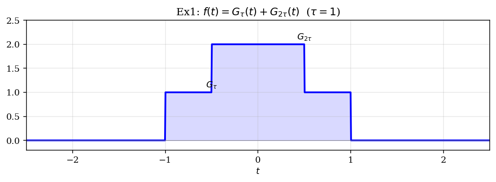

**解**：

$f(t)$ 由两个门函数叠加而成：

- $f_1(t) = u(t + \frac{\tau}{2}) - u(t - \frac{\tau}{2})$ —— 宽 $\tau$ 的门函数
- $f_2(t) = u(t + \tau) - u(t - \tau)$ —— 宽 $2\tau$ 的门函数

由 FT 表第 13 对：门函数 $G_\tau(t) \leftrightarrow \tau\,\mathrm{Sa}(\omega\tau/2)$，利用**线性特性**：

$$
\begin{aligned}
F(\omega) &= \mathcal{F}\{f_1(t)\} + \mathcal{F}\{f_2(t)\} \\
          &= \tau\,\mathrm{Sa}\!\left(\frac{\omega\tau}{2}\right) + 2\tau\,\mathrm{Sa}\!\left(\frac{\omega \cdot 2\tau}{2}\right) \\
          &= \tau\,\mathrm{Sa}\!\left(\frac{\omega\tau}{2}\right) + 2\tau\,\mathrm{Sa}(\omega\tau)
\end{aligned}
$$

即：

$$
\boxed{F(\omega) = \tau\left[\mathrm{Sa}\!\left(\frac{\omega\tau}{2}\right) + 2\,\mathrm{Sa}(\omega\tau)\right]}
$$

---

### 例2：利用延时特性求三脉冲频谱

**题目**：已知门函数 $f_0(t) = G_\tau(t)$ 的频谱 $F_0(\omega) = E\tau\,\mathrm{Sa}(\frac{\omega\tau}{2})$，求三脉冲信号 $f(t) = f_0(t) + f_0(t+T) + f_0(t-T)$ 的频谱。

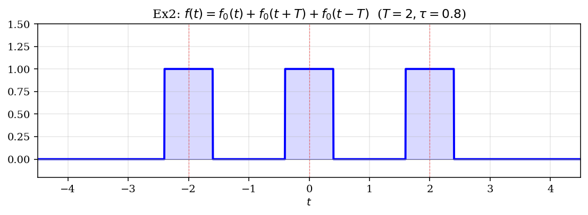

**解**：

由**延时特性** $f(t \pm T) \leftrightarrow F(\omega)e^{\pm j\omega T}$，和**线性特性**：

$$
\begin{aligned}
F(\omega) &= F_0(\omega) + F_0(\omega)e^{j\omega T} + F_0(\omega)e^{-j\omega T} \\
          &= F_0(\omega)\left[1 + e^{j\omega T} + e^{-j\omega T}\right] \\
          &= F_0(\omega)(1 + 2\cos\omega T) \\[6pt]
          &= \boxed{E\tau\,\mathrm{Sa}\!\left(\frac{\omega\tau}{2}\right)(1 + 2\cos\omega T)}
\end{aligned}
$$

> 三脉冲的频谱 = 单个门函数频谱 × 梳状因子 $(1+2\cos\omega T)$，体现了时域重复 ↔ 频域采样的对偶关系。

---

### 例3：利用尺度变换求反褶信号的 FT

**题目**：已知 $f_1(t) \leftrightarrow F_1(\omega)$，求 $f_1(t)$ 以 $\frac{t_0}{2}$ 为轴反褶后得到的 $f_2(t)$ 的傅里叶变换。

**解**：

以 $\frac{t_0}{2}$ 为轴反褶，等价于以下三步变换的复合：

1. **右移 $t_0$**： $f_1(t - t_0) \leftrightarrow F_1(\omega)e^{-j\omega t_0}$（延时特性）
2. **反褶**： $f_1(-t) \leftrightarrow F_1(-\omega)$（尺度 $a=-1$）
3. **合成**： $f_2(t) = f_1[-(t - t_0)]$

由延时 + 反褶两步合成：

$$
\boxed{f_1[-(t - t_0)] \leftrightarrow F_1(-\omega)\,e^{-j\omega t_0}}
$$

> 先移位再反褶：频谱先乘相移因子 $e^{-j\omega t_0}$，再把 $\omega$ 换成 $-\omega$。

---

### 例4：利用对称性求 $\frac{\sin t}{t}$ 的 FT

**题目**：求 $\frac{\sin t}{t}$ 的傅里叶变换。

**解**：

**第 1 步**：回顾门函数的 FT 对（表 13）：

$$
G_\tau(t) = u(t + \frac{\tau}{2}) - u(t - \frac{\tau}{2}) \quad \leftrightarrow \quad \tau\,\frac{\sin(\omega\tau/2)}{\omega\tau/2}
$$

**第 2 步**：取 $\tau = 2$，$E = 1$（令门函数高度为 $E$），令 $E = \frac{1}{2}$，则门函数频谱为：

$$
f(t) = \frac{1}{2}G_2(t) \quad \leftrightarrow \quad \frac{\sin\omega}{\omega}
$$

**第 3 步**：由**对称特性** $F(jt) \leftrightarrow 2\pi f(-\omega)$：

$$
\frac{\sin t}{t} \quad \leftrightarrow \quad 2\pi \cdot \frac{1}{2}G_2(-\omega) = \pi \cdot G_2(\omega)
$$

**第 4 步**：$G_2(\omega)$ 是宽为 2 的门函数（在 $[-1, 1]$ 内为 1），故：

$$
\boxed{\frac{\sin t}{t} \leftrightarrow \begin{cases} \pi, & |\omega| < 1 \\ 0, & |\omega| > 1 \end{cases}}
$$

> 对偶之美：门函数 ↔ $\mathrm{Sa}$ 函数，$\mathrm{Sa}$ 函数 ↔ 门函数。

---

### 例5：利用积分特性求 FT

**题目**：求 $f(t) = -u(-t) + u(t-1)$ 的傅里叶变换。

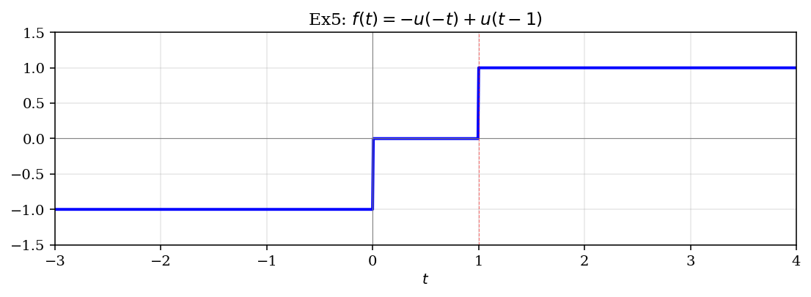

**解**：

**第 1 步**：先求导，去掉阶跃：

$$
f'(t) = \frac{d}{dt}[-u(-t) + u(t-1)] = \delta(t) + \delta(t-1)
$$

其中 $-u(-t)$ 求导得 $\delta(t)$（$\because u'(-t) \cdot (-1) = -\delta(-t)\cdot(-1) = \delta(t)$）。

**第 2 步**：对 $f'(t)$ 做 FT（线性 + 延时）：

$$
\mathcal{F}\{f'(t)\} = 1 + e^{-j\omega}
$$

**第 3 步**：由**时域积分特性** $\int_{-\infty}^{t} f'(\tau)d\tau \leftrightarrow \frac{1+e^{-j\omega}}{j\omega} + \pi F'(0)\delta(\omega)$：

由于 $f(-\infty) = -1$，$f(\infty) = 1$（两端不为零），积分公式中需加冲激修正项。但注意到：

$$
f(t)\delta(t) = f(0)\delta(t) = (-1)\delta(t) = -\delta(t)
$$

通过另一种方式验证（直接用 $u(t) \leftrightarrow \pi\delta(\omega) + \frac{1}{j\omega}$ 公式叠加），最终结果：

$$
\boxed{f(t) \leftrightarrow \frac{1 + e^{-j\omega}}{j\omega}}
$$

> 技巧：遇到含阶跃的信号，先求导消去阶跃 → 对导函数做 FT → 除以 $j\omega$（积分特性）还原。

---

### 例6：单个余弦脉冲的傅里叶变换

**题目**：求单个余弦脉冲 $f(t) = \cos\omega_0 t \cdot G_\tau(t)$ 的 FT，其中 $G_\tau(t) = u(t+\tau/2) - u(t-\tau/2)$。

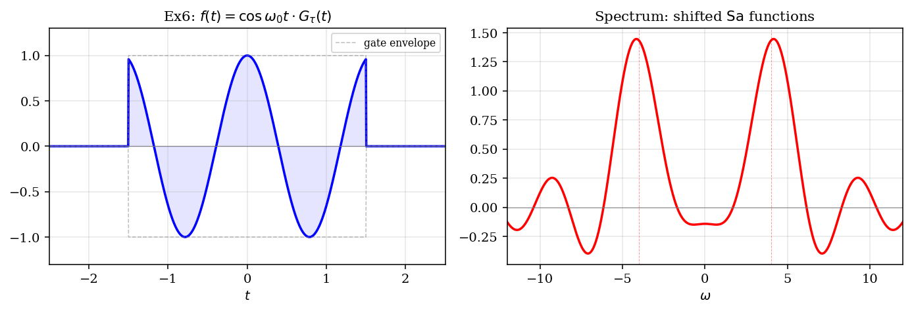

**解**：

**第 1 步**：将余弦写成复指数形式：

$$
\cos\omega_0 t = \frac{1}{2}\left(e^{j\omega_0 t} + e^{-j\omega_0 t}\right)
$$

**第 2 步**：利用**移频特性** $f(t)e^{j\omega_0 t} \leftrightarrow F(\omega - \omega_0)$：

已知门函数 $G_\tau(t) \leftrightarrow \tau\,\mathrm{Sa}(\omega\tau/2)$，则：

$$
\begin{aligned}
G_\tau(t)\,e^{j\omega_0 t} &\leftrightarrow \tau\,\mathrm{Sa}\!\left(\frac{(\omega - \omega_0)\tau}{2}\right) \\[6pt]
G_\tau(t)\,e^{-j\omega_0 t} &\leftrightarrow \tau\,\mathrm{Sa}\!\left(\frac{(\omega + \omega_0)\tau}{2}\right)
\end{aligned}
$$

**第 3 步**：由线性特性合成：

$$
\boxed{F(\omega) = \frac{\tau}{2}\left[ \mathrm{Sa}\!\left(\frac{(\omega - \omega_0)\tau}{2}\right) + \mathrm{Sa}\!\left(\frac{(\omega + \omega_0)\tau}{2}\right) \right]}
$$

> 物理意义：余弦脉冲的频谱 = 门函数 $\mathrm{Sa}$ 频谱向左右各搬移 $\omega_0$（调制）。

---

### 例7：三角脉冲的傅里叶变换

**题目**：求三角脉冲 $f(t) = \begin{cases} 1 - \frac{|t|}{\tau}, & |t| < \tau \\ 0, & |t| > \tau \end{cases}$ 的 FT。

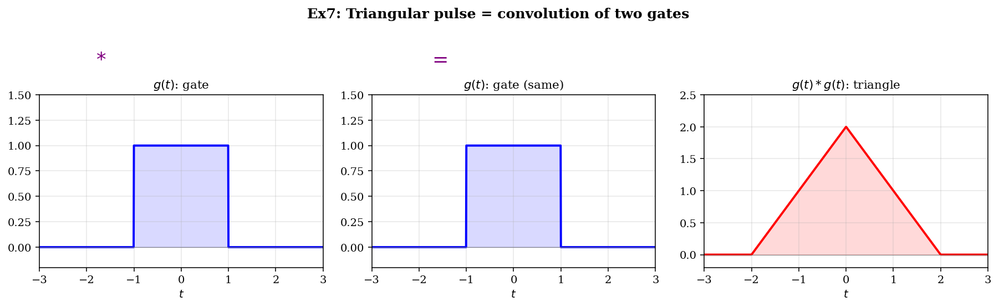

**解**：

**第 1 步**：观察到三角脉冲可以由**两个相同矩形脉冲的卷积**得到。

令 $g(t) = \begin{cases} 1, & |t| < \tau/2 \\ 0, & \text{其他} \end{cases}$（宽 $\tau$、高 1 的门函数），则：

$$
f(t) = \frac{1}{\tau}\,g(t) * g(t)
$$

> 几何直观：两矩形卷积 = 梯形；两相同矩形卷积 = 三角。

**第 2 步**：利用**时域卷积定理**：

$$
\mathcal{F}\{f(t)\} = \mathcal{F}\left\{\frac{1}{\tau}\,g(t) * g(t)\right\} = \frac{1}{\tau}\,[\mathcal{F}\{g(t)\}]^2
$$

**第 3 步**：门函数 $g(t)$ 宽为 $\tau$，其 FT 为 $\tau\,\mathrm{Sa}(\omega\tau/2)$。代入：

$$
F(\omega) = \frac{1}{\tau}\left[\tau\,\mathrm{Sa}\!\left(\frac{\omega\tau}{2}\right)\right]^2 = \boxed{\tau\left[\mathrm{Sa}\!\left(\frac{\omega\tau}{2}\right)\right]^2}
$$

> 这正是表 3-1 第 17 对。卷积定理在此处的妙用：避免了直接积分三角脉冲的麻烦。

---

### 例8：三角调幅波的频谱

**题目**：求三角调幅波 $f(t) = f_0(t) \cdot \cos\omega_0 t$ 的 FT，其中 $f_0(t)$ 为三角脉冲（同例7，取 $E=1$）。

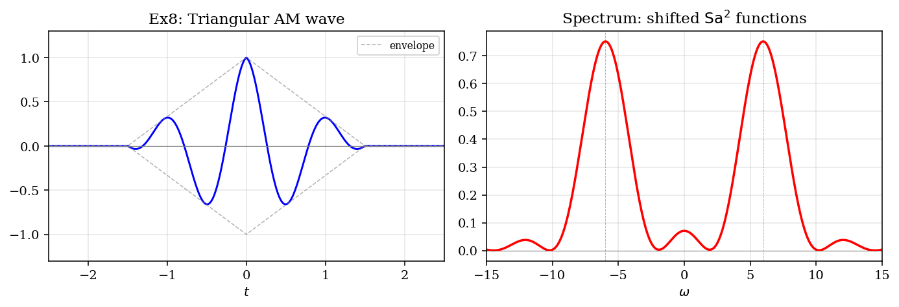

**解**：

**第 1 步**：写出三角脉冲（底宽 $\tau$）及其 FT：

$$
f_0(t) = 1 - \frac{2|t|}{\tau}\ (|t|<\tau/2),\qquad F_0(\omega) = \frac{\tau}{2}\,\mathrm{Sa}^2\!\left(\frac{\omega\tau}{4}\right)
$$

**第 2 步**：利用 $\cos\omega_0 t = \frac{1}{2}(e^{j\omega_0 t} + e^{-j\omega_0 t})$ 和**移频特性**：

$$
\begin{aligned}
F(\omega) &= \mathcal{F}\left\{f_0(t) \cdot \frac{1}{2}(e^{j\omega_0 t} + e^{-j\omega_0 t})\right\} \\[6pt]
          &= \frac{1}{2}\left[ F_0(\omega - \omega_0) + F_0(\omega + \omega_0) \right]
\end{aligned}
$$

**第 3 步**：代入 $F_0(\omega)$：

$$
\boxed{F(\omega) = \frac{\tau}{4}\left[ \mathrm{Sa}^2\!\left(\frac{(\omega - \omega_0)\tau}{4}\right) + \mathrm{Sa}^2\!\left(\frac{(\omega + \omega_0)\tau}{4}\right) \right]}
$$

> 三角调幅波的频谱 = 三角脉冲 $\mathrm{Sa}^2$ 频谱向 $\pm\omega_0$ 各搬移一份，幅度减半。这就是通信中调幅（AM）的频谱搬移原理。

---

### 本章小结

| 知识板块 | 核心要点 |
| :--- | :--- |
| **正交分解** | 正交函数集 → 最小均方误差准则 → 完备性 |
| **傅里叶级数** | 三角形式（正弦-余弦 / 振幅-相位）+ 复指数形式，三者等价 |
| **周期信号频谱** | 离散性、谐波性、收敛性；对称性 → 系数简化 |
| **傅里叶变换** | 周期 $T \to \infty$ 的极限推导；频谱密度概念；常见信号 FT 对 |
| **FT 性质** | 线性 / 延时 / 移频 / 尺度 / 微分积分 / 卷积定理 / Parseval |
| **Gibbs 现象** | 间断点处 ~9% 过冲，不随 $N$ 增大而消失 |


# 第四章 连续时间系统的频域分析

## 4.1 频域分析的基本思想

### 4.1.1 为什么用频域？

在时域中，LTI 系统的零状态响应由卷积给出：$r_{zs}(t) = e(t) * h(t)$。频域分析法通过傅里叶变换，将这一关系大幅简化：

| 角度 | 时域 | 频域 |
| :--- | :--- | :--- |
| **系统方程** | 微分方程 | 代数方程（利用 FT 微分特性 $d/dt \leftrightarrow j\omega$） |
| **零状态响应** | 卷积积分 $e(t) * h(t)$ | 乘法 $E(j\omega) \cdot H(j\omega)$（卷积定理） |
| **物理意义** | 抽象 | 频谱可测量、可直观理解 |

> **核心公式**： $\boxed{R(j\omega) = E(j\omega) \cdot H(j\omega)}$

---

### 4.1.2 频域分析的优缺点

**优点**：
- 将微分方程变换为代数方程，求解简化
- 卷积变为乘法，运算量大幅降低
- 频域具有明确的物理意义，可进行实测（频谱仪），适合黑箱系统分析

**缺点**：
- 需要正、逆两次傅里叶变换的计算代价
- 并非所有信号都有傅里叶变换（需满足绝对可积条件）
- → 因此常采用频域分析的推广——**拉普拉斯变换**（复频域分析）

---

### 4.1.3 系统函数（频率响应函数）

**定义**：系统函数 $H(j\omega)$ 是系统冲激响应 $h(t)$ 的傅里叶变换：

$$
\boxed{H(j\omega) = \frac{R(j\omega)}{E(j\omega)} = |H(j\omega)| \, e^{j\varphi(\omega)}}
$$

- $|H(j\omega)|$ —— **幅频特性**（系统对各频率分量的增益）
- $\varphi(\omega)$ —— **相频特性**（系统对各频率分量的相移）

> 系统函数又称为**频率响应函数**，简称"频响"。

三种求 $H(j\omega)$ 的途径：
1. 从**微分方程**求：将 $d/dt \to j\omega$ 代入算子方程
2. 从**冲激响应**求：$H(j\omega) = \mathcal{F}\{h(t)\}$
3. 从**实测**的幅频/相频曲线得到

---

### 4.1.4 频域分析法的步骤

| 步骤 | 内容 |
| :--- | :--- |
| **①** | 求激励信号的傅里叶变换 $E(j\omega)$ |
| **②** | 确定系统的频率响应函数 $H(j\omega)$ |
| **③** | 求响应的频谱： $R(j\omega) = E(j\omega) H(j\omega)$ |
| **④** | 对 $R(j\omega)$ 求傅里叶反变换，得到时域响应 $r(t)$ |

---

### 4.1.5 如何求冲激响应与阶跃响应

从核心公式 $R = E \cdot H$ 可直接导出两个重要结论：

#### 冲激响应 $h(t)$

输入 $\delta(t)$ 时，$E(j\omega) = \mathcal{F}\{\delta(t)\} = 1$，故：

$$
R(j\omega) = 1 \cdot H(j\omega) = H(j\omega) \quad \Longrightarrow \quad \boxed{h(t) = \mathcal{F}^{-1}\{H(j\omega)\}}
$$

> $h(t)$ 就是系统函数 $H(j\omega)$ 的傅里叶反变换。这也是 $H(j\omega)$ 又被称为"冲激响应的频谱"的原因。

#### 阶跃响应 $r_u(t)$

输入 $u(t)$ 时，由 $\mathcal{F}\{u(t)\} = \pi\delta(\omega) + \frac{1}{j\omega}$，经系统后取反变换。更简单的方法是利用 LTI 系统的积分性质（$u(t) = \int_{-\infty}^t \delta(\tau)d\tau$）：

$$
\boxed{r_u(t) = \int_{-\infty}^{t} h(\tau) d\tau}
$$

> 阶跃响应 = 冲激响应的积分，无需另行求频谱。

---

## 4.2 系统函数与频域求解

### 4.2.1 系统函数的物理意义

系统函数 $H(j\omega)$ 完整描述了 LTI 系统对任意频率正弦输入的响应特性：

- 对正弦输入 $\cos(\omega t)$，稳态输出为 $|H(j\omega)| \cos(\omega t + \varphi(\omega))$
- 幅频 $|H|$：系统对不同频率的**放大/衰减**
- 相频 $\varphi$：系统对不同频率的**延时**

---

### 4.2.2 典型例题（P.160 例4-1）

**题目**：一线性系统的频响曲线如右图所示（三角形状幅度谱 + 线性相位）。设激励信号为：

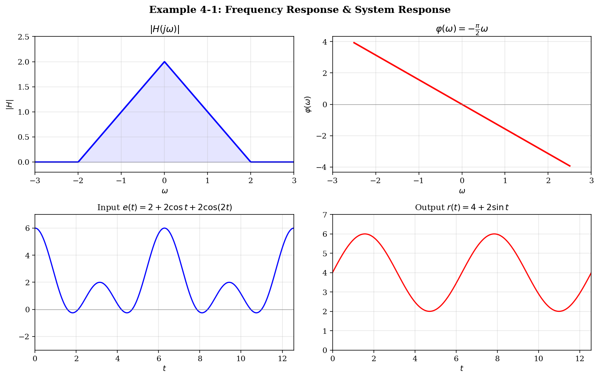

$$
e(t) = 2 + 2\cos t + 2\cos(2t)
$$

求零状态响应 $r(t)$。

**第 1 步**：求输入信号的频谱。

$$
e(t) = 2 + 2\cos t + 2\cos(2t)
$$

$$
E(j\omega) = 4\pi\delta(\omega) + 2\pi[\delta(\omega + 1) + \delta(\omega - 1)] + 2\pi[\delta(\omega + 2) + \delta(\omega - 2)]
$$

**第 2 步**：由频响曲线写出 $H(j\omega)$。

$$
|H(j\omega)| = (2 - |\omega|)[u(\omega + 2) - u(\omega - 2)]
$$

$$
\varphi(\omega) = -\frac{\pi}{2}\omega
$$

$$
H(j\omega) = |H(j\omega)| e^{j\varphi(\omega)} = \begin{cases}
(2 - |\omega|) e^{-j\frac{\pi}{2}\omega}, & |\omega| < 2 \\
0, & |\omega| \geq 2
\end{cases}
$$

**第 3 步**：求响应的频谱。

由于 $\delta$ 函数的抽样性，只需计算各频率处的 $H$ 值：

- $\omega = 0$：$H(0) = 2 e^{0} = 2$ → $R(0) = E(0) \cdot H(0) = 4\pi\delta(\omega) \cdot 2 = 8\pi\delta(\omega)$
- $\omega = \pm 1$：$H(\pm 1) = 1 \cdot e^{\mp j\pi/2} = e^{\mp j\pi/2}$ → $R(\pm 1) = 2\pi e^{\pm j\pi/2}\delta(\omega \mp 1)$
- $\omega = \pm 2$：$H(\pm 2) = 0$ → 频率 $\pm 2$ 分量被滤除

$$
R(j\omega) = 8\pi\delta(\omega) + 2\pi e^{j\pi/2}\delta(\omega + 1) + 2\pi e^{-j\pi/2}\delta(\omega - 1)
$$

**第 4 步**：求时域响应（傅里叶反变换）。

$$
\begin{aligned}
r(t) &= 4 + e^{j\pi/2}e^{-jt} + e^{-j\pi/2}e^{jt} \\
     &= 4 + e^{-j(t - \pi/2)} + e^{j(t - \pi/2)} \\
     &= 4 + 2\cos(t - \frac{\pi}{2}) = \boxed{4 + 2\sin t}
\end{aligned}
$$

**结果分析**：

| 输入分量 | 输出分量 | 变化 |
| :--- | :--- | :--- |
| 直流 $2$ | 直流 $4$ | 放大 2 倍 |
| $\cos t$（基波） | $2\sin t = 2\cos(t - \pi/2)$ | 幅度不变，相移 $-\pi/2$ |
| $\cos(2t)$（二次谐波） | — | **被滤除**（$\omega=2$ 在截止频率处） |

> 此系统是一个**低通滤波器**，截止频率 $\omega_c = 2$，相位线性下降。

---

**法二：查表直读法**

输入 $e(t) = 2 + 2\cos t + 2\cos(2t)$ 仅含三个频率分量。由频响曲线直接读出各频率处的 $|H|$ 和 $\varphi$：


| $\omega$ | 输入分量 | $\vert H\vert$ | $\varphi$ | 输出 |
| :---: | :--- | :---: | :---: | :--- |
| $0$ | $2$（直流） | $2$ | $0$ | $2 \times 2 = 4$ |
| $1$ | $2\cos t$（基波） | $1$ | $-\pi/2$ | $2\cos(t - \pi/2) = 2\sin t$ |
| $2$ | $2\cos 2t$（二次谐波） | $0$ | $-\pi$ | $0$（滤除） |


叠加即得 $r(t) = 4 + 2\sin t$。此法绕过了傅里叶正反变换，直接利用正弦稳态响应原理：**频率 $\omega$ 的正弦波通过 LTI 系统后，幅度乘以 $|H(j\omega)|$，相位加上 $\varphi(\omega)$**。

---

## 4.3 理想低通滤波器

### 4.3.1 滤波器的基本概念

滤波器是一种**选频装置**，使信号中特定频率成分通过，而衰减其他频率成分。

- **理想滤波器**：通带内幅值和相位都不失真（常数增益 + 线性相位），阻带内完全衰减为零
- **实际滤波器**：通带和阻带间存在**过渡带**，不存在理想跳变

---

### 4.3.2 理想低通滤波器的频响特性

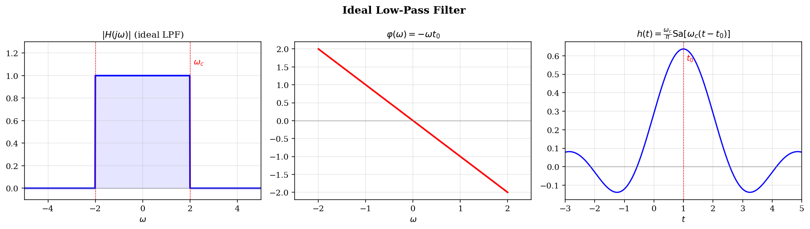

$$
\boxed{H(j\omega) = e^{-j\omega t_0} [u(\omega + \omega_c) - u(\omega - \omega_c)]}
$$

或写成：

$$
H(j\omega) = \begin{cases}
K e^{-j\omega t_0}, & |\omega| < \omega_c \quad (\omega_c\text{：截止频率})\\
0, & |\omega| > \omega_c
\end{cases}
$$

**关键特征**：
- 通带内幅度 $|H| = K$（常数），相位 $\varphi(\omega) = -\omega t_0$（线性）
- 低于 $\omega_c$ 的频率分量**一致均匀通过**，时间延迟均为 $t_0$
- 高于 $\omega_c$ 的频率分量**完全不能通过**

> 思考：请类比写出理想高通、理想带通、理想全通滤波器的频响表达式。

---

### 4.3.3 理想低通滤波器的冲激响应

对 $H(j\omega)$ 求傅里叶反变换：

$$
\begin{aligned}
h(t) &= \frac{1}{2\pi} \int_{-\infty}^{\infty} H(j\omega) e^{j\omega t} d\omega
     = \frac{1}{2\pi} \int_{-\omega_c}^{\omega_c} e^{-j\omega t_0} e^{j\omega t} d\omega \\[6pt]
     &= \boxed{\frac{\omega_c}{\pi} \, \mathrm{Sa}[\omega_c(t - t_0)]}
\end{aligned}
$$

---

### 4.3.4 冲激响应的分析

| 观察 | 结论 |
| :--- | :--- |
| 主峰发生在 $t = t_0$ 处 | 群延迟为 $t_0$ |
| $t < 0$ 时 $h(t) \neq 0$ | **非因果系统**，物理上无法实现 |
| $\omega_c \to \infty$ 时 $h(t) \to \delta(t - t_0)$ | 无限带宽 → 无失真传输 |

---

### 4.3.5 理想低通滤波器的阶跃响应

$$
r_u(t) = \int_{-\infty}^{t} h(\tau) d\tau = \int_{-\infty}^{t} \frac{\sin \omega_c(\tau - t_0)}{\pi(\tau - t_0)} d\tau
$$

令 $x = \omega_c(\tau - t_0)$，引入**正弦积分函数**：

$$
\mathrm{Si}(y) = \int_{0}^{y} \frac{\sin x}{x} dx = \int_{0}^{y} \mathrm{Sa}(x) dx
$$

得到阶跃响应的解析表达式：

$$
\boxed{r_u(t) = \frac{1}{2} + \frac{1}{\pi} \mathrm{Si}[\omega_c(t - t_0)]}
$$

**Si(y) 的性质**：

| 性质 | 说明 |
| :--- | :--- |
| $\mathrm{Si}(y)$ 为奇函数 | $\mathrm{Si}(-y) = -\mathrm{Si}(y)$ |
| $\mathrm{Si}(0) = 0$ | |
| $\mathrm{Si}(\infty) = \frac{\pi}{2}$ | |
| $\mathrm{Si}(-\infty) = -\frac{\pi}{2}$ | |
| 在 $y=0$ 处近似线性 | $\mathrm{Si}(y) \approx y$ |

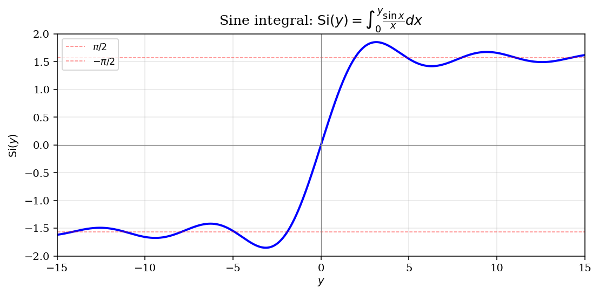

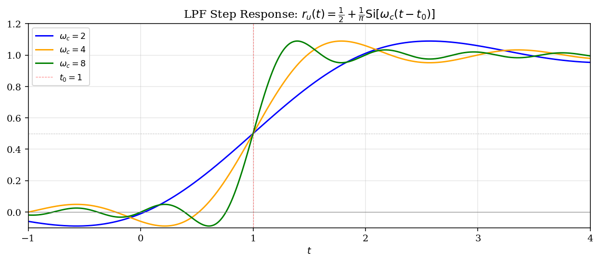

**阶跃响应分析**：

- 响应出现时间比激励**滞后 $t_0$**
- 输出电压前沿倾斜，建立时间与通带成反比： $t_r = \frac{2\pi}{\omega_c}$
- 波形产生了失真（Gibbs 现象）
- $\omega_c \to \infty$ 时 $r_u(t) \to u(t - t_0)$ —— 无限带宽方可无失真

---

## 4.4 无失真传输与物理可实现性

### 4.4.1 无失真传输的条件

系统**不失真传输**信号的条件：

$$
\boxed{H(j\omega) = K e^{-j\omega t_0}}
$$

| 条件 | 含义 |
| :--- | :--- |
| $\vert H(j\omega)\vert = K$（常数） | 所有频率分量幅度按相同比例缩放 |
| $\varphi(\omega) = -\omega t_0$（线性相位） | 所有频率分量延时相同 $t_0$ |

满足此条件的输出为 $r(t) = K \cdot e(t - t_0)$ —— 仅缩放 + 延时，无波形畸变。

---

### 4.4.2 物理可实现性——佩利-维纳（Paley-Wiener）准则

**时域条件**（因果性）： $h(t) = 0,\ t < 0$

**频域必要条件**（佩利-维纳准则）：

1. 能量可积： $\displaystyle \int_{-\infty}^{\infty} |H(j\omega)|^2 d\omega < \infty$
2. $\displaystyle \int_{-\infty}^{\infty} \frac{|\ln|H(j\omega)||}{1 + \omega^2} d\omega < \infty$

**推论**：
- $|H(j\omega)|$ 可在**离散频率点**为零，但**不能在有限频带内恒为零**
- 频响的衰减速率有限制，不能超过指数衰减速度

> → 理想滤波器（通带外 $|H| \equiv 0$）违背佩利-维纳准则，物理上**无法实现**。

---

### 4.4.3 实际滤波器简介

工程上用因果 LTI 系统**逼近**理想特性：

| 滤波器类型 | 特点 |
| :--- | :--- |
| **巴特沃斯（Butterworth）** | $\vert H(j\omega)\vert^2 = \frac{1}{1 + B_k\Omega^{2k}}$，通带平坦、阻带单调衰减 |
| **切比雪夫（Chebyshev）** | 通带内等波纹起伏，阻带单调衰减；同要求下阶数更低 |

$k$ 为滤波器阶数，$k$ 越大越接近理想，但元件越多、结构越复杂。

---

## 4.5 调制与解调

### 4.5.1 调制的目的与分类

**为什么要调制？**
- 将低频信号辐射到空间（天线效率要求信号波长与天线尺寸匹配）
- 实现信道复用（同一信道传输多路信号）
- 提高系统抗干扰性

**调制的分类**：

| 类型 | 控制参数 |
| :--- | :--- |
| **调幅（AM）** | 高频载波的**幅度** |
| **调频（FM）** | 高频载波的**频率** |
| **调相（PM）** | 高频载波的**相位** |
| 调频 + 调相 | 统称**调角** |

---

### 4.5.2 抑制载波调幅（AM-SC）

用待传输信号 $g(t)$ 控制载波 $\cos\omega_0 t$ 的幅度（抑制载波分量）：

$$
\boxed{f(t) = g(t) \cos\omega_0 t}
$$

**频域分析**：

将余弦写成复指数： $\cos\omega_0 t = \frac{1}{2}(e^{j\omega_0 t} + e^{-j\omega_0 t})$，由**移频特性** $g(t)e^{j\omega_0 t} \leftrightarrow G(\omega - \omega_0)$：

$$
\begin{aligned}
F(\omega) &= \mathcal{F}\!\left\{g(t) \cdot \frac{1}{2}(e^{j\omega_0 t} + e^{-j\omega_0 t})\right\} \\[6pt]
          &= \frac{1}{2}\Big[\mathcal{F}\{g(t)e^{j\omega_0 t}\} + \mathcal{F}\{g(t)e^{-j\omega_0 t}\}\Big] \\[6pt]
          &= \boxed{\frac{1}{2}\big[G(\omega - \omega_0) + G(\omega + \omega_0)\big]}
\end{aligned}
$$

> 移频特性直读：$g(t)$ 乘 $e^{j\omega_0 t}$ → 频谱右移 $\omega_0$，乘 $e^{-j\omega_0 t}$ → 频谱左移 $\omega_0$。乘 $\cos\omega_0 t$ = 两路各半叠加，即频谱向 $\pm\omega_0$ 各搬移一份、幅度减半。

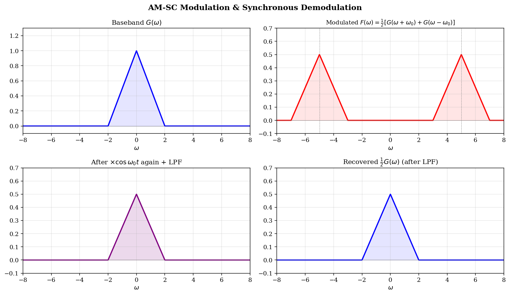

---

### 4.5.3 同步解调

在接收端，将已调信号再乘以同频同相的载波：

$$
\begin{aligned}
g_0(t) &= [g(t) \cos\omega_0 t] \cos\omega_0 t \\
       &= \frac{1}{2} g(t)(1 + \cos 2\omega_0 t) \\
       &= \frac{1}{2} g(t) + \frac{1}{2} g(t) \cos 2\omega_0 t
\end{aligned}
$$

频域：

$$
G_0(\omega) = \frac{1}{2} G(\omega) + \frac{1}{4}[G(\omega + 2\omega_0) + G(\omega - 2\omega_0)]
$$

用低通滤波器滤除 $2\omega_0$ 附近的高频分量，即可恢复 $g(t)$。

> **关键要求**：接收端本地载波必须与发送端**严格同频同相**（需要锁相环 PLL），否则产生 $\cos\theta$ 衰减项。

---

### 4.5.4 发送载波调幅（AM）

在发射信号中直接加入一定强度的载波 $A\cos\omega_0 t$：

$$
f(t) = [A + g(t)] \cos\omega_0 t
$$

- 若 $A$ 足够大使 $A + g(t) > 0$ 恒成立，则包络就是 $A + g(t)$
- 接收端只需**包络检波**（二极管 + 电阻 + 电容），结构简单
- 代价：发射功率中有相当部分被载波消耗（牺牲效率换取接收机简化）

---

### 4.5.5 频分复用（FDM）

将多路信号分别调制到不同的载波频率上，使各路频谱在频域中**互不重叠**，共享同一信道传输。

| 复用方式 | 原理 |
| :--- | :--- |
| **频分复用（FDM）** | 各路信号占据不同的频段 |
| **时分复用（TDM）** | 各路信号占据不同的时隙 |
| **码分复用（CDM）** | 各路信号使用不同的编码 |
| **波分复用（WDM）** | 光纤中不同波长（光频）并行传输 |

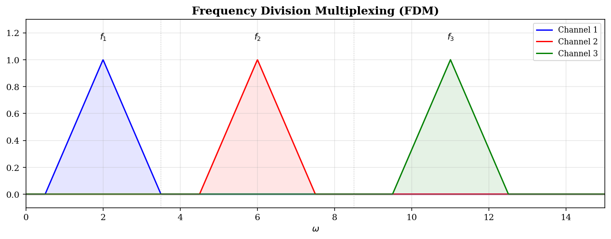

---

### 本章小结

| 知识板块 | 核心要点 |
| :--- | :--- |
| **频域分析思想** | 微分方程 → 代数方程，卷积 → 乘法；$R(j\omega)=E(j\omega)H(j\omega)$ |
| **系统函数 $H(j\omega)$** | $=\mathcal{F}\{h(t)\}$，由幅频 $\vert H\vert$ + 相频 $\varphi$ 组成；三种求法 |
| **频域求解步骤** | $e(t) \to E(j\omega) \to R=E \cdot H \to r(t)$（正反两次 FT） |
| **理想低通滤波器** | $H=e^{-j\omega t_0} \cdot \text{rect}$；$h(t)=\frac{\omega_c}{\pi}\mathrm{Sa}[\omega_c(t-t_0)]$；阶跃响应含 $\mathrm{Si}(y)$ |
| **无失真传输** | $H(j\omega)=K e^{-j\omega t_0}$（常数幅度 + 线性相位） |
| **佩利-维纳准则** | $\|H\|\not\equiv 0$ 在连续频带内；理想滤波器物理不可实现 |
| **调制解调** | AM-SC：频谱搬移；同步解调：再次搬移 + 低通；AM：包络检波 |
| **复用** | FDM（频分）/ TDM（时分）/ CDM（码分）/ WDM（波分） |

---

# 第五章 连续时间系统的复频域分析

## 5.1 从傅里叶变换到拉普拉斯变换

### 5.1.1 傅里叶变换的局限性

傅里叶变换要求信号满足**绝对可积**条件（狄利克雷条件），以下常见信号不满足：

| 信号 | 问题 |
| :--- | :--- |
| $u(t)$ | $\int_0^\infty 1 \cdot dt \to \infty$，不绝对可积 |
| 增长信号 $e^{\alpha t}\ (\alpha > 0)$ | 指数发散，积分不存在 |
| $\cos\omega_1 t$ 等周期信号 | 无限能量 |

### 5.1.2 核心思路：乘衰减因子

给 $f(t)$ 乘上 $e^{-\sigma t}$（$\sigma$ 为实数），使信号**收敛**：

| 原信号 | 乘 $e^{-\sigma t}$ 后 |
| :--- | :--- |
| $u(t)$ → | $u(t)e^{-\sigma t}$，$\sigma>0$ 时收敛 |
| $e^{\alpha t}$ → | $e^{\alpha t} \cdot e^{-\sigma t}$，$\sigma>\alpha$ 时收敛 |
| $\cos\omega_1 t$ → | $e^{-\sigma t}\cos\omega_1 t$，$\sigma>0$ 时收敛 |

对收敛后的 $f(t)e^{-\sigma t}$ 做傅里叶变换：

$$
\mathcal{F}\{f(t)e^{-\sigma t}\} = \int_{-\infty}^{\infty} f(t) e^{-\sigma t} e^{-j\omega t} dt = \int_{-\infty}^{\infty} f(t) e^{-(\sigma + j\omega)t} dt
$$

### 5.1.3 从 FT 到双边 LT

令复频率 $s = \sigma + j\omega$，则 $ds = j\,d\omega$：

**正变换**（双边）：

$$
\boxed{F(s) = \int_{-\infty}^{\infty} f(t) e^{-st} dt}
$$

**逆变换**：

$$
\boxed{f(t) = \frac{1}{2\pi j} \int_{\sigma - j\infty}^{\sigma + j\infty} F(s) e^{st} ds}
$$

简记为 $f(t) \leftrightarrow F(s)$。

### 5.1.4 收敛域（ROC）的概念

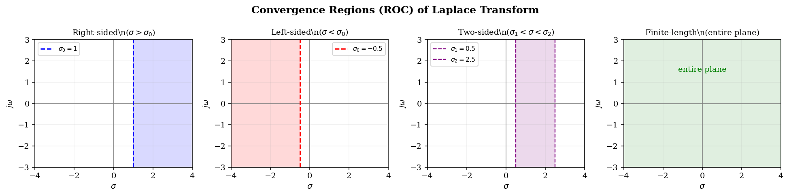

能使 $F(s)$ 存在的 $\sigma$ 的取值范围，称为**收敛域**（Region of Convergence）。

**四种典型情况**：

| 信号类型 | 收敛域 | 示例 |
| :--- | :--- | :--- |
| **右边信号**（$t<0$ 为零） | $\sigma > \sigma_0$（收敛轴右侧） | $u(t) \leftrightarrow 1/s$，ROC: $\sigma>0$ |
| **左边信号**（$t>0$ 为零） | $\sigma < \sigma_0$（收敛轴左侧） | $e^{bt}u(-t)$，ROC: $\sigma < b$ |
| **双边信号** | $\sigma_1 < \sigma < \sigma_2$（带状） | $e^{at}u(t)+e^{bt}u(-t)$，ROC: $a<\sigma<b$（$b>a$） |
| **有限长信号**（有始有终） | 整个 $s$ 平面均收敛 | 单个矩形脉冲 |

> 不同原函数，收敛域不同，可得**完全相同**的象函数 → 拉氏变换必须标明收敛域才是一一对应的。

**例1**：求 $f(t) = u(t) + e^t u(-t)$ 的双边 LT 及 ROC。

- $u(t)$（右边信号）：$\int_0^\infty e^{-\sigma t}dt$ 收敛 → $\sigma > 0$，$F_1(s)=\frac{1}{s}$
- $e^t u(-t)$（左边信号）：$\int_{-\infty}^0 e^{(1-\sigma)t}dt$ 收敛 → $\sigma < 1$，$F_2(s)=-\frac{1}{s-1}$

交集 $0 < \sigma < 1$ 非空 → **存在双边拉氏变换**：

$$
F(s) = \frac{1}{s} - \frac{1}{s-1}, \qquad \text{ROC: } 0 < \sigma < 1
$$

---

**例2**：求 $f(t) = e^{at} u(t) + e^{bt} u(-t)$ 的双边 LT 及 ROC。

检查绝对可积条件：

$$
\int_{-\infty}^{\infty} |f(t)e^{-\sigma t}| dt = \int_{-\infty}^{0} e^{(b-\sigma)t} dt + \int_{0}^{\infty} e^{(a-\sigma)t} dt
$$

- 第一个积分收敛要求 $\sigma < b$（指数在 $t \to -\infty$ 时衰减）
- 第二个积分收敛要求 $\sigma > a$（指数在 $t \to \infty$ 时衰减）

| 条件 | 结论 |
| :--- | :--- |
| $b > a$ | $a < \sigma < b$（带状 ROC），存在双边 LT |
| $b \leq a$ | ROC 为空，**不存在**双边 LT |

> 带状 ROC 存在的关键是 $b > a$，即左边信号的衰减速率必须"快过"右边信号。

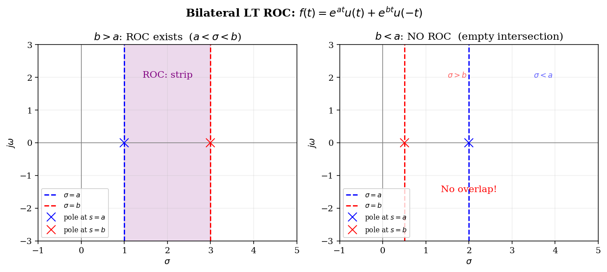

---

## 5.2 单边拉普拉斯变换

### 5.2.1 单边 LT 的定义

工程中信号多为因果信号（$t<0$ 时 $f(t)=0$），积分下限取 $0^-$：

$$
\boxed{F(s) = \int_{0^-}^{\infty} f(t) e^{-st} dt}
$$

$$
\boxed{f(t) = \frac{1}{2\pi j} \int_{\sigma - j\infty}^{\sigma + j\infty} F(s) e^{st} ds, \quad t \geq 0}
$$

> 本课程中，"拉普拉斯变换"默认指**单边拉普拉斯变换**。

### 5.2.2 常用信号的拉普拉斯变换

| $f(t)$ | $F(s)$ | ROC |
| :--- | :--- | :--- |
| $\delta(t)$ | $1$ | 全平面 |
| $\delta(t-t_0)$ | $e^{-st_0}$ | 全平面 |
| $u(t)$ | $\dfrac{1}{s}$ | $\sigma > 0$ |
| $e^{-\alpha t}u(t)$ | $\dfrac{1}{s+\alpha}$ | $\sigma > -\alpha$ |
| $\dfrac{t^{\,n-1}}{(n-1)!} e^{-\alpha t}u(t)$ | $\dfrac{1}{(s+\alpha)^n}$ | $\sigma > -\alpha$ |
| $t^n u(t)$ | $\dfrac{n!}{s^{n+1}}$ | $\sigma > 0$ |
| $\sin\omega_0 t \, u(t)$ | $\dfrac{\omega_0}{s^2 + \omega_0^2}$ | $\sigma > 0$ |
| $\cos\omega_0 t \, u(t)$ | $\dfrac{s}{s^2 + \omega_0^2}$ | $\sigma > 0$ |
| $e^{-\alpha t}\sin\omega_0 t \, u(t)$ | $\dfrac{\omega_0}{(s+\alpha)^2 + \omega_0^2}$ | $\sigma > -\alpha$ |
| $e^{-\alpha t}\cos\omega_0 t \, u(t)$ | $\dfrac{s+\alpha}{(s+\alpha)^2 + \omega_0^2}$ | $\sigma > -\alpha$ |

### 5.2.3 单边 LT 与 FT 的关系

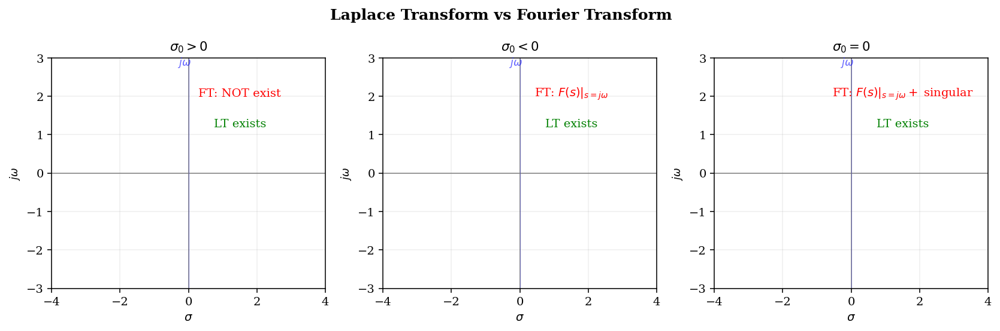

根据收敛坐标 $\sigma_0$ 的位置分三种情况：

| $\sigma_0$ | FT 是否存在 | $F(j\omega)$ 怎么求 |
| :--- | :---: | :--- |
| $\sigma_0 > 0$ | **不存在** | 拉氏变换存在，FT 不存在（如 $e^{\alpha t}u(t), \alpha>0$） |
| $\sigma_0 < 0$ | **存在** | 直接 $s = j\omega$ 代入：$F(j\omega) = F(s)\vert_{s=j\omega}$ |
| $\sigma_0 = 0$ | **存在**（边界） | 需加修正项：$F(j\omega) = F(s)\vert_{s=j\omega} + \pi K\delta(\cdots)$ |

---

## 5.3 拉普拉斯逆变换

### 5.3.1 方法概览

| 方法 | 适用场景 |
| :--- | :--- |
| **查表法** | 简单信号，直接匹配常用变换对 |
| **部分分式分解法** | $F(s)$ 为有理函数 |
| **留数法（围线积分）** | 不受有理函数限制 |
| **利用性质** | 结合时移/频移等性质间接求解 |

### 5.3.2 部分分式分解法

设 $F(s) = \frac{N(s)}{D(s)}$，当 $m \geq n$（假分式）时，先分解为多项式 + 真分式。

#### 情况一：$D(s)=0$ 无重根

$$
F(s) = \sum_{k=1}^{n} \frac{K_k}{s - s_k}, \qquad
K_k = \left[(s - s_k)\frac{N(s)}{D(s)}\right]_{s=s_k} = \frac{N(s_k)}{D'(s_k)}
$$

$$
\boxed{f(t) = \sum_{k=1}^{n} K_k e^{s_k t} u(t)}
$$

#### 情况二：$s_1$ 为 $p$ 重根

$$
K_{1k} = \frac{1}{(p-k)!} \frac{d^{p-k}}{ds^{p-k}}\left[(s-s_1)^p \frac{N(s)}{D(s)}\right]_{s=s_1}
$$

$$
f(t) = \left[ \frac{K_{1p}}{(p-1)!}t^{p-1} + \cdots + K_{11} \right] e^{s_1 t} u(t) + \sum_{q=p+1}^{n} K_q e^{s_q t} u(t)
$$

### 5.3.3 留数法（围线积分）

若 $s_k$ 为 $F(s)e^{st}$ 的一阶极点：

$$
\mathrm{Res}_k = \left[(s - s_k) F(s) e^{st}\right]_{s=s_k}
$$

若为 $p$ 阶极点：

$$
\mathrm{Res}_k = \frac{1}{(p-1)!} \left[\frac{d^{p-1}}{ds^{p-1}}(s - s_k)^p F(s) e^{st}\right]_{s=s_k}
$$

$$
f(t) = \sum \mathrm{Res}_k\, u(t)
$$

> 两种方法对比：部分分式法只能处理有理函数，但可处理 $m \geq n$ 的情况；留数法更严密但不适用于含假分式的情况。实际中二者互补使用。

---

## 5.4 拉普拉斯变换的性质

### 5.4.1 性质速查表

| 序号 | 性质 | 时域 $f(t)$ | s 域 $F(s)$ |
| :---: | :--- | :--- | :--- |
| 0 | 定义 | $f(t)$ | $\int_{0^-}^{\infty} f(t) e^{-st} dt$ |
| 1 | 线性 | $a_1 f_1 + a_2 f_2$ | $a_1 F_1 + a_2 F_2$ |
| 2 | 尺度变换 | $f(at),\ a>0$ | $\frac{1}{a}F(\frac{s}{a})$ |
| 3 | **时移** | $f(t-t_0)u(t-t_0)$ | $e^{-st_0}F(s)$ |
| 4 | 复频移 | $e^{s_a t}f(t)$ | $F(s - s_a)$ |
| 5 | 时域微分 | $f'(t)$ | $sF(s) - f(0^-)$ |
| | | $f^{(n)}(t)$ | $s^n F(s) - \sum_{m=0}^{n-1} s^{n-1-m} f^{(m)}(0^-)$ |
| 6 | 时域积分 | $\int_{0^-}^t f(\tau)d\tau$ | $\frac{1}{s}F(s)$ |
| | | $\int_{-\infty}^t f(\tau)d\tau$ | $\frac{1}{s}F(s) + \frac{1}{s}f^{(-1)}(0^-)$ |
| 7 | 时域卷积 | $f_1(t) * f_2(t)$ | $F_1(s) F_2(s)$ |
| 8 | s 域微分 | $(-t)^n f(t)$ | $F^{(n)}(s)$ |
| 9 | s 域积分 | $\frac{f(t)}{t}$ | $\int_s^\infty F(\lambda) d\lambda$ |
| 10 | **初值定理** | $f(0^+) = \lim_{s\to\infty} sF(s)$ | （$F(s)$ 须为真分式） |
| 11 | **终值定理** | $f(\infty) = \lim_{s\to 0} sF(s)$ | （$s=0$ 在收敛域内） |

### 5.4.2 时移性质的单边特殊性（高频考点）

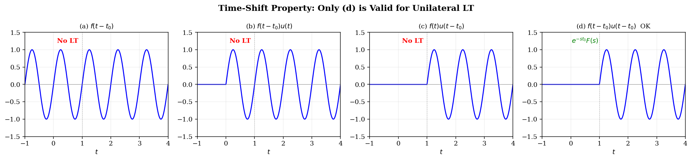

单边 LT 的时移性质要求信号为**因果信号 + 平移后仍保持因果**：

| 表达式 | 能否直接用时移？ |
| :--- | :---: |
| $f(t-t_0)$（无 $u$ 限制） | ✗ |
| $f(t-t_0)u(t)$ | ✗（$t<0$ 部分被截掉） |
| $f(t)u(t-t_0)$ | ✗（不是整体平移） |
| $f(t-t_0)u(t-t_0)$ | ✓ **正确用法** |

**例：台阶函数的 LT**

求下图台阶信号 $f(t)$ 的拉普拉斯变换：

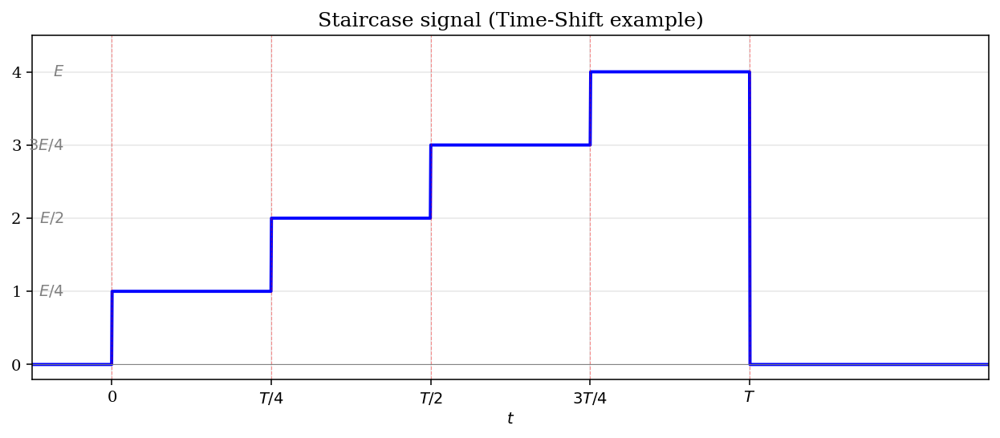

$$
f(t) = \frac{E}{4}u(t) + \frac{E}{4}u\!\left(t - \frac{T}{4}\right) + \frac{E}{4}u\!\left(t - \frac{T}{2}\right) + \frac{E}{4}u\!\left(t - \frac{3T}{4}\right) - E u(t - T)
$$

每一项都是阶跃函数的时移形式，利用 $\mathcal{L}\{u(t)\} = 1/s$ 和时移性质逐项写出：

$$
\begin{aligned}
\mathcal{L}\left\{\frac{E}{4}u(t)\right\} &= \frac{E}{4s} \\[4pt]
\mathcal{L}\left\{\frac{E}{4}u\!\left(t - \frac{T}{4}\right)\right\} &= \frac{E}{4s}e^{-sT/4} \\[4pt]
\mathcal{L}\left\{\frac{E}{4}u\!\left(t - \frac{T}{2}\right)\right\} &= \frac{E}{4s}e^{-sT/2} \\[4pt]
\mathcal{L}\left\{\frac{E}{4}u\!\left(t - \frac{3T}{4}\right)\right\} &= \frac{E}{4s}e^{-3sT/4} \\[4pt]
\mathcal{L}\left\{-E u(t - T)\right\} &= -\frac{E}{s}e^{-sT}
\end{aligned}
$$

叠加提公因式 $\frac{E}{4s}$：

$$
\boxed{F(s) = \frac{E}{4s}\left[1 + e^{-sT/4} + e^{-sT/2} + e^{-3sT/4} - 4e^{-sT}\right]}
$$

---

### 5.4.3 有始周期信号的 LT

若有始周期信号 $f(t)$ 的第一个周期波形 $f_1(t)$ 的 LT 为 $F_1(s)$，则：

$$
\boxed{F(s) = \frac{F_1(s)}{1 - e^{-sT}}}
$$

**例1：有始半波正弦信号的 LT**

半波正弦：$f(t)$ 在 $[0, T/2]$ 内为 $\sin\Omega t$，在 $[T/2, T]$ 内为零，周期 $T$。

第一个周期的 LT 为 $F_1(s) = \mathcal{L}\{\sin\Omega t \cdot [u(t) - u(t-T/2)]\}$。利用正弦的 LT 和时移性质可求得 $F_1(s)$，再代入周期公式即得 $F(s) = \frac{F_1(s)}{1 - e^{-sT}}$。

**例2：全波整流周期信号的 LT**

全波整流：$f(t) = |\sin\Omega t|$（周期为 $T/2$，实际周期 $T = \pi/\Omega$）。

第一个半周期（$0$ 到 $T/2$）内 $f_1(t) = \sin\Omega t$，其 LT 为 $F_1(s) = \frac{\Omega}{s^2+\Omega^2}(1 + e^{-sT/2})$，代入周期公式（注意实际周期为 $T/2$）即得 $F(s)$。

> 周期信号的 LT = 第一个周期的 LT 除以 $(1 - e^{-sT})$，关键是把重复结构"折叠"为单周期再套公式。

---

### 5.4.4 初值定理与终值定理

**初值定理**：$f(0^+) = \lim_{s\to\infty} sF(s)$

- 计算的是 $0^+$ 时刻的值（无论 $0^-$ 还是 $0^+$ 系统）
- $F(s)$ 须为真分式（分子阶次 < 分母阶次），否则先长除

**终值定理**：$f(\infty) = \lim_{s\to 0} sF(s)$

- 适用条件：$F(s)$ 极点全在左半平面或原点仅有单极点
- 物理：$s \to 0$ 对应直流稳态

---

### 5.4.5 时域微分性质的推导

拉普拉斯变换的时域微分性质是整个复频域分析法的基石，下面给出完整证明。

**一阶微分**：

$$
\mathcal{L}\left\{\frac{df(t)}{dt}\right\} = \int_{0^-}^{\infty} \frac{df(t)}{dt} e^{-st} dt
$$

运用分部积分 $\int u dv = uv - \int v du$，令 $u = e^{-st}$，$dv = \frac{df}{dt}dt$：

$$
\begin{aligned}
\mathcal{L}\left\{\frac{df}{dt}\right\} &= \left[f(t) e^{-st}\right]_{0^-}^{\infty} - \int_{0^-}^{\infty} f(t) \cdot (-s e^{-st}) dt \\[4pt]
&= \left[f(t) e^{-st}\right]_{0^-}^{\infty} + s\int_{0^-}^{\infty} f(t) e^{-st} dt
\end{aligned}
$$

当 $t \to \infty$ 时，$f(t)e^{-st} \to 0$（收敛域内），故：

$$
\mathcal{L}\left\{\frac{df}{dt}\right\} = -f(0^-) + sF(s) = \boxed{sF(s) - f(0^-)}
$$

**高阶微分**（递推）：

对 $n$ 阶导数重复上述过程：

$$
\boxed{\mathcal{L}\left\{\frac{d^n f}{dt^n}\right\} = s^n F(s) - s^{n-1}f(0^-) - s^{n-2}f'(0^-) - \cdots - f^{(n-1)}(0^-)}
$$

> 这就是为什么拉氏变换能"自动"带入初始条件——微分性质的每一项都天然携带了 $f(0^-)$、$f'(0^-)$ 等初始值。待 §5.5 的例题会看到，微分方程取 LT 后初始条件直接作为代数项出现，无需单独求解。

---

## 5.5 线性系统的复频域分析

### 5.5.1 微分方程一步求全响应

拉氏变换的核心优势：**初始条件自动包含在变换式中**，一次求出全响应（零输入 + 零状态）。

步骤：对方程两边取 LT → 代入初始条件 → 解出 $R(s)$ → 反变换得 $r(t)$。

### 5.5.2 $0^-$ 系统 vs $0^+$ 系统

- 若 $f(t)$ 在原点不连续，$f'(t)$ 在原点含冲激
- **$0^-$ 系统**：将此冲激自动计入 → **拉氏分析法通常选用 $0^-$ 系统**
- $0^+$ 系统不考虑此冲激，两种系统求得的 LT 式不同

> 这是拉普拉斯分析法优于傅里叶分析法的重要原因之一：$0^-$ 系统自动处理冲激项。

### 5.5.3 系统函数 $H(s)$

系统零状态下，响应的拉氏变换与激励拉氏变换之比：

$$
\boxed{H(s) = \frac{R_{zs}(s)}{E(s)}}
$$

$H(s)$ 可由微分方程、冲激响应 $h(t)$、或电路模型三种途径求得。

### 5.5.4 s 域 RLC 元件模型

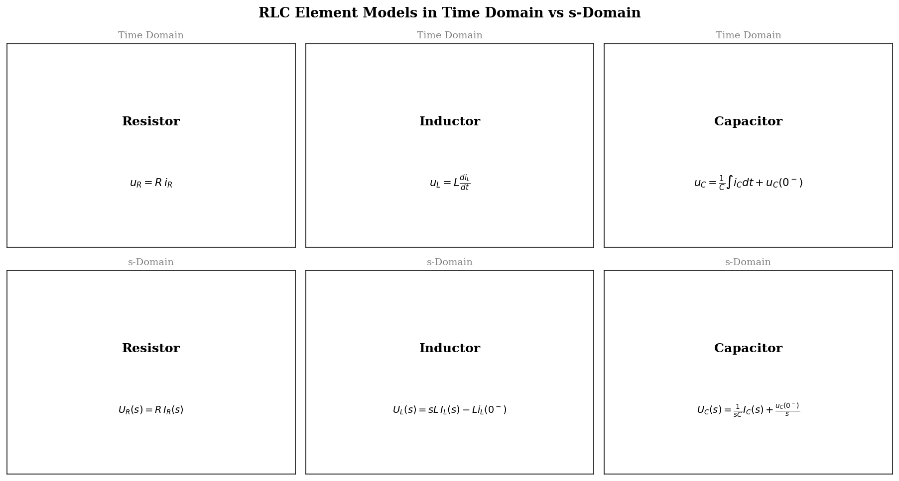

| 元件 | 时域 | s 域（$0^-$ 系统） |
| :--- | :--- | :--- |
| 电阻 $R$ | $u_R = R i_R$ | $U_R(s) = R I_R(s)$ |
| 电感 $L$ | $u_L = L \frac{di_L}{dt}$ | $U_L(s) = sL I_L(s) - L i_L(0^-)$ |
| 电容 $C$ | $u_C = \frac{1}{C}\int_0^t i_C d\tau + u_C(0^-)$ | $U_C(s) = \frac{1}{sC} I_C(s) + \frac{1}{s} u_C(0^-)$ |

> 电感/电容在 s 域中带有初始条件源（电压源或电流源形式），自动表征储能。

### 5.5.5 s 域电路分析步骤

1. 将激励源进行拉氏变换
2. 画出 s 域运算等效电路（RLC 用 s 域模型替换）
3. 用 KVL/KCL（$\sum I(s)=0,\ \sum V(s)=0$）或节点法/网孔法求解
4. 将求得的象函数反变换回时域

---

## 5.6 系统模拟

### 5.6.1 基本框图元件

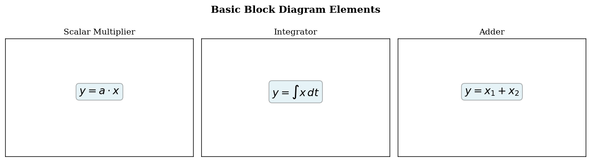

| 元件 | 符号 | 运算 |
| :--- | :--- | :--- |
| 标量乘法器 | $x \to \boxed{a} \to ax$ | $y = a \cdot x$ |
| 积分器 | $x \to \boxed{\int} \to \int x$ | $y = \int_0^t x(\tau)d\tau$（s域：$\frac{1}{s}$） |
| 加法器 | $x_1, x_2 \to \boxed{+} \to x_1+x_2$ | $y = x_1 + x_2$ |

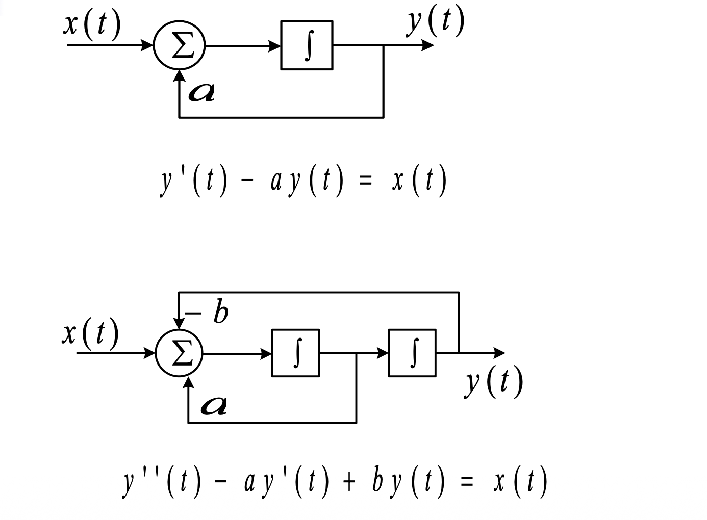

### 5.6.2 三种模拟方式

对同一 $H(s)$，有三种实现方式：

| 方式 | 原理 |
| :--- | :--- |
| **直接模拟** | 从微分方程/系统函数直接画出，保持原方程结构 |
| **并联模拟** | $H(s)$ 部分分式展开为 $\sum \frac{K_i}{s-\lambda_i}$，各项并联 |
| **串联模拟** | $H(s)$ 因式分解为子系统的乘积，逐级串联 |

---

## 5.7 综合例题

### 例1：微分方程求全响应

$$
\frac{d^2 r}{dt^2} + 3\frac{dr}{dt} + 2r = e(t), \quad e(t)=u(t),\ r(0^-)=1,\ r'(0^-)=2
$$

对两边取 LT，利用时域微分性质 $\mathcal{L}\{r'\} = sR(s) - r(0^-)$、$\mathcal{L}\{r''\} = s^2R(s) - sr(0^-) - r'(0^-)$，逐项写出：

**左边**：

$$
\begin{aligned}
\mathcal{L}\{r''(t)\} &= s^2 R(s) - s \cdot r(0^-) - r'(0^-) = s^2 R - s - 2 \\[4pt]
\mathcal{L}\{3r'(t)\} &= 3\big[s R(s) - r(0^-)\big] = 3sR - 3 \\[4pt]
\mathcal{L}\{2r(t)\}  &= 2R(s)
\end{aligned}
$$

左边总和：$(s^2 + 3s + 2)R(s) - (s + 5)$

**右边**：

$$
\mathcal{L}\{e(t)\} = \mathcal{L}\{u(t)\} = \frac{1}{s}
$$

**左右相等**：

$$
(s^2 + 3s + 2)R(s) - (s + 5) = \frac{1}{s}
$$

移项，把初值贡献移到右边：

$$
(s^2 + 3s + 2)R(s) = \frac{1}{s} + s + 5
$$

其中 $\frac{1}{s}$ 来自激励，$s+5$ 来自初始条件。由此解出：

$$
\Rightarrow R(s) = \frac{\frac{1}{s} + s + 5}{s^2 + 3s + 2} = \frac{1}{2}\cdot\frac{1}{s} + 3\cdot\frac{1}{s+1} - \frac{5}{2}\cdot\frac{1}{s+2}
$$

$$
\boxed{r(t) = \frac{1}{2}u(t) + 3e^{-t}u(t) - \frac{5}{2}e^{-2t}u(t)}
$$

> 一步到位，零输入 + 零状态自动合并，无需分别求解。

---

### 例2：三角信号的四种 LT 求法

三角脉冲 $f(t)$（$0<t<1$ 时 $f(t)=t$，$1<t<2$ 时 $f(t)=2-t$，其余为零）。

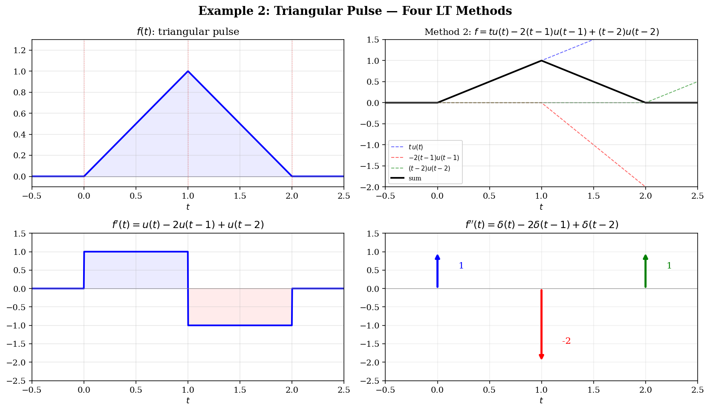

---

#### 方法一：定义积分

直接按 LT 定义分段积分：

$$
\begin{aligned}
F(s) &= \int_{0^-}^{\infty} f(t) e^{-st} dt \\
     &= \int_0^1 t e^{-st} dt + \int_1^2 (2-t) e^{-st} dt
\end{aligned}
$$

第一段用分部积分 $\int t e^{-st}dt = -\frac{t}{s}e^{-st} + \frac{1}{s}\int e^{-st}dt$：

$$
\int_0^1 t e^{-st} dt = \left[-\frac{t}{s}e^{-st} - \frac{1}{s^2}e^{-st}\right]_0^1
        = -\frac{1}{s}e^{-s} - \frac{1}{s^2}e^{-s} + \frac{1}{s^2}
$$

第二段类似处理：

$$
\int_1^2 (2-t) e^{-st} dt = \frac{1}{s}e^{-s} + \frac{1}{s^2}e^{-2s} - \frac{1}{s^2}e^{-s}
$$

两段相加，中间项抵消，得：

$$
\boxed{F(s) = \frac{1}{s^2}(1 - e^{-s})^2}
$$

> 方法一最直接，但分段积分的代数运算较繁琐。

---

#### 方法二：时移叠加

将三角脉冲拆成三条斜变信号的叠加：

$$
f(t) = \underbrace{t u(t)}_{\text{从0开始上升}} \;-\; \underbrace{2(t-1)u(t-1)}_{\text{从1开始下降，斜率-2}} \;+\; \underbrace{(t-2)u(t-2)}_{\text{从2开始归零}}
$$

利用 $\mathcal{L}\{t u(t)\} = \frac{1}{s^2}$ 和时移性质 $\mathcal{L}\{f(t-t_0)u(t-t_0)\} = e^{-st_0}F(s)$：

$$
\begin{aligned}
\mathcal{L}\{t u(t)\} &= \frac{1}{s^2} \\[4pt]
\mathcal{L}\{2(t-1)u(t-1)\} &= 2e^{-s} \cdot \frac{1}{s^2} \\[4pt]
\mathcal{L}\{(t-2)u(t-2)\} &= e^{-2s} \cdot \frac{1}{s^2}
\end{aligned}
$$

叠加：$F(s) = \frac{1}{s^2} - \frac{2e^{-s}}{s^2} + \frac{e^{-2s}}{s^2} = \boxed{\frac{1}{s^2}(1 - e^{-s})^2}$

> 方法二的关键：把三角波看成斜变信号的组合，利用 $tu(t) \leftrightarrow 1/s^2$ + 时移。

---

#### 方法三：微分定理

对 $f(t)$ 求两次导，将三角波变成冲激序列：

$$
f'(t) = u(t) - 2u(t-1) + u(t-2)
$$

$$
f''(t) = \delta(t) - 2\delta(t-1) + \delta(t-2)
$$

$f''(t)$ 的 LT 非常简单：

$$
\mathcal{L}\{f''(t)\} = 1 - 2e^{-s} + e^{-2s} = (1 - e^{-s})^2
$$

由时域微分性质 $\mathcal{L}\{f''(t)\} = s^2F(s) - sf(0^-) - f'(0^-)$，且 $f(0^-)=0$，$f'(0^-)=0$：

$$
s^2F(s) = (1 - e^{-s})^2 \quad \Longrightarrow \quad \boxed{F(s) = \frac{1}{s^2}(1 - e^{-s})^2}
$$

> 方法三最简洁：二阶导后变成冲激 → LT 立得 → 除以 $s^2$ 还原。微分将复杂波形"降解"为冲激，是处理分段线性信号的首选技巧。

---

#### 方法四：卷积定理

三角脉冲可看成两个相同门函数的卷积：

$$
f_1(t) = u(t) - u(t-1), \qquad f(t) = f_1(t) * f_1(t)
$$

门函数的 LT：

$$
F_1(s) = \mathcal{L}\{u(t) - u(t-1)\} = \frac{1}{s} - \frac{e^{-s}}{s} = \frac{1 - e^{-s}}{s}
$$

由时域卷积定理 $\mathcal{L}\{f_1 * f_1\} = F_1(s) \cdot F_1(s)$：

$$
F(s) = \left(\frac{1 - e^{-s}}{s}\right)^2 = \boxed{\frac{1}{s^2}(1 - e^{-s})^2}
$$

> 方法四利用卷积与乘法的对偶，将时域的三角构造转化为 s 域的平方运算。

---

### 例3：微分-积分混合方程

$$
\frac{df}{dt} + 3f(t) + 2\int_{-\infty}^t f(\tau)d\tau = u(t),\quad f(0^-)=2,\ \int_{-\infty}^0 f(\tau)d\tau = 0
$$

取 LT，逐项写出：

**项 ①**：$\displaystyle \mathcal{L}\left\{\frac{df}{dt}\right\} = sF(s) - f(0^-) = sF(s) - 2$

**项 ②**：$\displaystyle \mathcal{L}\{3f(t)\} = 3F(s)$

**项 ③**：$\displaystyle \mathcal{L}\left\{2\int_{-\infty}^t f(\tau)d\tau\right\} = 2\left[\frac{F(s)}{s} + \frac{1}{s}\int_{-\infty}^0 f(\tau)d\tau\right] = \frac{2}{s}F(s) + 0$

（使用了时域积分性质，$\int_{-\infty}^0 f(\tau)d\tau = 0$ 代入）

**项 ④**（右边）：$\displaystyle \mathcal{L}\{u(t)\} = \frac{1}{s}$

---

**左右相等**：

$$
\underbrace{[sF(s) - 2]}_{\text{①}} + \underbrace{3F(s)}_{\text{②}} + \underbrace{\frac{2}{s}F(s)}_{\text{③}} = \underbrace{\frac{1}{s}}_{\text{④}}
$$

合并 $F(s)$ 各项：

$$
\left(s + 3 + \frac{2}{s}\right) F(s) = \frac{1}{s} + 2
$$

等式两边同乘 $s$ 去分母：

$$
(s^2 + 3s + 2)F(s) = 2s + 1
$$

解出：

$$
F(s) = \frac{2s+1}{s^2+3s+2} = \frac{2s+1}{(s+1)(s+2)}
$$

部分分式展开：设 $\frac{2s+1}{(s+1)(s+2)} = \frac{A}{s+1} + \frac{B}{s+2}$

- $A = \left[(s+1)F(s)\right]_{s=-1} = \frac{2(-1)+1}{-1+2} = -1$
- $B = \left[(s+2)F(s)\right]_{s=-2} = \frac{2(-2)+1}{-2+1} = \frac{-3}{-1} = 3$

$$
F(s) = \frac{-1}{s+1} + \frac{3}{s+2}
$$

反变换（查表 $\frac{1}{s+\alpha} \leftrightarrow e^{-\alpha t}u(t)$）：

$$
\boxed{f(t) = \left[-e^{-t} + 3e^{-2t}\right]u(t)}
$$

---

### 例4：初值/终值定理

已知 $F(s)=\frac{s+6}{(s+2)(s+5)}$，求 $f(0^+)$ 和 $f(\infty)$。

$$
f(0^+) = \lim_{s\to\infty} sF(s) = \lim_{s\to\infty} s\cdot\frac{s+6}{(s+2)(s+5)} = 1
$$

$$
f(\infty) = \lim_{s\to 0} sF(s) = \lim_{s\to 0} s\cdot\frac{s+6}{(s+2)(s+5)} = 0
$$

---

### 例5：利用初值定理求泰勒展开

已知 $F(s) = \frac{3}{(s+1)^3}$，求 $f(t)$ 的前两项非零泰勒展开项。

**思路**：将 $F(s)$ 展开为 $s$ 的降幂级数 $\frac{a_0}{s} + \frac{a_1}{s^2} + \frac{2!a_2}{s^3} + \frac{3!a_3}{s^4} + \cdots$，逐项反变换即得 $f(t) = a_0 + a_1 t + a_2 t^2 + a_3 t^3 + \cdots$

---

**第 1 步**：将 $F(s)$ 写成 $s^{-3}$ 形式，便于展开

$$
F(s) = \frac{3}{(s+1)^3} = \frac{3}{s^3(1 + \frac{1}{s})^3} = \frac{3}{s^3}\left(1 + \frac{1}{s}\right)^{-3}
$$

**第 2 步**：利用二项式展开 $(1+x)^{-3} = 1 - 3x + 6x^2 - 10x^3 + \cdots$（令 $x = 1/s$）

$$
F(s) = \frac{3}{s^3}\left(1 - \frac{3}{s} + \frac{6}{s^2} - \frac{10}{s^3} + \cdots\right)
$$

**第 3 步**：乘开，得到 $s$ 的降幂级数

$$
F(s) = \frac{3}{s^3} - \frac{9}{s^4} + \frac{18}{s^5} - \frac{30}{s^6} + \cdots
$$

**第 4 步**：逐项反变换（$\mathcal{L}^{-1}\{1/s^{n+1}\} = t^n/n!$）

$$
\begin{aligned}
\frac{3}{s^3} &= 3 \cdot \frac{1}{s^3} = 3 \cdot \frac{2!}{2!} \cdot \frac{1}{s^3}
               \leftrightarrow 3 \cdot \frac{t^2}{2!} = \frac{3}{2}t^2 \\[4pt]
-\frac{9}{s^4} &= -9 \cdot \frac{1}{s^4}
               \leftrightarrow -9 \cdot \frac{t^3}{3!} = -\frac{9}{6}t^3 = -\frac{3}{2}t^3 \\[4pt]
\frac{18}{s^5} &\leftrightarrow 18 \cdot \frac{t^4}{4!} = \frac{18}{24}t^4 = \frac{3}{4}t^4 \\[4pt]
&\ \ \vdots
\end{aligned}
$$

**结果**：

$$
\boxed{f(t) \approx \frac{3}{2}t^2 - \frac{3}{2}t^3 + \frac{3}{4}t^4 - \cdots}
$$

前两项非零系数为 $a_2 = \frac{3}{2}$，$a_3 = -\frac{3}{2}$。

> 此法和初值定理等价：$a_0 = \lim_{s\to\infty}sF(s)$、$a_1 = \lim_{s\to\infty}s[sF(s)-a_0]$、$\dots$。但当 $F(s)$ 是有理函数时，直接展开为降幂级数再逐项反变换更直观。

---

### 本章小结

| 知识板块 | 核心要点 |
| :--- | :--- |
| **LT 的动机** | FT 不能处理 $u(t)$、$e^{\alpha t}$ 等 → 乘 $e^{-\sigma t}$ 衰减因子 |
| **双边 → 单边** | $s=\sigma+j\omega$；ROC 四种情况；工程默认单边 LT（$0^-$ 下限） |
| **常用变换对** | $\delta \leftrightarrow 1$、$u \leftrightarrow 1/s$、$e^{-\alpha t}u \leftrightarrow 1/(s+\alpha)$、$t^n \leftrightarrow n!/s^{n+1}$、$\sin$/$\cos$ |
| **逆变换** | 部分分式法 + 留数法；$m\geq n$ 时先分离多项式 |
| **关键性质** | 时移要求 $f(t-t_0)u(t-t_0)$；微积分自动引入初值；初值/终值定理 |
| **复频域分析** | 微分方程一步全响应；s 域 RLC 模型（带初值源的元件）；$H(s)$ 定义 |
| **系统模拟** | 三种实现：直接 / 并联（部分分式） / 串联（因式分解） |

---

# 第六章 连续时间系统的系统函数

## 6.1 系统函数的极零点

### 6.1.1 系统函数的表示

系统函数 $H(s)$ 可写成标准的有理分式形式：

$$
\boxed{H(s) = H_0 \frac{(s - z_1)(s - z_2) \cdots (s - z_m)}{(s - p_1)(s - p_2) \cdots (s - p_n)}}
$$

其中 $H_0 = \frac{a_m}{b_n}$ 称为**系统增益**（s 域比例因子）。

### 6.1.2 零点与极点

| 概念 | 定义 | 求法 |
| :--- | :--- | :--- |
| **零点** (zero) | 使 $H(s) = 0$ 的 $s$ 值 | 令分子 $N(s) = 0$ 解出 |
| **极点** (pole) | 使 $H(s) \to \infty$ 的 $s$ 值 | 令分母 $D(s) = 0$ 解出 |

**无穷远处的零/极点**：

- 当 $n > m$ 时，$\lim_{s\to\infty} H(s) = 0$，无穷远处有一个 $(n-m)$ 阶零点
- 当 $n < m$ 时，$\lim_{s\to\infty} H(s) = \infty$，无穷远处有一个 $(m-n)$ 阶极点

**例**：$F(s) = \frac{(s+2)(s+4)}{s(s^2+9)(s+5)^2}$

- 零点：$s = -2,\ -4$
- 极点：$s = 0,\ \pm j3,\ s = -5$（二阶）

### 6.1.3 极零图

系统函数 $H(s)$ 一般是 $s$ 的实有理函数，其极点和零点关于**实轴对称**。在 $s$ 平面上标注极点（×）和零点（○）的图形称为**极零图**（pole-zero plot）。

---

## 6.2 零极点分布与时域响应

### 6.2.1 极点位置决定 $h(t)$ 的模式

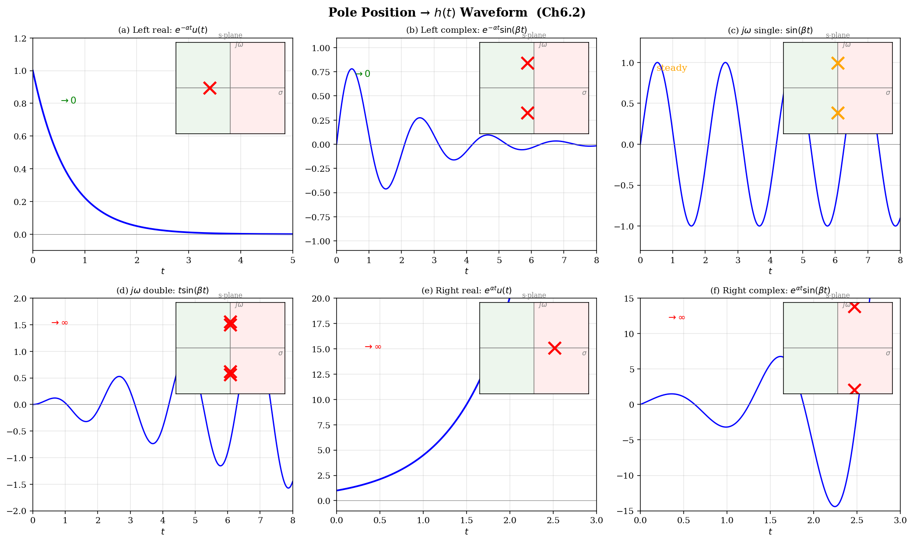

$H(s)$ 的极点位置直接决定了冲激响应 $h(t)$ 的时域波形模式：

| 极点位置 | $h(t)$ 模式 | $t \to \infty$ 行为 |
| :--- | :--- | :--- |
| **负实轴**（左半平面，单阶） | $e^{-\alpha t}u(t)$ | → 0（衰减） |
| **负实轴**（左半平面，$k$ 重） | $\frac{t^{k-1}}{(k-1)!}e^{-\alpha t}u(t)$ | → 0（衰减） |
| **左半平面共轭** | $e^{-\alpha t}\sin(\beta t + \varphi)u(t)$ | → 0（衰减振荡） |
| **虚轴单阶** | $\sin(\beta t + \varphi)u(t)$ 或 $u(t)$ | 等幅振荡 / 稳态 |
| **虚轴二阶及以上** | $t\sin(\beta t)u(t)$ 或 $t u(t)$ | → ∞（增长） |
| **右半平面**（实轴或共轭） | $e^{\alpha t}u(t)$ 或 $e^{\alpha t}\sin(\beta t)u(t)$ | → ∞（发散） |

**核心结论**：

- 左半平面极点 → $h(t)$ 的**暂态分量**（衰减，趋于零）
- 虚轴上单极点 → $h(t)$ 的**稳态分量**（等幅，不衰减）
- 虚轴上重极点 / 右半平面极点 → $h(t)$ **随时间增长而发散**

### 6.2.2 典型极点-波形对照

| 极点 | $H(s)$ 项 | $h(t)$ |
| :--- | :--- | :--- |
| 虚轴单阶 | $\frac{1}{s}$ | $u(t)$（稳态） |
| 虚轴单阶 | $\frac{1}{s^2+1}$ | $\sin t \cdot u(t)$（稳态） |
| 虚轴二阶 | $\frac{1}{s^2}$ | $t u(t)$（增长） |
| 虚轴二阶 | $\frac{1}{(s^2+1)^2}$ | $t\sin t \cdot u(t)$（增长） |
| 左半单阶 | $\frac{1}{s+1}$ | $e^{-t}u(t)$（衰减） |
| 左半单阶 | $\frac{1}{(s+1)^2+1}$ | $e^{-t}\sin t \cdot u(t)$（衰减振荡） |
| 左半二阶 | $\frac{1}{(s+1)^2}$ | $t e^{-t}u(t)$（衰减） |

### 6.2.3 零点对时域特性的影响

零点**不改变振荡频率**，只影响**幅度和相移**。

**例**：比较两个系统函数

| $H(s)$ | $h(t)$ |
| :--- | :--- |
| $H_1(s) = \frac{s+a}{(s+a)^2+\omega^2}$ | $e^{-at}\cos\omega t$ |
| $H_2(s) = \frac{s}{(s+a)^2+\omega^2}$（零点移到原点） | $e^{-at}\sqrt{1+(a/\omega)^2}\cos(\omega t - \phi)$ |

> 极点决定"有什么频率成分"（模式），零点决定"每种成分多大、相位偏移多少"（权重）。

### 6.2.4 自由响应与受迫响应的极点来源

全响应 $R(s) = H(s)E(s)$，极点来自两方面：

| 极点来源 | 决定 | 说明 |
| :--- | :--- | :--- |
| $H(s)$ 的极点 | **自由响应**的模式 | 由系统本身特征根决定 |
| $E(s)$ 的极点 | **受迫响应**的模式 | 由激励信号形式决定 |

幅度和相位与 $H(s)$ 和 $E(s)$ 的零点均有关。

---

## 6.3 零极点分布与频响特性

### 6.3.1 向量法基本思想

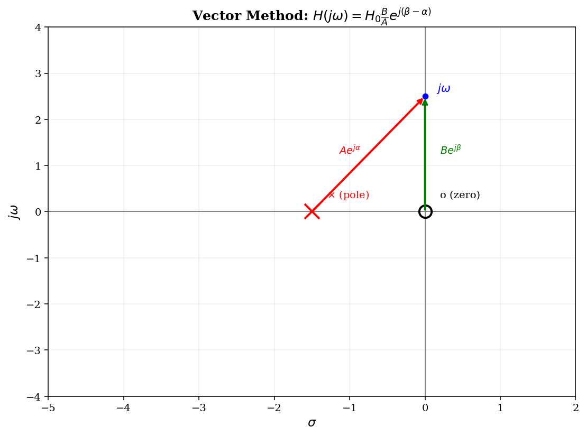

系统稳定时，令 $s = j\omega$ 得频响特性 $H(j\omega) = |H(j\omega)| e^{j\varphi(\omega)}$。

将 $H(s)$ 写成零极点形式并代入 $s = j\omega$：

$$
H(j\omega) = H_0 \frac{\prod_{i=1}^{m} (j\omega - z_i)}{\prod_{i=1}^{n} (j\omega - p_i)}
$$

令零点和极点对应的向量为：

$$
j\omega - z_i = B_i e^{j\beta_i}, \qquad j\omega - p_i = A_i e^{j\alpha_i}
$$

代入 $H(j\omega)$ 表达式：

### 6.3.2 幅频与相频的几何意义

$$
\boxed{|H(j\omega)| = H_0 \frac{\prod_{i=1}^{m} B_i}{\prod_{i=1}^{n} A_i}}, \qquad
\boxed{\varphi(\omega) = \sum_{i=1}^{m} \beta_i - \sum_{i=1}^{n} \alpha_i}
$$

| 频响分量 | 几何意义 |
| :--- | :--- |
| 幅频 $\vert H(j\omega)\vert$ | $H_0 \times$ 零点矢量模的乘积 $\div$ 极点矢量模的乘积 |
| 相频 $\varphi(\omega)$ | 零点矢量相角之和 $-$ 极点矢量相角之和 |

> 给定 $\omega$，在 s 平面上从各零/极点向 $j\omega$ 点画向量，量取长度 $B_i$、$A_i$ 和角度 $\beta_i$、$\alpha_i$，即可勾画频响曲线。这就是**频响特性的几何作图法**。

### 6.3.3 示例：RC 高通滤波器

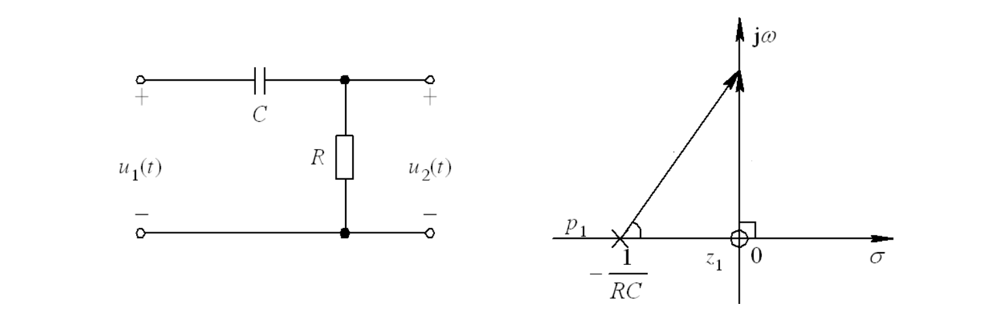


系统函数：

$$
H(s) = \frac{U_2(s)}{U_1(s)} = \frac{R}{R + \frac{1}{sC}} = \frac{s}{s + \frac{1}{RC}}
$$

- 零点：$z = 0$（原点）
- 极点：$p = -\frac{1}{RC}$（负实轴）

频响（$s = j\omega$）：

$$
H(j\omega) = \frac{j\omega}{j\omega + \frac{1}{RC}}
$$

$$
|H(j\omega)| = \frac{B}{A} = \frac{\omega}{\sqrt{\omega^2 + (1/RC)^2}}, \qquad
\varphi(\omega) = \beta - \alpha
$$

- $\omega \to 0$：$|H| \to 0$（直流阻断）
- $\omega \to \infty$：$|H| \to 1$（高频通过）
- 截止频率：$\omega_c = \frac{1}{RC}$

> 此为**一阶高通滤波器**。原点处的零点迫使 $|H(0)|=0$（直流增益为零），负实轴极点限制高频增益为 1。

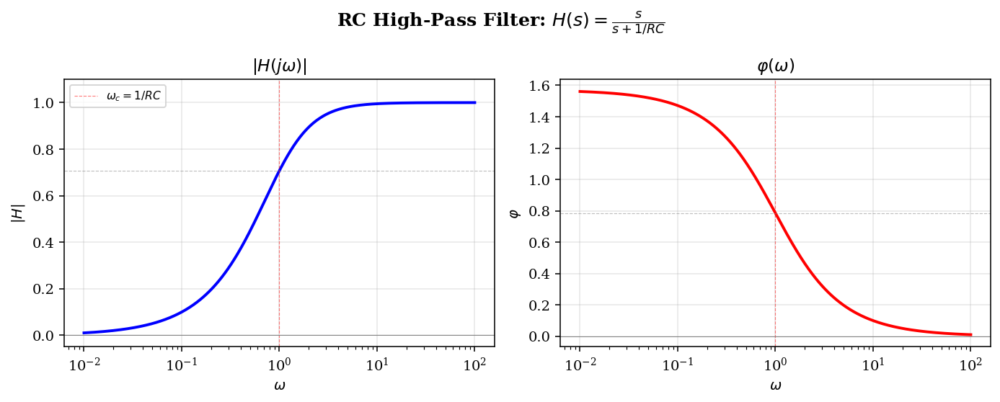

---

## 6.4 系统的稳定性

### 6.4.1 BIBO 稳定定义

一个系统，若对任意**有界输入** $|e(t)| < M_e$，其输出也**有界** $|r(t)| < M_r$，则称该系统是**BIBO 稳定**的（Bounded-Input, Bounded-Output）。

### 6.4.2 时域充要条件

**定理**：LTI 系统 BIBO 稳定的充要条件是冲激响应**绝对可积**：

$$
\boxed{\int_{-\infty}^{\infty} |h(t)| dt < \infty}
$$

> **充分性**：$|r(t)| = |\int e(t-\tau)h(\tau)d\tau| \leq M_e \int |h(\tau)|d\tau = M_r$

> **必要性**（反证法）：若 $\int |h| \to \infty$，取有界输入 $f(-t) = h(t)/|h(t)|$（$\|f\|=1$），则 $r(0) = \int |h| \to \infty$——矛盾。

### 6.4.3 极点位置判稳准则

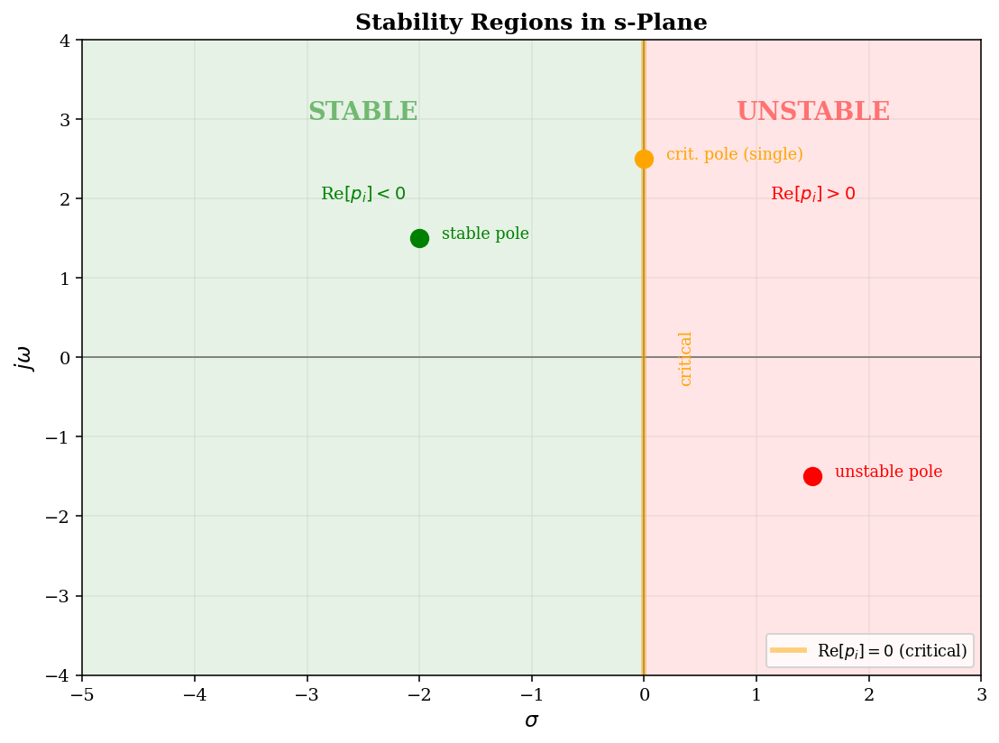

对因果 LTI 系统，稳定性可由 $H(s)$ 的极点分布直接判断：

| 极点位置 | 稳定性 | 说明 |
| :--- | :---: | :--- |
| 所有极点在**左半开平面** | ✅ 稳定 | $h(t)$ 各项衰减，绝对可积 |
| 虚轴上有**单阶**极点，其余在左半平面 | ⚠️ 临界稳定 | 等幅振荡，$h(t)$ 不绝对可积但输出有界（对 BIBO 通常算不稳定） |
| 虚轴上有**重极点** / 右半平面有极点 | ❌ 不稳定 | $h(t)$ 发散 |

**因果稳定系统的充要条件**：$H(s)$ 的所有极点全部位于 $s$ 平面的**左半开平面**（$\mathrm{Re}[p_i] < 0$）。

### 6.4.4 连续时间因果系统稳定性小结

| 条件 | 含义 |
| :--- | :--- |
| $h(t) = 0,\ t < 0$ | 因果性 |
| $\int_{-\infty}^{\infty} \vert h(t)\vert dt < \infty$ | 稳定性（时域） |
| $H(s)$ 极点全在左半开平面 | 稳定性（s 域） |

---

### 本章小结

| 知识板块 | 核心要点 |
| :--- | :--- |
| **极零点** | $H(s) = H_0\frac{\prod(s-z_i)}{\prod(s-p_i)}$；零点/N(s)=0，极点/D(s)=0；关于实轴对称 |
| **极点-波形** | 左半平面 → 衰减；虚轴单阶 → 等幅；虚轴重极点/右半平面 → 发散 |
| **零点作用** | 不影响振荡频率，只影响幅度和相移 |
| **向量法** | $|H| = H_0\frac{\prod B_i}{\prod A_i}$，$\varphi = \sum\beta_i - \sum\alpha_i$；从极零图几何作图 |

---

# 第七章 离散时间系统的时域分析

## 7.1 离散时间信号

### 7.1.1 离散信号的基本概念

离散时间信号是离散变量 $n$ 的函数（$n$ 为整数），也称**序列**，记为 $x(n)$ 或 $x[n]$。

与连续信号的对照：

| | 连续时间 | 离散时间 |
| :--- | :--- | :--- |
| 自变量 | $t \in \mathbb{R}$ | $n \in \mathbb{Z}$ |
| 函数写法 | $f(t)$ | $f(n)$ 或 $f[n]$ |
| 基本单元 | $\delta(t)$（冲激） | $\delta(n)$（单位函数） |
| 积分/求和 | $\int f(t)dt$ | $\sum f(n)$ |

### 7.1.2 基本离散序列

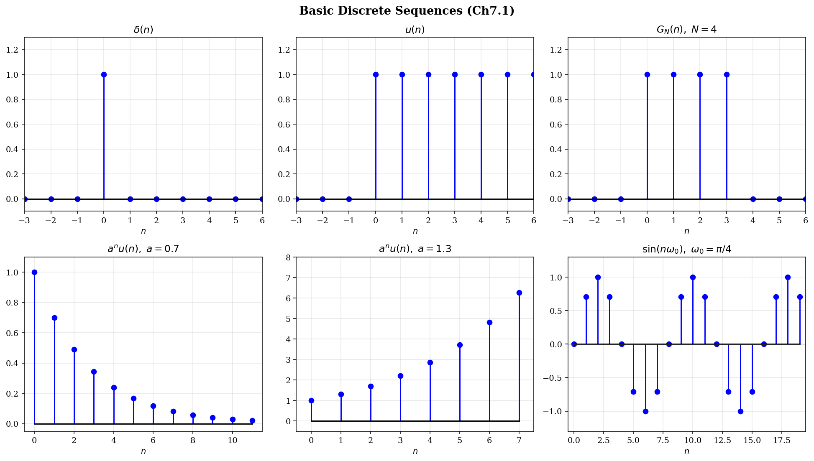

#### 1. 单位函数（单位样值） $\delta(n)$

$$
\delta(n) = \begin{cases} 1, & n = 0 \\ 0, & n \neq 0 \end{cases}
$$

$$
\delta(n - n_0) = \begin{cases} 1, & n = n_0 \\ 0, & n \neq n_0 \end{cases}
$$

抽样性：$f(n)\delta(n) = f(0)\delta(n)$，$f(n)\delta(n-n_0) = f(n_0)\delta(n-n_0)$

#### 2. 单位阶跃序列 $u(n)$

$$
u(n) = \begin{cases} 1, & n \geq 0 \\ 0, & n < 0 \end{cases}
$$

与 $\delta(n)$ 的关系：$u(n) = \sum_{k=0}^{\infty} \delta(n-k)$，$\delta(n) = u(n) - u(n-1)$

#### 3. 矩形序列 $G_N(n)$

$$
G_N(n) = u(n) - u(n-N) = \begin{cases} 1, & 0 \leq n \leq N-1 \\ 0, & \text{其他} \end{cases}
$$

#### 4. 指数序列 $a^n u(n)$

| $a$ 的范围 | 波形特征 |
| :--- | :--- |
| $a > 1$ | 单调增长 |
| $0 < a < 1$ | 单调衰减 |
| $-1 < a < 0$ | 正负交替衰减 |
| $a < -1$ | 正负交替增长 |

#### 5. 正弦序列

$$
f(n) = A\sin(n\omega_0) \quad \text{或} \quad f(n) = A\sin(\Omega_0 n T_s)
$$

#### 6. 复指数序列

$$
f(n) = e^{j n \omega_0} = \cos(n\omega_0) + j\sin(n\omega_0)
$$

### 7.1.3 序列的分类

| 分类 | 条件 |
| :--- | :--- |
| 双边无限序列 | $f(n)$ 对所有 $n$ 取值 |
| 有限序列 | $f(n)$ 仅在 $n_1 < n < n_2$ 有值 |
| 右边序列（因果序列） | $n < 0$ 时 $f(n) = 0$ |
| 偶对称 | $f(n) = f(-n)$ |
| 奇对称 | $f(n) = -f(-n)$ |

### 7.1.4 周期序列的判定

离散正弦 $x(n) = A\sin(n\omega_0)$ 是否为周期序列？

令 $N = \frac{2\pi}{\omega_0}$：

| $N$ 的值 | 结论 |
| :--- | :--- |
| $N$ 为整数 | 周期序列，周期 $N$ |
| $N$ 为有理数 $p/q$ | 周期序列，周期 $N' = N \times q$ |
| $N$ 为无理数 | **非周期序列** |

**例**：$x(n) = A\cos(\frac{3\pi}{7}n - \frac{\pi}{8})$

$N = \frac{2\pi}{3\pi/7} = \frac{14}{3}$ → 取 $N' = 14$，是周期序列。

**例**：$x(n) = e^{j(n/8 - \pi)}$，$\omega_0 = 1/8$，$N = 16\pi$ 无理数 → 非周期。

### 7.1.5 离散信号的运算

| 运算 | 表达式 |
| :--- | :--- |
| 左移 | $y(n) = f(n + m)$ |
| 右移 | $y(n) = f(n - m)$ |
| 反转 | $y(n) = f(-n)$ |
| 相加 | $y(n) = f_1(n) + f_2(n)$ |
| 相乘 | $y(n) = f_1(n) \cdot f_2(n)$ |
| 累加 | $y(n) = \sum_{i=-\infty}^{n} f(i)$ |
| 向前差分 | $\Delta f(n) = f(n+1) - f(n)$ |
| 向后差分 | $\nabla f(n) = f(n) - f(n-1)$ |

**移序算子**：$E f(n) = f(n+1)$（超前），$E^{-1} f(n) = f(n-1)$（滞后）

典型差分：$\nabla u(n) = \delta(n)$（对应连续 $\frac{du}{dt} = \delta(t)$）

### 7.1.6 用归纳法求序列的闭合表达式

对于按某种规律生成的序列，如果观察出前几项的规律，可以**猜想**一个闭合表达式（闭式），然后用**数学归纳法**严格证明。

**方法步骤**：
1. 写出序列的前若干项，观察模式
2. 提出猜想 $x(n) = f(n)$
3. 验证基础情形（如 $n = 0$ 或 $n = 1$）
4. 假设 $n = k$ 时成立，推导 $n = k+1$ 时亦成立

---

**例 1：交错序列**

序列：$\{1,\ -1,\ 1,\ -1,\ 1,\ -1,\ \dots\}$

观察：$x(0)=1,\ x(1)=-1,\ x(2)=1,\ x(3)=-1$

猜想：$x(n) = (-1)^n$

**归纳证明**：
- $n=0$：$(-1)^0 = 1 = x(0)$，成立。
- 假设 $x(k) = (-1)^k$，由序列定义 $x(k+1) = -x(k) = -(-1)^k = (-1)^{k+1}$。

$$
\boxed{x(n) = (-1)^n}
$$

---

**例 2：分数序列**

序列：$\left\{0,\ \dfrac{1}{2},\ \dfrac{2}{3},\ \dfrac{3}{4},\ \dfrac{4}{5},\ \dots\right\}$

观察：$x(0)=0 = 0/1,\ x(1)=1/2,\ x(2)=2/3,\ x(3)=3/4$

猜想：$x(n) = \dfrac{n}{n+1}$

**归纳证明**：
- $n=0$：$0/(0+1) = 0$，成立。
- 假设 $x(k) = k/(k+1)$，由递推规律 $x(k+1) = \dfrac{k+1}{(k+1)+1}$（下一项的分子、分母各加 1），恰为 $\dfrac{k+1}{k+2}$。

$$
\boxed{x(n) = \frac{n}{n+1}}
$$

---

**例 3：二次序列——一阶差分法**

序列：$\{-2,\ -1,\ 2,\ 7,\ 14,\ 23,\ \dots\}$

观察各项：
$$
\begin{aligned}
x(0) &= -2 = 0^2 - 2 \\
x(1) &= -1 = 1^2 - 2 \\
x(2) &= 2 = 2^2 - 2 \\
x(3) &= 7 = 3^2 - 2
\end{aligned}
$$

猜想：$x(n) = n^2 - 2$

**归纳证明**：
- $n=0$：$0^2 - 2 = -2$，成立。
- 假设 $x(k) = k^2 - 2$，则：
  $$
  \begin{aligned}
  x(k+1) &= x(k) + \big[x(k+1) - x(k)\big] \quad (\text{向前差分})
  \end{aligned}
  $$
  由序列值：$x(k+1) - x(k) = [(k+1)^2 - 2] - [k^2 - 2] = 2k + 1$。

  若 $x(k) = k^2 - 2$，则 $x(k+1) = k^2 - 2 + (2k+1) = k^2 + 2k - 1 = (k+1)^2 - 2$。

$$
\boxed{x(n) = n^2 - 2}
$$

> **注**：该例的差分 $\nabla x(n) = x(n) - x(n-1) = 2n - 1$ 是等差序列（一阶差分后变为线性），暗示原序列是二次函数。这种"**差分降次**"的思路与连续情况中微分降幂完全对偶。

---

**方法适用场景**：

| 序列特征 | 猜测方向 |
| :--- | :--- |
| 正负交替 | $(-1)^n$ 或 $\cos(n\pi)$ |
| 分子分母规律递增 | 分式 $P(n)/Q(n)$ |
| $k$ 阶差分为常数 | $k$ 次多项式 |
| 每项为前项乘常数 | 指数 $a^n$ |
| 每项为前若干项线性组合 | 特征根法（见 §7.4 差分方程求解） |

---

## 7.2 抽样定理

### 7.2.1 抽样的概念

抽样就是每隔一定的时间间隔 $T_s$，抽取模拟信号的一个瞬时幅度值。

| 抽样方式 | 抽样脉冲 | 特点 |
| :--- | :--- | :--- |
| **自然抽样** | 矩形脉冲串 | 抽样期间脉冲顶部随 $f(t)$ 变化 |
| **理想抽样** | 冲激序列 | $\tau \to 0$ 的极限，数学分析简化 |

本课程重点讨论理想抽样。

### 7.2.2 理想抽样的频谱分析

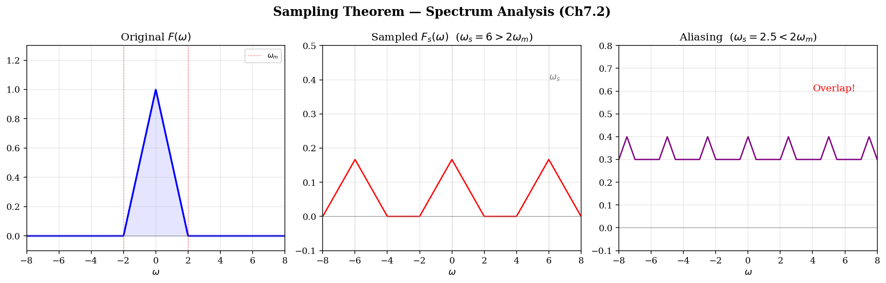

抽样脉冲：$p(t) = \delta_T(t) = \sum_{n=-\infty}^{\infty} \delta(t - nT_s)$，$\omega_s = 2\pi/T_s$

$\delta_T(t)$ 的傅里叶系数为常数 $P_n = 1/T_s$，故抽样信号 $f_s(t) = f(t) \cdot \delta_T(t)$ 的频谱：

$$
\boxed{F_s(\omega) = \frac{1}{T_s} \sum_{n=-\infty}^{\infty} F(\omega - n\omega_s)}
$$

> 抽样后频谱 = 原信号频谱以 $\omega_s$ 为周期等幅重复。

**为什么抽样后频谱会周期重复？** 三步推导：

**第 1 步**：冲激串 $\delta_T(t)$ 是周期函数，其傅里叶级数系数恒为 $1/T_s$：

$$
\delta_T(t) = \sum_{n=-\infty}^{\infty} \delta(t - nT_s) = \frac{1}{T_s} \sum_{n=-\infty}^{\infty} e^{j n \omega_s t}
$$

它的傅里叶变换是频域的冲激串：

$$
\mathcal{F}\{\delta_T(t)\} = \omega_s \sum_{n=-\infty}^{\infty} \delta(\omega - n\omega_s)
$$

**第 2 步**：抽样 $f_s(t) = f(t) \cdot \delta_T(t)$（时域相乘），由**频域卷积定理**：

$$
F_s(\omega) = \frac{1}{2\pi} F(\omega) * \mathcal{F}\{\delta_T(t)\}
$$

**第 3 步**：$F(\omega)$ 与 $\delta(\omega - n\omega_s)$ 的卷积 = 把 $F(\omega)$ 搬移到 $n\omega_s$ 处。每一个 $n$ 对应一份副本，全部叠加：

$$
F_s(\omega) = \frac{1}{T_s} \sum_{n=-\infty}^{\infty} F(\omega - n\omega_s)
$$

> 直观理解：时域每隔 $T_s$ "扎一下"信号 → 频域就把原频谱**复印**到 $\omega_s$ 的整数倍位置。$T_s$ 越小（扎越密）→ $\omega_s$ 越大 → 副本间距越远，不易重叠；$T_s$ 太大（扎得稀）→ $\omega_s$ 太小 → 副本挤在一起，产生**混叠**。

### 7.2.3 奈奎斯特（Nyquist）抽样定理

一个频谱限于 $f_m$（$\omega_m = 2\pi f_m$）的带限信号，若抽样频率满足：

$$
\boxed{f_s > 2f_m \quad \text{或} \quad \omega_s > 2\omega_m}
$$

则可由抽样值**唯一确定**原信号。$2f_m$ 称为**奈奎斯特率**，$T_s < 1/(2f_m)$ 为最大抽样间隔。

### 7.2.4 信号的重建（内插公式）

抽样信号通过理想低通滤波器 $H(\omega) = T_s \cdot G_{2\omega_c}(\omega)$（$\omega_m \leq \omega_c \leq \omega_s - \omega_m$）：

由 $h(t) = \frac{T_s\omega_c}{\pi} \mathrm{Sa}(\omega_c t)$ 和 $f_s(t) = \sum f(nT_s)\delta(t-nT_s)$，卷积：

$$
\boxed{f(t) = \sum_{n=-\infty}^{\infty} f(nT_s) \frac{T_s\omega_c}{\pi} \mathrm{Sa}[\omega_c(t - nT_s)]}
$$

> 物理含义：在每采样点 $nT_s$ 处放置一个峰值为 $f(nT_s)$ 的 $\mathrm{Sa}$ 函数波形，全部叠加即恢复 $f(t)$。

### 7.2.5 混叠现象

若 $f_s < 2f_m$（欠采样），频谱周期延拓后发生**重叠**，无法用滤波器分离 → 称为**混叠**（Aliasing）。

工程上保留一定的**防卫带宽**（过渡带），实际抽样频率取 $f_s > 2f_m$ 而非等于。

---

## 7.3 离散系统与差分方程

### 7.3.1 差分方程的一般形式

离散 LTI 系统用 $N$ 阶常系数线性差分方程描述：

$$
\boxed{\sum_{k=0}^{N} a_k y(n-k) = \sum_{r=0}^{M} b_r x(n-r)}
$$

或写成递推形式：

$$
y(n) = -\sum_{k=1}^{N} a_k y(n-k) + \sum_{r=0}^{M} b_r x(n-r)
$$

阶数 $N$ = 响应自变量的最高序号与最低序号之差。因果系统中 $M \leq N$。

### 7.3.2 线性与移不变性

| 性质 | 定义 | 判定 |
| :--- | :--- | :--- |
| **线性** | $T[ax_1 + bx_2] = aT[x_1] + bT[x_2]$ | 无非线性项（平方、乘积等） |
| **移不变** | $T[x(n-k)] = y(n-k)$ | 系数不显含 $n$ |

**例**：判 $y(n) = 2x(n) + 3$ → 非线性（常数 3），移不变 ✓

**例**：$y(n) = x(n)\sin(\frac{2\pi}{7}n + \frac{\pi}{6})$ → 线性 ✓，移变（系数含 $n$）

### 7.3.3 离散系统的模拟框图

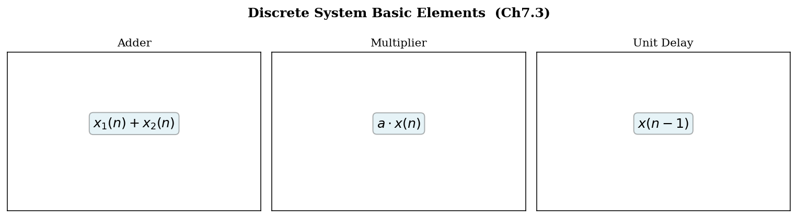

| 基本元件 | 连续系统 | 离散系统 |
| :--- | :--- | :--- |
| 加法器 | $\boxed{+}$ | $\boxed{+}$ |
| 乘法器 | $\boxed{a}$ | $\boxed{a}$ |
| 存储/延时 | $\int$（积分器） | $E^{-1}$（单位延时器） |

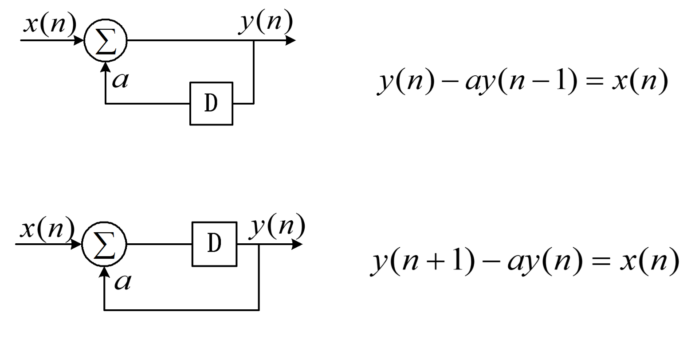

### 7.3.4 应用实例：开关电容电路

**背景**：在集成电路（IC）中，制造精确电容比值远比制造精确绝对电阻值容易。**开关电容**（Switched Capacitor）技术利用电容和 MOS 开关来**模拟电阻**，是现代模拟 IC（如滤波器、ADC）的基础。

---

**电路结构**：

- $C_1$：开关电容（负责电荷"搬运"）
- $C_2$：滤波电容（保持输出电压）
- $S_1$、$S_2$：两个 MOS 开关，由不重叠的两相时钟控制
- $x(t)$：输入电压，$y(t)$：输出电压

![开关电容电路示意]

---

**两相工作过程**：

设时钟周期为 $T$，$t = nT$ 时刻开始第 $n$ 个周期。

**相位 1**（$t = nT$，$S_1$ 闭合，$S_2$ 断开）：

$C_1$ 被充电至输入电压 $x(nT) \triangleq x(n)$。$C_2$ 保持上一周期的输出电压 $y(n)$。

$$
Q_{C_1} = C_1 \cdot x(n), \qquad Q_{C_2} = C_2 \cdot y(n)
$$

**相位 2**（$t = nT + T/2$，$S_1$ 断开，$S_2$ 闭合）：

$C_1$ 与 $C_2$ 并联，电荷重新分配。总电荷守恒（无电荷泄放路径）：

$$
Q_{\text{总}} = C_1 x(n) + C_2 y(n)
$$

并联后两端电压相同，$C_1$ 与 $C_2$ 等效为一个 $(C_1 + C_2)$ 的电容，其上电压即为新的输出电压（在 $t = (n+1)T$ 时刻采样）：

$$
y(n+1) = \frac{Q_{\text{总}}}{C_1 + C_2} = \frac{C_1 x(n) + C_2 y(n)}{C_1 + C_2}
$$

---

**差分方程的导出**：

整理上式：

$$
\begin{aligned}
(C_1 + C_2) y(n+1) &= C_1 x(n) + C_2 y(n) \\[4pt]
y(n+1) - \frac{C_2}{C_1 + C_2} y(n) &= \frac{C_1}{C_1 + C_2} x(n)
\end{aligned}
$$

令 $\alpha \triangleq \dfrac{C_2}{C_1 + C_2}$（$0 < \alpha < 1$），则：

$$
\boxed{y(n+1) - \alpha\, y(n) = (1 - \alpha)\, x(n)}
$$

或写作后向差分形式：

$$
\nabla y(n+1) + (1 - \alpha) y(n) = (1 - \alpha) x(n)
$$

---

**物理意义**：

| 参数 | 含义 |
| :--- | :--- |
| $\alpha = \frac{C_2}{C_1+C_2}$ | 由电容比值决定，在 IC 中可精确控制（~0.1%） |
| 等效 RC 时间常数 | $\tau_{\text{eq}} \approx \frac{T C_2}{C_1}$ |
| 等效电阻 | $R_{\text{eq}} \approx \frac{T}{C_1}$ |

该电路实现了一阶低通滤波功能，其差分方程将在 §7.4 中求解。

> **要点**：开关电容电路是**差分方程建模**在工程中的一个典型应用。从物理过程（电荷守恒）出发，自然地导出一个一阶线性常系数差分方程，体现了离散系统建模的基本范式。

---

## 7.4 差分方程的求解

### 7.4.1 求解方法概览

| 方法 | 适用场景 |
| :--- | :--- |
| **迭代法** | 低阶方程，手工递推 |
| **经典法** | 齐次解 + 特解，形式与微分方程完全对偶 |
| **零输入 + 零状态分解** | 物理概念清晰 |
| **Z 变换法**（第八章） | 最通用、方便 |

### 7.4.2 齐次解的形式

特征方程：$\sum_{k=0}^{N} a_k \alpha^{N-k} = 0$，$N$ 个特征根 $\alpha_1, \dots, \alpha_N$

| 特征根类型 | 齐次解 $y_h(n)$ |
| :--- | :--- |
| 不等实根 | $C_1\alpha_1^n + C_2\alpha_2^n + \cdots + C_N\alpha_N^n$ |
| $K$ 重实根 $\alpha$ | $(C_1 + C_2 n + \cdots + C_K n^{K-1})\alpha^n$ |
| 共轭复根 $\rho e^{\pm j\Omega_0}$ | $\rho^n(C_1\cos n\Omega_0 + C_2\sin n\Omega_0)$ |

### 7.4.3 特解的形式

激励 $x(n)$ 的形式决定特解 $y_p(n)$ 的设解形式，规则与连续系统完全对偶：

| 激励形式 | 特解设解（$\alpha$ 不是特征根时） |
| :--- | :--- |
| $n^K$ 多项式 | $D_1 n^K + D_2 n^{K-1} + \cdots + D_{K+1}$ |
| $\alpha^n$ | $D\alpha^n$ |
| $\alpha^n$ 且 $\alpha$ 为单特征根 | $D_1 n\alpha^n + D_2 \alpha^n$ |
| $\alpha^n$ 且 $\alpha$ 为 $K$ 重特征根 | $(D_1 n^K + \cdots + D_{K+1})\alpha^n$ |

完全解 $y(n) = y_h(n) + y_p(n)$，代入初始条件定系数。

### 7.4.4 典型例题

**例题**：$y(n) - 5y(n-1) + 6y(n-2) = 2^n u(n)$，$y(0)=0,\ y(1)=-1$

特征方程 $r^2 - 5r + 6 = 0$ → $r_1 = 2,\ r_2 = 3$

齐次解：$y_h(n) = C_1 2^n + C_2 3^n$

激励 $2^n$ 等于特征根 $r_1=2$ → 设特解 $y_p(n) = A n 2^n$，代入得 $A = -2$

全解 $y(n) = -2n 2^n + C_1 2^n + C_2 3^n$，代入初值得 $C_1=-3,\ C_2=3$

$$
\boxed{y(n) = -n 2^{n+1} - 3 \cdot 2^n + 3^{n+1}}
$$

### 7.4.5 零输入响应

激励为零，解齐次差分方程。用**移序算子** $E$ 写为：

$$
(a_0 + a_1E^{-1} + \cdots + a_N E^{-N}) y_{zi}(n) = 0
$$

形式与齐次解相同，待定系数由**初始状态**（$y(-1), y(-2), \dots$）确定。

### 7.4.6 单位样值响应 $h(n)$

$h(n)$ = 输入为 $\delta(n)$ 时系统的零状态响应。

**求解要点**：$\delta(n)$ 仅在 $n=0$ 时非零 → 转化为初始条件 → $n \geq 0$ 时等同于齐次解的零输入形式。

**例**：$y(n) - 3y(n-1) + 3y(n-2) - y(n-3) = x(n)$，三重根 $\alpha=1$

$$
h(n) = (C_1 n^2 + C_2 n + C_3) \cdot 1^n
$$

由 $h(0)=1,\ h(-1)=0,\ h(-2)=0$ → $C_1=\frac{1}{2},\ C_2=\frac{3}{2},\ C_3=1$

$$
h(n) = \frac{1}{2}(n^2 + 3n + 2)u(n)
$$

---

## 7.5 卷积和

### 7.5.1 卷积和的定义

任意序列可表示为加权移位的 $\delta(n)$ 之和：

$$
x(n) = \sum_{k=-\infty}^{\infty} x(k) \delta(n - k)
$$

由移不变性 + 线性，零状态响应为：

$$
\boxed{y_{zs}(n) = \sum_{k=-\infty}^{\infty} x(k) h(n - k) = x(n) * h(n)}
$$

全响应 $y(n) = y_{zi}(n) + y_{zs}(n)$。

### 7.5.2 卷积和的性质

| 性质 | 表达式 |
| :--- | :--- |
| 交换律 | $x * h = h * x$ |
| 分配律 | $[x_1 + x_2] * h = x_1 * h + x_2 * h$ |
| 结合律 | $[x * h_1] * h_2 = x * [h_1 * h_2]$ |
| 与 $\delta$ 卷积 | $x(n) * \delta(n) = x(n)$，$x(n) * \delta(n-k) = x(n-k)$ |
| 差分 | $\Delta(x*h) = \Delta x * h = x * \Delta h$ |
| 求和 | $\sum_{j=0}^{n} y(j) = [\sum x(j)] * h(n)$ |

### 7.5.3 图解法的四步

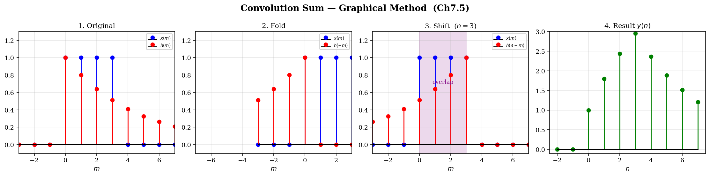

以 $y(n) = x(n) * h(n)$ 为例：

1. **换元**：将自变量改为 $m$，得 $x(m)$ 和 $h(m)$
2. **折迭**：$h(m) \to h(-m)$（关于纵轴反折）
3. **位移**：$h(-m) \to h(n-m)$（右移 $n$ 位）
4. **相乘求和**：$y(n) = \sum_{m} x(m) h(n-m)$

### 7.5.4 典型例题

**例**：$h(n) = a^n u(n)\ (0<a<1)$，$x(n) = u(n) - u(n-N)$（宽 $N$ 的矩形序列），求 $y(n) = x(n) * h(n)$。

**解**：卷积和 $y(n) = \sum_{m=-\infty}^{\infty} x(m) h(n-m)$。

$x(m)$ 仅在 $0 \leq m \leq N-1$ 非零（值为 1），$h(n-m) = a^{n-m} u(n-m)$ 仅在 $m \leq n$ 非零。两者交集决定积分上下限。

---

**情况 ①**：$n < 0$

$x(m)$ 从 $m=0$ 起有效，$h(n-m)$ 要求 $m \leq n < 0$，两者无交集 → $y(n) = 0$

---

**情况 ②**：$0 \leq n \leq N-1$

$x(m)$ 在 $[0, n]$ 范围内有效（$x$ 从 0 开始，$h$ 截至 $n$）：

$$
\begin{aligned}
y(n) &= \sum_{m=0}^{n} 1 \cdot a^{n-m}
     = a^n \sum_{m=0}^{n} (a^{-1})^m \\[4pt]
     &= a^n \cdot \frac{1 - a^{-(n+1)}}{1 - a^{-1}}
     = \frac{1 - a^{n+1}}{1 - a}
\end{aligned}
$$

（此处用了等比数列求和 $\sum_{m=0}^{n} r^m = \frac{1 - r^{n+1}}{1 - r}$，其中 $r = a^{-1}$）

---

**情况 ③**：$n \geq N$

$x(m)$ 仅在 $[0, N-1]$ 有效，$h$ 完全覆盖该区间：

$$
\begin{aligned}
y(n) &= \sum_{m=0}^{N-1} 1 \cdot a^{n-m}
     = a^n \sum_{m=0}^{N-1} (a^{-1})^m \\[4pt]
     &= a^n \cdot \frac{1 - a^{-N}}{1 - a^{-1}}
     = a^{n-N+1} \cdot \frac{1 - a^N}{1 - a}
\end{aligned}
$$

---

**汇总**：

$$
\boxed{y(n) = \begin{cases}
0, & n < 0 \\[8pt]
\dfrac{1 - a^{n+1}}{1 - a}, & 0 \leq n \leq N-1 \\[12pt]
a^{n-N+1} \cdot \dfrac{1 - a^N}{1 - a}, & n \geq N
\end{cases}}
$$

> 波形特征：$n < 0$ 为零；$[0, N-1]$ 段逐渐上升（类似 RC 充电）；$n \geq N$ 后指数衰减（输入撤去，系统自由响应）。

---

### 本章小结

| 知识板块 | 核心要点 |
| :--- | :--- |
| **基本序列** | $\delta(n)$、$u(n)$、$G_N(n)$、$a^n$、正弦、复指数；$\nabla u = \delta$ |
| **周期判定** | $N = 2\pi/\omega_0$：整数→周期；无理数→非周期 |
| **抽样定理** | $f_s > 2f_m$；频谱以 $\omega_s$ 为周期重复；内插 $\mathrm{Sa}$ 恢复 |
| **差分方程** | $N$ 阶线性常系数；齐次解 3 种形式 / 特解 4 种设解；$E$ 算子求零输入 |
| **$h(n)$** | $\delta(n)$ 激励 → 转化为初始条件 → 齐次解形式 |
| **卷积和** | $y_{zs} = x * h = \sum x(k)h(n-k)$；图解法四步 |

---

# 第八章 离散时间系统的变换域分析

## 8.1 从拉普拉斯变换到 Z 变换

### 8.1.1 从理想抽样信号的双边 LT 出发

理想抽样信号 $x_s(t) = \sum_{n=-\infty}^{\infty} x(nT) \delta(t - nT)$，对其取双边拉氏变换：

$$
X_s(s) = \int_{-\infty}^{\infty} \sum_{n=-\infty}^{\infty} x(nT) \delta(t - nT) e^{-st} dt
= \sum_{n=-\infty}^{\infty} x(nT) e^{-s nT}
$$

令 $z = e^{sT}$（或 $s = \frac{1}{T}\ln z$），并归一化 $T=1$（记 $x(nT) \to x(n)$），即得 Z 变换：

$$
\boxed{X(z) = \sum_{n=-\infty}^{\infty} x(n) z^{-n}}
$$

> 本质：Z 变换是拉普拉斯变换在离散域的对应——$z = e^{sT}$ 建立了 s 平面到 z 平面的映射。

### 8.1.2 双边 Z 变换的收敛域（ROC）

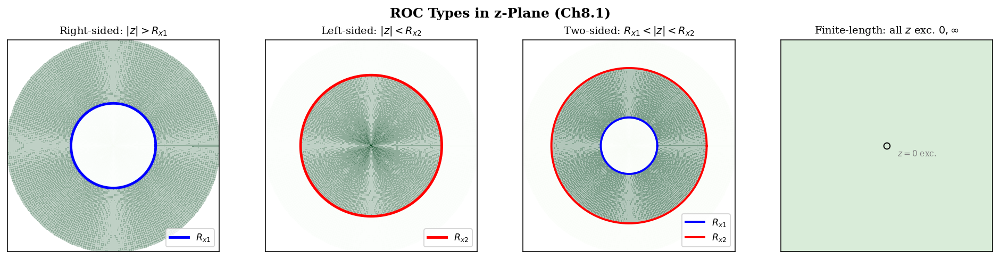

收敛的充分条件：$\sum_{n=-\infty}^{\infty} |x(n)z^{-n}| < \infty$

根据级数理论，用**比值判定**（$\lim|a_{n+1}/a_n| = \rho$）或**根值判定**（$\lim\sqrt[n]{|a_n|} = \rho$），$\rho<1$ 收敛，$\rho>1$ 发散。

| 序列类型 | 收敛域 | 图示 |
| :--- | :--- | :--- |
| **有限序列**（$n_1 \leq n \leq n_2$） | 除 $z=0$（$n_2>0$）和 $z=\infty$（$n_1<0$）外全平面 | 全平面（去掉个别点） |
| **右边序列**（$n \geq n_1$） | $\vert z\vert > R_{x1}$（圆外） | 收敛半径外 |
| **左边序列**（$n \leq n_2$） | $\vert z\vert < R_{x2}$（圆内） | 收敛半径内 |
| **双边序列** | $R_{x1} < \vert z\vert < R_{x2}$（环状） | 圆环区域 |

> 同一 $F(z)$ 表达式，收敛域不同 → 对应完全不同的原序列。必须标明 ROC。

### 8.1.3 典型例题：同一 $F(z)$，三种 ROC → 三种序列

**例**：$F(z) = \frac{z+2}{2z^2 - 7z + 2} = \frac{z+2}{2(z-3)(z-\frac{1}{2})}$，求原序列（三种 ROC）。

---

**第 1 步**：对 $\frac{F(z)}{z}$ 进行部分分式展开。

$$
\frac{F(z)}{z} = \frac{z+2}{z(2z^2-7z+2)}
= \frac{\frac{2}{3}}{z} + \frac{\frac{1}{3}}{z-3} + \frac{-1}{z-\frac{1}{2}}
$$

还原 $F(z)$：

$$
F(z) = \frac{2}{3} + \frac{1}{3}\cdot\frac{z}{z-3} - \frac{z}{z-\frac{1}{2}}
$$

---

**第 2 步**：根据 ROC 确定每一项对应的序列形式。

基本映射（关键）：

| 变换对 | 收敛域 |
| :--- | :--- |
| $a^n u(n) \leftrightarrow \frac{z}{z-a}$ | $\vert z\vert > \vert a\vert$（右边） |
| $-a^n u(-n-1) \leftrightarrow \frac{z}{z-a}$ | $\vert z\vert < \vert a\vert$（左边） |

同一表达式 $\frac{z}{z-a}$，ROC 不同 → 原序列不同！

---

**情况（1）**：ROC $\vert z\vert > 3$（圆外，右边序列）

$\frac{2}{3} = \frac{2}{3} \cdot 1 \leftrightarrow \frac{2}{3}\delta(n)$

$\frac{1}{3}\frac{z}{z-3}$：$\vert z\vert > 3$ → $\frac{1}{3} \cdot 3^n u(n)$

$-\frac{z}{z-1/2}$：$\vert z\vert > 3 > 1/2$ → $-(\frac{1}{2})^n u(n)$

$$
\boxed{f(n) = \frac{2}{3}\delta(n) + \frac{1}{3}3^n u(n) - \left(\frac{1}{2}\right)^n u(n)}
$$

---

**情况（2）**：ROC $\vert z\vert < \frac{1}{2}$（圆内，左边序列）

$\frac{2}{3} \leftrightarrow \frac{2}{3}\delta(n)$

$\frac{1}{3}\frac{z}{z-3}$：$\vert z\vert < 1/2 < 3$ → $-\frac{1}{3} \cdot 3^n u(-n-1)$

$-\frac{z}{z-1/2}$：$\vert z\vert < 1/2$ → $-(-(\frac{1}{2})^n u(-n-1)) = +(\frac{1}{2})^n u(-n-1)$

$$
\boxed{f(n) = \frac{2}{3}\delta(n) - \frac{1}{3}3^n u(-n-1) + \left(\frac{1}{2}\right)^n u(-n-1)}
$$

---

**情况（3）**：ROC $\frac{1}{2} < \vert z\vert < 3$（环状，双边序列）

$\frac{2}{3} \leftrightarrow \frac{2}{3}\delta(n)$

$\frac{1}{3}\frac{z}{z-3}$：$\vert z\vert < 3$（极点在 ROC 外侧）→ $-\frac{1}{3} \cdot 3^n u(-n-1)$

$-\frac{z}{z-1/2}$：$\vert z\vert > 1/2$（极点在 ROC 内侧）→ $-(\frac{1}{2})^n u(n)$

$$
\boxed{f(n) = \frac{2}{3}\delta(n) - \frac{1}{3}3^n u(-n-1) - \left(\frac{1}{2}\right)^n u(n)}
$$

---

> **核心结论**：同一个 $F(z)$ 表达式，收敛域不同对应**完全不同的原序列**。因此 Z 变换必须标明 ROC 才是一一对应的。

---

## 8.2 单边 Z 变换

### 8.2.1 定义

工程中默认使用**单边 Z 变换**（$n \geq 0$）：

$$
\boxed{X(z) = \sum_{n=0}^{\infty} x(n) z^{-n}}
$$

### 8.2.2 常用序列的单边 Z 变换

| $x(n)$ | $X(z)$ | ROC |
| :--- | :--- | :--- |
| $\delta(n)$ | $1$ | 全平面 |
| $\delta(n-m),\ m>0$ | $z^{-m}$ | $z \neq 0$ |
| $u(n)$ | $\dfrac{z}{z-1}$ | $\vert z\vert > 1$ |
| $a^n u(n)$ | $\dfrac{z}{z-a}$ | $\vert z\vert > \vert a\vert$ |
| $n u(n)$ | $\dfrac{z}{(z-1)^2}$ | $\vert z\vert > 1$ |
| $\sin(\omega_0 n) u(n)$ | $\dfrac{z\sin\omega_0}{z^2 - 2z\cos\omega_0 + 1}$ | $\vert z\vert > 1$ |
| $\cos(\omega_0 n) u(n)$ | $\dfrac{z(z - \cos\omega_0)}{z^2 - 2z\cos\omega_0 + 1}$ | $\vert z\vert > 1$ |

> $a^n u(n) \leftrightarrow \frac{z}{z-a}$ 是最核心的变换对，其余大多由此推导。

### 8.2.3 Z 变换的基本性质

| 序号 | 性质 | 时域 | Z 域 |
| :---: | :--- | :--- | :--- |
| 0 | 定义 | $x(n)$ | $\sum_{n=0}^{\infty} x(n)z^{-n}$ |
| 1 | 线性 | $a_1 x_1 + a_2 x_2$ | $a_1 X_1 + a_2 X_2$ |
| 2 | **时移（超前）** | $x(n+1)$ | $z[X(z) - x(0)]$ |
| | | $x(n+l)$ | $z^l[X(z) - \sum_{i=0}^{l-1} x(i)z^{-i}]$ |
| 3 | 尺度变换 | $a^n x(n)$ | $X(z/a)$ |
| 4 | Z 域微分 | $n x(n)$ | $-z \frac{d}{dz}X(z)$ |
| 5 | 卷积定理 | $x_1(n) * x_2(n)$ | $X_1(z) X_2(z)$ |
| 6 | **初值定理** | $x(0) = \lim_{z\to\infty} X(z)$ | |
| 7 | **终值定理** | $x(\infty) = \lim_{z\to 1} (z-1)X(z)$ | 极点全在单位圆内 |

---

## 8.3 逆 Z 变换

### 8.3.1 方法概览

| 方法 | 要点 |
| :--- | :--- |
| **部分分式展开法** | 最常用；先对 $\frac{X(z)}{z}$ 展开（注意是除以 $z$），再乘以 $z$ |
| **留数法（围线积分）** | $x(n) = \sum \mathrm{Res}[X(z)z^{n-1}]$，通用性强 |
| **幂级数展开（长除法）** | 右边序列展开为 $z^{-1}$ 的降幂；左边序列展开为 $z$ 的升幂 |

### 8.3.2 部分分式展开的关键步骤

由于基本变换对为 $a^n u(n) \leftrightarrow \frac{z}{z-a}$，因此需先对 $\frac{X(z)}{z}$ 分解：

$$
\frac{X(z)}{z} = \sum \frac{A_i}{z - p_i} \quad \Longrightarrow \quad X(z) = \sum \frac{A_i z}{z - p_i} \quad \Longrightarrow \quad x(n) = \sum A_i p_i^n u(n)
$$

### 8.3.3 留数法

$X(z)z^{n-1}$ 在各极点的留数之和：

- 一阶极点 $z_k$：$\mathrm{Res} = [(z - z_k)X(z)z^{n-1}]_{z=z_k}$
- $p$ 阶极点：$\mathrm{Res} = \frac{1}{(p-1)!}\frac{d^{p-1}}{dz^{p-1}}[(z - z_k)^p X(z)z^{n-1}]_{z=z_k}$

---

## 8.4 Z 变换求解差分方程

### 8.4.1 基本思路

利用单边 Z 变换的**时移性质**，将差分方程转换为代数方程，初始条件自动代入（与 LT 解微分方程完全对偶）。

**步骤**：差分方程 $\xrightarrow{ZT}$ 代数方程 → 解出 $Y(z)$ → 逆 ZT 得 $y(n)$

### 8.4.2 典型例题

**例1**：$y(n) - b y(n-1) = x(n)$，$x(n) = a^n u(n)$，$y(-1) = 2$，求全响应 $y(n)$。

---

**第 1 步**：对方程两边取单边 Z 变换。

| 项 | Z 变换 |
| :--- | :--- |
| $y(n)$ | $Y(z)$ | 
| $y(n-1)$ | $z^{-1}Y(z) + y(-1)$（右移性质，初始条件 $y(-1)$ 自动出现） |
| $x(n) = a^n u(n)$ | $\frac{z}{z-a}$（查表） |

代入方程：

$$
Y(z) - b\left[z^{-1}Y(z) + y(-1)\right] = \frac{z}{z-a}
$$

---

**第 2 步**：代入 $y(-1) = 2$，整理。

$$
Y(z) - b z^{-1}Y(z) - 2b = \frac{z}{z-a}
$$

将 $-2b$ 移到右边，左边提公因式：

$$
(1 - b z^{-1})Y(z) = \frac{z}{z-a} + 2b
$$

---

**第 3 步**：解出 $Y(z)$。两边同乘 $z$：

$$
(z - b)Y(z) = \frac{z^2}{z-a} + 2bz
$$

$$
Y(z) = \frac{z^2}{(z-a)(z-b)} + \frac{2bz}{z-b}
$$

> 观察结构：第一项来自激励（零状态分量），第二项来自初始条件（零输入分量）。二者在 s/Z 域中自然相加，无需像时域法那样分别求解后再合并。

---

**第 4 步**：部分分式展开 + 反变换。

**零状态分量**：

$$
\frac{z^2}{(z-a)(z-b)} = \frac{a}{a-b}\cdot\frac{z}{z-a} + \frac{b}{b-a}\cdot\frac{z}{z-b}
= \frac{1}{a-b}\left[a\cdot\frac{z}{z-a} - b\cdot\frac{z}{z-b}\right]
$$

反变换：$\frac{1}{a-b}\left[a^{n+1} - b^{n+1}\right] u(n)$

**零输入分量**：

$$
\frac{2bz}{z-b} \quad \xrightarrow{\mathcal{Z}^{-1}} \quad 2b \cdot b^n u(n) = 2b^{n+1} u(n)
$$

---

**第 5 步**：合并，得到全响应。

$$
\boxed{y(n) = \left[ \frac{1}{a-b}\left(a^{n+1} - b^{n+1}\right) + 2b^{n+1} \right] u(n)}
$$

> 要点：$y(-1)=2$ 通过时移性质 $y(n-1) \leftrightarrow z^{-1}Y(z) + y(-1)$ **自动**带入方程，与激励项在同一个代数方程中求解。Z 变换法一步出全响应，无需分别求零输入 + 零状态再叠加。

---

**例2**：二阶差分方程，两个初始条件

$$
y(n) + 0.1 y(n-1) - 0.02 y(n-2) = 10 u(n), \quad y(-1) = 4,\; y(-2) = 6
$$

求全响应 $y(n)$。

**第 1 步**：逐项取单边 ZT。

| 项 | Z 变换 |
| :--- | :--- |
| $y(n)$ | $Y(z)$ |
| $y(n-1)$ | $z^{-1}Y(z) + y(-1) = z^{-1}Y(z) + 4$ |
| $y(n-2)$ | $z^{-2}Y(z) + z^{-1}y(-1) + y(-2) = z^{-2}Y(z) + 4z^{-1} + 6$ |
| $10 u(n)$ | $\frac{10z}{z-1}$ |

代入方程：

$$
Y + 0.1(z^{-1}Y + 4) - 0.02(z^{-2}Y + 4z^{-1} + 6) = \frac{10z}{z-1}
$$

**第 2 步**：合并同类项。

$$
(1 + 0.1z^{-1} - 0.02z^{-2})Y + 0.4 - 0.08z^{-1} - 0.12 = \frac{10z}{z-1}
$$

$$
(1 + 0.1z^{-1} - 0.02z^{-2})Y = \frac{10z}{z-1} + 0.08z^{-1} - 0.28
$$

**第 3 步**：解出 $Y(z)$，部分分式展开（计算从略，结果为）：

$$
Y(z) = \frac{9.26}{1 - z^{-1}} + \frac{0.66}{1 + 0.02z^{-1}} - \frac{0.2}{1 - 0.1z^{-1}}
$$

**第 4 步**：反变换。

将分母恢复为 $z/(z-p)$ 形式：

$$
\frac{9.26}{1 - z^{-1}} = 9.26 \cdot \frac{z}{z-1} \leftrightarrow 9.26 \cdot 1^n u(n)
$$

$$
\frac{0.66}{1 + 0.02z^{-1}} = 0.66 \cdot \frac{z}{z + 0.02} \leftrightarrow 0.66 \cdot (-0.02)^n u(n)
$$

$$
-\frac{0.2}{1 - 0.1z^{-1}} = -0.2 \cdot \frac{z}{z - 0.1} \leftrightarrow -0.2 \cdot (0.1)^n u(n)
$$

**结果**：

$$
\boxed{y(n) = \left[ 9.26 + 0.66(-0.02)^n - 0.2(0.1)^n \right] u(n)}
$$

> 二阶系统两个初始条件 $y(-1)=4$、$y(-2)=6$，通过 $y(n-1)$ 和 $y(n-2)$ 的 ZT 自动带入，同时处理零输入与零状态。

### 8.4.3 系统函数与零状态响应

零状态条件下（初始条件全为零），$Y_{zs}(z) = H(z) E(z)$，其中：

$$
H(z) = \frac{\sum_{l=0}^{m} b_l z^l}{\sum_{i=0}^{n} a_i z^i}
$$

由差分方程直接读出。

---

**例**（教材例题 8-13）：系统方程为 $y(k+2) - 5y(k+1) + 6y(k) = e(k+1) + e(k)$，激励 $e(k) = u(k)$。分别在两种初始条件下求响应。

**(1) 零输入初始条件为零**：$y_{zi}(0)=0,\ y_{zi}(1)=0$

零输入响应为零 → 全响应 = 零状态响应。

由差分方程直接写出 $H(z)$（注意方程是超前型，移序算子 $S$ 与 $z$ 的对应关系）：

$$
H(z) = \frac{z + 1}{z^2 - 5z + 6} = \frac{z+1}{(z-2)(z-3)}
$$

激励 $E(z) = \frac{z}{z-1}$，故：

$$
Y(z) = H(z)E(z) = \frac{z(z+1)}{(z-1)(z-2)(z-3)}
$$

部分分式展开（先对 $Y(z)/z$ 分解）：

$$
Y(z) = \frac{z}{z-1} - 3\frac{z}{z-2} + 2\frac{z}{z-3}
$$

反变换：

$$
\boxed{y(k) = \left[1 - 3(2)^k + 2(3)^k\right] u(k)}
$$

---

**(2) 全响应初始条件为零**：$y(0)=0,\ y(1)=0$

此时 $y(n)$ 的初始值而非 $y(-1)$ 已知，需使用超前型时移公式。对方程两边取 ZT：

$$
z^2[Y(z) - y(0) - y(1)z^{-1}] - 5z[Y(z) - y(0)] + 6Y(z) = z[E(z) - e(0)] + E(z)
$$

代入 $y(0)=0,\ y(1)=0,\ e(0)=u(0)=1$，整理：

$$
(z^2 - 5z + 6)Y(z) = z\left(\frac{z}{z-1} - 1\right) + \frac{z}{z-1} = \frac{2z^2 - 2z}{z-1}
$$

$$
Y(z) = \frac{2z}{(z-1)(z-2)(z-3)} = \frac{z}{z-1} - 2\frac{z}{z-2} + \frac{z}{z-3}
$$

反变换：

$$
\boxed{y(k) = \left[1 - 2(2)^k + 3^k\right] u(k)}
$$

---

> 对比两种初始条件的结果差异：(1) 的系数为 $-3$ 和 $+2$，(2) 的系数为 $-2$ 和 $+1$。初始条件给法不同（$y_{zi}$ vs 全响应初始值），导致零输入分量不同，进而改变全响应中的系数。

---

## 8.5 系统函数 $H(z)$

### 8.5.1 s 平面到 z 平面的映射

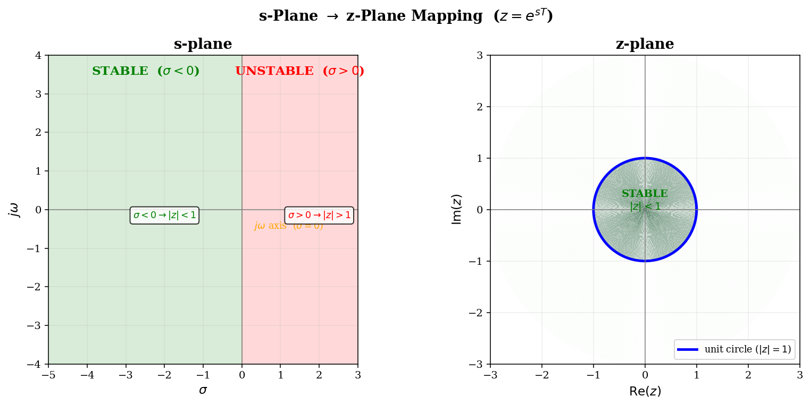

$z = e^{sT} = e^{(\sigma + j\omega)T}$，令 $z = r e^{j\theta}$：

| s 平面 | z 平面 | 物理含义 |
| :--- | :--- | :--- |
| $\sigma < 0$（左半平面） | $r < 1$（单位圆内） | 衰减 ↔ 稳定 |
| $\sigma = 0$（虚轴） | $r = 1$（单位圆上） | 等幅 ↔ 临界 |
| $\sigma > 0$（右半平面） | $r > 1$（单位圆外） | 增长 ↔ 不稳定 |

### 8.5.2 极点分布决定 $h(n)$ 模式

| 极点位置 | $h(n)$ 行为 |
| :--- | :--- |
| 单位圆内 | 衰减 → 0（稳定） |
| 单位圆上单阶 | 等幅（临界稳定） |
| 单位圆上重极点 / 圆外 | 发散（不稳定） |

### 8.5.3 因果系统的稳定性判据

**因果稳定系统的充要条件**：$H(z)$ 的所有极点全部位于**单位圆内**（$|p_i| < 1$）。

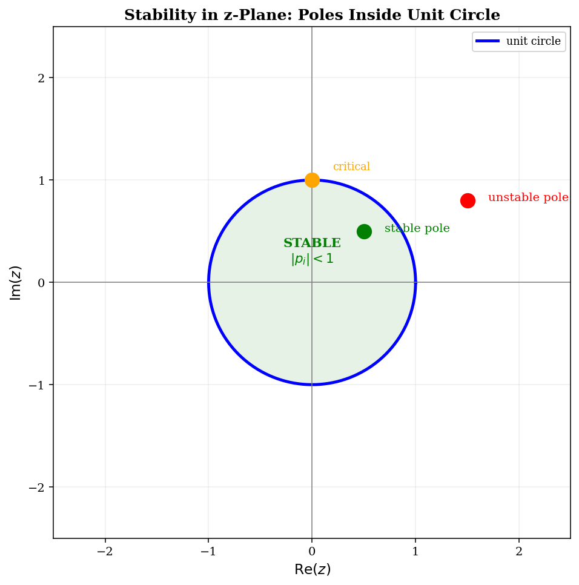

对应时域：$\sum_{n=0}^{\infty} |h(n)| < \infty$（绝对可和）。

### 8.5.3+ 二阶系统的稳定性代数判据

对于二阶离散系统，稳定性条件 $|p_i| < 1$ 可以转化为分母系数的**代数不等式**，无需直接求解极点。

---

**问题设定**：设因果二阶系统的系统函数为

$$
H(z) = \frac{z}{z^2 + a_1 z + a_0}
$$

分母多项式 $D(z) = z^2 + a_1 z + a_0$ 的两个根为 $z_1, z_2$（即系统极点）。

稳定性要求：

$$
|z_1| < 1 \quad \text{且} \quad |z_2| < 1
$$

**目标**：将这一条件用系数 $a_0, a_1$ 直接表达。

---

**韦达（Vieta）关系**：

$$
z_1 + z_2 = -a_1, \qquad z_1 z_2 = a_0
$$

---

**Jury 稳定性判据（二阶特例）**：

二阶多项式的稳定性充要条件为：

$$
\boxed{|a_0| < 1, \qquad |a_1| < a_0 + 1}
$$

---

**证明**：

**(1) 必要性**：若 $|z_1| < 1$ 且 $|z_2| < 1$

- $|a_0| = |z_1 z_2| = |z_1| \cdot |z_2| < 1 \cdot 1 = 1$ ✓
- 构造 $D(1) = 1 + a_1 + a_0 = 1 + a_0 + a_1 = (1 - z_1)(1 - z_2)$

  由于 $|z_1|<1,\,|z_2|<1$，有 $(1 - z_1)(1 - z_2) > 0 \;\Rightarrow\; 1 + a_0 + a_1 > 0 \;\Rightarrow\; a_1 > -(a_0 + 1)$
- 构造 $D(-1) = 1 - a_1 + a_0 = (1 + z_1)(1 + z_2)$

  同理 $(1 + z_1)(1 + z_2) > 0 \;\Rightarrow\; 1 + a_0 - a_1 > 0 \;\Rightarrow\; a_1 < a_0 + 1$
- 综上：$|a_1| < a_0 + 1$ ✓

**(2) 充分性**：若 $|a_0|<1$ 且 $|a_1|<a_0+1$

分两种情况讨论：

**情况 1：极点 $z_1, z_2$ 为实数**

由 $|a_0| = |z_1 z_2| < 1$。利用 $D(z) = (z - z_1)(z - z_2) = z^2 - (z_1+z_2)z + z_1 z_2$，得 $a_1 = -(z_1 + z_2)$，$a_0 = z_1 z_2$。

由 $D(1) > 0$ 和 $D(-1) > 0$（即 $|a_1| < a_0 + 1$），加上 $|a_0| < 1$：
- $D(1) > 0 \Rightarrow (1-z_1)(1-z_2) > 0$：两极点要么都大于 1，要么都小于 1
- $D(-1) > 0 \Rightarrow (1+z_1)(1+z_2) > 0$：两极点要么都大于 -1，要么都小于 -1
- $|a_0| < 1 \Rightarrow |z_1 z_2| < 1$：排除了都大于 1 和都小于 -1 的可能

故必有 $-1 < z_{1,2} < 1$，即 $|z_{1,2}| < 1$。

**情况 2：极点 $z_1 = \bar{z}_2 = re^{j\theta}$（共轭复根）**

此时 $a_0 = z_1 z_2 = r^2$，$|a_0| < 1 \Rightarrow r^2 < 1 \Rightarrow r < 1$，直接得稳定性。

---

**几何意义**：在 $(a_0, a_1)$ 参数平面上，稳定区域是一个**三角形**：

| 边界 | 不等式 |
| :--- | :--- |
| 下边界 | $a_0 > -1$ |
| 上边界 | $a_0 < 1$ |
| 左边界 | $a_1 > -(a_0 + 1)$ |
| 右边界 | $a_1 < a_0 + 1$ |

三角形顶点：$(-1, 0)$、$(1, 2)$、$(1, -2)$

![二阶离散系统稳定三角形区域示意]

> **实用结论**：判断二阶离散系统是否稳定，只需验证 $|a_0|<1$ 和 $|a_1|<a_0+1$ 两个不等式，无需计算极点。

### 8.5.4 连续与离散系统函数对照

| | 连续系统 | 离散系统 |
| :--- | :--- | :--- |
| 系统函数 | $H(s)$ | $H(z)$ |
| 冲激/样值响应 | $h(t) = \mathcal{L}^{-1}\{H(s)\}$ | $h(n) = \mathcal{Z}^{-1}\{H(z)\}$ |
| 频响 | $H(j\omega) = H(s)\vert_{s=j\omega}$ | $H(e^{j\omega}) = H(z)\vert_{z=e^{j\omega}}$ |
| 稳定条件 | 极点在**左半平面** | 极点在**单位圆内** |

---

## 8.6 序列的傅里叶变换（DTFT）

### 8.6.1 定义

在 $H(z)$ 中令 $z = e^{j\omega}$（单位圆上取值），即得序列的傅里叶变换：

$$
\boxed{X(e^{j\omega}) = \sum_{n=-\infty}^{\infty} x(n) e^{-j\omega n}}
$$

逆变换：

$$
\boxed{x(n) = \frac{1}{2\pi} \int_{-\pi}^{\pi} X(e^{j\omega}) e^{j\omega n} d\omega}
$$

### 8.6.2 DTFT 的特点

| 特点 | 说明 |
| :--- | :--- |
| $X(e^{j\omega})$ 是 $\omega$ 的**连续函数** | 离散时间 → 连续频谱 |
| $X(e^{j\omega})$ 以 $2\pi$ 为**周期** | $e^{-j\omega n}$ 的周期性 |
| 幅度谱以 $\omega = \pi$ 为对称轴 | 实序列的共轭对称性 |

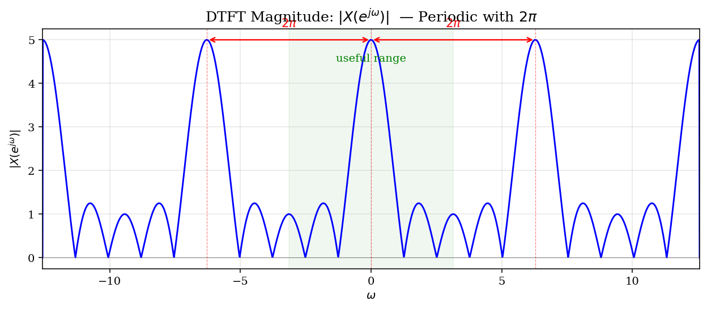

> 结论：**离散序列的频谱是连续的、周期的**。

### 8.6.3 傅里叶变换的四种形式

| 时域信号 | 频谱 | 变换名称 |
| :--- | :--- | :--- |
| 非周期连续 | 连续频谱 | 傅里叶变换（FT） |
| 周期连续 | 离散频谱 | 傅里叶级数（FS） |
| **非周期离散** | **周期连续频谱** | **序列的傅里叶变换（DTFT）** |
| 周期离散 | 周期离散频谱 | 离散傅里叶变换（DFT） |

### 8.6.4 离散系统的频率响应

系统频率响应 = 单位样值响应的 DTFT：

$$
H(e^{j\omega}) = \sum_{n=-\infty}^{\infty} h(n) e^{-j\omega n} = \frac{Y(e^{j\omega})}{X(e^{j\omega})}
$$

$H(e^{j\omega})$ 以 $2\pi$ 为周期。幅频 $|H(e^{j\omega})|$ 决定滤波特性。

**几何确定法**（与 s 域向量法对偶）：

$$
H(e^{j\omega}) = \frac{\prod (e^{j\omega} - z_r)}{\prod (e^{j\omega} - p_k)} = |H| e^{j\phi}
$$

- $z=0$ 处的零极点不影响幅频，只影响相位
- $e^{j\omega}$ 靠近极点 → 幅频出现峰值；靠近零点 → 谷值
- 极点越靠近单位圆，峰值越尖锐

**没有零点或没有极点的退化情况**：

| 情况 | $H(z)$ | $\vert H(e^{j\omega})\vert$ |
| :--- | :--- | :--- |
| **无零点**（全极点系统，如 IIR） | $H(z) = \frac{H_0}{\prod (z - p_k)}$ | $= \frac{H_0}{\prod A_i}$，仅由极点矢量模决定 |
| **无极点**（全零点系统，即 FIR） | $H(z) = H_0 \prod (z - z_r)$ | $= H_0 \prod B_i$，仅由零点矢量模决定 |
| 两者均无 | $H(z) = H_0$ | $= H_0$（常数，全通） |

> 退化时几何公式同样适用：缺零点的分子视为 $H_0$（乘积退化为常数），缺极点的分母视为 $1$。

### 8.6.5 FIR滤波器的频响设计实例

FIR（Finite Impulse Response，有限冲激响应）滤波器的系统函数仅含零点，不含非零极点（除 $z=0$ 外），设计自由度高且天然稳定。本节通过一个具体设计例，展示如何从频域约束直接确定滤波器的系数。

---

**设计规格**：设计一个 4 抽头（4-tap）FIR 滤波器

$$
y(n) = a_0 x(n) + a_1 x(n-1) + a_2 x(n-2) + a_3 x(n-3)
$$

满足以下频域约束：

| $\omega$ | 要求 | 含义 |
| :--- | :--- | :--- |
| $\omega = 0$ | $H(e^{j\omega}) = 1$ | 直流全通（DC gain = 1） |
| $\omega = \pi/2$ | $H(e^{j\omega}) = 0$ | 抑制 $\pi/2$ 频率分量 |
| $\omega = \pi$ | $H(e^{j\omega}) = 0$ | 抑制最高频率分量（低通特性） |

---

**第 1 步：写出系统函数与频率响应**

系统函数：

$$
H(z) = a_0 + a_1 z^{-1} + a_2 z^{-2} + a_3 z^{-3}
$$

频率响应（令 $z = e^{j\omega}$）：

$$
H(e^{j\omega}) = a_0 + a_1 e^{-j\omega} + a_2 e^{-2j\omega} + a_3 e^{-3j\omega}
$$

---

**第 2 步：代入约束条件建立方程**

**(i) $\omega = 0$**：$e^{-j0} = 1$

$$
H(e^{j0}) = a_0 + a_1 + a_2 + a_3 = 1 \tag{1}
$$

**(ii) $\omega = \pi/2$**：$e^{-j\pi/2} = -j$，$e^{-j\pi} = -1$，$e^{-j3\pi/2} = j$

$$
\begin{aligned}
H(e^{j\pi/2}) &= a_0 + a_1(-j) + a_2(-1) + a_3(j) \\
&= (a_0 - a_2) + j(a_3 - a_1) = 0
\end{aligned}
$$

实部和虚部须同时为 0：

$$
a_0 = a_2 \tag{2}, \qquad a_1 = a_3 \tag{3}
$$

**(iii) $\omega = \pi$**：$e^{-j\pi} = -1$，$e^{-j2\pi} = 1$，$e^{-j3\pi} = -1$

$$
\begin{aligned}
H(e^{j\pi}) &= a_0 + a_1(-1) + a_2(1) + a_3(-1) \\
&= a_0 - a_1 + a_2 - a_3 = 0
\end{aligned}
$$

代入 (2) 和 (3)：

$$
a_0 - a_1 + a_0 - a_1 = 2(a_0 - a_1) = 0 \quad\Rightarrow\quad a_0 = a_1 \tag{4}
$$

---

**第 3 步：求解系数**

由 (2)(3)(4)：$a_0 = a_1 = a_2 = a_3$

代入 (1)：$4a_0 = 1 \quad\Rightarrow\quad a_0 = \dfrac{1}{4}$

$$
\boxed{a_0 = a_1 = a_2 = a_3 = \frac{1}{4}}
$$

即：

$$
\boxed{y(n) = \frac{1}{4}\big[x(n) + x(n-1) + x(n-2) + x(n-3)\big]}
$$

这是一个**四点滑动平均滤波器**（4-point moving average）。

---

**第 4 步：频率响应的化简**

$$
\begin{aligned}
H(e^{j\omega}) &= \frac{1}{4}\big(1 + e^{-j\omega} + e^{-2j\omega} + e^{-3j\omega}\big) \\[4pt]
&= \frac{1}{4} e^{-j\frac{3\omega}{2}} \big(e^{j\frac{3\omega}{2}} + e^{j\frac{\omega}{2}} + e^{-j\frac{\omega}{2}} + e^{-j\frac{3\omega}{2}}\big) \\[4pt]
&= \frac{1}{4} e^{-j\frac{3\omega}{2}} \cdot 2\big(\cos\tfrac{3\omega}{2} + \cos\tfrac{\omega}{2}\big) \\[4pt]
&= \frac{1}{2} e^{-j\frac{3\omega}{2}} \cdot 2\cos\omega \cos\frac{\omega}{2} \quad (\text{和差化积})\\[4pt]
&= e^{-j\frac{3\omega}{2}} \cdot \cos\omega \cdot \cos\frac{\omega}{2}
\end{aligned}
$$

---

**第 5 步：幅频与相频特性**

幅频响应：

$$
\boxed{|H(e^{j\omega})| = |\cos\omega \cdot \cos\tfrac{\omega}{2}|}
$$

相频响应：$\varphi(\omega) = -\dfrac{3\omega}{2}$（线性相位，FIR 滤波器的典型优势）

---

**幅频特性分析**：

| $\omega$ | $\cos\omega$ | $\cos(\omega/2)$ | $|H|$ |
| :--- | :--- | :--- | :--- |
| $0$ | $1$ | $1$ | $1$（全通） |
| $\pi/2$ | $0$ | $\sqrt{2}/2$ | $0$（零点） |
| $\pi$ | $-1$ | $0$ | $0$（零点） |
| $2\pi/3$ | $-1/2$ | $1/2$ | $1/4$ |

滤波器呈现**低通**特性：直流无衰减，$\pi/2$ 和 $\pi$ 处完全抑制。

---

> **设计启示**：4 个未知系数 $a_0\sim a_3$，3 个频域约束（$\omega=0,\pi/2,\pi$），得到唯一的对称解。增加抽头数可提供更多自由度，实现更陡峭的过渡带。对称系数（$a_0=a_3$，$a_1=a_2$）是线性相位 FIR 的典型特征。

---

### 本章小结

| 知识板块 | 核心要点 |
| :--- | :--- |
| **Z 变换定义** | $X(z) = \sum x(n)z^{-n}$，由抽样信号 LT 导出；$z = e^{sT}$ |
| **ROC** | 有限/右边（圆外）/左边（圆内）/双边（环状）；ROC 决定唯一原序列 |
| **单边 ZT** | 默认工程使用；7 对常用变换 + 7 条性质（时移自动引入初值） |
| **逆 ZT** | 部分分式法（先对 $X(z)/z$ 展开）+ 留数法 + 长除法 |
| **求解差分方程** | ZT → 代数方程 → $Y(z)$ → 逆 ZT；初始条件自动代入 |
| **$H(z)$ 与稳定性** | $H(z) = R_{zs}/E$；极点全在单位圆内 ⇔ 因果稳定 |
| **DTFT** | $X(e^{j\omega})$ 是单位圆上的 ZT；周期 $2\pi$；连续频谱 |

---

# 附录：作业题及解析

1.1.1 判断下述信号是否周期信号，并求出其中周期信号的基本周期：

(a) $x_{1}(t) = 10\cos(5\pi t)$

(b) $x_{2}(t)=10\cos(5\pi t)+2\sin(7t)$

(c) $x_{3}(t)=10\cos(5\pi t)+2\sin(7\pi t)+3\cos(6.5\pi t)$

**1.1.1 解**

(a) $x_{1}(t)$ 是余弦信号，是周期信号，基本周期 $T = \frac{2\pi}{5\pi} = 0.4$ 。

(b) $10\cos (5\pi t)$ 的周期 $T_{1} = \frac{2\pi}{5\pi} = 0.4$ ， $2\sin (7t)$ 的周期 $T_{2} = \frac{2\pi}{7}$

由于 $T_{1}$ 是有理数， $T_{2}$ 是无理数， $T_{1}$ 与 $T_{2}$ 的最小公共倍数不存在，故 $x_{2}(t)$ 不是周期信号。

(c) $10\cos (5\pi t)$ 的周期 $T_{1} = \frac{2\pi}{5\pi} = 0.4$ ， $2\sin (7\pi t)$ 的周期 $T_{2} = \frac{2\pi}{7\pi} = \frac{2}{7}$ ， $3\cos (6.5\pi t)$ 的周期 $T_{3} = \frac{2\pi}{6.5\pi} = \frac{4}{13}$ 。

由于 $T_{1},T_{2},T_{3}$ 均为有理数，一定存在公共倍数，故 $x_{3}(t)$ 是周期信号，基本周期是 $T_{1},T_{2},T_{3}$ 的最小公共倍数，即T=4。
1.1.2 求出如下信号的功率与能量，并判断是否能量信号，是否功率信号：

(a) $x_{1}(t) = 2u(t)$ ，其中 $u(t) = \left\{ \begin{array}{ll}1, & t\geq 0\\ 0, & t <   0 \end{array} \right.$

(b) $x_{2}(t) = 3\Pi \left(\frac{t - 1}{2}\right)$ ，其中 $\Pi (t) = \left\{ \begin{array}{ll}1, & |t|\leq \frac{1}{2}\\ 0, & \text{其它} \end{array} \right.$

(c) $x_{3}(t)=3\Pi(\frac{3-2t}{4})$

(d) $x_{4}(t) = \cos(2\pi t)$

(e) $x_{5}(t) = \cos(2\pi t)u(t)$

(f) $x_{6}(t)=cos^{2}(2\pi t)+sin^{2}(2\pi t)$


**1.1.2 解**

(a) $x_{1}(t) = 2u(t) = \left\{ \begin{array}{ll}2,t\geq 0\\ 0,t <   0 \end{array} \right.$

能量 $E=\int_{-\infty}^{\infty}|x_{1}(t)|^{2}dt=\int_{0}^{\infty}4dt=\infty$

平均功率 $P = \lim_{T\to \infty}\frac{1}{2T}\int_{-T}^{T}|x_1(t)|^2 dt = \lim_{T\to \infty}\frac{1}{2T}\int_0^T 4dt = 2$

$x_{1}(t)$ 不是能量信号，是功率信号。

(b) $x_{2}(t) = 3\Pi \left(\frac{t - 1}{2}\right) = \left\{ \begin{array}{l}3,0\leq t\leq 2\\ 0,\text{其它} \end{array} \right.$

能量 $E = \int_0^2 |x_2(t)|^2 dt = \int_0^2 3^2 dt = 18$

平均功率 $P = \lim_{T\to \infty}\frac{1}{2T}\int_0^2 |x_2(t)|^2 dt = \lim_{T\to \infty}\frac{1}{2T}\int_0^2 9dt = 0$

$x_{2}(t)$ 是能量信号，不是功率信号。

(c) $x_{3}(t) = 3\Pi \left(\frac{3 - 2t}{4}\right) = \left\{ \begin{array}{ll}3, & \frac{1}{2}\leq t\leq \frac{5}{2}\\ 0, & \text{其它} \end{array} \right.$ 能量 $E = \int_{\frac{1}{2}}^{\frac{5}{2}}3^{2}dt = 18$ 平均功率 $P = \lim_{T\to \infty}\frac{1}{2T}\int_{\frac{1}{2}}^{\frac{5}{2}}3^{2}dt = 0$ $x_{3}(t)$ 是能量信号，不是功率信号。

(d) 能量 $E = \int_{-\infty}^{\infty} \cos^{2}(2\pi t) dt = \infty$

平均功率 $P = \lim_{T\to \infty}\frac{1}{2T}\int_{-T}^{T}\cos^2 (2\pi t)dt = \lim_{T\to \infty}\frac{1}{2T}\int_{-T}^{T}\frac{1 + \cos(4\pi t)}{2} dt = \frac{1}{2}$

$x_{4}(t)$ 不是能量信号，是功率信号。

(e) 能量 $E = \int_{0}^{\infty} \cos^{2}(2\pi t) dt = \infty$

平均功率 $P = \lim_{T\to \infty}\frac{1}{2T}\int_0^T\cos^2 (2\pi t)dt = \frac{1}{4}$

$x_{5}(t)$ 不是能量信号，是功率信号。

(f) $x_{6}(t)=cos^{2}(2\pi t)+sin^{2}(2\pi t)=1$

能量 $E = \int_{-\infty}^{\infty}1dt = \infty$

平均功率 $P = \lim_{T\to \infty}\frac{1}{2T}\int_{-T}^{T}1dt = 1$

$x_{6}(t)$ 不是能量信号，是功率信号。

1.2.1 计算如下积分值:

(a) $I_{1} = \int_{-10}^{10} u(t) dt$

(b) $I_{2}=\int_{-10}^{10}\delta(t-1)u(t)dt$

(c) $I_{3} = \int_{-10}^{10} \delta(t + 1) u(t) dt$

**1.2.1 解**

$$
\mathrm{(a)} I _ {1} = \int_ {- 1 0} ^ {1 0} u (t) d t = \int_ {0} ^ {1 0} 1 d t = 1 0
$$

$$
\mathrm{(b)} I _ {2} = \int_ {- 1 0} ^ {1 0} \delta (t - 1) u (t) d t = \int_ {- 1 0} ^ {1 0} \delta (t - 1) u (1) d t = u (1) = 1
$$

$$
\mathrm{(c)} I _ {3} = \int_ {- 1 0} ^ {1 0} \delta (t + 1) u (t) d t = \int_ {- 1 0} ^ {1 0} \delta (t + 1) u (-1) d t = u (-1) = 0
$$

1.2.2 电容 $C_1$ 与 $C_2$ 串联，以一个电压源 $e(t)$ 作为激励串联接入，试分别写出回路中的电流 $i(t)$ 、每个电容两端电压 $v_{C_1}(t)$ 、 $v_{C_2}(t)$ 与激励电压源 $e(t)$ 间的关系式，并判别该系统的线性、时不变性和因果性（给出具体判别过程）。当 $e(t) = Eu(t)$ 时，计算 $i(t)$ 、 $v_{C_1}(t)$ 、 $v_{C_2}(t)$ 。

**1.2.2 解**


由基尔霍夫电压定律(KVL): $v_{C_1}(t) + v_{C_2}(t) = e(t)$

由电容的伏安特性： $i(t) = C_1\frac{dv_{C_1}(t)}{dt} = C_2\frac{dv_{C_2}(t)}{dt}$

对 KVL 等式两侧求导，得 $\frac{i(t)}{C_{1}} + \frac{i(t)}{C_{2}} = \frac{de(t)}{dt}$ ，即 $i(t) = \frac{C_{1}C_{2}}{C_{1} + C_{2}} \cdot \frac{de(t)}{dt}$

$$
v _ {C _ {1}} (t) = \frac {1}{C _ {1}} \int_ {- \infty} ^ {t} i (\tau) d \tau = \frac {C _ {2}}{C _ {1} + C _ {2}} e (t)
$$

$$
v _ {C _ {2}} (t) = \frac {1}{C _ {2}} \int_ {- \infty} ^ {t} i (\tau) d \tau = \frac {C _ {1}}{C _ {1} + C _ {2}} e (t)
$$

$v_{C_1}(t)$ 和 $v_{C_2}(t)$ 与 $e(t)$ 成正比，具有均匀性和叠加性。

设 $e(t)=ae_{1}(t)+be_{2}(t)$ ，则

$$
i (t) = \frac {C _ {1} C _ {2}}{C _ {1} + C _ {2}} \cdot \frac {d e (t)}{d t} = \frac {a C _ {1} C _ {2}}{C _ {1} + C _ {2}} \cdot \frac {d e _ {1} (t)}{d t} + \frac {b C _ {1} C _ {2}}{C _ {1} + C _ {2}} \cdot \frac {d e _ {2} (t)}{d t} = a i _ {1} (t) + b i _ {2} (t)
$$

故该系统是线性的。

$$
v _ {C _ {1}} (t - t _ {0}) = \frac {C _ {2}}{C _ {1} + C _ {2}} e (t - t _ {0})
$$

$$
v _ {C _ {2}} (t - t _ {0}) = \frac {C _ {1}}{C _ {1} + C _ {2}} e (t - t _ {0})
$$

$$
i (t - t _ {0}) = \frac {C _ {1} C _ {2}}{C _ {1} + C _ {2}} \cdot \frac {d e (t - t _ {0})}{d t}
$$

故该系统是时不变的。

若 $e(t)$ 在 $t_1$ 时刻出现非零值，则 $v_{C_1}(t), v_{C_2}(t)$ 也在 $t_1$ 时刻出现非零值， $i(t)$ 由 $\frac{de(t)}{dt}$ 决定，不会在 $t_1$ 时刻前出现非零值。

故该系统是因果的。

当 $e(t)=Eu(t)$ 时，

$$
i (t) = \frac {C _ {1} C _ {2}}{C _ {1} + C _ {2}} \cdot \frac {d e (t)}{d t} = \frac {C _ {1} C _ {2} E}{C _ {1} + C _ {2}} \delta (t)
$$

$$
v _ {C _ {1}} (t) = \frac {C _ {2}}{C _ {1} + C _ {2}} E u (t)
$$

$$
v _ {C _ {2}} (t) = \frac {C _ {1}}{C _ {1} + C _ {2}} E u (t)
$$

2.1.1 分别求取下列微分方程所描述系统的单位冲激响应 $h(t)$ 。

$$
(a) \frac {d}{d t} r (t) + 4 r (t) = e (t)
$$

$$
(\mathsf {b}) 2 \frac {d}{d t} r (t) + 6 r (t) = e (t)
$$

$$
\mathrm{(c)} \frac {d ^ {3}}{d t ^ {3}} r (t) + \frac {d ^ {2}}{d t ^ {2}} r (t) + 2 \frac {d}{d t} r (t) + 2 r (t) = \frac {d}{d t} e (t) + 2 e (t)
$$


**2.1.1 解**


(a) 特征方程为 $\lambda + 4 = 0$ ，即 $\lambda = -4$ 。

设 $h(t)=Ae^{-4t}u(t)$ ，令 $e(t)=\delta(t)$ ，代入原微分方程，则：

$$
-4 A e ^ {- 4 t} u (t) + A \delta (t) + 4 A e ^ {- 4 t} u (t) = \delta (t)
$$

解得A=1，故 $h(t)=e^{-4t}u(t)$ 。

(b) 特征方程为 $2\lambda + 6 = 0$ ，即 $\lambda = -3$ 。

设 $h(t)=Ae^{-3t}u(t)$ ，令 $e(t)=\delta(t)$ ，代入原微分方程，则：

$$
-6 A e ^ {- 3 t} u (t) + 2 A \delta (t) + 6 A e ^ {- 3 t} u (t) = \delta (t)
$$

解得 $A = \frac{1}{2}$ ，故 $h(t) = \frac{1}{2} e^{-3t}u(t)$

(c) 特征方程为 $\lambda^3 + \lambda^2 + 2\lambda + 2 = 0$ ，即 $(\lambda + 1)(\lambda^2 + 2) = 0$ 。

解得 $\lambda_1 = -1, \lambda_2 = j\sqrt{2}, \lambda_3 = -j\sqrt{2}$

设 $h(t)=[Ae^{-t}+Bcos(\sqrt{2}t)+Csin(\sqrt{2}t)]u(t)$ ，令 $e(t)=\delta(t)$ ，代入原微分

方程，比较系数得： $\left\{ \begin{array}{c}A + B = 0\\ -A + \sqrt{2} C + A + B = 1\\ A - 2B - A + \sqrt{2} C + 2A + 2B = 2 \end{array} \right.$

解得 $A = \frac{1}{3}, B = -\frac{1}{3}, C = \frac{2\sqrt{2}}{3}$ ，故 $h(t) = [\frac{1}{3} e^{-t} - \frac{1}{3} cos(\sqrt{2} t) + \frac{2\sqrt{2}}{3} sin(\sqrt{2} t)]u(t)$

### 第 3 周第一次作业

题 3-1.1：下图所示电路的起始状态为零，求下列两种情况下流过 AB 的电流 $i(t)$ 。

(1) 激励为电流源 $i_{S}(t)=u(t)\mathrm{A}$ ;

(2) 激励为电压源 $u_{S}(t)=u(t)\mathrm{V}$ 。

  
图 1

3-1.1(1)设左侧支路电容两端的电压为 $u_{1}$ ，极性上正下负，则右侧支路电阻两端电压也为 $u_{1}$ ；左侧支路电阻两端的电压为 $u_{2}$ ，极性上正下负，则右侧支路电容两端电压也为 $u_{2}$ 。

根据 KCL 与元件的伏安特性:

$$
\left\{ \begin{array}{l} C \frac {d u _ {1} (t)}{d t} + \frac {u _ {1} (t)}{R} = i _ {s} (t) \\ \frac {u _ {2} (t)}{R} + C \frac {d u _ {2} (t)}{d t} = i _ {s} (t) \end{array} \right.
$$

特征方程为 $C\lambda+\frac{1}{R}=0$ ，即 $\lambda=-\frac{1}{RC}$

设 $h(t)=Ae^{-\frac{t}{RC}}u(t)$ ，令 $i_{s}(t)=\delta(t)$ ，代入原方程得：

$$
C \cdot (- \frac {1}{R C}) A e ^ {- \frac {t}{R C}} u (t) + C A \delta (t) + \frac {1}{R} A e ^ {- \frac {t}{R C}} u (t) = \delta (t)
$$

解得 $A = \frac{1}{C},\quad h(t) = \frac{1}{C} e^{-\frac{t}{RC}}u(t)$

$$
\begin{array}{r l} & u _ {1} (t) = u _ {2} (t) = h (t) * i _ {s} (t) = \int_ {- \infty} ^ {\infty} h (\tau) u (t - \tau) d \tau = \frac {1}{C} \int_ {0} ^ {t} e ^ {- \frac {\tau}{R C}} d \tau \\ & \qquad = R (1 - e ^ {- \frac {t}{R C}}) u (t) \end{array}
$$

A 点的 KCL: $C \frac{du_{1}(t)}{dt} = i(t) + \frac{u_{2}(t)}{R}$

$$
i (t) = C \frac {d u _ {1} (t)}{d t} - \frac {u _ {2} (t)}{R} = (e ^ {- \frac {t}{R C}} - 1 + e ^ {- \frac {t}{R C}}) u (t) = (2 e ^ {- \frac {t}{R C}} - 1) u (t)
$$

(2) B 点的 KCL: $C \frac{du_{2}(t)}{dt} = i(t) + \frac{u_{1}(t)}{R}$

整个电路的 KVL: $u_{1}(t) + u_{2}(t) = u_{s}(t)$

联立 A、B 点 KCL:

$$
\begin{array}{c} {2 i (t) = C \frac {d u _ {1} (t)}{d t} + C \frac {d u _ {2} (t)}{d t} - \frac {u _ {1} (t)}{R} - \frac {u _ {2} (t)}{R} = C \frac {d u _ {s} (t)}{d t} - \frac {u _ {s} (t)}{R}} \\ {i (t) = \frac {C}{2} \cdot \frac {d u (t)}{d t} - \frac {u (t)}{2 R} = \frac {C}{2} \delta (t) - \frac {1}{2 R} u (t)} \end{array}
$$

### 第 3 周第二次作业

题 3-2.1：利用周期矩形脉冲信号的傅里叶级数展开式与三角波信号的傅里叶级数展开式，求出下列级数的和：

(1) $1 - \frac{1}{3} + \frac{1}{5} - \frac{1}{7} + \cdots;$

(2) $1 + \frac{1}{9} +\frac{1}{25} +\frac{1}{49} +\dots 。$

3-2.1(1)设周期为 $2\pi$ 的矩形脉冲信号在 $[0,2\pi]$ 上的表达式 $f(t) = \left\{ \begin{array}{l} 1,0\leq t < \pi \\ -1,\pi \leq t\leq 2\pi \end{array} \right.$

$$
a _ {0} = \frac {2}{2 \pi} \int_ {0} ^ {2 \pi} f (t) d t = 0
$$

$$
a _ {n} = \frac {2}{2 \pi} \int_ {0} ^ {2 \pi} f (t) c o s (n t) d t = 0
$$

$$
\begin{array}{r l} & {b _ {n} = \frac {2}{2 \pi} \int_ {0} ^ {2 \pi} f (t) \sin (n t) d t = \frac {1}{\pi} \left[ \int_ {0} ^ {\pi} \sin (n t) d t - \int_ {\pi} ^ {2 \pi} \sin (n t) d t \right]} \\ & {\qquad = \frac {1}{\pi} \left[ \frac {1 - \cos (n \pi)}{n} - \left(- \frac {1}{n} + \frac {\cos (n \pi)}{n}\right) \right]} \\ & {\qquad = \left\{ \begin{array}{l l} {\frac {4}{n \pi},} & {n \text {为奇数}} \\ {0,} & {n \text {为偶数}} \end{array} \right.} \end{array}
$$

故该矩形脉冲信号可展开为:

$$
f (t) = \frac {4}{\pi} (s i n t + \frac {1}{3} s i n 3 t + \frac {1}{5} s i n 5 t + \frac {1}{7} s i n 7 t + \dots)
$$

取 $t=\frac{\pi}{2}$ ，则

$$
\begin{array}{c} {f (\frac {\pi}{2}) = \frac {4}{\pi} (1 - \frac {1}{3} + \frac {1}{5} - \frac {1}{7} + \dots) = 1} \\ {1 - \frac {1}{3} + \frac {1}{5} - \frac {1}{7} + \dots = \frac {\pi}{4}} \end{array}
$$

(2)设周期为 $2\pi$ 的三角波信号在 $[- \pi, \pi]$ 上的表达式是 $f(t) = |t|, t \in [-\pi, \pi]$

$$
\begin{array}{r} {{a _ {0} = \frac {2}{2 \pi} \int_ {- \pi} ^ {\pi} f (t) d t = \frac {2}{\pi} \int_ {0} ^ {\pi} t d t = \pi}} \\ {{a _ {n} = \frac {2}{2 \pi} \int_ {- \pi} ^ {\pi} f (t) c o s (n t) d t = \frac {2}{\pi} \int_ {0} ^ {\pi} t c o s (n t) d t = \frac {2}{\pi} \cdot \frac {\cos (n \pi) - 1}{n ^ {2}}}} \\ {{= \left\{ \begin{array}{l l} {{- \frac {4}{n ^ {2} \pi},}} & {{n \text {为奇数}}} \\ {{0,}} & {{n \text {为偶数}}} \end{array} \right.}} \\ {{b _ {n} = \frac {2}{2 \pi} \int_ {- \pi} ^ {\pi} f (t) s i n (n t) d t = 0}} \end{array}
$$

故该三角波信号可展开为:

$$
f (t) = \frac {a _ {0}}{2} + \sum_ {n = 1} ^ {\infty} a _ {n} c o s (n t) = \frac {\pi}{2} - \frac {4}{\pi} (c o s t + \frac {c o s 3 t}{9} + \frac {c o s 5 t}{2 5} + \frac {c o s 7 t}{4 9} + \dots)
$$

取 $t = 0$ ，则

$$
f (0) = \frac {\pi}{2} - \frac {4}{\pi} (1 + \frac {1}{9} + \frac {1}{2 5} + \frac {1}{4 9} + \dots) = 0
$$

$$
1 + \frac {1}{9} + \frac {1}{2 5} + \frac {1}{4 9} + \dots = \frac {\pi}{2} \cdot \frac {\pi}{4} = \frac {\pi^ {2}}{8}
$$

### 第 4 周第一次作业

题4-1.1：写出下图中所示三角脉冲信号 $f_{1}(t)$ 的时域表达式，并求其傅里叶变换，画出频谱图。当 $0 < \tau \leq 2$ 时，画出信号 $f_{2}(t) = \sum_{m=-\infty}^{\infty} f_{1}(t - 3m)$ 的时域波形，求其傅里叶级数，并画出频谱图。


**4-1.1 解**

$$
f _ {1} (t) = \left\{ \begin{array}{c} A - \frac {2 A}{\tau} | t |, | t | \leq \frac {\tau}{2} \\ 0, | t | > \frac {\tau}{2} \end{array} \right.
$$

$f_{1}(t)$ 的傅里叶变换

$$
\begin{array}{r l r} & & F _ {1} (j \omega) = \int_ {- \frac {\tau}{2}} ^ {\frac {\tau}{2}} f _ {1} (t) e ^ {- j \omega t} d t = \int_ {- \frac {\tau}{2}} ^ {0} (A + \frac {2 A t}{\tau}) e ^ {- j \omega t} d t + \int_ {0} ^ {\frac {\tau}{2}} (A - \frac {2 A t}{\tau}) e ^ {- j \omega t} d t \\ & & = (- \frac {A}{j \omega} e ^ {- j \omega t}) | _ {- \frac {\tau}{2}} ^ {0} + \frac {2 A}{\tau} (- \frac {t e ^ {- j \omega t}}{j \omega} + \frac {e ^ {- j \omega t}}{\omega^ {2}}) | _ {- \frac {\tau}{2}} ^ {0} + (- \frac {A}{j \omega} e ^ {- j \omega t}) | _ {0} ^ {\frac {\tau}{2}} - \frac {2 A}{\tau} (- \frac {t e ^ {- j \omega t}}{j \omega} + \frac {e ^ {- j \omega t}}{\omega^ {2}}) | _ {0} ^ {\frac {\tau}{2}} \\ & & = \frac {2 A}{\omega^ {2} \tau} (2 - e ^ {j \omega \frac {\tau}{2}} - e ^ {- j \omega \frac {\tau}{2}}) = \frac {4 A}{\omega^ {2} \tau} (1 - c o s \frac {\omega \tau}{2}) = \frac {8 A}{\omega^ {2} \tau} s i n ^ {2} \frac {\omega \tau}{4} = \frac {A \tau}{2} [ S a (\frac {\omega \tau}{4}) ] ^ {2} \end{array}
$$

幅度谱如下


相位 $\varphi_{1}(\omega) = 0$ ，相位谱如下


$f_{2}(t) = \sum_{m = -\infty}^{\infty}f_{1}(t - 3m)$ 的周期 $T = 3$ ，由于 $0 < \tau \leq 2 < 3$ ，故各周期波形无重叠，波形图如下


$$
F _ {n} = \frac {1}{3} \int_ {- \frac {3}{2}} ^ {\frac {3}{2}} f _ {2} (t) e ^ {- j n \omega_ {1} t} d t = \frac {1}{3} \int_ {- \frac {\tau}{2}} ^ {\frac {\tau}{2}} f _ {2} (t) e ^ {- j n \omega_ {1} t} d t = \frac {1}{3} F _ {1} (j n \omega_ {1})
$$

又

$$
F _ {1} (j \omega) = \frac {A \tau}{2} \Big [ S a (\frac {\omega \tau}{4}) \Big ] ^ {2}, \omega_ {1} = \frac {2 \pi}{T} = \frac {2 \pi}{3}
$$

得

$$
F _ {n} = \frac {A \tau}{6} \left[ S a (\frac {n \pi \tau}{6}) \right] ^ {2} \geq 0
$$

故 $f_{2}(t)$ 的傅里叶级数

$$
f _ {2} (t) = \sum_ {n = - \infty} ^ {\infty} \frac {A \tau}{6} \Big [ S a (\frac {n \pi \tau}{6}) \Big ] ^ {2} e ^ {j \frac {2 \pi}{3} n t}
$$

幅度谱如下

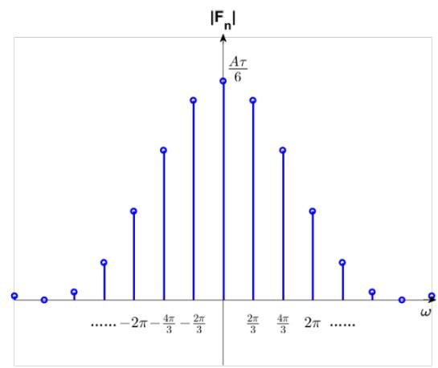

相位 $\varphi_{2}(\omega) = 0$ ，相位谱如下


### 第 4 周第二次作业

题 4-2.1：已知信号 $f(t) = e^{-at}u(t) - e^{at}u(-t)$ ，其中 $a > 0$ 。试求：

(a) $f(t)$ 的傅里叶变换，并画出频谱图。

(b) 利用 $f(t)$ 的傅里叶变换，求符号函数 $sgn(t) = \begin{cases} 1, & t \geq 0 \\ -1, & t < 0 \end{cases}$ 的傅里叶变换，并画出频谱图。

(c) 根据上面所得的结果，利用关系式 $u(t) = [sgn(t) + 1] / 2$ ，求出单位阶跃信号的傅里叶变换，并画出频谱图。

(d) 根据积分定理，利用单位冲激信号的傅里叶变换，求出单位阶跃信号的傅里叶变换。将所得结果与(c)的结果进行比较。

4-2.1(a) $f(t)$ 的傅里叶变换

$$
\begin{array}{r l r} & & F _ {1} (j \omega) = \int_ {- \infty} ^ {\infty} f (t) e ^ {- j \omega t} d t = \int_ {0} ^ {\infty} e ^ {- a t} e ^ {- j \omega t} d t - \int_ {- \infty} ^ {0} e ^ {a t} e ^ {- j \omega t} d t \\ & & = \frac {1}{a + j \omega} - \frac {1}{a - j \omega} = - \frac {2 j \omega}{a ^ {2} + \omega^ {2}} \\ & & | F _ {1} (j \omega) | = \frac {2 | \omega |}{a ^ {2} + \omega^ {2}} \end{array}
$$

幅度谱如下


$$
\varphi_ {1} (\omega) = \left\{ \begin{array}{l l} - \frac {\pi}{2}, \omega > 0 \\ \frac {\pi}{2}, \omega <   0 \end{array} \right.
$$

相位谱如下


(b)当 $a \to 0^{+}$ 时

$$
\lim _ {a \to 0 ^ {+}} f (t) = u (t) - u (- t) = s g n (t)
$$

则 $sgn(t)$ 的傅里叶变换

$$
F _ {2} (j \omega) = \lim _ {a \to 0 ^ {+}} F _ {1} (j \omega) = \lim _ {a \to 0 ^ {+}} (- \frac {2 j \omega}{a ^ {2} + \omega^ {2}}) = - \frac {2 j}{\omega} = \frac {2}{j \omega} (\omega \neq 0)
$$

需要注意，直接对 $F_{1}(j\omega)$ 取极限要求 $\omega \neq 0$ ，无法得到 $\omega = 0$ 处的结果。若已知 $u(t) \leftrightarrow \frac{1}{j\omega} + \pi \delta(\omega)$ ，可以求 $u(t) - u(-t)$ 的傅里叶变换避免此问题。

由傅里叶变换的尺度变换性质

$$
\begin{array}{c} {u (- t) \leftrightarrow - \frac {1}{j \omega} + \pi \delta (- \omega)} \\ {F _ {2} (j \omega) = \frac {1}{j \omega} + \pi \delta (\omega) - [ - \frac {1}{j \omega} + \pi \delta (- \omega) ] = \frac {2}{j \omega}} \\ {| F _ {2} (j \omega) | = \frac {2}{| \omega |}} \end{array}
$$

幅度谱如下

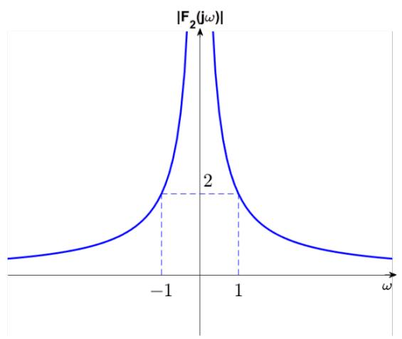

$$
\varphi_ {2} (\omega) = \left\{ \begin{array}{l} - \frac {\pi}{2}, \omega > 0 \\ \frac {\pi}{2}, \omega <   0 \end{array} \right.
$$

相位谱如下

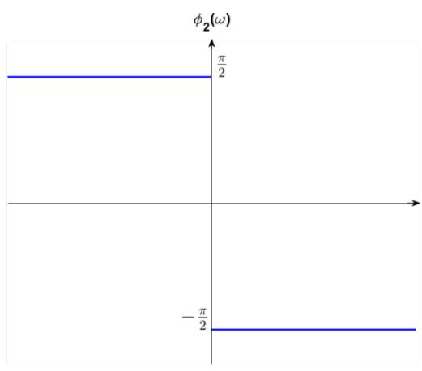

(c)对关系式两侧作傅里叶变换，得 $u(t)$ 的傅里叶变换

$$
\begin{array}{r l r} & & {F _ {3} (j \omega) = \frac {1}{2} \biggl [ \frac {2}{j \omega} + 2 \pi \delta (\omega) \biggr ] = \frac {1}{j \omega} + \pi \delta (\omega)} \\ & & {| F _ {3} (j \omega) | = \left\{ \begin{array}{l l} {\frac {1}{| \omega |}, \omega \neq 0} \\ {\pi \delta (\omega), \omega = 0} \end{array} \right.} \end{array}
$$

幅度谱如下

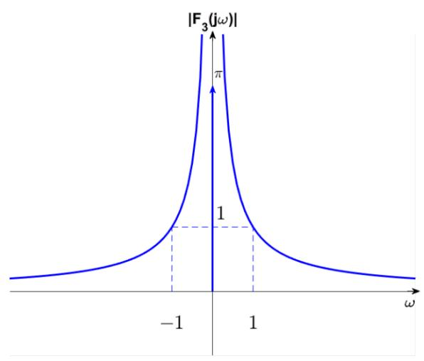

$$
\varphi_ {3} (\omega) = \left\{ \begin{array}{l l} - \frac {\pi}{2}, \omega > 0 \\ \frac {\pi}{2}, \omega <   0 \end{array} \right.
$$

相位谱如下

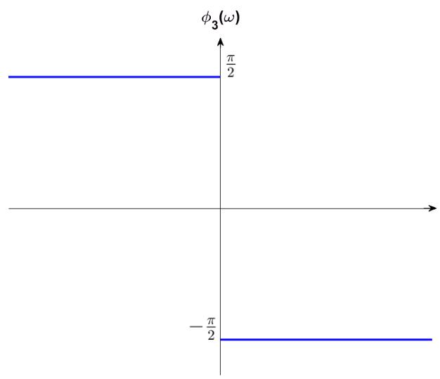

(d)单位冲激信号 $\delta(t)$ 的傅里叶变换

$$
F (j \omega) = 1
$$

根据积分定理

$$
u (t) = \int_ {- \infty} ^ {t} \delta (\tau) d \tau \leftrightarrow \pi \delta (\omega) F (0) + \frac {1}{j \omega} F (j \omega) = \pi \delta (\omega) + \frac {1}{j \omega}
$$

与(c)中结果一致

### 第 5 周第一次作业

题 5-1.1：分别求出下图(a)和(b)中所示电路的频响函数 $H_{a}(j\omega)$ 、 $H_{b}(j\omega)$ 和单位冲激响应 $h_{a}(t)$ 、 $h_{b}(t)$ 的表达式，绘出其幅频和相频响应曲线，并简要说明系统特性。其中，激励信号为 $e(t)$ ，响应为 $r(t)$ 。

  
(a)

  
(b)

5-1.1(a)设电路中电流为 $i(t)$ 。

根据 KCL 与元件的伏安特性

$$
\left\{ \begin{array}{l l} e (t) = R _ {1} i (t) + R _ {2} i (t) + L \frac {d i (t)}{d t} \\ r (t) = R _ {2} i (t) + L \frac {d i (t)}{d t} \end{array} \right.
$$

则有

$$
i (t) = \frac {e (t) - r (t)}{R _ {1}}
$$

代入 $e(t)$ 表达式，整理得系统微分方程

$$
L r ^ {\prime} (t) + (R _ {1} + R _ {2}) r (t) = L e ^ {\prime} (t) + R _ {2} e (t)
$$

电路频响函数

$$
H _ {a} (j \omega) = \frac {R _ {2} + j \omega L}{R _ {1} + R _ {2} + j \omega L}
$$

微分方程特征根

$$
\lambda_ {1} = - \frac {R _ {1} + R _ {2}}{L}
$$

设 $h_{a}(t)=A\delta(t)+Be^{\lambda_{1}t}u(t)$ ，令 $e(t)=\delta(t)$

代入微分方程，比较两侧系数，得：

$$
\left\{ \begin{array}{c} L A = L \\ L B + (R _ {1} + R _ {2}) A = R _ {2} \end{array} \right.
$$

解得

$$
\left\{ \begin{array}{l l} A = 1 \\ B = - \frac {R _ {1}}{L} \end{array} \right.
$$

$$
h _ {a} (t) = \delta (t) - \frac {R _ {1}}{L} e ^ {- \frac {R _ {1} + R _ {2}}{L} t} u (t)
$$

$$
| H _ {a} (j \omega) | = \sqrt {\frac {R _ {2} ^ {2} + \omega^ {2} L ^ {2}}{(R _ {1} + R _ {2}) ^ {2} + \omega^ {2} L ^ {2}}}
$$

幅频响应曲线如下图:


$$
\varphi_ {a} (\omega) = a r c t a n (\frac {\omega L}{R _ {2}}) - a r c t a n (\frac {\omega L}{R _ {1} + R _ {2}})
$$

相频响应曲线如下图:


该系统特性是低频衰减，高频不衰减，相位超前。

(b)设电感电流为 $i_{L}(t)$ ， $R_{2}$ 上电流为 $i_{R_{2}}(t)$ ， $R_{1}$ 上电流为 $i_{R_{1}}(t)$ 。

根据 KVL，KCL 与元件的伏安特性

$$
\left\{ \begin{array}{l} i _ {R _ {1}} (t) = i _ {L} (t) + i _ {R _ {2}} (t) \\ e (t) = R _ {1} i _ {R _ {1}} (t) + L \frac {d i _ {L} (t)}{d t} \\ L \frac {d i _ {L} (t)}{d t} = R _ {2} i _ {R _ {2}} (t) = r (t) \end{array} \right.
$$

解得

$$
e (t) = \frac {R _ {1}}{L} \int_ {- \infty} ^ {t} r (\tau) d \tau + (\frac {R _ {1}}{R _ {2}} + 1) r (t)
$$

两侧求导得

$$
e ^ {\prime} (t) = \frac {R _ {1}}{L} r (t) + \frac {R _ {1} + R _ {2}}{R _ {2}} r ^ {\prime} (t)
$$

整理得

$$
(R _ {1} + R _ {2}) r ^ {\prime} (t) + \frac {R _ {1} R _ {2}}{L} r (t) = R _ {2} e ^ {\prime} (t)
$$

电路频响函数

$$
H _ {b} (j \omega) = \frac {j \omega L R _ {2}}{R _ {1} R _ {2} + j \omega L (R _ {1} + R _ {2})} = \frac {R _ {2}}{R _ {1} + R _ {2}} \cdot \frac {j \omega}{j \omega + \frac {R _ {1} R _ {2}}{L (R _ {1} + R _ {2})}}
$$

微分方程特征根

$$
\lambda_ {2} = - \frac {R _ {1} R _ {2}}{L (R _ {1} + R _ {2})}
$$

设 $h_b(t) = C\delta (t) + De^{\lambda_2t}u(t)$ ，令 $e(t) = \delta (t)$

代入微分方程，比较两侧系数，得

$$
\left\{ \begin{array}{c} (R _ {1} + R _ {2}) C = R _ {2} \\ (R _ {1} + R _ {2}) D + \frac {R _ {1} R _ {2}}{L} C = 0 \end{array} \right.
$$

解得

$$
\left\{ \begin{array}{c} C = \frac {R _ {2}}{R _ {1} + R _ {2}} \\ D = - \frac {{R _ {1} {R _ {2}} ^ {2}}}{L (R _ {1} + R _ {2}) ^ {2}} \end{array} \right.
$$

$$
h _ {b} (t) = \frac {R _ {2}}{R _ {1} + R _ {2}} \delta (t) - \frac {{R _ {1} {R _ {2}} ^ {2}}}{L (R _ {1} + R _ {2}) ^ {2}} e ^ {- \frac {R _ {1} R _ {2}}{L (R _ {1} + R _ {2})} t} u (t)
$$

$$
| H _ {b} (j \omega) | = \frac {R _ {2}}{R _ {1} + R _ {2}} \cdot \frac {| \omega |}{\sqrt {\omega^ {2} + \frac {R _ {1} ^ {2} R _ {2} ^ {2}}{L ^ {2} (R _ {1} + R _ {2}) ^ {2}}}}
$$

幅频响应曲线如下图:

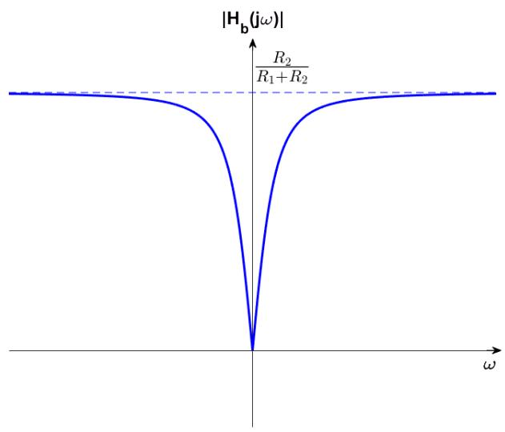

$$
\varphi_ {b} (\omega) = s g n (\omega) \cdot \frac {\pi}{2} - a r c t a n \left[ \frac {\omega L (R _ {1} + R _ {2})}{R _ {1} R _ {2}} \right]
$$

相频响应曲线如下图:


该系统是高通滤波器，相位超前。

### 第 5 周第二次作业

题 5-2.1: 下图(所示电路中激励信号 $i_{s}(t)=\text{sintu}(t)$ ，响应为 $u_{0}(t)$ 。求系统单位冲激响应 $h(t)$ 和零状态响应。


5-2.1 设电感电流为 $i_{L}(t)$ ，电容电流为 $i_{C}(t)$

根据 KCL 与元件的伏安特性

$$
\left\{ \begin{array}{l} i _ {s} (t) = i _ {L} (t) + i _ {c} (t) \\ i _ {c} (t) = C \frac {d u _ {0} (t)}{d t} \\ i _ {L} (t) = \frac {1}{L} \int_ {- \infty} ^ {t} u _ {0} (\tau) d \tau \end{array} \right.
$$

代入电感与电容值，得

$$
i _ {s} (t) = \frac {1}{3} \frac {d u _ {0} (t)}{d t} + \frac {4}{3} u _ {0} (t)
$$

记 $u_{0}(t), i_{s}(t)$ 的拉普拉斯变换为 $U_{0}(s), I_{s}(s)$ ，由题设， $u_{0}(0^{-}) = 0, i_{s}(0^{-}) = 0$ 对微分方程两侧做拉普拉斯变换

$$
s I _ {s} (s) = \frac {1}{3} s ^ {2} U _ {0} (s) + \frac {4}{3} U _ {0} (s)
$$

整理得

$$
U _ {0} (s) = \frac {3 s}{s ^ {2} + 4} I _ {s} (s)
$$

记单位冲激响应 $h(t)$ 的拉普拉斯变换为 $H(s)$ ，令 $i_{s}(t) = \delta (t)$ ，则 $I_{s}(s) = 1$ ，且

$$
H (s) = \frac {3 s}{s ^ {2} + 4}
$$

反变换得

$$
h (t) = 3 \cos 2 t \cdot u (t)
$$

由 $i_{s}(t)=\sin t\cdot u(t)$ ，则

$$
\begin{array}{r} I _ {s} (s) = \frac {1}{s ^ {2} + 1} \\ U _ {0} (s) = \frac {3 s}{s ^ {2} + 4} \cdot \frac {1}{s ^ {2} + 1} = \frac {3 s}{(s ^ {2} + 4) (s ^ {2} + 1)} = \frac {s}{s ^ {2} + 1} - \frac {s}{s ^ {2} + 4} \end{array}
$$

反变换得零状态响应

$$
u _ {0} (t) = (c o s t - c o s 2 t) u (t)
$$

### 第 6 周第一次作业

题 6-1.1：分别求出下图(a)和(b)中所示电路的系统函数 $H_{a}(s)$ 、 $H_{b}(s)$ ，绘出其极零图及幅频和相频响应曲线，并简要说明系统特性。其中，激励信号为 $e(t)$ ，响应为 $r(t)$ 。

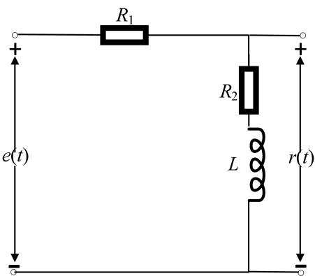  
(a)

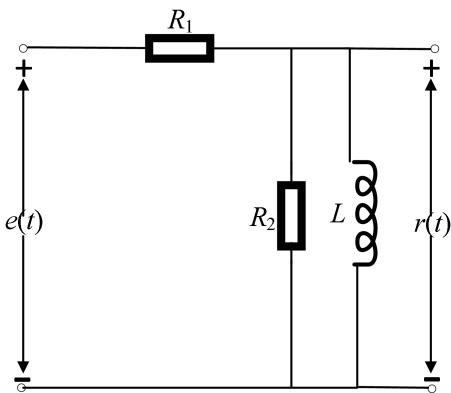  
(b)

**6-1.1 解**

(a)

$$
H _ {a} (s) = \frac {R (s)}{E (s)} = \frac {R _ {2} + s L}{R _ {1} + R _ {2} + s L} = \frac {s + \frac {R _ {2}}{L}}{s + \frac {R _ {1} + R _ {2}}{L}}
$$

令 $s + \frac{R_2}{L} = 0$ ，得零点 $z_{a} = -\frac{R_{2}}{L}$

令 $s + \frac{R_1 + R_2}{L} = 0$ ，得极点 $p_a = -\frac{R_1 + R_2}{L}$

极零图如下

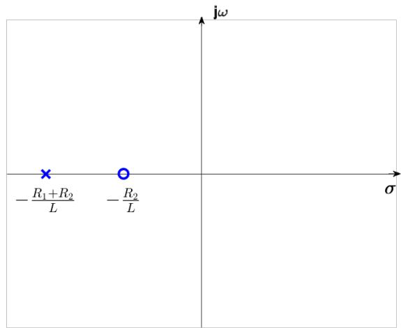

极点在左半平面，故系统稳定

令 $s=j\omega$ ，则系统频响函数


如上图， $A_{1}$ 、 $B_{1}$ 是两矢量的模， $\alpha_{1}$ 、 $\beta_{1}$ 是两矢量与实轴间的夹角。

$$
\left\{ \begin{array}{l l} | H _ {a} (j \omega) | = \frac {B _ {1}}{A _ {1}} \\ \varphi_ {a} (\omega) = \beta_ {1} - \alpha_ {1} \end{array} \right.
$$

幅频响应曲线如下图:


相频响应曲线如下图:

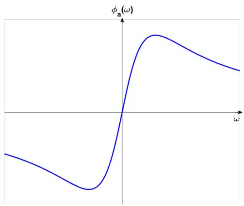

该系统是因果、稳定系统，特性是低频衰减，高频通过，相位超前。

(b)

$$
\begin{array}{c} {H _ {b} (s) = \frac {R (s)}{E (s)} = \frac {\frac {s L R _ {2}}{R _ {2} + s L}}{R _ {1} + \frac {s L R _ {2}}{R _ {2} + s L}} = \frac {s L R _ {2}}{R _ {1} R _ {2} + s L (R _ {1} + R _ {2})} = \frac {\frac {R _ {2}}{R _ {1} + R _ {2}} s}{s + \frac {R _ {1} R _ {2}}{L (R _ {1} + R _ {2})}}} \\ {= \frac {R _ {2}}{R _ {1} + R _ {2}} \cdot \frac {s}{s + \frac {R _ {1} R _ {2}}{L (R _ {1} + R _ {2})}}} \end{array}
$$

令 $s = 0$ ，得零点 $z_{b} = 0$

令 $s+\frac{R_{1}R_{2}}{L(R_{1}+R_{2})}=0$ ，得极点 $p_{b}=-\frac{R_{1}R_{2}}{L(R_{1}+R_{2})}$

极零图如下


极点在左半平面，故系统稳定

令 $s=j\omega$ ，则系统频响函数

$$
H _ {b} (j \omega) = \frac {R _ {2}}{R _ {1} + R _ {2}} \cdot \frac {j \omega}{j \omega + \frac {R _ {1} R _ {2}}{L (R _ {1} + R _ {2})}}
$$


如上图， $A_{2}$ 、 $B_{2}$ 是两矢量的模， $\alpha_{2}$ 、 $\beta_{2}$ 是两矢量与实轴间的夹角。

$$
\left\{ \begin{array}{c} | H _ {b} (j \omega) | = \frac {B _ {2}}{A _ {2}} \cdot \frac {R _ {2}}{R _ {1} + R _ {2}} \\ \varphi_ {b} (\omega) = \beta_ {2} - \alpha_ {2} \end{array} \right.
$$

幅频响应曲线如下图:

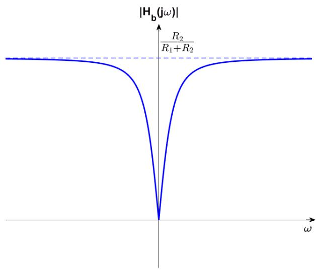

相频响应曲线如下图:


该系统是因果、稳定系统，是高通滤波器，相位超前。

### 第 6 周第二次作业

题 6-2.1：用归纳法写出下列右边序列的闭合表达式 $x(n), n=0,1,2,\cdots$ 。然后用单位样值信号分别表示之，并求其一阶后向差分，绘出原序列及其一阶后向差分的图形，并简要说明你的观察和发现。

(1) $\{1,-1,1,-1,\cdots\}$

(2) $\left\{0, \frac{1}{2}, \frac{2}{3}, \frac{3}{4}, \cdots \right\}$

(3) $\{-2, -1, 2, 7, 14, 23, \cdots\}$

(4) $\{3^2 + 8, 5^2 + 11, 7^2 + 14, 9^2 + 17, \cdots\}$

6-2.1(1)由序列可知， $x(k + 1) = -x(k)$

设 $x(n) = (-1)^{n}$ ， $n = 0$ 时成立

若 $n = k$ 时 $x(k) = (-1)^{k}$ 成立，则 $n = k + 1$ 时

$x(k + 1) = -x(k) = (-1)\cdot (-1)^{k} = (-1)^{k + 1}$ 成立

故 $x(n)=(-1)^{n}$ 对 $n\in N$ 成立

$$
x (n) = \sum_ {k = 0} ^ {\infty} (-1) ^ {k} \delta (n - k)
$$

$$
\nabla x (n) = x (n) - x (n - 1) = \left\{ \begin{array}{c} 1, n = 0 \\ 2 \cdot (-1) ^ {n}, n \geq 1 \end{array} \right.
$$

$x(n)$ 图形


$\nabla x(n)$ 图形

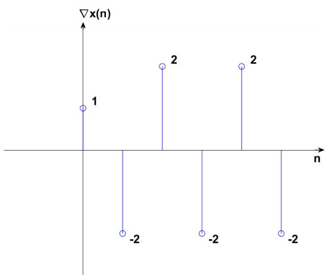

原序列与后向差分图形均震荡。除首项外，后向差分的值是原序列相邻两样本后一个相对前一个的变化量。

(2)由序列可知， $x(k) = \frac{a}{b}$ 时， $x(k) = \frac{a + 1}{b + 1}$

设 $x(n) = \frac{n}{n + 1}$ ， $n = 0$ 时成立

若 $n = k$ 时 $x(k) = \frac{k}{k + 1}$ 成立，则 $n = k + 1$ 时 $x(k + 1) = \frac{k + 1}{k + 2} = \frac{k + 1}{(k + 1) + 1}$ 成立故 $x(n) = \frac{n}{n + 1}$ 对 $n\in N$ 成立

$$
\begin{array}{c} {x (n) = \sum_ {k = 0} ^ {\infty} \frac {k}{k + 1} \delta (n - k)} \\ {\nabla x (n) = x (n) - x (n - 1) = \left\{ \begin{array}{c} {0, n = 0} \\ {1} \\ {\overline {{n (n + 1)}}}, n \geq 1 \end{array} \right.} \end{array}
$$

$x(n)$ 图形

  
$\nabla x(n)$ 图形

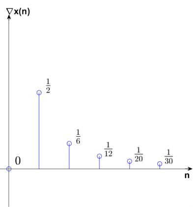

原序列单调递增，增速逐渐放缓，后向差分除首项外恒为正且单调递减。(3)由序列可知， $x(k+1)-x(k)=2k+1$

设 $x(n) = an^{2} + bn + c$ ，代入 $x(0), x(1), x(2)$ 得 $a = 1, b = 0, c = -2$

则 $x(n)=n^{2}-2,\quad n=0$ 时成立

若 $n = k$ 时 $x(k) = k^2 - 2$ 成立，则 $n = k + 1$ 时

$x(k + 1) = x(k) + 2k + 1 = k^2 +2k - 1 = (k + 1)^2 -2$ 成立

故 $x(n) = n^{2} - 2$ 对 $n\in N$ 成立

$$
\begin{array}{c} {x (n) = \sum_ {k = 0} ^ {\infty} (k ^ {2} - 2) \delta (n - k)} \\ {\nabla x (n) = x (n) - x (n - 1) = \left\{ \begin{array}{l l} {- 2, n = 0} \\ {2 n - 1, n \geq 1} \end{array} \right.} \end{array}
$$

$x(n)$ 图形


$\nabla x(n)$ 图形


原序列为二次抛物线型，后向差分除首项外线性递增。

(4)由序列可知， $x(k) = a^{2} + b$ 时， $x(k + 1) = (a + 2)^{2} + b + 3$

设 $x(n) = (2n + 3)^{2} + 3n + 8$ ， $n = 0$ 时成立

若 $n = k$ 时 $x(k) = (2k + 3)^{2} + 3k + 8$ 成立，则 $n = k + 1$ 时

$$
x (k + 1) = (2 k + 5) ^ {2} + 3 k + 1 1 = [ 2 (k + 1) + 3 ] ^ {2} + 3 (k + 1) + 8 \text {成立}
$$

故 $x(n) = (2n + 3)^{2} + 3n + 8$ 对 $n \in N$ 成立

$$
x (n) = \sum_ {k = 0} ^ {\infty} [ (2 k + 3) ^ {2} + 3 k + 8 ] \delta (n - k)
$$

$$
\nabla x (n) = x (n) - x (n - 1) = \left\{ \begin{array}{l} 3 ^ {2} + 8, n = 0 \\ 8 n + 1 1, n \geq 1 \end{array} \right.
$$

$x(n)$ 图形

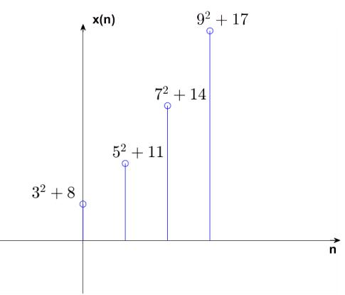

$\nabla x(n)$ 图形  
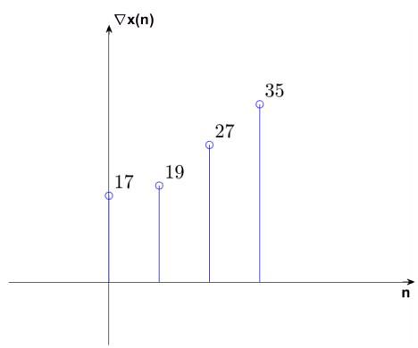

原序列为二次抛物线型，后向差分除首项外线性递增，二次序列的差分为一次序列。

### 第 7 周第一次作业

题 7-1.1: “开关电容”是在集成电路中用来替代电阻的一种基本单元。下图中，开关 $S_{1}$ 、 $S_{2}$ (在集成芯片内由两只 MOS 晶体管实现)和电容 $C_{1}$ 组成开关电容用以传送电荷，它们相当于连续系统中的电阻，再与另一电容 $C_{2}$ 可构成离散系统中的一阶滤波器。试求：

(1) 设 t=nT 时刻输入与输出电压分别为 $x(t)=x(nT)$ 和 $y(t)=y(nT)$ 。在 t=nT 时 $S_{1}$ 通、 $S_{2}$ 断（此期间 $x(t)$ 保持不变）， $t=nT+T/2$ 时 $S_{1}$ 断、 $S_{2}$ 通，利用电荷转移关系求 $y(nT+T/2)$ 与 $x(nT)$ 和 $y(nT)$ 间的关系式；

(2) 重复上述动作，当 $t=(n+1)T$ 时 $S_{1}$ 通、 $S_{2}$ 断， $t=(n+1)T+T/2$ 时 $S_{1}$ 断、 $S_{2}$ 通，……，列出描述 $y(n)$ 与 $x(n)$ 关系的差分方程(令 T=1)。

(3) 若 $x(t) = u(t)$ , 求系统零状态响应 $y(n)$ 的表达式, 并画出其随 $n$ 变化的图形。

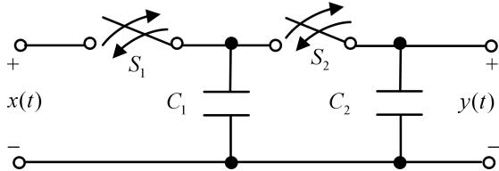

7-1.1(1)t = nT时:

电容 $C_1$ 两端电压 $V_{c_1} = x(t) = x(nT)$ ， $C_1$ 上电荷 $Q_{c_1} = C_1x(nT)$

电容 $C_{2}$ 两端电压 $V_{c_{2}} = y(t) = y(nT)$ ， $C_{2}$ 上电荷 $Q_{c_{2}} = C_{2}y(nT)$

$$
t = n T + \frac {T}{2} \text {时:}
$$

$C_{1}$ 与 $C_{2}$ 电压相同，均为 $y\left(nT+\frac{T}{2}\right)$ ，总电荷量为 $C_{1}x(nT)+C_{2}y(nT)$ ，则

$$
y \left(n T + \frac {T}{2}\right) = \frac {C _ {1} x (n T) + C _ {2} y (n T)}{C _ {1} + C _ {2}}
$$

(2)当 $t = (n + 1)T$ 时 $S_{2}$ 断开，故 $y[(n + 1)T] = y\left(nT + \frac{T}{2}\right)$

令 $T = 1$ ，则 $y(n + 1) = y\left(n + \frac{1}{2}\right) = \frac{C_1x(n)}{C_1 + C_2} +\frac{C_2y(n)}{C_1 + C_2}$

整理得差分方程

$$
y (n + 1) - \frac {C _ {2}}{C _ {1} + C _ {2}} y (n) = \frac {C _ {1}}{C _ {1} + C _ {2}} x (n)
$$

(3)令 $x(n)=\delta(n)$ 。

$n = -1$ 时， $y(0) - \frac{C_2}{C_1 + C_2} y(-1) = \frac{C_1}{C_1 + C_2}\delta (-1) = 0$ ，其中 $y(-1) = 0$

$$
n = 0 \text {时,} y (1) - \frac {C _ {2}}{C _ {1} + C _ {2}} y (0) = \frac {C _ {1}}{C _ {1} + C _ {2}} \delta (0) = \frac {C _ {1}}{C _ {1} + C _ {2}} \Longrightarrow y (1) = \frac {C _ {1}}{C _ {1} + C _ {2}}
$$

$$
n = 1 \text {时,} y (2) - \frac {C _ {2}}{C _ {1} + C _ {2}} y (1) = \frac {C _ {1}}{C _ {1} + C _ {2}} \delta (1) = 0 \Longrightarrow y (2) = \frac {C _ {1} C _ {2}}{(C _ {1} + C _ {2}) ^ {2}}
$$

$$
n = 2 \text {时,} y (3) - \frac {C _ {2}}{C _ {1} + C _ {2}} y (2) = \frac {C _ {1}}{C _ {1} + C _ {2}} \delta (2) = 0 \Longrightarrow y (3) = \frac {C _ {1} C _ {2} {} ^ {2}}{(C _ {1} + C _ {2}) ^ {3}}
$$

归纳得 $x(n)=\delta(n)$ 时

$$
y (n) = \frac {C _ {1} C _ {2} ^ {n - 1}}{(C _ {1} + C _ {2}) ^ {n}} (n \geq 1)
$$

即系统单位样值响应

$$
h (n) = \frac {C _ {1} C _ {2} ^ {n - 1}}{(C _ {1} + C _ {2}) ^ {n}} u (n - 1)
$$

输入信号 $x(t)=u(t)$ ，在离散时刻t=n， $x(n)=u(n)=1(n\geq0)$ ，故系统零状态响应

$$
y (n) = x (n) * h (n) = u (n) * h (n) = \sum_ {k = - \infty} ^ {\infty} u (k) h (n - k) = \sum_ {k = 0} ^ {n - 1} \frac {C _ {1} C _ {2} ^ {n - k - 1}}{(C _ {1} + C _ {2}) ^ {n - k}}
$$

$$
\begin{array}{r l} & {\text {记} a = \frac {C _ {1}}{C _ {1} + C _ {2}}, \text {则} 1 - a = \frac {C _ {2}}{C _ {1} + C _ {2}}} \\ & {y (n) = \sum_ {k = 0} ^ {n - 1} \frac {C _ {1} C _ {2} ^ {n - k - 1}}{(C _ {1} + C _ {2}) ^ {n - k}} = \sum_ {k = 0} ^ {n - 1} a (1 - a) ^ {n - k - 1} = a (1 - a) ^ {n - 1} \sum_ {k = 0} ^ {n - 1} (1 - a) ^ {- k}} \\ & {\qquad = a (1 - a) ^ {n - 1} \cdot [ - \frac {(1 - a) - (1 - a) ^ {1 - n}}{a} ] = 1 - (1 - a) ^ {n}} \end{array}
$$

代入 $1 - a = \frac{C_2}{C_1 + C_2}$ ，得

$$
y (n) = [ 1 - (\frac {C _ {2}}{C _ {1} + C _ {2}}) ^ {n} ] u (n)
$$

图形如下


### 第 7 周第二次作业

题 7-2.1: 求如下序列的 z 变换。

(1) $f(n) = u(n) - u(n - 8)$

(2) $f(n) = n(n - 1)u(n)$

(3) $f(n) = \left(\frac{1}{2}\right)^n\cos \frac{n\pi}{2} u(n)$

**7-2.1 解**

(1)

$$
F (z) = \sum_ {n = - \infty} ^ {\infty} [ u (n) - u (n - 8) ] z ^ {- n} = \sum_ {n = 0} ^ {7} z ^ {- n} = \frac {1 - z ^ {- 8}}{1 - z ^ {- 1}}
$$

由于 $f(n)$ 是仅在 $[0,7]$ 内有非零值的有限长序列，收敛域为 $0 < |z| \leq \infty$ 。

(2)

$$
\begin{array}{c} {f (n) = n (n - 1) u (n) = n ^ {2} u (n) - n u (n)} \\ {F (z) = Z [ n ^ {2} u (n) ] - Z [ n u (n) ] = \frac {z (z + 1)}{(z - 1) ^ {3}} - \frac {z}{(z - 1) ^ {2}} = \frac {z (z + 1) - z (z - 1)}{(z - 1) ^ {3}}} \\ {= \frac {2 z}{(z - 1) ^ {3}}} \end{array}
$$

$f(n)$ 是右边序列，收敛域为 $|z| > \lim_{n\to \infty}\sqrt[n]{|f(n)|} = \lim_{n\to \infty}\sqrt[n]{|n(n - 1)|} = 1$ 。

(3) 由欧拉公式

$$
c o s \frac {n \pi}{2} = \frac {1}{2} (e ^ {j \frac {n \pi}{2}} + e ^ {- j \frac {n \pi}{2}})
$$

$$
f (n) = \frac {1}{2} [ (\frac {e ^ {j \frac {\pi}{2}}}{2}) ^ {n} + (\frac {e ^ {- j \frac {\pi}{2}}}{2}) ^ {n} ] u (n)
$$

$$
\mathrm{由于} a ^ {n} u (n) \leftrightarrow {\frac {z}{z - a}}, e ^ {j {\frac {\pi}{2}}} = j, e ^ {- j {\frac {\pi}{2}}} = - j
$$

$$
F (z) = \frac {1}{2} \mathcal {Z} [ (\frac {j}{2}) ^ {n} u (n) + (\frac {- j}{2}) ^ {n} u (n) ] = \frac {1}{2} (\frac {z}{z - \frac {j}{2}} + \frac {z}{z + \frac {j}{2}}) = \frac {z ^ {2}}{z ^ {2} + \frac {1}{4}} = \frac {4 z ^ {2}}{4 z ^ {2} + 1}
$$

$f(n)$ 是右边序列，收敛域为 $|z| > \lim_{n\to \infty}\sqrt[n]{\left|\left(\frac{1}{2}\right)^n cos\frac{n\pi}{2} \right|} = \frac{1}{2}\lim_{n\to \infty}\sqrt[n]{\left|cos\frac{n\pi}{2} \right|} = \frac{1}{2}$ 。


### 第8周第一次作业

题 8-1.1: 已知某离散系统的差分方程为: $y(n+2)+a_{1}y(n+1)+a_{0}y(n)=x(n+1)$ 。其中, $x(n)$ 和 $y(n)$ 分别为系统激励和响应, $a_{0}$ 和 $a_{1}$ 均为实常数。试用 z 变换分析法求该系统:

(1) 系统函数 $H(z)$ 和单位样值响应 $h(n)$ ，并判断该系统是否稳定？

(2) 当 $a_{1}=2,\quad a_{0}=1$ ，且激励为单位阶跃序列 $u(n)$ 时，系统的零状态响应 $y_{zs}(n)$ 。

8-1.1(1)对差分方程作双边 z 变换，得

$$
z ^ {2} Y (z) + a _ {1} z Y (z) + a _ {0} Y (z) = z X (z)
$$

系统函数

$$
H (z) = \frac {Y (z)}{X (z)} = \frac {z}{z ^ {2} + a _ {1} z + a _ {0}}
$$

记 $z^2 + a_1z + a_0 = 0$ 的根为 $z_1, z_2$

$$
z _ {1} = \frac {- a _ {1} + \sqrt {a _ {1} ^ {2} - 4 a _ {0}}}{2}
$$

$$
z _ {2} = \frac {- a _ {1} - \sqrt {a _ {1} ^ {2} - 4 a _ {0}}}{2}
$$

当 $z_{1} \neq z_{2}$ 时

$$
{\frac {H (z)}{z}} = {\frac {1}{(z - z _ {1}) (z - z _ {2})}} = {\frac {1}{z _ {1} - z _ {2}}} ({\frac {1}{z - z _ {1}}} - {\frac {1}{z - z _ {2}}})
$$

即

$$
H (z) = \frac {1}{z _ {1} - z _ {2}} (\frac {z}{z - z _ {1}} - \frac {z}{z - z _ {2}})
$$

反 z 变换得

$$
\begin{array}{r l} & h (n) = \frac {1}{z _ {1} - z _ {2}} (z _ {1} ^ {n} - z _ {2} ^ {n}) u (n) \\ & \qquad = \frac {1}{\sqrt {a _ {1} ^ {2} - 4 a _ {0}}} [ (\frac {- a _ {1} + \sqrt {a _ {1} ^ {2} - 4 a _ {0}}}{2}) ^ {n} - (\frac {- a _ {1} - \sqrt {a _ {1} ^ {2} - 4 a _ {0}}}{2}) ^ {n} ] u (n) \end{array}
$$

当 $z_{1} = z_{2}$ 时

$$
H (z) = \frac {z}{(z - z _ {1}) ^ {2}}
$$

反 z 变换得

$$
h (n) = n z _ {1} ^ {n - 1} u (n) = n (- \frac {a _ {1}}{2}) ^ {n - 1} u (n)
$$

系统稳定要求 $|z_{1}|<1$ 且 $|z_{2}|<1$ 。

当 $|z_{1}|<1$ 且 $|z_{2}|<1$ 时，由韦达定理

$$
\left\{ \begin{array}{c} a _ {0} = z _ {1} z _ {2} \\ - a _ {1} = z _ {1} + z _ {2} \end{array} \right.
$$

则

$$
| a _ {0} | = | z _ {1} | | z _ {2} | <   1
$$

若 $z_{1}, z_{2}$ 都为实数，则 $(1 - z_{1})(1 - z_{2}) > 0$ 且 $(1 + z_{1})(1 + z_{2}) > 0$ 。

若 $z_{1}, z_{2}$ 为共轭复数，则 $(1 - z_{1}), (1 - z_{2})$ 为共轭复数，且 $(1 + z_{1}), (1 + z_{2})$ 为共轭复数，因此 $(1 - z_{1})(1 - z_{2})$ 为正实数，且 $(1 + z_{1})(1 + z_{2})$ 为正实数。

$$
\left\{ \begin{array}{l} (1 - z _ {1}) (1 - z _ {2}) = 1 - z _ {1} - z _ {2} + z _ {1} z _ {2} = a _ {0} + a _ {1} + 1 > 0 \\ (1 + z _ {1}) (1 + z _ {2}) = 1 + z _ {1} + z _ {2} + z _ {1} z _ {2} = a _ {0} - a _ {1} + 1 > 0 \end{array} \right.
$$

解得

$$
\vert a _ {1} \vert <   a _ {0} + 1
$$

故 $|z_{1}|<1,|z_{2}|<1$ 是 $|a_{0}|<1,|a_{1}|<a_{0}+1$ 的充分条件。

以下证明必要性。

当 $|a_{0}|<1$ 且 $|a_{1}|<a_{0}+1$ 时，由韦达定理 $|z_{1}z_{2}|<1$ 。

记 $f(z) = z^{2} + a_{1}z + a_{0}$

若 $z_{1}, z_{2}$ 都为实数，由于 $\left|z_{1}z_{2}\right| < 1$ ，且

$$
\left\{ \begin{array}{l} f (1) = a _ {0} + a _ {1} + 1 > 0 \\ f (-1) = a _ {0} - a _ {1} + 1 > 0 \end{array} \right.
$$

故 $z_{1}, z_{2} \in (-1, 1)$ , $|z_{1}| < 1$ , $|z_{2}| < 1$

若 $z_{1}, z_{2}$ 为共轭复数， $|z_{1}z_{2}| = |z_{1}|^{2} = |z_{2}|^{2} < 1$ ，故 $|z_{1}| < 1, |z_{2}| < 1$

即 $|z_1| < 1, |z_2| < 1$ 是 $|a_0| < 1, |a_1| < a_0 + 1$ 的必要条件。

综上， $|z_1| < 1, |z_2| < 1$ 与 $|a_0| < 1, |a_1| < a_0 + 1$ 等价。

因此， $|a_0| < 1, |a_1| < a_0 + 1$ 时系统稳定，否则系统不稳定。

(2)代入 $a_{1}=2,a_{0}=1$ ，则

$$
H (z) = \frac {z}{(z + 1) ^ {2}}
$$

$x(n) = u(n)$ 的 $z$ 变换 $X(z) = \frac{z}{z - 1}$ ，收敛域为 $|z| > 1$

$$
Y _ {z s} (z) = H (z) X (z) = \frac {z ^ {2}}{(z - 1) (z + 1) ^ {2}} = \frac {1}{4} \cdot \frac {z}{z - 1} - \frac {1}{4} \cdot \frac {z}{z + 1} + \frac {1}{2} \cdot \frac {z}{(z + 1) ^ {2}}
$$

反 z 变换得

$$
y _ {z s} (n) = [ \frac {1}{4} - \frac {1}{4} \cdot (-1) ^ {n} + \frac {1}{2} \cdot (-1) ^ {n - 1} n ] u (n)
$$

### 第8周第二次作业

题 8-2.1：已知某离散时间系统如下图所示。


其中， $x(n)$ 和 $y(n)$ 分别为系统激励和响应，D 为延时器，标量乘法器中 $a_{0}, a_{1}, a_{2}, a_{3}$ 为实数。如要求其频响函数在 $\omega = 0$ 时为 1，在 $\omega = \frac{\pi}{2}$ 及 $\omega = \pi$ 时为零。试求：

(1) 列出系统差分方程，并计算 $a_0, a_1, a_2, a_3$ 的值；

(2) 系统频响函数 $H(e^{j\omega})$ ，画出幅频特性曲线。

**8-2.1 解**

(1) 差分方程

$$
y (n) = a _ {0} x (n) + a _ {1} x (n - 1) + a _ {2} x (n - 2) + a _ {3} x (n - 3)
$$

对方程两侧作 z 变换，得

$$
Y (z) = a _ {0} X (z) + a _ {1} z ^ {- 1} X (z) + a _ {2} z ^ {- 2} X (z) + a _ {3} z ^ {- 3} X (z)
$$

$$
H (z) = \frac {Y (z)}{X (z)} = a _ {0} + a _ {1} z ^ {- 1} + a _ {2} z ^ {- 2} + a _ {3} z ^ {- 3}
$$

收敛域为 $0 < |z| \leq \infty$

令 $z = e^{j\omega}$ ，则

$$
H (e ^ {j \omega}) = a _ {0} + a _ {1} e ^ {- j \omega} + a _ {2} e ^ {- 2 j \omega} + a _ {3} e ^ {- 3 j \omega}
$$

由题设

$$
\left\{ \begin{array}{l l} {\omega = 0 \text {时}, H (e ^ {j \omega}) = a _ {0} + a _ {1} + a _ {2} + a _ {3} = 1} \\ {\omega = \frac {\pi}{2} \text {时}, H (e ^ {j \omega}) = a _ {0} + a _ {1} j - a _ {2} - a _ {3} j = 0} \\ {\omega = \pi \text {时}, H (e ^ {j \omega}) = a _ {0} - a _ {1} + a _ {2} - a _ {3} = 0} \end{array} \right.
$$

解得 $a_0 = a_1 = a_2 = a_3 = \frac{1}{4}$

$$
H (e ^ {j \omega}) = \frac {1}{4} (1 + e ^ {- j \omega} + e ^ {- 2 j \omega} + e ^ {- 3 j \omega})
$$

(2)

$$
\begin{array}{r l} & H (e ^ {j \omega}) = \frac {1}{4} e ^ {- j \frac {3 \omega}{2}} (e ^ {j \frac {3 \omega}{2}} + e ^ {j \frac {\omega}{2}} + e ^ {- j \frac {\omega}{2}} + e ^ {- j \frac {3 \omega}{2}}) = \frac {1}{4} e ^ {- j \frac {3 \omega}{2}} (2 c o s \frac {3 \omega}{2} + 2 c o s \frac {\omega}{2}) \\ & \qquad = e ^ {- j \frac {3 \omega}{2}} c o s \omega c o s \frac {\omega}{2} \\ & \qquad | H (e ^ {j \omega}) | = | c o s \omega c o s \frac {\omega}{2} | \end{array}
$$

幅频特性曲线

