# 作业题及解析

1.1.1 判断下述信号是否周期信号，并求出其中周期信号的基本周期：

(a) $x_{1}(t) = 10\cos(5\pi t)$

(b) $x_{2}(t)=10\cos(5\pi t)+2\sin(7t)$

(c) $x_{3}(t)=10\cos(5\pi t)+2\sin(7\pi t)+3\cos(6.5\pi t)$

1.1.2 求出如下信号的功率与能量，并判断是否能量信号，是否功率信号：

(a) $x_{1}(t) = 2u(t)$ ，其中 $u(t) = \left\{ \begin{array}{ll}1, & t\geq 0\\ 0, & t <   0 \end{array} \right.$

(b) $x_{2}(t) = 3\Pi \left(\frac{t - 1}{2}\right)$ ，其中 $\Pi (t) = \left\{ \begin{array}{ll}1, & |t|\leq \frac{1}{2}\\ 0, & \text{其它} \end{array} \right.$

(c) $x_{3}(t)=3\Pi(\frac{3-2t}{4})$

(d) $x_{4}(t) = \cos(2\pi t)$

(e) $x_{5}(t) = \cos(2\pi t)u(t)$

(f) $x_{6}(t)=cos^{2}(2\pi t)+sin^{2}(2\pi t)$

1.2.1 计算如下积分值:

(a) $I_{1} = \int_{-10}^{10} u(t) dt$

(b) $I_{2}=\int_{-10}^{10}\delta(t-1)u(t)dt$

(c) $I_{3} = \int_{-10}^{10} \delta(t + 1) u(t) dt$

1.2.2 电容 $C_1$ 与 $C_2$ 串联，以一个电压源 $e(t)$ 作为激励串联接入，试分别写出回路中的电流 $i(t)$ 、每个电容两端电压 $v_{C_1}(t)$ 、 $v_{C_2}(t)$ 与激励电压源 $e(t)$ 间的关系式，并判别该系统的线性、时不变性和因果性（给出具体判别过程）。当 $e(t) = Eu(t)$ 时，计算 $i(t)$ 、 $v_{C_1}(t)$ 、 $v_{C_2}(t)$ 。

1.1.1

(a) $x_{1}(t)$ 是余弦信号，是周期信号，基本周期 $T = \frac{2\pi}{5\pi} = 0.4$ 。

(b) $10\cos (5\pi t)$ 的周期 $T_{1} = \frac{2\pi}{5\pi} = 0.4$ ， $2\sin (7t)$ 的周期 $T_{2} = \frac{2\pi}{7}$

由于 $T_{1}$ 是有理数， $T_{2}$ 是无理数， $T_{1}$ 与 $T_{2}$ 的最小公共倍数不存在，故 $x_{2}(t)$ 不是周期信号。

(c) $10\cos (5\pi t)$ 的周期 $T_{1} = \frac{2\pi}{5\pi} = 0.4$ ， $2\sin (7\pi t)$ 的周期 $T_{2} = \frac{2\pi}{7\pi} = \frac{2}{7}$ ， $3\cos (6.5\pi t)$ 的周期 $T_{3} = \frac{2\pi}{6.5\pi} = \frac{4}{13}$ 。

由于 $T_{1},T_{2},T_{3}$ 均为有理数，一定存在公共倍数，故 $x_{3}(t)$ 是周期信号，基本周期是 $T_{1},T_{2},T_{3}$ 的最小公共倍数，即T=4。

1.1.2

(a) $x_{1}(t) = 2u(t) = \left\{ \begin{array}{ll}2,t\geq 0\\ 0,t <   0 \end{array} \right.$

能量 $E=\int_{-\infty}^{\infty}|x_{1}(t)|^{2}dt=\int_{0}^{\infty}4dt=\infty$

平均功率 $P = \lim_{T\to \infty}\frac{1}{2T}\int_{-T}^{T}|x_1(t)|^2 dt = \lim_{T\to \infty}\frac{1}{2T}\int_0^T 4dt = 2$

$x_{1}(t)$ 不是能量信号，是功率信号。

(b) $x_{2}(t) = 3\Pi \left(\frac{t - 1}{2}\right) = \left\{ \begin{array}{l}3,0\leq t\leq 2\\ 0,\text{其它} \end{array} \right.$

能量 $E = \int_0^2 |x_2(t)|^2 dt = \int_0^2 3^2 dt = 18$

平均功率 $P = \lim_{T\to \infty}\frac{1}{2T}\int_0^2 |x_2(t)|^2 dt = \lim_{T\to \infty}\frac{1}{2T}\int_0^2 9dt = 0$

$x_{2}(t)$ 是能量信号，不是功率信号。

(c) $x_{3}(t) = 3\Pi \left(\frac{3 - 2t}{4}\right) = \left\{ \begin{array}{ll}3, & \frac{1}{2}\leq t\leq \frac{5}{2}\\ 0, & \text{其它} \end{array} \right.$ 能量 $E = \int_{\frac{1}{2}}^{\frac{5}{2}}3^{2}dt = 18$ 平均功率 $P = \lim_{T\to \infty}\frac{1}{2T}\int_{\frac{1}{2}}^{\frac{5}{2}}3^{2}dt = 0$ $x_{3}(t)$ 是能量信号，不是功率信号。

(d) 能量 $E = \int_{-\infty}^{\infty} \cos^{2}(2\pi t) dt = \infty$

平均功率 $P = \lim_{T\to \infty}\frac{1}{2T}\int_{-T}^{T}\cos^2 (2\pi t)dt = \lim_{T\to \infty}\frac{1}{2T}\int_{-T}^{T}\frac{1 + \cos(4\pi t)}{2} dt = \frac{1}{2}$

$x_{4}(t)$ 不是能量信号，是功率信号。

(e) 能量 $E = \int_{0}^{\infty} \cos^{2}(2\pi t) dt = \infty$

平均功率 $P = \lim_{T\to \infty}\frac{1}{2T}\int_0^T\cos^2 (2\pi t)dt = \frac{1}{4}$

$x_{5}(t)$ 不是能量信号，是功率信号。

(f) $x_{6}(t)=cos^{2}(2\pi t)+sin^{2}(2\pi t)=1$

能量 $E = \int_{-\infty}^{\infty}1dt = \infty$

平均功率 $P = \lim_{T\to \infty}\frac{1}{2T}\int_{-T}^{T}1dt = 1$

$x_{6}(t)$ 不是能量信号，是功率信号。

1.2.1

$$
\mathrm{(a)} I _ {1} = \int_ {- 1 0} ^ {1 0} u (t) d t = \int_ {0} ^ {1 0} 1 d t = 1 0
$$

$$
\mathrm{(b)} I _ {2} = \int_ {- 1 0} ^ {1 0} \delta (t - 1) u (t) d t = \int_ {- 1 0} ^ {1 0} \delta (t - 1) u (1) d t = u (1) = 1
$$

$$
\mathrm{(c)} I _ {3} = \int_ {- 1 0} ^ {1 0} \delta (t + 1) u (t) d t = \int_ {- 1 0} ^ {1 0} \delta (t + 1) u (- 1) d t = u (- 1) = 0
$$

1.2.2

由基尔霍夫电压定律(KVL): $v_{C_1}(t) + v_{C_2}(t) = e(t)$

由电容的伏安特性： $i(t) = C_1\frac{dv_{C_1}(t)}{dt} = C_2\frac{dv_{C_2}(t)}{dt}$

对 KVL 等式两侧求导，得 $\frac{i(t)}{C_{1}} + \frac{i(t)}{C_{2}} = \frac{de(t)}{dt}$ ，即 $i(t) = \frac{C_{1}C_{2}}{C_{1} + C_{2}} \cdot \frac{de(t)}{dt}$

$$
v _ {C _ {1}} (t) = \frac {1}{C _ {1}} \int_ {- \infty} ^ {t} i (\tau) d \tau = \frac {C _ {2}}{C _ {1} + C _ {2}} e (t)
$$

$$
v _ {C _ {2}} (t) = \frac {1}{C _ {2}} \int_ {- \infty} ^ {t} i (\tau) d \tau = \frac {C _ {1}}{C _ {1} + C _ {2}} e (t)
$$

$v_{C_1}(t)$ 和 $v_{C_2}(t)$ 与 $e(t)$ 成正比，具有均匀性和叠加性。

设 $e(t)=ae_{1}(t)+be_{2}(t)$ ，则

$$
i (t) = \frac {C _ {1} C _ {2}}{C _ {1} + C _ {2}} \cdot \frac {d e (t)}{d t} = \frac {a C _ {1} C _ {2}}{C _ {1} + C _ {2}} \cdot \frac {d e _ {1} (t)}{d t} + \frac {b C _ {1} C _ {2}}{C _ {1} + C _ {2}} \cdot \frac {d e _ {2} (t)}{d t} = a i _ {1} (t) + b i _ {2} (t)
$$

故该系统是线性的。

$$
v _ {C _ {1}} (t - t _ {0}) = \frac {C _ {2}}{C _ {1} + C _ {2}} e (t - t _ {0})
$$

$$
v _ {C _ {2}} (t - t _ {0}) = \frac {C _ {1}}{C _ {1} + C _ {2}} e (t - t _ {0})
$$

$$
i (t - t _ {0}) = \frac {C _ {1} C _ {2}}{C _ {1} + C _ {2}} \cdot \frac {d e (t - t _ {0})}{d t}
$$

故该系统是时不变的。

若 $e(t)$ 在 $t_1$ 时刻出现非零值，则 $v_{C_1}(t), v_{C_2}(t)$ 也在 $t_1$ 时刻出现非零值， $i(t)$ 由 $\frac{de(t)}{dt}$ 决定，不会在 $t_1$ 时刻前出现非零值。

故该系统是因果的。

当 $e(t)=Eu(t)$ 时，

$$
i (t) = \frac {C _ {1} C _ {2}}{C _ {1} + C _ {2}} \cdot \frac {d e (t)}{d t} = \frac {C _ {1} C _ {2} E}{C _ {1} + C _ {2}} \delta (t)
$$

$$
v _ {C _ {1}} (t) = \frac {C _ {2}}{C _ {1} + C _ {2}} E u (t)
$$

$$
v _ {C _ {2}} (t) = \frac {C _ {1}}{C _ {1} + C _ {2}} E u (t)
$$

2.1.1 分别求取下列微分方程所描述系统的单位冲激响应 $h(t)$ 。

$$
(a) \frac {d}{d t} r (t) + 4 r (t) = e (t)
$$

$$
(\mathsf {b}) 2 \frac {d}{d t} r (t) + 6 r (t) = e (t)
$$

$$
\mathrm{(c)} \frac {d ^ {3}}{d t ^ {3}} r (t) + \frac {d ^ {2}}{d t ^ {2}} r (t) + 2 \frac {d}{d t} r (t) + 2 r (t) = \frac {d}{d t} e (t) + 2 e (t)
$$

2.1.1

(a) 特征方程为 $\lambda + 4 = 0$ ，即 $\lambda = -4$ 。

设 $h(t)=Ae^{-4t}u(t)$ ，令 $e(t)=\delta(t)$ ，代入原微分方程，则：

$$
- 4 A e ^ {- 4 t} u (t) + A \delta (t) + 4 A e ^ {- 4 t} u (t) = \delta (t)
$$

解得A=1，故 $h(t)=e^{-4t}u(t)$ 。

(b) 特征方程为 $2\lambda + 6 = 0$ ，即 $\lambda = -3$ 。

设 $h(t)=Ae^{-3t}u(t)$ ，令 $e(t)=\delta(t)$ ，代入原微分方程，则：

$$
- 6 A e ^ {- 3 t} u (t) + 2 A \delta (t) + 6 A e ^ {- 3 t} u (t) = \delta (t)
$$

解得 $A = \frac{1}{2}$ ，故 $h(t) = \frac{1}{2} e^{-3t}u(t)$

(c) 特征方程为 $\lambda^3 + \lambda^2 + 2\lambda + 2 = 0$ ，即 $(\lambda + 1)(\lambda^2 + 2) = 0$ 。

解得 $\lambda_1 = -1, \lambda_2 = j\sqrt{2}, \lambda_3 = -j\sqrt{2}$

设 $h(t)=[Ae^{-t}+Bcos(\sqrt{2}t)+Csin(\sqrt{2}t)]u(t)$ ，令 $e(t)=\delta(t)$ ，代入原微分

方程，比较系数得： $\left\{ \begin{array}{c}A + B = 0\\ -A + \sqrt{2} C + A + B = 1\\ A - 2B - A + \sqrt{2} C + 2A + 2B = 2 \end{array} \right.$

解得 $A = \frac{1}{3}, B = -\frac{1}{3}, C = \frac{2\sqrt{2}}{3}$ ，故 $h(t) = [\frac{1}{3} e^{-t} - \frac{1}{3} cos(\sqrt{2} t) + \frac{2\sqrt{2}}{3} sin(\sqrt{2} t)]u(t)$

## 信号与系统第 3 周第一次作业

题 3-1.1：下图所示电路的起始状态为零，求下列两种情况下流过 AB 的电流 $i(t)$ 。

(1) 激励为电流源 $i_{S}(t)=u(t)\mathrm{A}$ ;

(2) 激励为电压源 $u_{S}(t)=u(t)\mathrm{V}$ 。

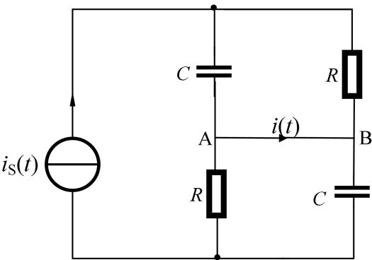  
图 1

## 信号与系统第 3 周第二次作业

题 3-2.1：利用周期矩形脉冲信号的傅里叶级数展开式与三角波信号的傅里叶级数展开式，求出下列级数的和：

(1) $1 - \frac{1}{3} + \frac{1}{5} - \frac{1}{7} + \cdots;$

(2) $1 + \frac{1}{9} +\frac{1}{25} +\frac{1}{49} +\dots 。$

3-1.1(1)设左侧支路电容两端的电压为 $u_{1}$ ，极性上正下负，则右侧支路电阻两端电压也为 $u_{1}$ ；左侧支路电阻两端的电压为 $u_{2}$ ，极性上正下负，则右侧支路电容两端电压也为 $u_{2}$ 。

根据 KCL 与元件的伏安特性:

$$
\left\{ \begin{array}{l} C \frac {d u _ {1} (t)}{d t} + \frac {u _ {1} (t)}{R} = i _ {s} (t) \\ \frac {u _ {2} (t)}{R} + C \frac {d u _ {2} (t)}{d t} = i _ {s} (t) \end{array} \right.
$$

特征方程为 $C\lambda+\frac{1}{R}=0$ ，即 $\lambda=-\frac{1}{RC}$

设 $h(t)=Ae^{-\frac{t}{RC}}u(t)$ ，令 $i_{s}(t)=\delta(t)$ ，代入原方程得：

$$
C \cdot (- \frac {1}{R C}) A e ^ {- \frac {t}{R C}} u (t) + C A \delta (t) + \frac {1}{R} A e ^ {- \frac {t}{R C}} u (t) = \delta (t)
$$

解得 $A = \frac{1}{C},\quad h(t) = \frac{1}{C} e^{-\frac{t}{RC}}u(t)$

$$
\begin{array}{r l} & u _ {1} (t) = u _ {2} (t) = h (t) * i _ {s} (t) = \int_ {- \infty} ^ {\infty} h (\tau) u (t - \tau) d \tau = \frac {1}{C} \int_ {0} ^ {t} e ^ {- \frac {\tau}{R C}} d \tau \\ & \qquad = R (1 - e ^ {- \frac {t}{R C}}) u (t) \end{array}
$$

A 点的 KCL: $C \frac{du_{1}(t)}{dt} = i(t) + \frac{u_{2}(t)}{R}$

$$
i (t) = C \frac {d u _ {1} (t)}{d t} - \frac {u _ {2} (t)}{R} = (e ^ {- \frac {t}{R C}} - 1 + e ^ {- \frac {t}{R C}}) u (t) = (2 e ^ {- \frac {t}{R C}} - 1) u (t)
$$

(1) B 点的 KCL: $C \frac{du_{2}(t)}{dt} = i(t) + \frac{u_{1}(t)}{R}$

整个电路的 KVL: $u_{1}(t) + u_{2}(t) = u_{s}(t)$

联立 A、B 点 KCL:

$$
\begin{array}{c} {2 i (t) = C \frac {d u _ {1} (t)}{d t} + C \frac {d u _ {2} (t)}{d t} - - \frac {u _ {1} (t)}{R} - \frac {u _ {2} (t)}{R} = C \frac {d u _ {s} (t)}{d t} - \frac {u _ {s} (t)}{R}} \\ {i (t) = \frac {C}{2} \cdot \frac {d u (t)}{d t} - \frac {u (t)}{2 R} = \frac {C}{2} \delta (t) - \frac {1}{2 R} U (t)} \end{array}
$$

3-2.1(1)设周期为 $2\pi$ 的矩形脉冲信号在 $[0,2\pi]$ 上的表达式 $f(t) = \left\{ \begin{array}{l} 1,0\leq t < \pi \\ -1,\pi \leq t\leq 2\pi \end{array} \right.$

$$
a _ {0} = \frac {2}{2 \pi} \int_ {0} ^ {2 \pi} f (t) d t = 0
$$

$$
a _ {n} = \frac {2}{2 \pi} \int_ {0} ^ {2 \pi} f (t) c o s (n t) d t = 0
$$

$$
\begin{array}{r l} & {b _ {n} = \frac {2}{2 \pi} \int_ {0} ^ {2 \pi} f (t) \sin (n t) d t = \frac {1}{\pi} \left[ \int_ {0} ^ {\pi} \sin (n t) d t - \int_ {\pi} ^ {2 \pi} \sin (n t) d t \right]} \\ & {\qquad = \frac {1}{\pi} \left[ \frac {1 - \cos (n \pi)}{n} - \left(- \frac {1}{n} + \frac {\cos (n \pi)}{k}\right) \right]} \\ & {\qquad = \left\{ \begin{array}{l l} {\frac {4}{n \pi},} & {n \text {为奇数}} \\ {0,} & {n \text {为偶数}} \end{array} \right.} \end{array}
$$

故该矩形脉冲信号可展开为:

$$
f (t) = \frac {4}{\pi} (s i n t + \frac {1}{3} s i n 3 t + \frac {1}{5} s i n 5 t + \frac {1}{7} s i n 7 t + \dots)
$$

取 $t=\frac{\pi}{2}$ ，则

$$
\begin{array}{c} {f (\frac {\pi}{2}) = \frac {4}{\pi} (1 - \frac {1}{3} + \frac {1}{5} - \frac {1}{7} + \dots) = 1} \\ {1 - \frac {1}{3} + \frac {1}{5} - \frac {1}{7} + \dots = \frac {\pi}{4}} \end{array}
$$

(2)设周期为 $2\pi$ 的矩形脉冲信号在 $[- \pi, \pi]$ 上的表达式是 $f(t) = |t|, t \in [-\pi, \pi]$

$$
\begin{array}{r} {{a _ {0} = \frac {2}{2 \pi} \int_ {- \pi} ^ {\pi} f (t) d t = \frac {2}{\pi} \int_ {0} ^ {\pi} t d t = \pi}} \\ {{a _ {n} = \frac {2}{2 \pi} \int_ {- \pi} ^ {\pi} f (t) c o s (n t) d t = \frac {2}{\pi} \int_ {0} ^ {\pi} t c o s (n t) d t = \frac {2}{\pi} \cdot \frac {c o s (n t) - 1}{n ^ {2}}}} \\ {{= \left\{ \begin{array}{l l} {{- \frac {4}{n ^ {2} \pi},}} & {{n \text {为奇数}}} \\ {{0,}} & {{n \text {为偶数}}} \end{array} \right.}} \\ {{b _ {n} = \frac {2}{2 \pi} \int_ {- \pi} ^ {\pi} f (t) s i n (n t) d t = 0}} \end{array}
$$

故该三角波信号可展开为:

$$
f (t) = \frac {a _ {0}}{2} + \sum_ {n = 1} ^ {\infty} a _ {n} c o s (n t) = \frac {\pi}{2} - \frac {4}{\pi} (c o s t + \frac {c o s 3 t}{9} + \frac {c o s 5 t}{2 5} + \frac {c o s 7 t}{4 9} + \dots)
$$

取 $t = 0$ ，则

$$
f (0) = \frac {\pi}{2} - \frac {4}{\pi} (1 + \frac {1}{9} + \frac {1}{2 5} + \frac {1}{4 9} + \dots) = 0
$$

$$
1 + \frac {1}{9} + \frac {1}{2 5} + \frac {1}{4 9} + \dots = \frac {\pi}{2} \cdot \frac {\pi}{4} = \frac {\pi^ {2}}{8}
$$

## 信号与系统第 4 周第一次作业

题4-1.1：写出下图中所示三角脉冲信号 $f_{1}(t)$ 的时域表达式，并求其傅里叶变换，画出频谱图。当 $0 < \tau \leq 2$ 时，画出信号 $f_{2}(t) = \sum_{m=-\infty}^{\infty} f_{1}(t - 3m)$ 的时域波形，求其傅里叶级数，并画出频谱图。

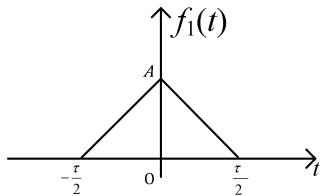

## 信号与系统第 4 周第二次作业

题 4-2.1：已知信号 $f(t) = e^{-at}u(t) - e^{at}u(-t)$ ，其中 $a > 0$ 。试求：

(a) $f(t)$ 的傅里叶变换，并画出频谱图。

(b) 利用 $f(t)$ 的傅里叶变换，求符号函数 $sgn(t) = \begin{cases} 1, & t \geq 0 \\ -1, & t < 0 \end{cases}$ 的傅里叶变换，并画出频谱图。

(c) 根据上面所得的结果，利用关系式 $u(t) = [sgn(t) + 1] / 2$ ，求出单位阶跃信号的傅里叶变换，并画出频谱图。

(d) 根据积分定理，利用单位冲激信号的傅里叶变换，求出单位阶跃信号的傅里叶变换。将所得结果与(c)的结果进行比较。

$$
f _ {1} (t) = \left\{ \begin{array}{c} A - \frac {2 A}{\tau} | t |, | t | \leq \frac {\tau}{2} \\ 0, | t | > \frac {\tau}{2} \end{array} \right.
$$

$f_{1}(t)$ 的傅里叶变换

$$
\begin{array}{r l r} & & F _ {1} (j \omega) = \int_ {- \frac {\tau}{2}} ^ {\frac {\tau}{2}} f _ {1} (t) e ^ {- j \omega t} d t = \int_ {- \frac {\tau}{2}} ^ {0} (A + \frac {2 A t}{\tau}) e ^ {- j \omega t} d t + \int_ {0} ^ {\frac {\tau}{2}} (A - \frac {2 A t}{\tau}) e ^ {- j \omega t} d t \\ & & = (- \frac {A}{j \omega} e ^ {- j \omega t}) | _ {- \frac {\tau}{2}} ^ {0} + \frac {2 A}{\tau} (- \frac {t e ^ {- j \omega t}}{j \omega} + \frac {e ^ {- j \omega t}}{\omega^ {2}}) | _ {- \frac {\tau}{2}} ^ {0} + (- \frac {A}{j \omega} e ^ {- j \omega t}) | _ {0} ^ {\frac {\tau}{2}} - \frac {2 A}{\tau} (- \frac {t e ^ {- j \omega t}}{j \omega} + \frac {e ^ {- j \omega t}}{\omega^ {2}}) | _ {0} ^ {\frac {\tau}{2}} \\ & & = \frac {2 A}{\omega^ {2} \tau} (2 - e ^ {j \omega \frac {\tau}{2}} - e ^ {- j \omega \frac {\tau}{2}}) = \frac {4 A}{\omega^ {2} \tau} (1 - c o s \frac {\omega \tau}{2}) = \frac {8 A}{\omega^ {2} \tau} s i n ^ {2} \frac {\omega \tau}{4} = \frac {A \tau}{2} [ S a (\frac {\omega \tau}{4}) ] ^ {2} \end{array}
$$

幅度谱如下

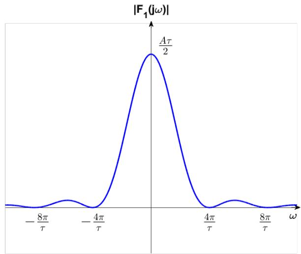

相位 $\varphi_{1}(\omega) = 0$ ，相位谱如下

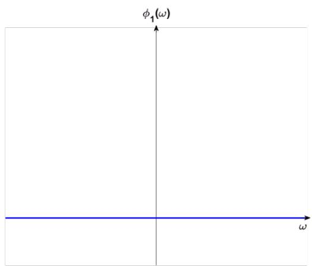

$f_{2}(t) = \sum_{m = -\infty}^{\infty}f_{1}(t - 3m)$ 的周期 $T = 3$ ，由于 $0 < \tau \leq 2 < 3$ ，故各周期波形无重叠，波形图如下

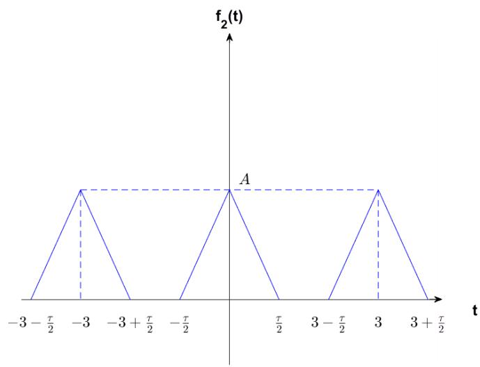

$$
F _ {n} = \frac {1}{3} \int_ {- \frac {3}{2}} ^ {\frac {3}{2}} f _ {2} (t) e ^ {- j n \omega_ {1} t} d t = \frac {1}{3} \int_ {- \frac {\tau}{2}} ^ {\frac {\tau}{2}} f _ {2} (t) e ^ {- j n \omega_ {1} t} d t = \frac {1}{3} F _ {1} (j n \omega_ {1})
$$

又

$$
F _ {1} (j \omega) = \frac {A \tau}{2} \Big [ S a (\frac {\omega \tau}{4}) \Big ] ^ {2}, \omega_ {1} = \frac {2 \pi}{T} = \frac {2 \pi}{3}
$$

得

$$
F _ {n} = \frac {A \tau}{6} \left[ S a (\frac {n \pi \tau}{6}) \right] ^ {2} \geq 0
$$

故 $f_{2}(t)$ 的傅里叶级数

$$
f _ {2} (t) = \sum_ {n = - \infty} ^ {\infty} \frac {A \tau}{6} \Big [ S a (\frac {n \pi \tau}{6}) \Big ] ^ {2} e ^ {j \frac {2 \pi}{3} n t}
$$

幅度谱如下

相位 $\varphi_{2}(\omega) = 0$ ，相位谱如下

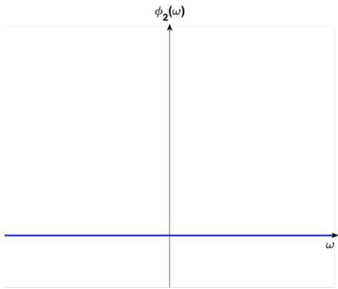

4-2.1(a) $f(t)$ 的傅里叶变换

$$
\begin{array}{r l r} & & F _ {1} (j \omega) = \int_ {- \infty} ^ {\infty} f (t) e ^ {- j \omega t} d t = \int_ {0} ^ {\infty} e ^ {- a t} e ^ {- j \omega t} d t - \int_ {- \infty} ^ {0} e ^ {a t} e ^ {- j \omega t} d t \\ & & = \frac {1}{a + j \omega} - \frac {1}{a - j \omega} = - \frac {2 j \omega}{a ^ {2} + \omega^ {2}} \\ & & | F _ {1} (j \omega) | = \frac {2 | \omega |}{a ^ {2} + \omega^ {2}} \end{array}
$$

幅度谱如下

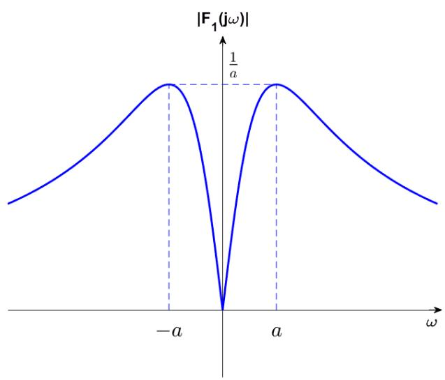

$$
\varphi_ {1} (\omega) = \left\{ \begin{array}{l l} - \frac {\pi}{2}, \omega > 0 \\ \frac {\pi}{2}, \omega <   0 \end{array} \right.
$$

相位谱如下

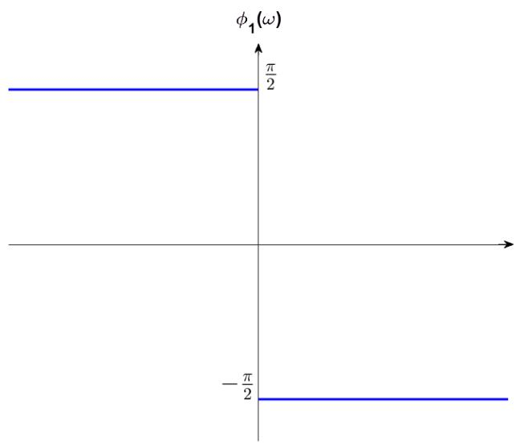

(b)当 $a \to 0^{+}$ 时

$$
\lim _ {a \to 0 ^ {+}} f (t) = u (t) - u (- t) = s g n (t)
$$

则 $sgn(t)$ 的傅里叶变换

$$
F _ {2} (j \omega) = \lim _ {a \to 0 ^ {+}} F _ {1} (j \omega) = \lim _ {a \to 0 ^ {+}} (- \frac {2 j \omega}{a ^ {2} + \omega^ {2}}) = - \frac {2 j}{\omega} = \frac {2}{j \omega} (\omega \neq 0)
$$

需要注意，直接对 $F_{1}(j\omega)$ 取极限要求 $\omega \neq 0$ ，无法得到 $\omega = 0$ 处的结果。若已知 $u(t) \leftrightarrow \frac{1}{j\omega} + \pi \delta(\omega)$ ，可以求 $u(t) - u(-t)$ 的傅里叶变换避免此问题。

由傅里叶变换的尺度变换性质

$$
\begin{array}{c} {u (- t) \leftrightarrow - \frac {1}{j \omega} + \pi \delta (- \omega)} \\ {F _ {2} (j \omega) = \frac {1}{j \omega} + \pi \delta (\omega) - [ - \frac {1}{j \omega} + \pi \delta (- \omega) ] = \frac {2}{j \omega}} \\ {| F _ {2} (j \omega) | = \frac {2}{| \omega |}} \end{array}
$$

幅度谱如下

$$
\varphi_ {2} (\omega) = \left\{ \begin{array}{l} - \frac {\pi}{2}, \omega > 0 \\ \frac {\pi}{2}, \omega <   0 \end{array} \right.
$$

相位谱如下

(c)对关系式两侧作傅里叶变换，得 $u(t)$ 的傅里叶变换

$$
\begin{array}{r l r} & & {F _ {3} (j \omega) = \frac {1}{2} \biggl [ \frac {2}{j \omega} + 2 \pi \delta (\omega) \biggr ] = \frac {1}{j \omega} + \pi \delta (\omega)} \\ & & {| F _ {3} (j \omega) | = \left\{ \begin{array}{l l} {\frac {1}{| \omega |}, \omega \neq 0} \\ {\pi \delta (\omega), \omega = 0} \end{array} \right.} \end{array}
$$

幅度谱如下

$$
\varphi_ {3} (\omega) = \left\{ \begin{array}{l l} - \frac {\pi}{2}, \omega > 0 \\ \frac {\pi}{2}, \omega <   0 \end{array} \right.
$$

相位谱如下

(d)单位冲激信号 $\delta(t)$ 的傅里叶变换

$$
F (j \omega) = 1
$$

根据积分定理

$$
u (t) = \int_ {- \infty} ^ {t} \delta (\tau) d \tau \leftrightarrow \pi \delta (\omega) F (0) + \frac {1}{j \omega} F (j \omega) = \pi \delta (\omega) + \frac {1}{j \omega}
$$

与(c)中结果一致

## 信号与系统第 5 周第一次作业

题 5-1.1：分别求出下图(a)和(b)中所示电路的频响函数 $H_{a}(j\omega)$ 、 $H_{b}(j\omega)$ 和单位冲激响应 $h_{a}(t)$ 、 $h_{b}(t)$ 的表达式，绘出其幅频和相频响应曲线，并简要说明系统特性。其中，激励信号为 $e(t)$ ，响应为 $r(t)$ 。

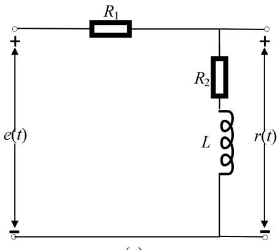  
(a)

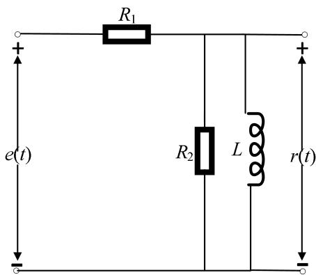  
(b)

## 信号与系统第 5 周第二次作业

题 5-2.1: 下图(所示电路中激励信号 $i_{s}(t)=\text{sintu}(t)$ ，响应为 $u_{0}(t)$ 。求系统单位冲激响应 $h(t)$ 和零状态响应。

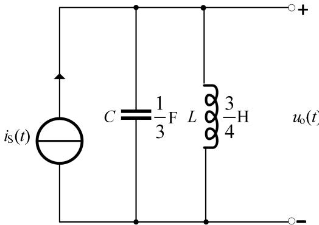

5-1.1(a)设电路中电流为 $i(t)$ 。

根据 KCL 与元件的伏安特性

$$
\left\{ \begin{array}{l l} e (t) = R _ {1} i (t) + R _ {2} i (t) + L \frac {d i (t)}{d t} \\ r (t) = R _ {2} i (t) + L \frac {d i (t)}{d t} \end{array} \right.
$$

则有

$$
i (t) = \frac {e (t) - r (t)}{R _ {1}}
$$

代入 $e(t)$ 表达式，整理得系统微分方程

$$
L r ^ {\prime} (t) + (R _ {1} + R _ {2}) r (t) = L e ^ {\prime} (t) + R _ {2} e (t)
$$

电路频响函数

$$
H _ {a} (j \omega) = \frac {R _ {2} + j \omega L}{R _ {1} + R _ {2} + j \omega L}
$$

微分方程特征根

$$
\lambda_ {1} = - \frac {R _ {1} + R _ {2}}{L}
$$

设 $h_{a}(t)=A\delta(t)+Be^{\lambda_{1}t}u(t)$ ，令 $e(t)=\delta(t)$

代入微分方程，比较两侧系数，得：

$$
\left\{ \begin{array}{c} L A = L \\ L B + (R _ {1} + R _ {2}) A = R _ {2} \end{array} \right.
$$

解得

$$
\left\{ \begin{array}{l l} A = 1 \\ B = - \frac {R _ {1}}{L} \end{array} \right.
$$

$$
h _ {a} (t) = \delta (t) - \frac {R _ {1}}{L} e ^ {- \frac {R _ {1} + R _ {2}}{L} t} u (t)
$$

$$
| H _ {a} (j \omega) | = \sqrt {\frac {R _ {2} ^ {2} + \omega^ {2} L ^ {2}}{(R _ {1} + R _ {2}) ^ {2} + \omega^ {2} L ^ {2}}}
$$

幅频响应曲线如下图:

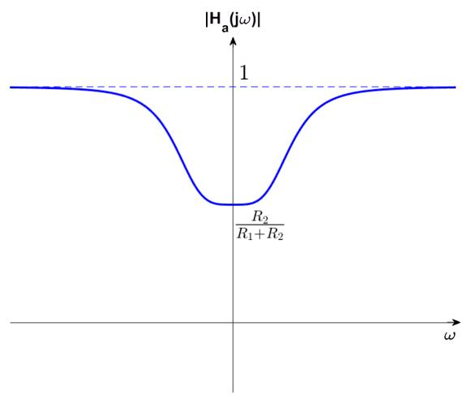

$$
\varphi_ {a} (\omega) = a r c t a n (\frac {\omega L}{R _ {2}}) - a r c t a n (\frac {\omega L}{R _ {1} + R _ {2}})
$$

相频响应曲线如下图:

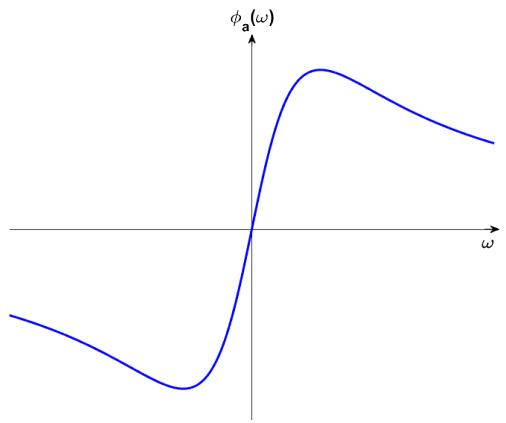

该系统特性是低频衰减，高频不衰减，相位超前。

(b)设电感电流为 $i_{L}(t)$ ， $R_{2}$ 上电流为 $i_{R_{2}}(t)$ ， $R_{1}$ 上电流为 $i_{R_{1}}(t)$ 。

根据 KVL，KCL 与元件的伏安特性

$$
\left\{ \begin{array}{l} i _ {R _ {1}} (t) = i _ {L} (t) + i _ {R _ {2}} (t) \\ e (t) = R _ {1} i _ {R _ {1}} (t) + L \frac {d i _ {L} (t)}{d t} \\ L \frac {d i _ {L} (t)}{d t} = R _ {2} i _ {R _ {2}} (t) = r (t) \end{array} \right.
$$

解得

$$
e (t) = \frac {R _ {1}}{L} \int_ {- \infty} ^ {t} r (\tau) d \tau + (\frac {R _ {1}}{R _ {2}} + 1) r (t)
$$

两侧求导得

$$
e ^ {\prime} (t) = \frac {R _ {1}}{L} r (t) + \frac {R _ {1} + R _ {2}}{R _ {2}} r ^ {\prime} (t)
$$

整理得

$$
(R _ {1} + R _ {2}) r ^ {\prime} (t) + \frac {R _ {1} R _ {2}}{L} r (t) = R _ {2} e ^ {\prime} (t)
$$

电路频响函数

$$
H _ {b} (j \omega) = \frac {j \omega L R _ {2}}{R _ {1} R _ {2} + j \omega L (R _ {1} + R _ {2})} = \frac {R _ {2}}{R _ {1} + R _ {2}} \cdot \frac {j \omega}{j \omega + \frac {R _ {1} R _ {2}}{L (R _ {1} + R _ {2})}}
$$

微分方程特征根

$$
\lambda_ {2} = - \frac {R _ {1} R _ {2}}{L (R _ {1} + R _ {2})}
$$

设 $h_b(t) = C\delta (t) + De^{\lambda_2t}u(t)$ ，令 $e(t) = \delta (t)$

代入微分方程，比较两侧系数，得

$$
\left\{ \begin{array}{c} (R _ {1} + R _ {2}) C = R _ {2} \\ (R _ {1} + R _ {2}) D + \frac {R _ {1} R _ {2}}{L} C = 0 \end{array} \right.
$$

解得

$$
\left\{ \begin{array}{c} C = \frac {R _ {2}}{R _ {1} + R _ {2}} \\ D = - \frac {{R _ {1} {R _ {2}} ^ {2}}}{L (R _ {1} + R _ {2}) ^ {2}} \end{array} \right.
$$

$$
h _ {b} (t) = \frac {R _ {2}}{R _ {1} + R _ {2}} \delta (t) - \frac {{R _ {1} {R _ {2}} ^ {2}}}{L (R _ {1} + R _ {2}) ^ {2}} e ^ {- \frac {R _ {1} R _ {2}}{L (R _ {1} + R _ {2})} t} u (t)
$$

$$
| H _ {b} (j \omega) | = \frac {R _ {2}}{R _ {1} + R _ {2}} \cdot \frac {| \omega |}{\sqrt {\omega^ {2} + \frac {R _ {1} ^ {2} R _ {2} ^ {2}}{L ^ {2} (R _ {1} + R _ {2}) ^ {2}}}}
$$

幅频响应曲线如下图:

$$
\varphi_ {b} (\omega) = s g n (\omega) \cdot \frac {\pi}{2} - a r c t a n \left[ \frac {\omega L (R _ {1} + R _ {2})}{R _ {1} R _ {2}} \right]
$$

相频响应曲线如下图:

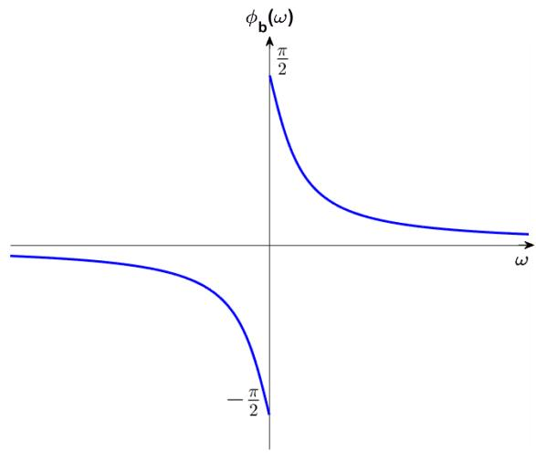

该系统是高通滤波器，相位超前。

5-2.1 设电感电流为 $i_{L}(t)$ ，电容电流为 $i_{C}(t)$

根据 KCL 与元件的伏安特性

$$
\left\{ \begin{array}{l} i _ {s} (t) = i _ {L} (t) + i _ {c} (t) \\ i _ {c} (t) = C \frac {d u _ {0} (t)}{d t} \\ i _ {L} (t) = \frac {1}{L} \int_ {- \infty} ^ {t} u _ {0} (\tau) d \tau \end{array} \right.
$$

代入电感与电容值，得

$$
i _ {s} (t) = \frac {1}{3} \frac {d u _ {0} (t)}{d t} + \frac {4}{3} u _ {0} (t)
$$

记 $u_{0}(t), i_{s}(t)$ 的拉普拉斯变换为 $U_{0}(s), I_{s}(s)$ ，由题设， $u_{0}(0^{-}) = 0, i_{s}(0^{-}) = 0$ 对微分方程两侧做拉普拉斯变换

$$
s I _ {s} (s) = \frac {1}{3} s ^ {2} U _ {0} (s) + \frac {4}{3} U _ {0} (s)
$$

整理得

$$
U _ {0} (s) = \frac {3 s}{s ^ {2} + 4} I _ {s} (s)
$$

记单位冲激响应 $h(t)$ 的拉普拉斯变换为 $H(s)$ ，令 $i_{s}(t) = \delta (t)$ ，则 $I_{s}(s) = 1$ ，且

$$
H (s) = \frac {3 s}{s ^ {2} + 4}
$$

反变换得

$$
h (t) = 3 \cos 2 t \cdot u (t)
$$

由 $i_{s}(t)=\sin t\cdot u(t)$ ，则

$$
\begin{array}{r} I _ {s} (s) = \frac {1}{s ^ {2} + 1} \\ U _ {0} (s) = \frac {3 s}{s ^ {2} + 4} \cdot \frac {1}{s ^ {2} + 1} = \frac {3 s}{(s ^ {2} + 4) (s ^ {2} + 1)} = \frac {s}{s ^ {2} + 1} - \frac {s}{s ^ {2} + 4} \end{array}
$$

反变换得零状态响应

$$
u _ {0} (t) = (c o s t - c o s 2 t) u (t)
$$

## 信号与系统第 6 周第一次作业

题 6-1.1：分别求出下图(a)和(b)中所示电路的系统函数 $H_{a}(s)$ 、 $H_{b}(s)$ ，绘出其极零图及幅频和相频响应曲线，并简要说明系统特性。其中，激励信号为 $e(t)$ ，响应为 $r(t)$ 。

  
(a)

  
(b)

## 信号与系统第 6 周第二次作业

题 6-2.1：用归纳法写出下列右边序列的闭合表达式 $x(n), n=0,1,2,\cdots$ 。然后用单位样值信号分别表示之，并求其一阶后向差分，绘出原序列及其一阶后向差分的图形，并简要说明你的观察和发现。

(1) $\{1,-1,1,-1,\cdots\}$

(2) $\left\{0, \frac{1}{2}, \frac{2}{3}, \frac{3}{4}, \cdots \right\}$

(3) $\{-2, -1, 2, 7, 14, 23, \cdots\}$

(4) $\{3^2 + 8, 5^2 + 11, 7^2 + 14, 9^2 + 17, \cdots\}$

$$
H _ {a} (s) = \frac {R (s)}{E (s)} = \frac {R _ {2} + s L}{R _ {1} + R _ {2} + s L} = \frac {s + \frac {R _ {2}}{L}}{s + \frac {R _ {1} + R _ {2}}{L}}\tag{6-1.1(a}
$$

令 $s + \frac{R_2}{L} = 0$ ，得零点 $z_{a} = -\frac{R_{2}}{L}$

令 $s + \frac{R_1 + R_2}{L} = 0$ ，得极点 $p_a = -\frac{R_1 + R_2}{L}$

极零图如下

极点在左半平面，故系统稳定

令 $s=j\omega$ ，则系统频响函数

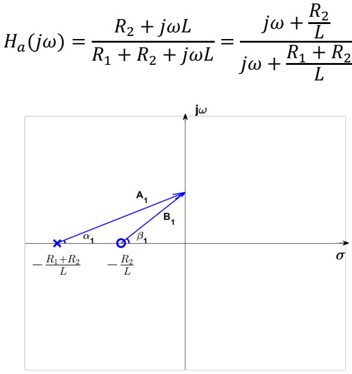

如上图， $A_{1}$ 、 $B_{1}$ 是两矢量的模， $\alpha_{1}$ 、 $\beta_{1}$ 是两矢量与实轴间的夹角。

$$
\left\{ \begin{array}{l l} | H _ {a} (j \omega) | = \frac {B _ {1}}{A _ {1}} \\ \varphi_ {a} (\omega) = \beta_ {1} - \alpha_ {1} \end{array} \right.
$$

幅频响应曲线如下图:

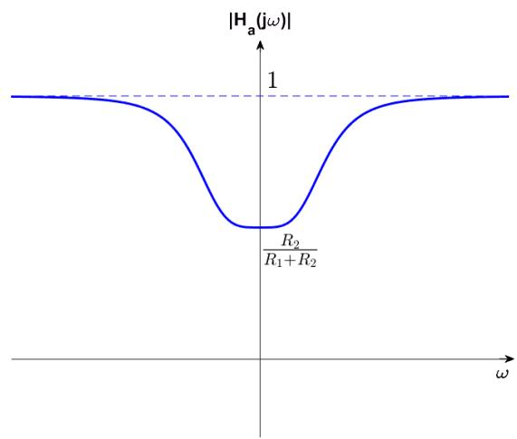

相频响应曲线如下图:

该系统是因果、稳定系统，特性是低频衰减，高频通过，相位超前。

(b)

$$
\begin{array}{c} {H _ {b} (s) = \frac {R (s)}{E (s)} = \frac {\frac {s L R _ {2}}{R _ {2} + s L}}{R _ {1} + \frac {s L R _ {2}}{R _ {2} + s L}} = \frac {s L R _ {2}}{R _ {1} R _ {2} + s L (R _ {1} + R _ {2})} = \frac {\frac {R _ {2}}{R _ {1} + R _ {2}} s}{s + \frac {R _ {1} R _ {2}}{L (R _ {1} + R _ {2})}}} \\ {= \frac {R _ {2}}{R _ {1} + R _ {2}} \cdot \frac {s}{s + \frac {R _ {1} R _ {2}}{L (R _ {1} + R _ {2})}}} \end{array}
$$

令 $s = 0$ ，得零点 $z_{b} = 0$

令 $s+\frac{R_{1}R_{2}}{L(R_{1}+R_{2})}=0$ ，得极点 $p_{b}=-\frac{R_{1}R_{2}}{L(R_{1}+R_{2})}$

极零图如下

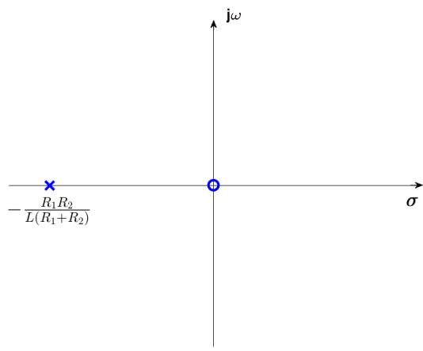

极点在左半平面，故系统稳定

令 $s=j\omega$ ，则系统频响函数

$$
H _ {b} (j \omega) = \frac {R _ {2}}{R _ {1} + R _ {2}} \cdot \frac {j \omega}{j \omega + \frac {R _ {1} R _ {2}}{L (R _ {1} + R _ {2})}}
$$

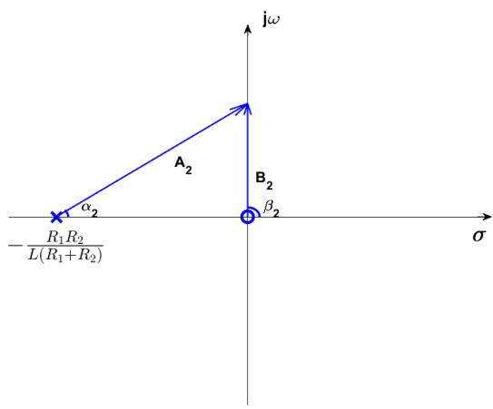

如上图， $A_{2}$ 、 $B_{2}$ 是两矢量的模， $\alpha_{2}$ 、 $\beta_{2}$ 是两矢量与实轴间的夹角。

$$
\left\{ \begin{array}{c} | H _ {b} (j \omega) | = \frac {B _ {2}}{A _ {2}} \cdot \frac {R _ {2}}{R _ {1} + R _ {2}} \\ \varphi_ {a} (\omega) = \beta_ {2} - \alpha_ {2} \end{array} \right.
$$

幅频响应曲线如下图:

相频响应曲线如下图:

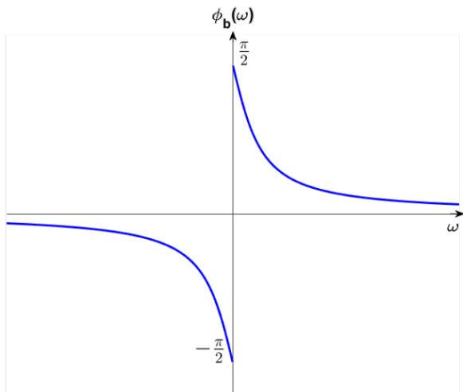

该系统是因果、稳定系统，是高通滤波器，相位超前。

6-2.1(1)由序列可知， $x(k + 1) = -x(k)$

设 $x(n) = (-1)^{n}$ ， $n = 0$ 时成立

若 $n = k$ 时 $x(k) = (-1)^{k}$ 成立，则 $n = k + 1$ 时

$x(k + 1) = -x(k) = (-1)\cdot (-1)^{k} = (-1)^{k + 1}$ 成立

故 $x(n)=(-1)^{n}$ 对 $n\in N$ 成立

$$
x (n) = \sum_ {k = 0} ^ {\infty} (- 1) ^ {k} \delta (n - k)
$$

$$
\nabla x (n) = x (n) - x (n - 1) = \left\{ \begin{array}{c} 1, n = 0 \\ 2 \cdot (- 1) ^ {n}, n \geq 1 \end{array} \right.
$$

$x(n)$ 图形

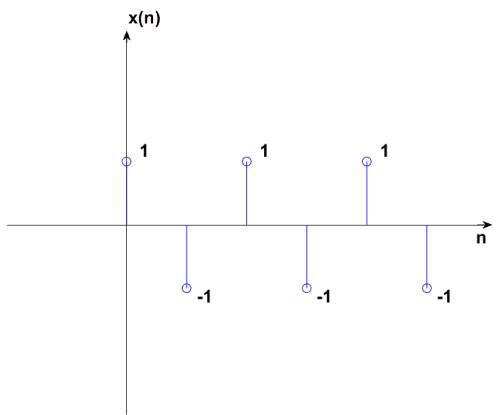

$\nabla x(n)$ 图形

原序列与后向差分图形均震荡。除首项外，后向差分的值是原序列相邻两样本后一个相对前一个的变化量。

(2)由序列可知， $x(k) = \frac{a}{b}$ 时， $x(k) = \frac{a + 1}{b + 1}$

设 $x(n) = \frac{n}{n + 1}$ ， $n = 0$ 时成立

若 $n = k$ 时 $x(k) = \frac{k}{k + 1}$ 成立，则 $n = k + 1$ 时 $x(k + 1) = \frac{k + 1}{k + 2} = \frac{k + 1}{(k + 1) + 1}$ 成立故 $x(n) = \frac{n}{n + 1}$ 对 $n\in N$ 成立

$$
\begin{array}{c} {x (n) = \sum_ {k = 0} ^ {\infty} \frac {k}{k + 1} \delta (n - k)} \\ {\nabla x (n) = x (n) - x (n - 1) = \left\{ \begin{array}{c} {0, n = 0} \\ {1} \\ {\overline {{n (n + 1)}}}, n \geq 1 \end{array} \right.} \end{array}
$$

$x(n)$ 图形

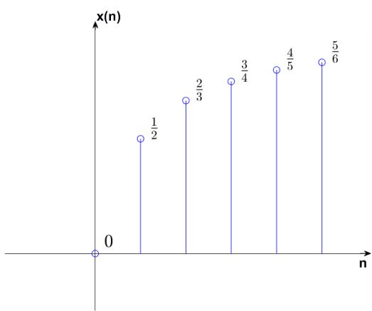  
$\nabla x(n)$ 图形

原序列单调递增，增速逐渐放缓，后向差分除首项外恒为正且单调递减。(3)由序列可知， $x(k+1)-x(k)=2k+1$

设 $x(n) = an^{2} + bn + c$ ，代入 $x(0), x(1), x(2)$ 得 $a = 1, b = 0, c = -2$

则 $x(n)=n^{2}-2,\quad n=0$ 时成立

若 $n = k$ 时 $x(k) = k^2 - 2$ 成立，则 $n = k + 1$ 时

$x(k + 1) = x(k) + 2k + 1 = k^2 +2k - 1 = (k + 1)^2 -2$ 成立

故 $x(n) = n^{2} - 2$ 对 $n\in N$ 成立

$$
\begin{array}{c} {x (n) = \sum_ {k = 0} ^ {\infty} (k ^ {2} - 2) \delta (n - k)} \\ {\nabla x (n) = x (n) - x (n - 1) = \left\{ \begin{array}{l l} {- 2, n = 0} \\ {2 n - 1, n \geq 1} \end{array} \right.} \end{array}
$$

$x(n)$ 图形

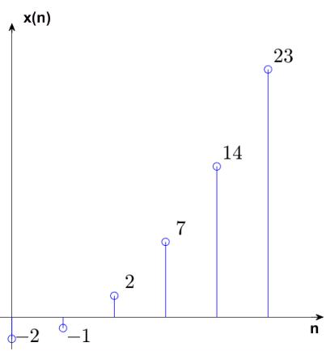

$\nabla x(n)$ 图形

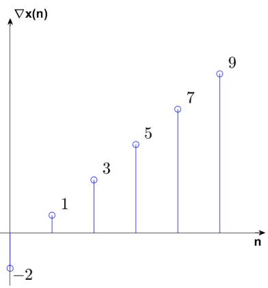

原序列为二次抛物线型，后向差分除首项外线性递增。

(4)由序列可知， $x(k) = a^{2} + b$ 时， $x(k + 1) = (a + 2)^{2} + b + 3$

设 $x(n) = (2n + 3)^{2} + 3n + 8$ ， $n = 0$ 时成立

若 $n = k$ 时 $x(k) = (2k + 3)^{2} + 3k + 8$ 成立，则 $n = k + 1$ 时

$$
x (k + 1) = (2 k + 5) ^ {2} + 3 k + 1 1 = [ 2 (k + 1) + 3 ] ^ {2} + 3 (k + 1) + 8 \text {成立}
$$

故 $x(n) = (2n + 3)^{2} + 3n + 8$ 对 $n \in N$ 成立

$$
x (n) = \sum_ {k = 0} ^ {\infty} [ (2 k + 3) ^ {2} + 3 k + 8 ] \delta (n - k)
$$

$$
\nabla x (n) = x (n) - x (n - 1) = \left\{ \begin{array}{l} 3 ^ {2} + 8, n = 0 \\ 8 n + 1 1, n \geq 1 \end{array} \right.
$$

$x(n)$ 图形

$\nabla x(n)$ 图形  

原序列为二次抛物线型，后向差分除首项外线性递增，二次序列的差分为一次序列。

## 信号与系统第 7 周第一次作业

题 7-1.1: “开关电容”是在集成电路中用来替代电阻的一种基本单元。下图中，开关 $S_{1}$ 、 $S_{2}$ (在集成芯片内由两只 MOS 晶体管实现)和电容 $C_{1}$ 组成开关电容用以传送电荷，它们相当于连续系统中的电阻，再与另一电容 $C_{2}$ 可构成离散系统中的一阶滤波器。试求：

(1) 设 t=nT 时刻输入与输出电压分别为 $x(t)=x(nT)$ 和 $y(t)=y(nT)$ 。在 t=nT 时 $S_{1}$ 通、 $S_{2}$ 断（此期间 $x(t)$ 保持不变）， $t=nT+T/2$ 时 $S_{1}$ 断、 $S_{2}$ 通，利用电荷转移关系求 $y(nT+T/2)$ 与 $x(nT)$ 和 $y(nT)$ 间的关系式；

(2) 重复上述动作，当 $t=(n+1)T$ 时 $S_{1}$ 通、 $S_{2}$ 断， $t=(n+1)T+T/2$ 时 $S_{1}$ 断、 $S_{2}$ 通，……，列出描述 $y(n)$ 与 $x(n)$ 关系的差分方程(令 T=1)。

(3) 若 $x(t) = u(t)$ , 求系统零状态响应 $y(n)$ 的表达式, 并画出其随 $n$ 变化的图形。

## 信号与系统第 7 周第二次作业

题 7-2.1: 求如下序列的 z 变换。

(1) $f(n) = u(n) - u(n - 8)$

(2) $f(n) = n(n - 1)u(n)$

(3) $f(n) = \left(\frac{1}{2}\right)^n\cos \frac{n\pi}{2} u(n)$

7-1.1(1)t = nT时:

电容 $C_1$ 两端电压 $V_{c_1} = x(t) = x(nT)$ ， $C_1$ 上电荷 $Q_{c_1} = C_1x(nT)$

电容 $C_{2}$ 两端电压 $V_{c_{2}} = y(t) = y(nT)$ ， $C_{2}$ 上电荷 $Q_{c_{2}} = C_{2}y(nT)$

$$
t = n T + \frac {T}{2} \text {时:}
$$

$C_{1}$ 与 $C_{2}$ 电压相同，均为 $y\left(nT+\frac{T}{2}\right)$ ，总电荷量为 $C_{1}x(nT)+C_{2}y(nT)$ ，则

$$
y \left(n T + \frac {T}{2}\right) = \frac {C _ {1} x (n T) + C _ {2} y (n T)}{C _ {1} + C _ {2}}
$$

(2)当 $t = (n + 1)T$ 时 $S_{2}$ 断开，故 $y[(n + 1)T] = y\left(nT + \frac{T}{2}\right)$

令 $T = 1$ ，则 $y(n + 1) = y\left(n + \frac{1}{2}\right) = \frac{C_1x(n)}{C_1 + C_2} +\frac{C_2y(n)}{C_1 + C_2}$

整理得差分方程

$$
y (n + 1) - \frac {C _ {2}}{C _ {1} + C _ {2}} y (n) = \frac {C _ {1}}{C _ {1} + C _ {2}} x (n)
$$

(3)令 $x(n)=\delta(n)$ 。

$n = -1$ 时， $y(0) - \frac{C_2}{C_1 + C_2} y(-1) = \frac{C_1}{C_1 + C_2}\delta (-1) = 0$ ，其中 $y(-1) = 0$

$$
n = 0 \text {时,} y (1) - \frac {C _ {2}}{C _ {1} + C _ {2}} y (0) = \frac {C _ {1}}{C _ {1} + C _ {2}} \delta (0) = \frac {C _ {1}}{C _ {1} + C _ {2}} \Longrightarrow y (1) = \frac {C _ {1}}{C _ {1} + C _ {2}}
$$

$$
n = 1 \text {时,} y (2) - \frac {C _ {2}}{C _ {1} + C _ {2}} y (1) = \frac {C _ {1}}{C _ {1} + C _ {2}} \delta (1) = 0 \Longrightarrow y (2) = \frac {C _ {1} C _ {2}}{(C _ {1} + C _ {2}) ^ {2}}
$$

$$
n = 2 \text {时,} y (3) - \frac {C _ {2}}{C _ {1} + C _ {2}} y (2) = \frac {C _ {1}}{C _ {1} + C _ {2}} \delta (2) = 0 \Longrightarrow y (3) = \frac {C _ {1} C _ {2} {} ^ {2}}{(C _ {1} + C _ {2}) ^ {3}}
$$

归纳得 $x(n)=\delta(n)$ 时

$$
y (n) = \frac {C _ {1} C _ {2} ^ {n - 1}}{(C _ {1} + C _ {2}) ^ {n}} (n \geq 1)
$$

即系统单位样值响应

$$
h (n) = \frac {C _ {1} C _ {2} ^ {n - 1}}{(C _ {1} + C _ {2}) ^ {n}} u (n - 1)
$$

输入信号 $x(t)=u(t)$ ，在离散时刻t=n， $x(n)=u(n)=1(n\geq0)$ ，故系统零状态响应

$$
y (n) = x (n) * h (n) = u (n) * h (n) = \sum_ {k = - \infty} ^ {\infty} u (k) h (n - k) = \sum_ {k = 0} ^ {n - 1} \frac {C _ {1} C _ {2} ^ {n - k - 1}}{(C _ {1} + C _ {2}) ^ {n - k}}
$$

$$
\begin{array}{r l} & {\text {记} a = \frac {C _ {1}}{C _ {1} + C _ {2}}, \text {则} 1 - a = \frac {C _ {2}}{C _ {1} + C _ {2}}} \\ & {y (n) = \sum_ {k = 0} ^ {n - 1} \frac {C _ {1} C _ {2} ^ {n - k - 1}}{(C _ {1} + C _ {2}) ^ {n - k}} = \sum_ {k = 0} ^ {n - 1} a (1 - a) ^ {n - k - 1} = a (1 - a) ^ {n - 1} \sum_ {k = 0} ^ {n - 1} (1 - a) ^ {- k}} \\ & {\qquad = a (1 - a) ^ {n - 1} \cdot [ - \frac {(1 - a) - (1 - a) ^ {1 - n}}{a} ] = 1 - (1 - a) ^ {n}} \end{array}
$$

代入 $1 - a = \frac{C_2}{C_1 + C_2}$ ，得

$$
y (n) = [ 1 - (\frac {C _ {2}}{C _ {1} + C _ {2}}) ^ {n} ] u (n)
$$

图形如下

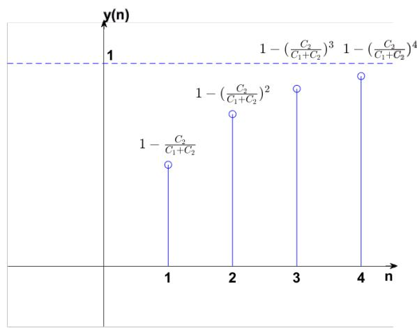

$$
F (z) = \sum_ {n = - \infty} ^ {\infty} [ u (n) - u (n - 8) ] z ^ {- n} = \sum_ {n = 0} ^ {7} z ^ {- n} = \frac {1 - z ^ {- 8}}{1 - z ^ {- 1}}\tag{7-2.1(1}
$$

由于 $f(n)$ 是仅在[0,7]内有非零值的有限长序列，收敛域为 $0 < |z| \leq \infty$ (2)

$$
\begin{array}{c} {f (n) = n (n - 1) u (n) = n ^ {2} u (n) - n u (n)} \\ {F (z) = Z [ n ^ {2} u (n) ] - Z [ n u (n) ] = \frac {z (z + 1)}{(z - 1) ^ {3}} - \frac {z}{(z - 1) ^ {2}} = \frac {z (z + 1) - z (z - 1)}{(z - 1) ^ {3}}} \\ {= \frac {2 z}{(z - 1) ^ {3}}} \end{array}
$$

$f(n)$ 是右边序列，收敛域为 $|z| > \lim_{n\to \infty}\sqrt[n]{|f(n)|} = \lim_{n\to \infty}\sqrt[n]{|n(n - 1)|} = 1$ (3)由欧拉公式

$$
c o s \frac {n \pi}{2} = \frac {1}{2} (e ^ {j \frac {n \pi}{2}} + e ^ {- j \frac {n \pi}{2}})
$$

$$
f (n) = \frac {1}{2} [ (\frac {e ^ {j \frac {\pi}{2}}}{2}) ^ {n} + (\frac {e ^ {- j \frac {\pi}{2}}}{2}) ^ {n} ] u (n)
$$

$$
\mathrm{由于} a ^ {n} u (n) \leftrightarrow {\frac {z}{z - a}}, e ^ {j {\frac {\pi}{2}}} = j, e ^ {- j {\frac {\pi}{2}}} = - j
$$

$$
F (z) = \frac {1}{2} \mathcal {Z} [ (\frac {j}{2}) ^ {n} u (n) + (\frac {- j}{2}) ^ {n} u (n) ] = \frac {1}{2} (\frac {z}{z - \frac {j}{2}} + \frac {z}{z + \frac {j}{2}}) = \frac {z ^ {2}}{z ^ {2} + \frac {1}{4}} = \frac {4 z ^ {2}}{4 z ^ {2} + 1}
$$

$f(n)$ 是右边序列，收敛域为 $|z| > \lim_{n\to \infty}\sqrt[n]{\left|\left(\frac{1}{2}\right)^n cos\frac{n\pi}{2} \right|} = \frac{1}{2}\lim_{n\to \infty}\sqrt[n]{\left|cos\frac{n\pi}{2} \right|} = \frac{1}{2}$

## 信号与系统第8周第一次作业

题 8-1.1: 已知某离散系统的差分方程为: $y(n+2)+a_{1}y(n+1)+a_{0}y(n)=x(n+1)$ 。其中, $x(n)$ 和 $y(n)$ 分别为系统激励和响应, $a_{0}$ 和 $a_{1}$ 均为实常数。试用 z 变换分析法求该系统:

(1) 系统函数 $H(z)$ 和单位样值响应 $h(n)$ ，并判断该系统是否稳定？

(2) 当 $a_{1}=2,\quad a_{0}=1$ ，且激励为单位阶跃序列 $u(n)$ 时，系统的零状态响应 $y_{zs}(n)$ 。

## 信号与系统第8周第二次作业

题 8-2.1：已知某离散时间系统如下图所示。

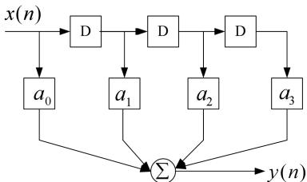

其中， $x(n)$ 和 $y(n)$ 分别为系统激励和响应，D 为延时器，标量乘法器中 $a_{0}, a_{1}, a_{2}, a_{3}$ 为实数。如要求其频响函数在 $\omega = 0$ 时为 1，在 $\omega = \frac{\pi}{2}$ 及 $\omega = \pi$ 时为零。试求：

(1) 列出系统差分方程，并计算 $a_0, a_1, a_2, a_3$ 的值；

(2) 系统频响函数 $H(e^{j\omega})$ ，画出幅频特性曲线。

8-1.1(1)对差分方程作双边 z 变换，得

$$
z ^ {2} Y (z) + a _ {1} z Y (z) + a _ {0} Y (z) = z X (z)
$$

系统函数

$$
H (z) = \frac {Y (z)}{X (z)} = \frac {z}{z ^ {2} + a _ {1} z + a _ {0}}
$$

记 $z^2 + a_1z + a_0 = 0$ 的根为 $z_1, z_2$

$$
z _ {1} = \frac {- a _ {1} + \sqrt {a _ {1} ^ {2} - 4 a _ {0}}}{2}
$$

$$
z _ {2} = \frac {- a _ {1} - \sqrt {a _ {1} ^ {2} - 4 a _ {0}}}{2}
$$

当 $z_{1} \neq z_{2}$ 时

$$
{\frac {H (z)}{z}} = {\frac {1}{(z - z _ {1}) (z - z _ {2})}} = {\frac {1}{z _ {1} - z _ {2}}} ({\frac {1}{z - z _ {1}}} - {\frac {1}{z - z _ {2}}})
$$

即

$$
H (z) = \frac {1}{z _ {1} - z _ {2}} (\frac {z}{z - z _ {1}} - \frac {z}{z - z _ {2}})
$$

反 z 变换得

$$
\begin{array}{r l} & h (n) = \frac {1}{z _ {1} - z _ {2}} (z _ {1} ^ {n} - z _ {2} ^ {n}) u (n) \\ & \qquad = \frac {1}{\sqrt {a _ {1} ^ {2} - 4 a _ {0}}} [ (\frac {- a _ {1} + \sqrt {a _ {1} ^ {2} - 4 a _ {0}}}{2}) ^ {n} - (\frac {- a _ {1} - \sqrt {a _ {1} ^ {2} - 4 a _ {0}}}{2}) ^ {n} ] u (n) \end{array}
$$

当 $z_{1} = z_{2}$ 时

$$
H (z) = \frac {z}{(z - z _ {1}) ^ {2}}
$$

反 z 变换得

$$
h (n) = n z _ {1} ^ {n - 1} u (n) = n (- \frac {a _ {1}}{2}) ^ {n - 1} u (n)
$$

系统稳定要求 $|z_{1}|<1$ 且 $|z_{2}|<1$ 。

当 $|z_{1}|<1$ 且 $|z_{2}|<1$ 时，由韦达定理

$$
\left\{ \begin{array}{c} a _ {0} = z _ {1} z _ {2} \\ - a _ {1} = z _ {1} + z _ {2} \end{array} \right.
$$

则

$$
| a _ {0} | = | z _ {1} | | z _ {2} | <   1
$$

若 $z_{1}, z_{2}$ 都为实数，则 $(1 - z_{1})(1 - z_{2}) > 0$ 且 $(1 + z_{1})(1 + z_{2}) > 0$ 。

若 $z_{1}, z_{2}$ 为共轭复数，则 $(1 - z_{1}), (1 - z_{2})$ 为共轭复数，且 $(1 + z_{1}), (1 + z_{2})$ 为共轭复数，因此 $(1 - z_{1})(1 - z_{2})$ 为正实数，且 $(1 + z_{1})(1 + z_{2})$ 为正实数。

$$
\left\{ \begin{array}{l} (1 - z _ {1}) (1 - z _ {2}) = 1 - z _ {1} - z _ {2} + z _ {1} z _ {2} = a _ {0} + a _ {1} + 1 > 0 \\ (1 + z _ {1}) (1 + z _ {2}) = 1 + z _ {1} + z _ {2} + z _ {1} z _ {2} = a _ {0} - a _ {1} + 1 > 0 \end{array} \right.
$$

解得

$$
\vert a _ {1} \vert <   a _ {0} + 1
$$

故 $|z_{1}|<1,|z_{2}|<1$ 是 $|a_{0}|<1,|a_{1}|<a_{0}+1$ 的充分条件。

以下证明必要性。

当 $|a_{0}|<1$ 且 $|a_{1}|<a_{0}+1$ 时，由韦达定理 $|z_{1}z_{2}|<1$ 。

记 $f(z) = z^{2} + a_{1}z + a_{0}$

若 $z_{1}, z_{2}$ 都为实数，由于 $\left|z_{1}z_{2}\right| < 1$ ，且

$$
\left\{ \begin{array}{l} f (1) = a _ {0} + a _ {1} + 1 > 0 \\ f (- 1) = a _ {0} - a _ {1} + 1 > 0 \end{array} \right.
$$

故 $z_{1}, z_{2} \in (-1, 1)$ , $|z_{1}| < 1$ , $|z_{2}| < 1$

若 $z_{1}, z_{2}$ 为共轭复数， $|z_{1}z_{2}| = |z_{1}|^{2} = |z_{2}|^{2} < 1$ ，故 $|z_{1}| < 1, |z_{2}| < 1$

即 $|z_1| < 1, |z_2| < 1$ 是 $|a_0| < 1, |a_1| < a_0 + 1$ 的必要条件。

综上， $|z_1| < 1, |z_2| < 1$ 与 $|a_0| < 1, |a_1| < a_0 + 1$ 等价。

因此， $|a_0| < 1, |a_1| < a_0 + 1$ 时系统稳定，否则系统不稳定。

(2)代入 $a_{1}=2,a_{0}=1$ ，则

$$
H (z) = \frac {z}{(z + 1) ^ {2}}
$$

$x(n) = u(n)$ 的 $z$ 变换 $X(z) = \frac{z}{z - 1}$ ，收敛域为 $|z| < 1$

$$
Y _ {z s} (z) = H (z) X (z) = \frac {z ^ {2}}{(z - 1) (z + 1) ^ {2}} = \frac {1}{4} \cdot \frac {z}{z - 1} - \frac {1}{4} \cdot \frac {z}{z + 1} + \frac {1}{2} \cdot \frac {z}{(z + 1) ^ {2}}
$$

反 z 变换得

$$
y _ {z s} (n) = [ \frac {1}{4} - \frac {1}{4} \cdot (- 1) ^ {n} + \frac {1}{2} \cdot (- 1) ^ {n - 1} n ] u (n)
$$
## 8-2.1(1)差分方程

$$
y (n) = a _ {0} x (n) + a _ {1} x (n - 1) + a _ {2} x (n - 2) + a _ {3} x (n - 3)
$$

对方程两侧作 z 变换，得

$$
Y (z) = a _ {0} X (z) + a _ {1} z ^ {- 1} X (z) + a _ {2} z ^ {- 2} X (z) + a _ {3} z ^ {- 3} X (z)
$$

$$
H (z) = \frac {Y (z)}{X (z)} = a _ {0} + a _ {1} z ^ {- 1} + a _ {2} z ^ {- 2} + a _ {3} z ^ {- 3}
$$

收敛域为 $0 < |z| \leq \infty$

令 $z = e^{j\omega}$ ，则

$$
H (e ^ {j \omega}) = a _ {0} + a _ {1} e ^ {- j \omega} + a _ {2} e ^ {- 2 j \omega} + a _ {3} e ^ {- 3 j \omega}
$$

由题设

$$
\left\{ \begin{array}{l l} {\omega = 0 \text {时}, H (e ^ {j \omega}) = a _ {0} + a _ {1} + a _ {2} + a _ {3} = 1} \\ {\omega = \frac {\pi}{2} \text {时}, H (e ^ {j \omega}) = a _ {0} + a _ {1} j - a _ {2} - a _ {3} j = 0} \\ {\omega = \pi \text {时}, H (e ^ {j \omega}) = a _ {0} - a _ {1} + a _ {2} - a _ {3} = 0} \end{array} \right.
$$

解得 $a_0 = a_1 = a_2 = a_3 = \frac{1}{4}$

$$
H (e ^ {j \omega}) = \frac {1}{4} (1 + e ^ {- j \omega} + e ^ {- 2 j \omega} + e ^ {- 3 j \omega})
$$

(2)

$$
\begin{array}{r l} & H (e ^ {j \omega}) = \frac {1}{4} e ^ {- j \frac {3 \omega}{2}} (e ^ {j \frac {3 \omega}{2}} + e ^ {j \frac {\omega}{2}} + e ^ {- j \frac {\omega}{2}} + e ^ {- j \frac {3 \omega}{2}}) = \frac {1}{4} e ^ {- j \frac {3 \omega}{2}} (2 c o s \frac {3 \omega}{2} + 2 c o s \frac {\omega}{2}) \\ & \qquad = e ^ {- j \frac {3 \omega}{2}} c o s \omega c o s \frac {\omega}{2} \\ & \qquad | H (e ^ {j \omega}) | = | c o s \omega c o s \frac {\omega}{2} | \end{array}
$$

幅频特性曲线

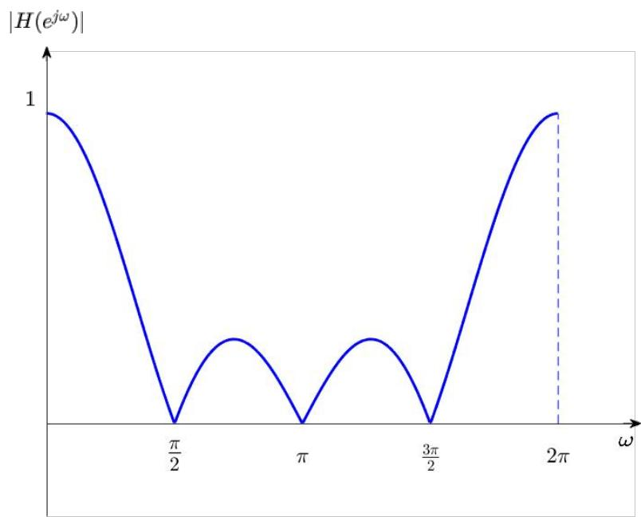