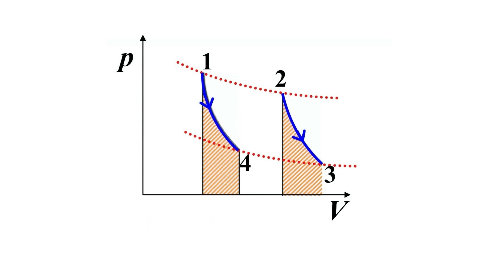
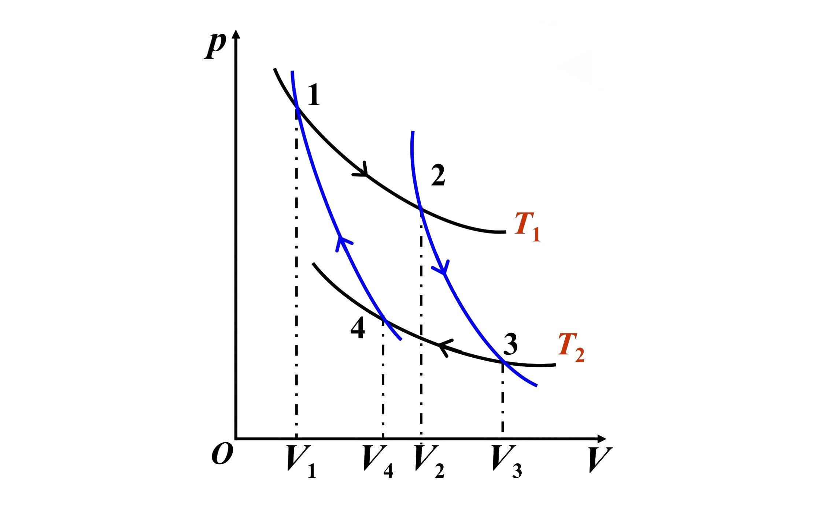

# **大学物理**

# 第七章 热力学基础

## 7.1 热力学第一定律

### 1. 热力学第一定律

$$
Q = \Delta E + A
$$

**无限小过程：**
$$
đQ = dE + đA \quad \text{——微分形式}
$$

**物理意义：**
1. 适用于任何系统的一切过程，但只有准静态过程才能计算过程中的功和能量。
2. 第一类永动机是不可能制成的。

### 2. 功与热量的表达式

#### (1) 功
$$
đA = p dV
$$
$$
A = \int dA = \int_{V_1}^{V_2} p \, dV
$$

## 7.2 理想气体的热容

- **热容：**
$$
C = \frac{đQ}{dT}
$$

- **摩尔热容 $C_m$：**
$$
C_m = \frac{C}{\upsilon}
$$

- **比热容 $c$：**
$$
c = \frac{C}{m}
$$

- **热量：**
$$
đQ = C \, dT = \upsilon \, C_m \, dT
$$
$$
Q = \int_{T_1}^{T_2} C \, dT = \upsilon \int_{T_1}^{T_2} C_m \, dT = \frac{m}{M} \int_{T_1}^{T_2} C_m \, dT
$$

- **摩尔定容热容 $C_{V,m}$：**
$$
C_{V,m} = \frac{C_V}{\upsilon} = \frac{1}{\upsilon} \left( \frac{đQ}{dT} \right)_V
$$

- **摩尔定压热容 $C_{P,m}$：**
$$
C_{P,m} = \frac{C_P}{\upsilon} = \frac{1}{\upsilon} \left( \frac{đQ}{dT} \right)_P
$$

## 7.3 热一律对理想气体的应用
### 1. 等容过程 ($dV = 0$)

- **功**: $A = 0$
- **内能与热量**: $Q = \Delta E$

因此：
$$
\Delta E = \upsilon C_{V,m} (T_2 - T_1)
$$

结合 $\Delta E = \frac{1}{2} \upsilon R \Delta T$，可得：
$$
C_{V,m} = \frac{1}{2} R
$$

**注**: 理想气体无论经历什么过程，其内能的变化均为：
$$
\boxed{\Delta E = \upsilon C_{V,m} (T_2 - T_1)}
$$

### 2. 等压过程 ($dp = 0$)

- 功: 
$$
A = p(V_2 - V_1) = \upsilon R (T_2 - T_1)
$$

- 热量:
$$
Q = E_2 - E_1 + p(V_2 - V_1)
$$

因此：
$$
C_{p,m} = \left( \frac{\partial Q}{\partial T} \right)_p = \upsilon \frac{dE}{dT} + \left( \frac{p}{\upsilon} \frac{d\upsilon}{dT} \right)_p
$$

即：
$$
C_{p,m} = C_{V,m} + R
$$

**迈耶公式**：
$$
\boxed{C_{p,m} = C_{V,m} + R}
$$

- 热量:
$$
Q = \upsilon C_{p,m} (T_2 - T_1)
$$

- 内能:
$$
\Delta E = \upsilon C_{V,m} (T_2 - T_1)
$$

- 比热容比:
$$
\gamma = \frac{C_{p,m}}{C_{V,m}} = 1 + \frac{R}{C_{V,m}} > 1
$$

对理想气体：
$$
C_{V,m} = \frac{1}{2} R, \quad C_{p,m} = \frac{2+i}{2} R, \quad \gamma = \frac{2+i}{i}
$$

### 3. 等温过程 ($dT = 0$)

- **内能**: $\Delta E = 0$
- **功和热量**: $A = Q$

功的计算：
$$
A = \int_{V_1}^{V_2} p dV = \upsilon RT \int_{V_1}^{V_2} \frac{dV}{V} = \upsilon RT \ln \frac{V_2}{V_1}
$$

即：
$$
\boxed{A = \upsilon RT \ln \frac{P_1}{P_2}}
$$

### 4. 绝热过程 ($dQ = 0$)

- **功与内能的关系**:
$$
dA = -dE
$$

#### a. 理想气体准静态绝热过程

- 功:
$$
dA = pdV
$$

- 内能变化:
$$
dE = \upsilon C_{V,m} dT
$$

因此可得：
$$
\ln p + \gamma \ln V = \text{常量}
$$

故绝热过程方程为：
$$
\begin{cases}
pV^\gamma = C_1 \\
TV^{\gamma-1} = C_2 \\
p^{\gamma-1} T^{-\gamma} = C_3
\end{cases}
$$
在 $P-V$ 图上，绝热线比等温线更陡。

##### 准静态绝热过程功的计算：
$$
\boxed{A = \frac{P_1 V_1 - P_2 V_2}{\gamma - 1}}
$$

推导过程：
$$
A = -\upsilon C_{V,m} (T_2 - T_1) = \frac{P_1 V_1 - P_2 V_2}{\gamma - 1}
$$

或：
$$
A = \int_{V_1}^{V_2} \frac{P_1 V_1^\gamma}{V^\gamma} dV = \frac{P_1 V_1^\gamma}{1 - \gamma} \left( \frac{1}{V_1^{\gamma-1}} - \frac{1}{V_2^{\gamma-1}} \right) = \frac{P_1 V_1 - P_2 V_2}{\gamma - 1}
$$

#### b. 绝热自由膨胀

- 自由膨胀：气体冲向真空，$A = 0$
- 绝热：$Q = 0$

因此：
$$
E_1 = E_2 \implies T_1 = T_2
$$

### 5. 等温线与绝热线

一定质量的理想气体系先后经历两个绝热过程，即从 1 态到 4 态，2 态到 3 态（如图所示），且 $T_1 = T_2$、$T_3 = T_4$。在 1 态与 2 态、3 态与 4 态之间可分别连接两条等温线。求证：

1. $\frac{V_2}{V_1} = \frac{V_3}{V_4}$
2. $A_{1 \to 4} = A_{2 \to 3}$

#### 证明：

##### （1）由泊松公式及状态方程可得：
$$
p V^\gamma = (\upsilon R) T V^{\gamma-1} = \text{const.}
$$
$$
T V^{\gamma-1} = \text{const.}
$$

- **1 → 4**:
$$
\frac{T_4}{T_1} = \left( \frac{V_1}{V_4} \right)^{\gamma-1}
$$

- **2 → 3**:
$$
\frac{T_3}{T_2} = \left( \frac{V_2}{V_3} \right)^{\gamma-1}
$$

考虑到 $T_1 = T_2$、$T_3 = T_4$，可得：
$$
\frac{V_2}{V_1} = \frac{V_3}{V_4}
$$

##### （2）绝热过程中功的计算公式：
$$
A_{1 \to 4} = \frac{1}{\gamma - 1} (p_1 V_1 - p_4 V_4) = -\Delta E_{1 \to 4}
$$
$$
A_{2 \to 3} = \frac{1}{\gamma - 1} (p_2 V_2 - p_3 V_3) = -\Delta E_{2 \to 3}
$$

由于 $T_1 = T_2$ 和 $T_3 = T_4$，内能变化相等，即：
$$
\Delta E_{1 \to 4} = \Delta E_{2 \to 3}
$$

因此：
$$
A_{1 \to 4} = A_{2 \to 3}
$$

#### 结论：
在两条等温线之间，沿任意两条绝热线，系统对外界作功相等。

$$
\boxed{\frac{V_2}{V_1} = \frac{V_3}{V_4}, \quad A_{1 \to 4} = A_{2 \to 3}}
$$

## 7.4 循环过程&卡诺循环

### 1. 正循环

- **特征**：
  - $PV$ 图中沿顺时针方向进行，也称为热循环。
  - 对外作净功等于循环闭合曲线所围成的面积。

一定质量的工质在一次循环过程中要从高温热源吸热 $Q_1$，对外作净功 $A = A_1 - A_2$，又向低温热源放出热量 $Q_2$。而工质回到初态，内能不变。

$$
A = Q_1 - Q_2
$$

$$
\eta = \frac{A}{Q_1} = 1 - \frac{Q_2}{Q_1}
$$

### 2. 卡诺循环

卡诺循环由 4 个准静态过程（两个等温、两个绝热）组成。按卡诺循环工作的热机称为卡诺热机。讨论以理想气体为工质的卡诺循环。

#### 过程描述：

1. **1 → 2：与温度为 $T_1$ 的高温热源接触，$T_1$ 不变，体积由 $V_1$ 膨胀到 $V_2$，从热源吸收热量为：**

   $$
   Q_1 = \upsilon R T_1 \ln \frac{V_2}{V_1}
   $$

2. **2 → 3：绝热膨胀，体积由 $V_2$ 变到 $V_3$，吸热为零。**

3. **3 → 4：与温度为 $T_2$ 的低温热源接触，$T_2$ 不变，体积由 $V_3$ 压缩到 $V_4$，向热源放热为：**

   $$
   Q_2 = \upsilon R T_2 \ln \frac{V_3}{V_4}
   $$

4. **4 → 1：绝热压缩，体积由 $V_4$ 变到 $V_1$，吸热为零。**

#### 净功计算：

在一次循环中，气体对外作净功为：

$$
A = Q_1 - Q_2
$$

#### 效率计算：

效率为：

$$
\eta = \frac{A}{Q_1} = 1 - \frac{Q_2}{Q_1}
$$

由等温线与绝热线的结果知：

$$
\frac{V_3}{V_4} = \frac{V_2}{V_1}, \quad \text{即} \quad \frac{Q_2}{Q_1} = \frac{T_2}{T_1}
$$

所以：

$$
\boxed{\eta = 1 - \frac{T_2}{T_1}}
$$

#### 结论：

- 理想气体卡诺循环的效率只与两热源的温度有关。
- 可以证明，在同样两个温度 $T_1$ 和 $T_2$ 之间工作的各种工质的卡诺循环的效率都由上式给出，而且是实际热机可能效率的最大值。

### 3. (逆)致冷循环

工质借助于外界做的功，把从低温热源吸收的热量和外界对它所作的功以热量的形式传给高温热源，其结果可使低温热源的温度更低，达到制冷的目的。

#### 制冷系数 $\omega$：
吸热越多，外界作功越少，表明制冷机效能越好。
$$
\omega = \frac{Q_2}{A} = \frac{Q_2}{Q_1 - Q_2}
$$

**以理想气体为工质的卡诺制冷循环的制冷系数为**
$$
\omega = \frac{T_2}{T_1 - T_2} = \frac{1}{\frac{T_1}{T_2} - 1}
$$

### 4. 通过 $p-V$ 确定准静态过程的温度和热量

a. 用等温线簇判断过程温度变化。
b. 结合等值过程、绝热过程构造循环判断热量。

## 7.5 热力学第二定律

### 1. 不可逆过程

#### (1) 热传导
- **注**：热量可以从低温传向高温物体，但需要外界做功。

#### (2) 功热转换
- 功变热可以自动实现，但热变功不可能自动实现。
- **注**：热机是利用热量做功，但必定要向低温热源传递能量。  
  热量甚至可以全部转化为功，如理想气体的等温膨胀过程，但气体的体积膨胀了，引起了其它变化。

#### (3) 气体自由膨胀

#### 结论：
一切与热现象有关的宏观自然过程都是不可逆的。

### 2. 可逆过程（只能接近，不能真正达到）

#### 条件：
1. 过程要无限缓慢进行，即为准静态过程。
2. 无摩擦力、粘滞力或其他耗散力做功。

### 3. 热力学第二定律

#### (1) 克劳修斯表述：
$$
\text{热量不可能自动地由低温物体向高温物体传导（而不引起其他变化）。}
$$

#### (2) 开尔文表述：
$$
\text{不可能制成一种循环动作的热机，只从单一热源吸取热量，使之完全变成有用的功而不产生其他影响。}
$$

#### 等价说法：
第二类永动机（单热源）是不可能制成的。

# 第八章 静电场

## 8.1 电荷与库仑定律
在真空中两个点电荷 $q_1$ 和 $q_2$ 之间的相互作用力为：

$$
\vec{F} = k \frac{q_1 q_2}{r^2} \hat{e}_r
$$

其中，

$$
k = \frac{1}{4\pi \varepsilon_0} = 8.988 \times 10^9 \, \text{N} \cdot \text{m}^2 / \text{C}^2
$$

$$
\varepsilon_0 = 8.85 \times 10^{-12} \, \text{C}^2 / (\text{N} \cdot \text{m}^2) \quad \text{——真空中的介电常量（电容率）}
$$
## 8.2 静电场 电场强度
#### 1. 点电荷 $q$ 的电场

$$
\vec{E} = \frac{q}{4\pi \varepsilon_0 r^2} \vec{e}_r
$$
#### 2. 均匀带电细棒中垂面上的电场分布（棒长 $L$，电荷线密度 $\lambda$）

$$
E = \frac{\lambda L}{4\pi \varepsilon_0 x \sqrt{x^2 + \frac{L^2}{4}}}
$$

当 $L \gg x$ 时，

$$
E = \frac{\lambda}{2\pi \varepsilon_0 x}
$$

#### 3. 均匀带电无限大平面的电场分布（面密度 $\sigma$）

$$
E = \frac{\sigma}{2\varepsilon_0}, \quad \text{方向垂直于平面}
$$

#### 4. 均匀带电圆环轴线上的电场分布（带电量为 $Q$，半径为 $R$）

$$
E = \frac{Qx}{4\pi \varepsilon_0 (R^2 + x^2)^{\frac{3}{2}}}
$$

#### 5. 均匀带电圆盘轴线上的电场分布（面密度 $\sigma$，半径为 $R$）

$$
E = \frac{\sigma}{2\varepsilon_0} \left(1 - \frac{x}{\sqrt{x^2 + R^2}}\right)
$$

## 8.3 静电场的高斯定理
#### 当 $ S $ 为闭合曲面时

$$
\Phi_E = \oint_S \vec{E} \cdot d\vec{S} = \frac{1}{\varepsilon_0} \sum_{S内} q_i
$$

#### 1. 均匀带电球面电场分布（半径为 $ R $，电量为 $ +Q $）

$$
E =
\begin{cases}
0, & r < R \\
\frac{Q}{4\pi \varepsilon_0 r^2}, & r > R
\end{cases}
$$

#### 2. 均匀带电球体电场分布（半径为 $ R $，电量为 $ Q $）

$$
E =
\begin{cases}
\frac{\rho}{3\varepsilon_0} r, & r < R \\
\frac{Q}{4\pi \varepsilon_0 r^2}, & r > R
\end{cases}
$$

## 8.4 静电场中的环路定理

**静电场环路定理**：在静电场中，场强沿任意闭合路径的线积分等于零。

$$
\oint_S \vec{E} \cdot d\vec{l} = 0
$$

## 8.5 电势差和电势

静电力做功：
$$
A_{ab} = W_a - W_b = q_0 \int_a^b \vec{E} \cdot d\vec{l} = q_0 (V_a - V_b)
$$

电势差：
$$
V_a - V_b = \int_a^b \vec{E} \cdot d\vec{l}
$$

电势：
$$
V_p = \int_p^{V=0} \vec{E} \cdot d\vec{l}
$$

电势梯度：
电场沿某方向的分量：$E_l = -\frac{dV}{dl}$
电场：$\vec{E} = -\nabla V$

#### 1. 均匀带电球面（半径为 $R$，电量为 $Q$）
$$
V =
\begin{cases}
\frac{Q}{4\pi \epsilon_0 R} & r < R \\
\frac{Q}{4\pi \epsilon_0 r} & r > R
\end{cases}
$$

#### 2. 均匀带电无限长圆柱体（半径为 $R$，体密度为 $\rho$）
$$
E =
\begin{cases}
\frac{\rho r}{2\epsilon_0} & r < R \\
\frac{\rho R^2}{2\epsilon_0 r} = \frac{\lambda}{2\pi \epsilon_0 r} & r > R
\end{cases}
$$

##### 注：电荷分布扩展到无穷远时，电势零点不能选在无穷远。
取 $r = R$ 处 $V = 0$：
$$
V_p =
\begin{cases}
\int_R^{V=0} \frac{\rho R^2}{2\epsilon_0 r} dr = -\frac{\rho R^2}{2\epsilon_0} \ln \frac{r}{R} < 0, & r > R \\
\int_r^R \frac{\rho}{2\epsilon_0} r dr = \frac{\rho}{4\epsilon_0} (R^2 - r^2) > 0, & r < R
\end{cases}
$$
在 $r = 0$ 处，$V_{\text{max}} = \frac{\rho}{4\epsilon_0} R^2$

## 8.6 静电场中的导体
#### 1. 导体静电平衡条件

- **条件**：
  1. 导体内任何一点的场强为 0，即：
     $$
     \vec{E}_{\text{内}} = 0
     $$
  2. 导体表面任何一点的场强垂直于表面，即：
     $$
     \vec{E}_{\text{表面}} \perp \text{表面}
     $$

- **推论**：
  1. 导体是等势体。
  2. 导体表面是等势面。

#### 2. 导体上电荷分布

##### （1）导体无空腔：电荷只分布在导体表面

##### （2）空腔导体

- **a. 内有带电体 $ q $**
  - 内表面有感应电荷 $ -q $
  - 外表面有感应电荷 $ Q + q $
  - 电场：
    $$
    E_{\text{内}} = 0, \quad E_{\text{外}} = 0
    $$
    即空腔静电屏蔽。

- **b. 内无带电体**
  - 电荷分布在导体外表面，内表面无电荷。
  - **结论**：空腔不受外部带电体影响。

#### 3. 导体表面上场强与电荷面密度的关系

导体表面上的场强为：
$$
E = \frac{\sigma}{\epsilon_0}, \quad \text{方向垂直于表面}
$$

#### 4. 电荷面密度与导体表面曲率的关系

孤立导体表面的电荷面密度与曲率半径成反比：
$$
\sigma \propto \frac{1}{R}
$$
即曲率越大，电荷面密度越大。

#### 5. 静电屏蔽

##### （1）空腔导体屏蔽外电场
- 要维持电势不变可接地。

##### （2）消除空腔内导体对外影响。

## 8.7 静电场中的电介质

### 1. 极化强度与极化电荷

#### (1) 极化强度矢量 $\vec{P}$
$$
\vec{P} = \frac{\sum \vec{p}_i}{\Delta V} \quad (\text{单位体积内所有分子的电偶极矩矢量和})
$$
$\vec{P}$ 与 $\vec{E}$ 成正比：
$$
\vec{P} = \epsilon_0 (\epsilon_r - 1) \vec{E}
$$
其中 $\epsilon_r$ 为相对介电常数，$\epsilon_r > 1$（真空为 1）。
$$
\chi_e = \epsilon_r - 1, \quad \text{为极化率，即 } \vec{P} = \chi_e \epsilon_0 \vec{E}.
$$

#### (2) 介质内的静电场（$\vec{E}$ 为外电场）
$$
\vec{E} = \frac{\vec{F}}{q}
$$

#### (3) 极化强度与束缚电荷密度的关系
$$
\sigma' = P \cos \theta \quad (\theta \text{ 为 } \vec{P} \text{ 与介质表面外法线夹角})
$$

### 2. 介质中静电场的基本规律
$$
\vec{E} = \vec{E}_0 + \vec{E}'
$$
$$
\vec{E}' = \frac{1}{\epsilon_r} \vec{E}_0
$$
故：
$$
\oint_S \epsilon_r \epsilon_0 \vec{E} \cdot d\vec{S} = \sum q_{\text{自}}
$$
引入：
$$
\vec{D} = \epsilon \vec{E} \quad (\text{电位移矢量})
$$
故：
$$
\oint_S \vec{D} \cdot d\vec{S} = \sum q_{\text{自}} \quad (\text{有介质空间的高斯定理})
$$

### 3. 归纳

#### (1) 有介质存在时，出现三个物理量 $\vec{E}, \vec{P}, \vec{D}$
$$
\vec{P} = \chi_e \epsilon_0 \vec{E}, \quad \vec{D} = \epsilon_0 \vec{E} + \vec{P}
$$
$$
\vec{D} = \epsilon_r \epsilon_0 \vec{E}
$$

#### (2) 四个量的关系
$$
\epsilon = \epsilon_r \epsilon_0
$$
$$
\epsilon_r = 1 + \chi_e
$$

#### (3) 解题一般步骤
$$
q_{\text{自}} \longrightarrow \oint_S \vec{D} \cdot d\vec{S} = \sum q_{\text{自}} \longrightarrow \vec{D} \longrightarrow \vec{E} = \frac{\vec{D}}{\epsilon} \longrightarrow \vec{P} = \chi_e \epsilon_0 \vec{E}\longrightarrow \sigma'
$$

### 4. 电容和电容器

#### (1) 孤立导体电容：
$$
C = \frac{q}{V}
$$

#### (2) 电容器的电容：
$$
C = \frac{q}{\Delta V} = \frac{q}{V} \quad (V \text{ 为电容器电压})
$$

##### a. 平行板电容器
- **电容器内无介质时：**
$$
E = \frac{\sigma}{\epsilon_0} = \frac{q}{\epsilon_0 S}
$$
$$
\Delta V = \int E \, d\vec{l} = Ed = \frac{qd}{\epsilon_0 S}
$$
故：
$$
C_0 = \frac{\epsilon_0 S}{d} \quad (\text{真空时 } \epsilon_r = 1)
$$

- **电容器内充满介质时：**
$$
E = \frac{D}{\epsilon} = \frac{\sigma}{\epsilon}
$$
$$
\Delta V = Ed = \frac{\sigma d}{\epsilon} = \frac{qd}{\epsilon S}
$$
$$
C = \frac{q}{\Delta V} = \frac{\epsilon_0 \epsilon_r S}{d}
$$

##### b. 球形电容器
$$
E = \frac{q}{4\pi \epsilon_0 \epsilon_r r^2}, \quad R_1 < r < R_2
$$
$$
V = \int_{R_1}^{R_2} E \, dr = \frac{q}{4\pi \epsilon_0 \epsilon_r} \left( \frac{1}{R_1} - \frac{1}{R_2} \right)
$$
$$
C = \frac{q}{V} = \frac{4\pi \epsilon_0 \epsilon_r R_1 R_2}{R_2 - R_1}
$$

##### c. 圆柱形电容器
- 设两圆柱面单位长度上分别带电 $ \lambda $：
$$
\oint_S \vec{D} \cdot d\vec{S} = D \cdot 2\pi r L = \lambda L
$$
$$
D = \frac{\lambda}{2\pi r}, \quad E = \frac{\lambda}{2\pi \epsilon_0 \epsilon_r r} \quad (R_1 < r < R_2)
$$
$$
\Delta V = \int_{R_1}^{R_2} E \, dr = \frac{\lambda}{2\pi \epsilon_0 \epsilon_r} \ln \frac{R_2}{R_1}
$$
$$
C = \frac{\lambda L}{\Delta V} = \frac{2\pi \epsilon_0 \epsilon_r L}{\ln \frac{R_2}{R_1}}
$$

#### (3) 电容器的串联和并联
##### a. 并联：
$$
C = \sum C_i
$$
电容增大，但耐压不够。

##### b. 串联：
$$
\frac{1}{C} = \sum \frac{1}{C_i}
$$
电容减小，但耐压增强。

## 8.8 静电场的能量

### 1. 电荷在外电场中的静电势能

**静电势能**：
$$
W = qV
$$

### 2. 带电体系的静电能

电荷系统的静电能：
$$
W_{\text{总}} = W_{\text{互}} + W_{\text{自}}
$$

#### (1) 点电荷的互能
$$
W = \frac{1}{2} \sum_{i=1}^n q_i V_i
$$

#### (2) 电荷连续分布的带电体的静电能
$$
W = \frac{1}{2} \int_V V \, dq
$$

### 3. 电容器的静电能
$$
W = \frac{1}{2} \frac{Q^2}{C} = \frac{1}{2} CV^2 = \frac{1}{2} QV
$$

### 4. 电场的能量

#### (1) 电场能量密度
$$
w_e = \frac{1}{2} \epsilon E^2 = \frac{1}{2} D \cdot E = \frac{1}{2} \vec{D} \cdot \vec{E}
$$

#### (2) 电场能量
$$
W = \int_V \frac{1}{2} \epsilon E^2 \, dV = \int_V \frac{1}{2} \epsilon_0 \epsilon_r E^2 \, dV
$$

### 4. 插入介质对电容器的电容、电量、电压、电场和静电能的影响

#### ✅ 情况一：保持与电源连接（充电中）

> **前提条件：** 电源提供恒定电压 $ V $，即电容器两端电压不变。

##### 影响分析：

| 物理量 | 变化情况 | 原因 |
|--------|-----------|------|
| **电容 $ C $** | 增大为原来的 $ \epsilon_r $ 倍 | $ C = \epsilon_r C_0 $ |
| **电压 $ V $** | 不变 | 由电源维持不变 |
| **电量 $ q $** | 增大为原来的 $ \epsilon_r $ 倍 | $ q = C V $，$ C $ 增大 |
| **电场 $ E $** | 不变 | $ E = \frac{V}{d} $，$ V $ 和 $ d $ 不变 |
| **静电能 $ W_e $** | 增大为原来的 $ \epsilon_r $ 倍 | $ W_e = \frac{1}{2} C V^2 $，$ C $ 增大 |

##### 🔍 结论：
在保持与电源连接的情况下，插入介质会使得电容增大，从而导致电荷增加、储能增加，但电压和电场均保持不变。

#### ✅ 情况二：充电后与电源断开

> **前提条件：** 电容器已充电并断开电源，电荷 $ q $ 保持不变。

##### 影响分析：

| 物理量 | 变化情况 | 原因 |
|--------|-----------|------|
| **电容 $ C $** | 增大为原来的 $ \epsilon_r $ 倍 | $ C = \epsilon_r C_0 $ |
| **电量 $ q $** | 不变 | 因为与电源断开，电荷无法进出 |
| **电压 $ V $** | 减小为原来的 $ \frac{1}{\epsilon_r} $ 倍 | $ V = \frac{q}{C} $，$ C $ 增大 |
| **电场 $ E $** | 减小为原来的 $ \frac{1}{\epsilon_r} $ 倍 | $ E = \frac{V}{d} $，$ V $ 减小 |
| **静电能 $ W_e $** | 减小为原来的 $ \frac{1}{\epsilon_r} $ 倍 | $ W_e = \frac{1}{2} \frac{q^2}{C} $，$ C $ 增大 |

##### 🔍 结论：
在断开电源后插入介质，由于电荷守恒，电容增大将导致电压降低、电场减弱、储能减少。

#### 📊 总结对比表

| 条件 | 电容 $ C $ | 电压 $ V $ | 电荷 $ q $ | 电场 $ E $ | 静电能 $ W_e $ |
|------|---------------|----------------|----------------|----------------|--------------------|
| 保持与电源连接 | ↑（×$\epsilon_r$） | — | ↑（×$\epsilon_r$） | — | ↑（×$\epsilon_r$） |
| 充电后断开电源 | ↑（×$\epsilon_r$） | ↓（÷$\epsilon_r$） | — | ↓（÷$\epsilon_r$） | ↓（÷$\epsilon_r$） |