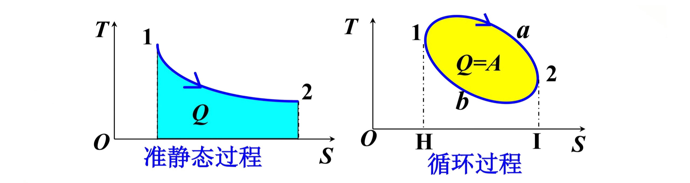
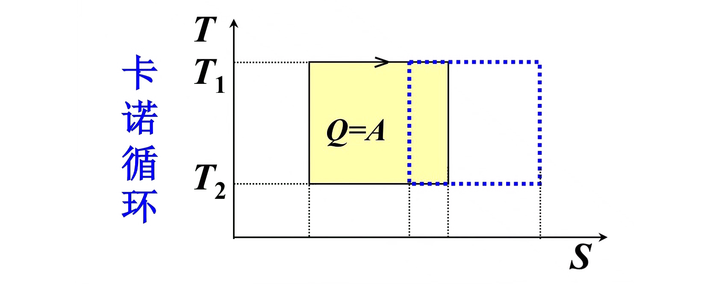

# **大学物理**

# 第二章 牛顿运动定律

## 2.1 牛顿运动定律

### 1. 牛顿第一定律

任何物体都保持静止或沿直线作匀速运动的状态，除非有力加于其上迫使它改变这种状态。

**数学表达式：**
$$
\vec{F} = 0, \quad \vec{v} = \text{常量}
$$

### 2. 牛顿第二定律

运动的改变与所加的动力成正比，并且发生在该力所沿直线的方向上。

**数学表达式：**
$$
\vec{F} = \frac{d(m\vec{v})}{dt}
$$

若 $v \ll c$，$m = \text{常量}$，则有：
$$
\vec{F} = m\vec{a}
$$

### 3. 牛顿第三定律

每一个作用总有一个相等的反作用与它对抗；或者说，两个物体之间的相互作用永远相等并且指向对方。

**数学表达式：**
$$
\vec{F}_1 = -\vec{F}_2
$$

### 4. 惯性参考系

定义牛顿第一定律成立的参考系为惯性参考系，否则为非惯性参考系。

## 2.2 基本力简介

### 1. 万有引力

$$
F = G \frac{m_1 m_2}{r^2} \quad G = 6.67 \times 10^{-11} \, \text{Nm}^2/\text{kg}^2
$$

### 2. 电磁力

带电物体间的相互作用力。

- 弹性力、摩擦力、分子力、浮力、流体压力等本质上都属于电磁力。

### 3. 强力

存在于核子、介子和超子间的一种力。

### 4. 弱力（弱相互作用）

存在于许多粒子之间，但仅在某些反应（如 β 衰变）中才显得重要。

## 2.3 应用牛顿定律

## 2.4 惯性力

### 非惯性系中力和运动的关系

$$
\begin{cases}
\vec{F} = m \vec{a} \\
\vec{a} = \vec{a}' + \vec{a}_0 \quad (\text{牵连速度不为 0})
\end{cases}
$$

- **方向不变：加速平动参照系**
- **大小不变：转动参考系**

### 1. 加速平动参照系

牛顿定律在 $S'$ 中不成立。

$$
\vec{F} = m \vec{a}' + m \vec{a}_0, \quad \text{即 } \vec{F} + (-m \vec{a}_0) = m \vec{a}'
$$

**惯性力：**
$$
\vec{F}_i = -m \vec{a}_0
$$

故在非惯性系中牛顿定律：
$$
\vec{F} + \vec{F}_i = m \vec{a}'
$$

#### 力的定义

- 力是物体间的相互作用（狭义）
- 力使物体运动状态发生改变（广义）

### 2. 转动参考系

物体在转动系中受两种惯性力：

$$
\begin{cases}
\vec{F}_c = m \omega^2 \vec{r} \\
\vec{f}_c = 2 m \vec{v}' \times \vec{\omega}
\end{cases}
$$

#### **a. 离心惯性力（$\vec{F}_c = m \omega^2 \vec{r}$）**

- **定义**：当参考系绕某点旋转时，物体在该参考系中会感受到一个向外的“虚拟力”。
- **方向**：沿半径方向向外。
- **原因**：由于参考系本身在旋转，牛顿定律不再直接适用。
- **例子**：坐在旋转木马上感觉被甩出去的感觉。

#### **b. 科里奥利力（$\vec{f}_c = 2m \vec{v}' \times \vec{\omega}$）**

- **定义**：当物体在转动参考系中运动时，所观察到的一个横向偏转力。
- **方向**：垂直于物体速度 $\vec{v}'$ 和角速度 $\vec{\omega}$ 所构成的平面。
- **特点**：只在物体相对于转动系运动时才出现。
- **例子**：地球上北半球河流右岸侵蚀更严重、台风旋转方向等都与此有关。

## 2.5 冲量与动量定理

### 1. 动量

**定义：** 动量是表示物体运动状态的物理量。

$$
\vec{p} = m \vec{v}
$$

- **矢量**：动量是一个矢量，其方向与速度 $\vec{v}$ 的方向相同。
- **单位**：千克·米/秒（kg·m/s）。
- **特点**：动量与参考系和坐标系的选择有关。

### 2. 冲量

**定义：** 冲量是描述力的时间累积作用的物理量。

#### 1. 恒力的冲量
$$
\vec{I} = \vec{F} \Delta t
$$
- **矢量**：冲量是一个矢量，其方向与力 $\vec{F}$ 的方向相同。
- **单位**：牛顿·秒（N·s）。

#### 2. 变力的冲量
- **元冲量**：
$$
d\vec{I} = \vec{F} dt
$$
- **总冲量**：
$$
\vec{I} = \int_{t_1}^{t_2} \vec{F}(t) \, dt
$$

### 3. 动量定理

#### 牛顿第二定律：
牛顿第二定律的表达式为：
$$
\vec{F} = \frac{\mathrm{d}(m\vec{v})}{\mathrm{dt}}
$$
改写为：
$$
\vec{F}\,\mathrm{d}t = \mathrm{d}\vec{p}
$$
——这是**质点动量定理的微分形式**。

#### 对上式积分：
对上述微分形式进行积分，得到：
$$
\vec{I} = \int_{t_1}^{t_2} \vec{F}(t)\,\mathrm{d}t = \int_{\vec{p}_1}^{\vec{p}_2} \mathrm{d}\vec{p} = \vec{p}_2 - \vec{p}_1 = m\vec{v}_2 - m\vec{v}_1
$$
——这是**质点动量定理的积分形式**。

#### 动量定理的适用性：
- **适用于惯性参考系**：在惯性参考系中，动量定理可以直接应用。
- **在非惯性参考系中**：必须考虑惯性力的冲量。

### 4. 平均冲力

动量定理常用于碰撞和打击等过程。在这些过程中，物体间相互作用时间很短，但力却很大，且随时间变化，这种力叫 **冲力**。

冲力的瞬时值很难确定，为了对冲力的大小有一个估计，引入 **平均冲力**，它为冲力对碰撞时间的平均值：

$$
\vec{F}_{\text{avg}} = \frac{1}{t_2 - t_1} \int_{t_1}^{t_2} \vec{F}(t) \, \mathrm{d}t = \frac{\vec{I}}{t_2 - t_1} = \frac{\vec{p}_2 - \vec{p}_1}{t_2 - t_1}
$$

#### 分量式：
$$
\vec{F}_{x} \Delta t = I_x = \Delta p_x
$$

## 2.6 质点系的动量定理

### 1. 质点系的动量定理

**质点系：** 由有相互作用的若干个质点组成的系统。

- **内力：** 系统内各质点间的相互作用力。
- **外力：** 系统外质点对系统内质点的作用力。

在 $t_1$ 到 $t_2$ 这段时间内：

$$
\left( \int_{t_1}^{t_2} \sum_{i=1}^n \vec{F}_{i, \text{外}} \, \mathrm{d}t \right) = \sum_{i=1}^n \vec{p}_{i2} - \sum_{i=1}^n \vec{p}_{i1}
$$

——**质点系动量定理的积分形式**

系统的动量定理表明，一个系统的总动量的变化仅决定于系统所受的外力，而与系统的内力无关。因此，在有些问题中，可以通过选择研究对象把一些比较复杂或未知的相互作用力化为内力来处理，从而使问题简化。

### 2. 质点系的动量守恒定律

当 $\sum_{i=1}^n \vec{F}_{i, \text{外}} \, \mathrm{d}t = 0$ 时：

$$
\sum_{i=1}^n \vec{p}_{i2} = \sum_{i=1}^n \vec{p}_{i1} = \text{恒矢量}
$$

即：

$$
\sum_{i=1}^n m_i \vec{v}_2 = \sum_{i=1}^n m_i \vec{v}_1 = \text{恒矢量}
$$

说明当质点系不受外力，或虽受外力，但外力的矢量和为零时，系统的总动量保持不变（守恒）。

#### 应用动量守恒定律时，应注意：

1. **系统总动量守恒，但每个质点的动量可能变化。**
2. 在碰撞、打击、爆炸等相互作用时间极短的过程中，外力比系统的内力小得多，往往可忽略外力。
   - 可认为过程前后系统的总动量守恒。
3. **动量守恒可在某一方向上成立。**
   - 如当 $\sum_{i=1}^n F_{i, \text{外}, x} = 0$ 时，$\sum_{i=1}^n p_{ix} = \text{恒矢量}$。
4. **定律中的速度应是对同一惯性系的速度，动量和应是同一时刻的动量之和。**
5. 动量守恒定律在微观、高速领域仍适用。是自然界最基本的**普适定律**之一。
6. 动量守恒定律只适用于**惯性系**。

### 3. 变质量问题——火箭飞行原理

设 $t$ 时刻火箭质量为 $m$，取为研究的质点系。

- $t$ 时刻动量：$\vec{p}_1 = m \vec{v}$ 
- $t + \mathrm{d}t$ 时刻动量：$\vec{p}_2 = (m + \mathrm{d}m)(\vec{v} + \mathrm{d}\vec{v}) + (-\mathrm{d}m)\vec{v}'$ （$\vec{v}' = \vec{u} + \vec{v}$）（此处 $\mathrm{d}m < 0$）
- 系统受外力：$\vec{F}$

由动量定理：

$$
\vec{F} \, \mathrm{d}t = \vec{p}_2 - \vec{p}_1
$$

$$
= (m + \mathrm{d}m)(\vec{v} + \mathrm{d}\vec{v}) + (-\mathrm{d}m)(\vec{u} + \vec{v}) - m \vec{v}
$$

$$
= m \mathrm{d}\vec{v} - \vec{u} \mathrm{d}m
$$

$$
\boxed{\vec{F} = m \frac{\mathrm{d}\vec{v}}{\mathrm{d}t} - \vec{u} \frac{\mathrm{d}m}{\mathrm{d}t}}
$$

——**密歇尔斯基方程**

- $\vec{v}$：火箭在某一时刻的速度（相对于惯性参考系，如地面）
- $\vec{u}$：喷出燃料相对于火箭的速度（通常是向后的，所以常为负值）
- $\vec{u} \frac{\mathrm{d}m}{\mathrm{d}t}$ : 火箭发动机推力

## 2.7 角动量

###  1.质点的角动量

**描述质点转动状态的物理量。**

#### 1. 定义：质点对定点 $O$ 的角动量：
$$
\vec{L} = \vec{r} \times \vec{p} = \vec{r} \times (m \vec{v})
$$
- **矢量**：$\vec{L}$ 是一个矢量。
- **大小**：$L = r p \sin \alpha$
- **方向**：垂直于 $\vec{r}$ 和 $\vec{p}$ 所决定的平面，指向用右手螺旋法则确定。
- **单位**：kg·m²/s。

#### 2. 圆周运动质点对圆心的角动量：
$$
L = r p = m r v = m r^2 \omega
$$
- **公式**：$\vec{L} = m r^2 \vec{\omega}$
- **说明**：角动量与参考系以及定点 $O$ 有关。

###  2.角动量定理

#### 1. 力矩：力对定点 $O$ 的力矩定义为：
$$
\vec{M} = \vec{r} \times \vec{F}
$$
- **矢量**：$\vec{M}$ 是一个矢量。
- **大小**：$M = r F \sin \alpha = r_\perp F$，其中 $r_\perp$ 称为力臂。
- **方向**：由右手螺旋法则确定。
- **说明**：力矩与参考点 $O$ 有关。
- **单位**：牛顿·米 (N·m)。

#### 2. 质点的角动量定理：

$$
\boxed{\vec{M} = \frac{\mathrm{d}\vec{L}}{\mathrm{d}t}}
$$

**说明**：质点所受的合外力对定点的力矩等于质点对同一定点的角动量对时间的变化率。

- **微分形式**：$\mathrm{d}\vec{L} = \vec{M} \, \mathrm{d}t$
- **积分形式**：
$$
\int_{t_1}^{t_2} \vec{M} \, \mathrm{d}t = \int_{L_1}^{L_2} \mathrm{d}\vec{L} = \vec{L}_2 - \vec{L}_1
$$
  式中 $\int_{t_1}^{t_2} \vec{M} \, \mathrm{d}t$ 是在 $t_1$ 到 $t_2$ 这段时间内作用在质点上的合力矩对某一定点的冲量矩。单位为牛顿·米·秒。

**说明**：在 $t_1$ 到 $t_2$ 时间内作用在质点上的合力矩等于质点在这段时间内对同一定点的角动量的增量。

**注意**：角动量定理只适用于惯性系。在非惯性系中，必须考虑惯性力的力矩。

###  3. 质点的角动量守恒定律

当 $\vec{M} = \vec{r} \times \vec{F} = 0$ 时，$\frac{\mathrm{d}\vec{L}}{\mathrm{d}t} = 0$，$\vec{L} = \vec{r} \times \vec{p}$ 为常矢量。

**说明**：当质点所受的合外力对定点的力矩等于零时，质点对该点的角动量守恒。

- **分量式**：若 $M_i = 0$，则 $L_i =$ 常量。

**角动量守恒定律是自然界又一条基本的普适定律。**

###  4. 有心力

质点所受的力的作用线始终通过某固定点，该力称为有心力，该点称为力心。

由于有心力对力心的力矩为零，质点对该力心的角动量一定守恒。

**应用**：可用于研究质点绕固定点运动的情况，如行星、卫星的运动，电子绕原子核的运动等。

###  5. 质点系的角动量定理和角动量守恒定律

#### 1. 质点系的角动量定理：
$$
\vec{M} = \frac{\mathrm{d}\vec{L}}{\mathrm{d}t}
$$

#### 2. 质点系的角动量守恒定律：
若 $\vec{M} = 0$，则 $\vec{L} =$ 常矢量。

## 2.8 功 功率

### 1. 功的定义

**定义：** 力在位移方向上的分量与该位移大小的乘积。

设质点在力 $\vec{F}$ 的作用下发生无限小位移 $\mathrm{d}\vec{r}$，则功（元功）为：
$$
\mathrm{d}A = F \cos \alpha \cdot |\mathrm{d}\vec{r}| = \vec{F} \cdot \mathrm{d}\vec{r}
$$

- **元功等于质点所受的力和它的元位移的点积。**
- **功为标量，它没有方向，但有正负：**
  1. 当 $0 \leq \alpha < \frac{\pi}{2}$ 时，$\mathrm{d}A > 0$，力对质点做正功；
  2. 当 $\frac{\pi}{2} < \alpha \leq \pi$ 时，$\mathrm{d}A < 0$，力对质点做负功；
  3. 当 $\alpha = \frac{\pi}{2}$ 时，$\mathrm{d}A = 0$，力对质点不做功。

### 2. 变力的功

**定义：** 等于力沿轨道的线积分，与过程有关。

设质点从位置 $a$ 到位置 $b$，则变力的功为：
$$
A_{ab} = \int_{L_a}^{L_b} \mathrm{d}A = \int_{L_a}^{L_b} \vec{F} \cdot \mathrm{d}\vec{r}
$$

- **功为过程量。**
- **功的计算与参考系有关。**

### 3. 功率

**定义：** 为衡量力做功的快慢程度的物理量。

功率公式为：
$$
P = \frac{\mathrm{d}A}{\mathrm{d}t} = \frac{\vec{F} \cdot \mathrm{d}\vec{r}}{\mathrm{d}t} = \vec{F} \cdot \vec{v} = F v \cos \alpha
$$

- **功率愈大，做同样的功所花费的时间就愈少，做功的效率也愈高。**
- **功率的单位为瓦特（1 W = 1 J/s）。**

## 2.9 动能 动能定理

#### 合外力做的总功

$$
A_{ab} = \frac{1}{2} m v_b^2 - \frac{1}{2} m v_a^2
$$

#### 定义质点的动能

定义质点的动能为：
$$
E_k = \frac{1}{2} m v^2
$$
- **动能为状态量。**

#### 质点的动能定理

$$
A_{ab} = E_{kb} - E_{ka} = \Delta E_k
$$

#### 动能定理的适用范围

- 动能定理适用于惯性系。
- 在非惯性系中，应考虑惯性力的功。

## 2.10 保守力 势能

### 一、几种常见的保守力做功

#### 1. 重力做功：
$$
A_{ab} = -mg(h_b - h_a)
$$

#### 2. 弹力做功：
$$
A_{ab} = \int_a^b (-kx) \, \mathrm{d}x = -\left(\frac{1}{2} k x_b^2 - \frac{1}{2} k x_a^2\right)
$$

#### 3. 万有引力做功：

$$
A_{ab} = \int_{r_a}^{r_b} -G \frac{Mm}{r^2} \, \mathrm{d}r = -\left(-G \frac{Mm}{r_b} - \left(-G \frac{Mm}{r_a}\right)\right)
$$

**一切有心力都是保守力 → 势能**

#### 保守力沿任意闭合路径的功为 0：
$$
\oint \vec{F} \cdot \mathrm{d}\vec{r} = 0
$$

### 二、势能

存在一个由质点位置决定的函数 —— 势能函数。

#### 保守力做功为势能增量的负值：

$$
A_{ab} = E_{pa} - E_{pb} = -\Delta E_p
$$

##### 势能公式：

$$
E_p = A_{ab} = \int_a^b \vec{F}_{\text{保}} \cdot \mathrm{d}\vec{r}
$$

- **重力势能**：$E_p = mgh$
- **弹性势能**：$E_p = \frac{1}{2} k x^2$
- **引力势能**：$E_p = -G \frac{Mm}{r}$

##### 由势能函数求保守力：
$$
F_x = -\frac{\partial E_p}{\partial x}, \quad l = x, y, z
$$

## 2.11 功能关系 机械能守恒定律

#### 质点的动能定理：
$$
A_{ab} = E_{kb} - E_{ka}
$$

#### 质点系的动能定理：
$$
A_{\text{外}} + A_{\text{内}} = E_{kb} - E_{ka}
$$

##### 内力能改变系统的总动能，但不能改变系统的总动量。

##### 功能原理：
$$
A_{\text{外}} + A_{\text{保内}} = E_b - E_a = \Delta E
$$

##### 只有保守内力做功，则机械能守恒。

# 第七章 热力学基础

## 7.1 热力学第一定律

### 1. 热力学第一定律

$$
Q = \Delta E + A
$$

**无限小过程：**
$$
đQ = dE + đA \quad \text{——微分形式}
$$

**物理意义：**
1. 适用于任何系统的一切过程，但只有准静态过程才能计算过程中的功和能量。
2. 第一类永动机是不可能制成的。

### 2. 功与热量的表达式

#### (1) 功
$$
đA = p dV
$$
$$
A = \int dA = \int_{V_1}^{V_2} p \, dV
$$

## 7.2 理想气体的热容

- **热容：**
$$
C = \frac{đQ}{dT}
$$

- **摩尔热容 $C_m$：**
$$
C_m = \frac{C}{\upsilon}
$$

- **比热容 $c$：**
$$
c = \frac{C}{m}
$$

- **热量：**
$$
đQ = C \, dT = \upsilon \, C_m \, dT
$$
$$
Q = \int_{T_1}^{T_2} C \, dT = \upsilon \int_{T_1}^{T_2} C_m \, dT = \frac{m}{M} \int_{T_1}^{T_2} C_m \, dT
$$

- **摩尔定容热容 $C_{V,m}$：**
$$
C_{V,m} = \frac{C_V}{\upsilon} = \frac{1}{\upsilon} \left( \frac{đQ}{dT} \right)_V
$$

- **摩尔定压热容 $C_{P,m}$：**
$$
C_{P,m} = \frac{C_P}{\upsilon} = \frac{1}{\upsilon} \left( \frac{đQ}{dT} \right)_P
$$

## 7.3 热一律对理想气体的应用
### 1. 等容过程 ($dV = 0$)

- **功**: $A = 0$
- **内能与热量**: $Q = \Delta E$

因此：
$$
\Delta E = \upsilon C_{V,m} (T_2 - T_1)
$$

结合 $\Delta E = \frac{1}{2} \upsilon R \Delta T$，可得：
$$
C_{V,m} = \frac{1}{2} R
$$

**注**: 理想气体无论经历什么过程，其内能的变化均为：
$$
\boxed{\Delta E = \upsilon C_{V,m} (T_2 - T_1)}
$$

### 2. 等压过程 ($dp = 0$)

- 功:
$$
A = p(V_2 - V_1) = \upsilon R (T_2 - T_1)
$$

- 热量:
$$
Q = E_2 - E_1 + p(V_2 - V_1)
$$

因此：
$$
C_{p,m} = \left( \frac{\partial Q}{\partial T} \right)_p = \upsilon \frac{dE}{dT} + \left( \frac{p}{\upsilon} \frac{d\upsilon}{dT} \right)_p
$$

即：
$$
C_{p,m} = C_{V,m} + R
$$

**迈耶公式**：
$$
\boxed{C_{p,m} = C_{V,m} + R}
$$

- 热量:
$$
Q = \upsilon C_{p,m} (T_2 - T_1)
$$

- 内能:
$$
\Delta E = \upsilon C_{V,m} (T_2 - T_1)
$$

- 比热容比:
$$
\gamma = \frac{C_{p,m}}{C_{V,m}} = 1 + \frac{R}{C_{V,m}} > 1
$$

对理想气体：
$$
C_{V,m} = \frac{1}{2} R, \quad C_{p,m} = \frac{2+i}{2} R, \quad \gamma = \frac{2+i}{i}
$$

### 3. 等温过程 ($dT = 0$)

- **内能**: $\Delta E = 0$
- **功和热量**: $A = Q$

功的计算：
$$
A = \int_{V_1}^{V_2} p dV = \upsilon RT \int_{V_1}^{V_2} \frac{dV}{V} = \upsilon RT \ln \frac{V_2}{V_1}
$$

即：
$$
\boxed{A = \upsilon RT \ln \frac{P_1}{P_2}}
$$

### 4. 绝热过程 ($dQ = 0$)

- **功与内能的关系**:
$$
dA = -dE
$$

#### a. 理想气体准静态绝热过程

- 功:
$$
dA = pdV
$$

- 内能变化:
$$
dE = \upsilon C_{V,m} dT
$$

因此可得：
$$
\ln p + \gamma \ln V = \text{常量}
$$

故绝热过程方程为：
$$
\begin{cases}
pV^\gamma = C_1 \\
TV^{\gamma-1} = C_2 \\
p^{\gamma-1} T^{-\gamma} = C_3
\end{cases}
$$
在 $P-V$ 图上，绝热线比等温线更陡。

##### 准静态绝热过程功的计算：
$$
\boxed{A = \frac{P_1 V_1 - P_2 V_2}{\gamma - 1}}
$$

推导过程：
$$
A = -\upsilon C_{V,m} (T_2 - T_1) = \frac{P_1 V_1 - P_2 V_2}{\gamma - 1}
$$

或：
$$
A = \int_{V_1}^{V_2} \frac{P_1 V_1^\gamma}{V^\gamma} dV = \frac{P_1 V_1^\gamma}{1 - \gamma} \left( \frac{1}{V_1^{\gamma-1}} - \frac{1}{V_2^{\gamma-1}} \right) = \frac{P_1 V_1 - P_2 V_2}{\gamma - 1}
$$

#### b. 绝热自由膨胀

- 自由膨胀：气体冲向真空，$A = 0$
- 绝热：$Q = 0$

因此：
$$
E_1 = E_2 \implies T_1 = T_2
$$

### 5. 等温线与绝热线

一定质量的理想气体系先后经历两个绝热过程，即从 1 态到 4 态，2 态到 3 态（如图所示），且 $T_1 = T_2$、$T_3 = T_4$。在 1 态与 2 态、3 态与 4 态之间可分别连接两条等温线。求证：

1. $\frac{V_2}{V_1} = \frac{V_3}{V_4}$
2. $A_{1 \to 4} = A_{2 \to 3}$

#### 证明：

##### （1）由泊松公式及状态方程可得：
$$
p V^\gamma = (\upsilon R) T V^{\gamma-1} = \text{const.}
$$
$$
T V^{\gamma-1} = \text{const.}
$$

- **1 → 4**:
$$
\frac{T_4}{T_1} = \left( \frac{V_1}{V_4} \right)^{\gamma-1}
$$

- **2 → 3**:
$$
\frac{T_3}{T_2} = \left( \frac{V_2}{V_3} \right)^{\gamma-1}
$$

考虑到 $T_1 = T_2$、$T_3 = T_4$，可得：
$$
\frac{V_2}{V_1} = \frac{V_3}{V_4}
$$

##### （2）绝热过程中功的计算公式：
$$
A_{1 \to 4} = \frac{1}{\gamma - 1} (p_1 V_1 - p_4 V_4) = -\Delta E_{1 \to 4}
$$
$$
A_{2 \to 3} = \frac{1}{\gamma - 1} (p_2 V_2 - p_3 V_3) = -\Delta E_{2 \to 3}
$$

由于 $T_1 = T_2$ 和 $T_3 = T_4$，内能变化相等，即：
$$
\Delta E_{1 \to 4} = \Delta E_{2 \to 3}
$$

因此：
$$
A_{1 \to 4} = A_{2 \to 3}
$$

#### 结论：
在两条等温线之间，沿任意两条绝热线，系统对外界作功相等。

$$
\boxed{\frac{V_2}{V_1} = \frac{V_3}{V_4}, \quad A_{1 \to 4} = A_{2 \to 3}}
$$

## 7.4 循环过程&卡诺循环

### 1. 正循环

- **特征**：
  - $PV$ 图中沿顺时针方向进行，也称为热循环。
  - 对外作净功等于循环闭合曲线所围成的面积。

一定质量的工质在一次循环过程中要从高温热源吸热 $Q_1$，对外作净功 $A = A_1 - A_2$，又向低温热源放出热量 $Q_2$。而工质回到初态，内能不变。

$$
A = Q_1 - Q_2
$$

$$
\eta = \frac{A}{Q_1} = 1 - \frac{Q_2}{Q_1}
$$

### 2. 卡诺循环

卡诺循环由 4 个准静态过程（两个等温、两个绝热）组成。按卡诺循环工作的热机称为卡诺热机。讨论以理想气体为工质的卡诺循环。

#### 过程描述：

1. **1 → 2：与温度为 $T_1$ 的高温热源接触，$T_1$ 不变，体积由 $V_1$ 膨胀到 $V_2$，从热源吸收热量为：**

   $$
   Q_1 = \upsilon R T_1 \ln \frac{V_2}{V_1}
   $$

2. **2 → 3：绝热膨胀，体积由 $V_2$ 变到 $V_3$，吸热为零。**

3. **3 → 4：与温度为 $T_2$ 的低温热源接触，$T_2$ 不变，体积由 $V_3$ 压缩到 $V_4$，向热源放热为：**

   $$
   Q_2 = \upsilon R T_2 \ln \frac{V_3}{V_4}
   $$

4. **4 → 1：绝热压缩，体积由 $V_4$ 变到 $V_1$，吸热为零。**

#### 净功计算：

在一次循环中，气体对外作净功为：

$$
A = Q_1 - Q_2
$$

#### 效率计算：

效率为：

$$
\eta = \frac{A}{Q_1} = 1 - \frac{Q_2}{Q_1}
$$

由等温线与绝热线的结果知：

$$
\frac{V_3}{V_4} = \frac{V_2}{V_1}, \quad \text{即} \quad \frac{Q_2}{Q_1} = \frac{T_2}{T_1}
$$

所以：

$$
\boxed{\eta = 1 - \frac{T_2}{T_1}}
$$

#### 结论：

- 理想气体卡诺循环的效率只与两热源的温度有关。
- 可以证明，在同样两个温度 $T_1$ 和 $T_2$ 之间工作的各种工质的卡诺循环的效率都由上式给出，而且是实际热机可能效率的最大值。

### 3. (逆)致冷循环

工质借助于外界做的功，把从低温热源吸收的热量和外界对它所作的功以热量的形式传给高温热源，其结果可使低温热源的温度更低，达到制冷的目的。

#### 制冷系数 $\omega$：
吸热越多，外界作功越少，表明制冷机效能越好。
$$
\omega = \frac{Q_2}{A} = \frac{Q_2}{Q_1 - Q_2}
$$

**以理想气体为工质的卡诺制冷循环的制冷系数为**
$$
\omega = \frac{T_2}{T_1 - T_2} = \frac{1}{\frac{T_1}{T_2} - 1}
$$

### 4. 通过 $p-V$ 确定准静态过程的温度和热量

a. 用等温线簇判断过程温度变化。
b. 结合等值过程、绝热过程构造循环判断热量。

## 7.5 热力学第二定律

### 1. 不可逆过程

#### (1) 热传导
- **注**：热量可以从低温传向高温物体，但需要外界做功。

#### (2) 功热转换
- 功变热可以自动实现，但热变功不可能自动实现。
- **注**：热机是利用热量做功，但必定要向低温热源传递能量。
  热量甚至可以全部转化为功，如理想气体的等温膨胀过程，但气体的体积膨胀了，引起了其它变化。

#### (3) 气体自由膨胀

#### 结论：
一切与热现象有关的宏观自然过程都是不可逆的。

### 2. 可逆过程（只能接近，不能真正达到）

#### 条件：
1. 过程要无限缓慢进行，即为准静态过程。
2. 无摩擦力、粘滞力或其他耗散力做功。

### 3. 热力学第二定律

#### (1) 克劳修斯表述：
$$
\text{热量不可能自动地由低温物体向高温物体传导（而不引起其他变化）。}
$$

#### (2) 开尔文表述：
$$
\text{不可能制成一种循环动作的热机，只从单一热源吸取热量，使之完全变成有用的功而不产生其他影响。}
$$

#### 等价说法：
第二类永动机（单热源）是不可能制成的。

## 7.6 熵

### 1. 卡诺定理

① 在两个给定温度的热源之间工作的可逆热机，其效率相等，与工质无关。

$$
\eta_{\text{可逆}} = 1 - \frac{Q_2}{Q_1} = 1 - \frac{T_2}{T_1}
$$

②
$$
\eta_{\text{不可逆}} = 1 - \frac{Q_2}{Q_1} < \eta_{\text{可逆}} = 1 - \frac{T_2}{T_1}
$$

### 2. 克劳修斯等式与不等式

$$
\sum_{i=1}^n \frac{Q_i}{T_i} \leq 0
$$

$$
\oint \frac{\delta Q}{T} \leq 0
$$

### 3. 熵

$$
dS = \frac{dQ}{T}
$$

$$
S_2 - S_1 = \int_1^2 \frac{dQ}{T}
$$

对任意过程，有 $dS \geq \frac{dQ}{T}$。

### 4. 熵增加原理

$$
dS \geq \frac{dQ}{T}
$$

孤立系统在可逆过程中熵的数值不变；它经历不可逆过程后，熵的数值总是增加。

熵增加原理还可表述为孤立系统的熵永不减小。孤立系统中所发生的过程必然是绝热的，故上述结论适用于绝热系统。

可逆绝热过程又称为等熵过程。

### 5. 热力学系统的熵变

$S$ 是状态函数，在给定的初态和终态之间，系统无论经历什么过程，熵的改变量一定相同。

### 6. 不可逆过程的熵变计算

#### ① 有限温差热传导

两物体 A、B 的温度 $T_A > T_B$，接触后，热量 $\delta Q$ 由 A 传向 B。由于 $\delta Q$ 很小，A、B 的温度基本不变，则有：

$$
dS_A = -\frac{\delta Q}{T_A}, \quad dS_B = \frac{\delta Q}{T_B}
$$

系统的熵变：
$$
dS = dS_A + dS_B = \delta Q \left( \frac{1}{T_B} - \frac{1}{T_A} \right) > 0 \quad (\text{不可逆过程})
$$

#### ② 理想气体绝热自由膨胀过程

初态 $(T, V_1)$，终态 $(T, V_2)$

$$
\Delta S = \int_1^2 \frac{dQ}{T} = \int_1^2 \frac{P dV}{T} = \upsilon R \int_{V_1}^{V_2} \frac{dV}{V} = \upsilon R \ln \frac{V_2}{V_1} > 0
$$

### 7. 理想气体等值过程的熵变

#### ① 等容过程

$$
S_2 - S_1 = \int_1^2 \frac{dQ}{T} = \int_{T_1}^{T_2} \frac{\upsilon C_{V,m} dT}{T} = \upsilon C_{V,m} \ln \frac{T_2}{T_1}
$$

#### ② 等压过程

$$
S_2 - S_1 = \int_1^2 \frac{dQ}{T} = \int_{T_1}^{T_2} \frac{\upsilon C_{p,m} dT}{T} = \upsilon C_{p,m} \ln \frac{T_2}{T_1}
$$

#### ③ 等温过程

$$
S_2 - S_1 = \int_1^2 \frac{dQ}{T} = \int_{V_1}^{V_2} \frac{P dV}{T} = \upsilon R \ln \frac{V_2}{V_1}
$$

#### ④ 绝热过程

$$
S_2 - S_1 = \int_1^2 \frac{dQ}{T} = 0
$$

### 8. 温熵图

$$
dA = P dV \quad (P-V \text{ 图上曲线下面积为做的功})
$$

$$
dQ = T ds \quad (T-S \text{ 图上曲线下面积为吸收的热})
$$

# 第八章 静电场

## 8.1 电荷与库仑定律
在真空中两个点电荷 $q_1$ 和 $q_2$ 之间的相互作用力为：

$$
\vec{F} = k \frac{q_1 q_2}{r^2} \hat{e}_r
$$

其中，

$$
k = \frac{1}{4\pi \varepsilon_0} = 8.988 \times 10^9 \, \text{N} \cdot \text{m}^2 / \text{C}^2
$$

$$
\varepsilon_0 = 8.85 \times 10^{-12} \, \text{C}^2 / (\text{N} \cdot \text{m}^2) \quad \text{——真空中的介电常量（电容率）}
$$
## 8.2 静电场 电场强度
#### 1. 点电荷 $q$ 的电场

$$
\vec{E} = \frac{q}{4\pi \varepsilon_0 r^2} \vec{e}_r
$$
#### 2. 均匀带电细棒中垂面上的电场分布（棒长 $L$，电荷线密度 $\lambda$）

$$
E = \frac{\lambda L}{4\pi \varepsilon_0 x \sqrt{x^2 + \frac{L^2}{4}}}
$$

当 $L \gg x$ 时，

$$
E = \frac{\lambda}{2\pi \varepsilon_0 x}
$$

#### 3. 均匀带电无限大平面的电场分布（面密度 $\sigma$）

$$
E = \frac{\sigma}{2\varepsilon_0}, \quad \text{方向垂直于平面}
$$

#### 4. 均匀带电圆环轴线上的电场分布（带电量为 $Q$，半径为 $R$）

$$
E = \frac{Qx}{4\pi \varepsilon_0 (R^2 + x^2)^{\frac{3}{2}}}
$$

#### 5. 均匀带电圆盘轴线上的电场分布（面密度 $\sigma$，半径为 $R$）

$$
E = \frac{\sigma}{2\varepsilon_0} \left(1 - \frac{x}{\sqrt{x^2 + R^2}}\right)
$$

## 8.3 静电场的高斯定理
#### 当 $S$ 为闭合曲面时

$$
\Phi_E = \oint_S \vec{E} \cdot d\vec{S} = \frac{1}{\varepsilon_0} \sum_{S内} q_i
$$

#### 1. 均匀带电球面电场分布（半径为 $R$，电量为 $+Q$）

$$
E =
\begin{cases}
0, & r < R \\
\frac{Q}{4\pi \varepsilon_0 r^2}, & r > R
\end{cases}
$$

#### 2. 均匀带电球体电场分布（半径为 $R$，电量为 $Q$）

$$
E =
\begin{cases}
\frac{\rho}{3\varepsilon_0} r, & r < R \\
\frac{Q}{4\pi \varepsilon_0 r^2}, & r > R
\end{cases}
$$

## 8.4 静电场中的环路定理

**静电场环路定理**：在静电场中，场强沿任意闭合路径的线积分等于零。

$$
\oint_S \vec{E} \cdot d\vec{l} = 0
$$

## 8.5 电势差和电势

静电力做功：
$$
A_{ab} = W_a - W_b = q_0 \int_a^b \vec{E} \cdot d\vec{l} = q_0 (V_a - V_b)
$$

电势差：
$$
V_a - V_b = \int_a^b \vec{E} \cdot d\vec{l}
$$

电势：
$$
V_p = \int_p^{V=0} \vec{E} \cdot d\vec{l}
$$

电势梯度：
电场沿某方向的分量：$E_l = -\frac{dV}{dl}$
电场：$\vec{E} = -\nabla V$

#### 1. 均匀带电球面（半径为 $R$，电量为 $Q$）
$$
V =
\begin{cases}
\frac{Q}{4\pi \epsilon_0 R} & r < R \\
\frac{Q}{4\pi \epsilon_0 r} & r > R
\end{cases}
$$

#### 2. 均匀带电无限长圆柱体（半径为 $R$，体密度为 $\rho$）
$$
E =
\begin{cases}
\frac{\rho r}{2\epsilon_0} & r < R \\
\frac{\rho R^2}{2\epsilon_0 r} = \frac{\lambda}{2\pi \epsilon_0 r} & r > R
\end{cases}
$$

##### 注：电荷分布扩展到无穷远时，电势零点不能选在无穷远。
取 $r = R$ 处 $V = 0$：
$$
V_p =
\begin{cases}
\int_R^{V=0} \frac{\rho R^2}{2\epsilon_0 r} dr = -\frac{\rho R^2}{2\epsilon_0} \ln \frac{r}{R} < 0, & r > R \\
\int_r^R \frac{\rho}{2\epsilon_0} r dr = \frac{\rho}{4\epsilon_0} (R^2 - r^2) > 0, & r < R
\end{cases}
$$
在 $r = 0$ 处，$V_{\text{max}} = \frac{\rho}{4\epsilon_0} R^2$

## 8.6 静电场中的导体
#### 1. 导体静电平衡条件

- **条件**：
  1. 导体内任何一点的场强为 0，即：
     $$
     \vec{E}_{\text{内}} = 0
     $$
  2. 导体表面任何一点的场强垂直于表面，即：
     $$
     \vec{E}_{\text{表面}} \perp \text{表面}
     $$

- **推论**：
  1. 导体是等势体。
  2. 导体表面是等势面。

#### 2. 导体上电荷分布

##### （1）导体无空腔：电荷只分布在导体表面

##### （2）空腔导体

- **a. 内有带电体 $q$**
  - 内表面有感应电荷 $-q$
  - 外表面有感应电荷 $Q + q$
  - 电场：
    $$
    E_{\text{内}} = 0, \quad E_{\text{外}} = 0
    $$
    即空腔静电屏蔽。

- **b. 内无带电体**
  - 电荷分布在导体外表面，内表面无电荷。
  - **结论**：空腔不受外部带电体影响。

#### 3. 导体表面上场强与电荷面密度的关系

导体表面上的场强为：
$$
E = \frac{\sigma}{\epsilon_0}, \quad \text{方向垂直于表面}
$$

#### 4. 电荷面密度与导体表面曲率的关系

孤立导体表面的电荷面密度与曲率半径成反比：
$$
\sigma \propto \frac{1}{R}
$$
即曲率越大，电荷面密度越大。

#### 5. 静电屏蔽

##### （1）空腔导体屏蔽外电场
- 要维持电势不变可接地。

##### （2）消除空腔内导体对外影响。

## 8.7 静电场中的电介质

### 1. 极化强度与极化电荷

#### (1) 极化强度矢量 $\vec{P}$
$$
\vec{P} = \frac{\sum \vec{p}_i}{\Delta V} \quad (\text{单位体积内所有分子的电偶极矩矢量和})
$$
$\vec{P}$ 与 $\vec{E}$ 成正比：
$$
\vec{P} = \epsilon_0 (\epsilon_r - 1) \vec{E}
$$
其中 $\epsilon_r$ 为相对介电常数，$\epsilon_r > 1$（真空为 1）。
$$
\chi_e = \epsilon_r - 1, \quad \text{为极化率，即 } \vec{P} = \chi_e \epsilon_0 \vec{E}.
$$

#### (2) 介质内的静电场（$\vec{E}$ 为外电场）
$$
\vec{E} = \frac{\vec{F}}{q}
$$

#### (3) 极化强度与束缚电荷密度的关系
$$
\sigma' = P \cos \theta \quad (\theta \text{ 为 } \vec{P} \text{ 与介质表面外法线夹角})
$$

### 2. 介质中静电场的基本规律
$$
\vec{E} = \vec{E}_0 + \vec{E}'
$$
$$
\vec{E}' = \frac{1}{\epsilon_r} \vec{E}_0
$$
故：
$$
\oint_S \epsilon_r \epsilon_0 \vec{E} \cdot d\vec{S} = \sum q_{\text{自}}
$$
引入：
$$
\vec{D} = \epsilon \vec{E} \quad (\text{电位移矢量})
$$
故：
$$
\oint_S \vec{D} \cdot d\vec{S} = \sum q_{\text{自}} \quad (\text{有介质空间的高斯定理})
$$

### 3. 归纳

#### (1) 有介质存在时，出现三个物理量 $\vec{E}, \vec{P}, \vec{D}$
$$
\vec{P} = \chi_e \epsilon_0 \vec{E}, \quad \vec{D} = \epsilon_0 \vec{E} + \vec{P}
$$
$$
\vec{D} = \epsilon_r \epsilon_0 \vec{E}
$$

#### (2) 四个量的关系
$$
\epsilon = \epsilon_r \epsilon_0
$$
$$
\epsilon_r = 1 + \chi_e
$$

#### (3) 解题一般步骤
$$
q_{\text{自}} \longrightarrow \oint_S \vec{D} \cdot d\vec{S} = \sum q_{\text{自}} \longrightarrow \vec{D} \longrightarrow \vec{E} = \frac{\vec{D}}{\epsilon} \longrightarrow \vec{P} = \chi_e \epsilon_0 \vec{E}\longrightarrow \sigma'
$$

### 4. 电容和电容器

#### (1) 孤立导体电容：
$$
C = \frac{q}{V}
$$

#### (2) 电容器的电容：
$$
C = \frac{q}{\Delta V} = \frac{q}{V} \quad (V \text{ 为电容器电压})
$$

##### a. 平行板电容器
- **电容器内无介质时：**
$$
E = \frac{\sigma}{\epsilon_0} = \frac{q}{\epsilon_0 S}
$$
$$
\Delta V = \int E \, d\vec{l} = Ed = \frac{qd}{\epsilon_0 S}
$$
故：
$$
C_0 = \frac{\epsilon_0 S}{d} \quad (\text{真空时 } \epsilon_r = 1)
$$

- **电容器内充满介质时：**
$$
E = \frac{D}{\epsilon} = \frac{\sigma}{\epsilon}
$$
$$
\Delta V = Ed = \frac{\sigma d}{\epsilon} = \frac{qd}{\epsilon S}
$$
$$
C = \frac{q}{\Delta V} = \frac{\epsilon_0 \epsilon_r S}{d}
$$

##### b. 球形电容器
$$
E = \frac{q}{4\pi \epsilon_0 \epsilon_r r^2}, \quad R_1 < r < R_2
$$
$$
V = \int_{R_1}^{R_2} E \, dr = \frac{q}{4\pi \epsilon_0 \epsilon_r} \left( \frac{1}{R_1} - \frac{1}{R_2} \right)
$$
$$
C = \frac{q}{V} = \frac{4\pi \epsilon_0 \epsilon_r R_1 R_2}{R_2 - R_1}
$$

##### c. 圆柱形电容器
- 设两圆柱面单位长度上分别带电 $\lambda$：
$$
\oint_S \vec{D} \cdot d\vec{S} = D \cdot 2\pi r L = \lambda L
$$
$$
D = \frac{\lambda}{2\pi r}, \quad E = \frac{\lambda}{2\pi \epsilon_0 \epsilon_r r} \quad (R_1 < r < R_2)
$$
$$
\Delta V = \int_{R_1}^{R_2} E \, dr = \frac{\lambda}{2\pi \epsilon_0 \epsilon_r} \ln \frac{R_2}{R_1}
$$
$$
C = \frac{\lambda L}{\Delta V} = \frac{2\pi \epsilon_0 \epsilon_r L}{\ln \frac{R_2}{R_1}}
$$

#### (3) 电容器的串联和并联
##### a. 并联：
$$
C = \sum C_i
$$
电容增大，但耐压不够。

##### b. 串联：
$$
\frac{1}{C} = \sum \frac{1}{C_i}
$$
电容减小，但耐压增强。

## 8.8 静电场的能量

### 1. 电荷在外电场中的静电势能

**静电势能**：
$$
W = qV
$$

### 2. 带电体系的静电能

电荷系统的静电能：
$$
W_{\text{总}} = W_{\text{互}} + W_{\text{自}}
$$

#### (1) 点电荷的互能
$$
W = \frac{1}{2} \sum_{i=1}^n q_i V_i
$$

#### (2) 电荷连续分布的带电体的静电能
$$
W = \frac{1}{2} \int_V V \, dq
$$

### 3. 电容器的静电能
$$
W = \frac{1}{2} \frac{Q^2}{C} = \frac{1}{2} CV^2 = \frac{1}{2} QV
$$

### 4. 电场的能量

#### (1) 电场能量密度
$$
w_e = \frac{1}{2} \epsilon E^2 = \frac{1}{2} D \cdot E = \frac{1}{2} \vec{D} \cdot \vec{E}
$$

#### (2) 电场能量
$$
W = \int_V \frac{1}{2} \epsilon E^2 \, dV = \int_V \frac{1}{2} \epsilon_0 \epsilon_r E^2 \, dV
$$

### 4. 插入介质对电容器的电容、电量、电压、电场和静电能的影响

#### ✅ 情况一：保持与电源连接（充电中）

> **前提条件：** 电源提供恒定电压 $V$，即电容器两端电压不变。

##### 影响分析：

| 物理量 | 变化情况 | 原因 |
|--------|-----------|------|
| **电容 $C$** | 增大为原来的 $\epsilon_r$ 倍 | $C = \epsilon_r C_0$ |
| **电压 $V$** | 不变 | 由电源维持不变 |
| **电量 $q$** | 增大为原来的 $\epsilon_r$ 倍 | $q = C V$，$C$ 增大 |
| **电场 $E$** | 不变 | $E = \frac{V}{d}$，$V$ 和 $d$ 不变 |
| **静电能 $W_e$** | 增大为原来的 $\epsilon_r$ 倍 | $W_e = \frac{1}{2} C V^2$，$C$ 增大 |

##### 🔍 结论：
在保持与电源连接的情况下，插入介质会使得电容增大，从而导致电荷增加、储能增加，但电压和电场均保持不变。

#### ✅ 情况二：充电后与电源断开

> **前提条件：** 电容器已充电并断开电源，电荷 $q$ 保持不变。

##### 影响分析：

| 物理量 | 变化情况 | 原因 |
|--------|-----------|------|
| **电容 $C$** | 增大为原来的 $\epsilon_r$ 倍 | $C = \epsilon_r C_0$ |
| **电量 $q$** | 不变 | 因为与电源断开，电荷无法进出 |
| **电压 $V$** | 减小为原来的 $\frac{1}{\epsilon_r}$ 倍 | $V = \frac{q}{C}$，$C$ 增大 |
| **电场 $E$** | 减小为原来的 $\frac{1}{\epsilon_r}$ 倍 | $E = \frac{V}{d}$，$V$ 减小 |
| **静电能 $W_e$** | 减小为原来的 $\frac{1}{\epsilon_r}$ 倍 | $W_e = \frac{1}{2} \frac{q^2}{C}$，$C$ 增大 |

##### 🔍 结论：
在断开电源后插入介质，由于电荷守恒，电容增大将导致电压降低、电场减弱、储能减少。

#### 📊 总结对比表

| 条件 | 电容 $C$ | 电压 $V$ | 电荷 $q$ | 电场 $E$ | 静电能 $W_e$ |
|------|---------------|----------------|----------------|----------------|--------------------|
| 保持与电源连接 | ↑（×$\epsilon_r$） | — | ↑（×$\epsilon_r$） | — | ↑（×$\epsilon_r$） |
| 充电后断开电源 | ↑（×$\epsilon_r$） | ↓（÷$\epsilon_r$） | — | ↓（÷$\epsilon_r$） | ↓（÷$\epsilon_r$） |

# 第九章 恒定磁场

## 9.1 磁性与磁场

### 一、基本磁现象

- **运动电荷** → **磁场** → **运动电荷**

### 二、磁场

**磁场的物质性：**

1. 在磁场中的运动电荷、载流导体等受磁场力作用；
2. 运动电荷、载流导体在磁场中运动时，磁力作功，表明磁场具有能量。

### 三、电流、电流密度

- **电流强度**：

$$
I = \frac{\mathrm{d}q}{\mathrm{d}t}
$$

- **电流密度（矢量）**：

$$
\vec{J} = \frac{\mathrm{d}\vec{I}}{\mathrm{d}S_\perp}
$$

  - **方向**：该点正电荷运动方向。
  - **大小**：与该点正电荷运动方向垂直的单位面积上的电流强度。

- **任意 $S$ 的电流**：

$$
I = \int_S \vec{J} \cdot \mathrm{d}\vec{S}
$$

- **电流元**：载有电流的一段矢量线元 —— $I \, \mathrm{d}\vec{l}$
  - $\mathrm{d}\vec{l}$ 的方向为电流的方向。

### 四、磁感应强度 $\vec{B}$ —— 描述磁场强弱及方向的物理量

用运动电荷 $q_0$ 来检验磁场。

- **$\vec{B}$ 的定义**：
  设电荷 $q_0$ 以速度 $\vec{v}$ 进入磁场 $\vec{B}$ 中的 $P$ 点。
  - **方向**：受力为零的方向。
  - **大小**：当 $q_0$ 沿 $\vec{v} \perp \vec{B}$ 的方向运动时，

$$
B = \frac{F_{\text{max}}}{q_0 v}
$$

    单位：SI 制，特斯拉 (T)。

- **实验表明：磁场对运动电荷的力**

$$
\boxed{\vec{F} = q \vec{v} \times \vec{B}}
$$

  称为洛伦兹力。

### 五、磁场线（磁感应线、$B$ 线）

- **磁场线上任一点切线方向是该点的磁场方向；**
- **磁场线的疏密程度表示磁场的强弱。**

**磁场线的性质：**

1. 磁场线是从北极出发到南极终止的、无头无尾的闭合曲线；  
   （磁场是有旋场）
2. 与电流套连；
3. 与电流成右手螺旋关系。

## 9.2 毕奥-萨伐尔定律 —— 电流激发磁场的规律

#### 磁场叠加原理
任意闭合电流产生的磁感应强度为其各个电流元产生的元磁感应强度的矢量叠加。

### 一、毕-萨定律

毕奥-萨伐尔根据电流磁作用的实验结果分析得出：

**电流元 $I \, \mathrm{d}\vec{l}$ 在点 $P$ 产生的磁场：**

$$
\mathrm{d}\vec{B} = \frac{\mu_0}{4\pi} \frac{I \, \mathrm{d}\vec{l} \times \hat{\vec{r}}}{r^3}
$$

- **真空磁导率**：

$$
\mu_0 = 4\pi \times 10^{-7} \, \text{Tm/A}
$$

**大小为：**

$$
\mathrm{d}B = \frac{\mu_0}{4\pi} \frac{I \, \mathrm{d}l \sin\theta}{r^2}
$$

**方向为：**

$$
I \, \mathrm{d}\vec{l} \times \hat{\vec{r}} \quad \text{（右手螺旋方向）}
$$

#### 讨论：

1. 当 $\theta = 0$ 或 $\theta = \pi$ 时，$\mathrm{d}B = 0$，即沿电流方向上的磁场为 0。
2. 所有电流元 $I \, \mathrm{d}\vec{l}$ 对点 $P$ 的磁感应强度 $B$ 的贡献为：

$$
\vec{B} = \int \mathrm{d}\vec{B} = \frac{\mu_0}{4\pi} \int \frac{I \, \mathrm{d}\vec{l} \times \hat{\vec{r}}}{r^3}
$$

### 二、典型电流的磁场

1. **长直载流导线的磁场：**

$$
B = \frac{\mu_0 I}{2\pi r}
$$

   - 半无限长导线：

$$
B_{\text{半无限}} = \frac{1}{2} B_{\text{无限}}
$$

2. **圆电流在圆心的磁场：**

$$
B = \frac{\mu_0 I}{2R}
$$

   - 弧长部分：

$$
B = \frac{\mu_0 I}{4\pi R^2} \cdot \text{弧长}
$$

3. **无限大均匀载流平面：**

$$
B = \frac{\mu_0 i}{2}
$$

### 三、平面载流线圈的磁矩

$$
\vec{m} = I S \hat{n}
$$

## 9.3 磁场的高斯定理

### 一、磁通量

**磁感应线：规定**

$$
B = \frac{\mathrm{d}\Phi_B}{\mathrm{d}S_\perp}
$$

**定义磁通量：** 通过磁场中任一给定面的磁感应线的总根数（$\Phi_B$）。

$$
\mathrm{d}\Phi_B = \vec{B} \cdot \mathrm{d}\vec{S}
$$

**$S$ 面上的总通量：**

$$
\Phi_B = \int \mathrm{d}\Phi_B = \int_S \vec{B} \cdot \mathrm{d}\vec{S}
$$

**当 $S$ 为闭合曲面时：**

$$
\Phi_B = \oint_S \vec{B} \cdot \mathrm{d}\vec{S}
$$

- $\Phi_B$ 的单位：韦伯 (Wb)

**对闭合面的法线方向规定：**
- 自内向外为法线的正方向。

### 二、稳恒磁场的高斯定理

$$
\boxed{\oint_S \vec{B} \cdot \mathrm{d}\vec{S} = 0}
$$

**通过任意闭合曲面 $S$ 的磁感应通量恒等于零。**

**高斯定理的意义：** 稳恒磁场是无源场。

**推论：**
- 磁场中以任一闭合曲线 $L$ 为边界的 **所有曲面的磁通量相等**。

## 9.4 安培环路定理

### 一、安培环路定理

$$
\oint_L \vec{B} \cdot \mathrm{d}\vec{l} = \mu_0 \sum I_i
$$

**磁感应强度 $\vec{B}$ 沿任意闭合曲线 $L$ 的线积分，等于穿过这闭合曲线内所有电流的代数和的 $\mu_0$ 倍。**

**$I$ 的正负规定：**
1. 当 $I$ 与 $L$ 的环绕方向成右手关系时，$I > 0$；反之 $I < 0$。
2. 若 $I$ 不穿过 $L$，则 $I$ 对 $L$ 的环流为 0。

**说明：**
1. 适用于稳恒磁场的任何情况；
2. 磁场是所有电流共同激发的；
3. 对不穿过回路 $L$ 的电流：
   - 1) 对 $\oint \vec{B} \cdot \mathrm{d}\vec{l}$ 无贡献；
   - 2) 在空间各点（$L$ 上各点）均产生磁场。
4. 若穿过回路的电流是连续分布：

$$
\oint_L \vec{B} \cdot \mathrm{d}\vec{l} = \mu_0 \int_S \vec{j} \cdot \mathrm{d}\vec{S}
$$

### 二、稳恒磁场的性质
- **高斯定理：** $\oint_S \vec{B} \cdot \mathrm{d}\vec{S} = 0$ → **无源场**
- **安培环路定理：** $\oint_L \vec{B} \cdot \mathrm{d}\vec{l} = \mu_0 \sum I_i$ → **有旋场**

### 三、稳恒磁场计算的两种方法
1. **毕—萨定律 + 叠加原理**

$$
\vec{B} = \int \mathrm{d}\vec{B}
$$

2. **安培环路定理计算对称磁场**
