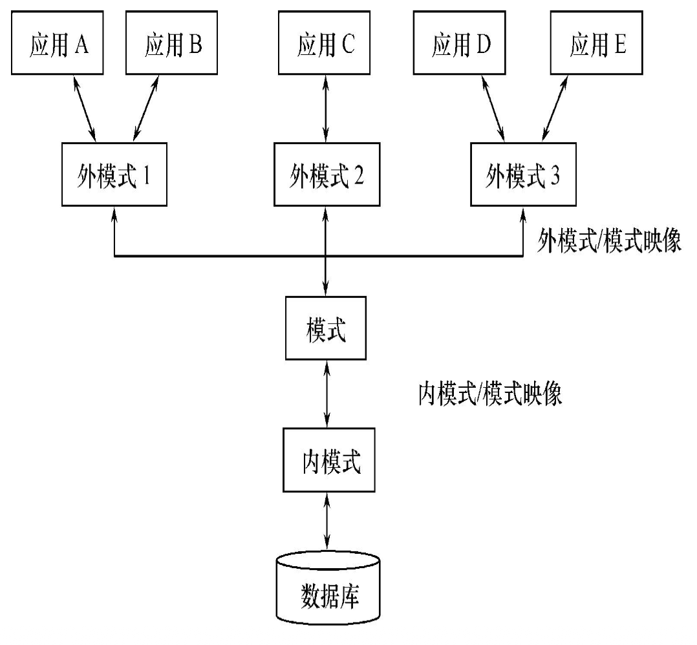
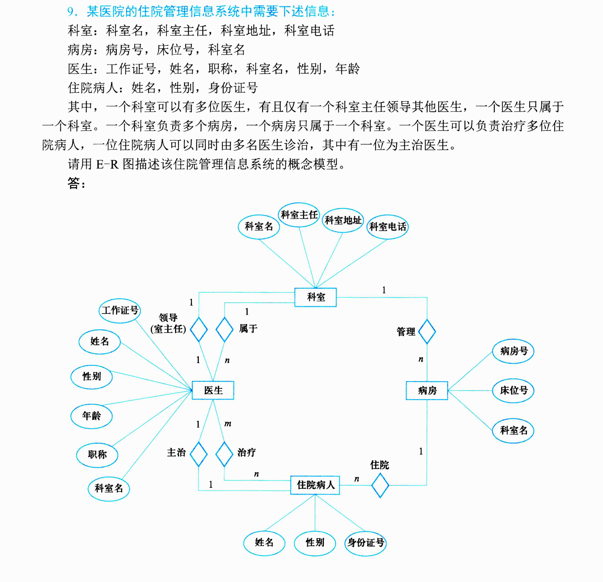
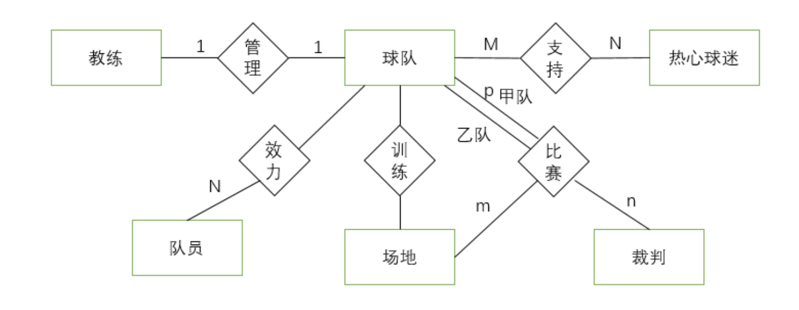

# 数据库系统原理

# 第一章 绪论

## 1.1 数据模型

### 1.1.1 数据模型的定义

数据模型是对现实世界数据特征的抽象，用来描述数据、组织数据、对数据进行操作，是数据库系统的核心与基础。

**数据结构化**核心意义：

1. 整体数据按统一结构组织，不仅记录内部有结构，记录之间也存在关联；

2. 区别于文件系统仅针对单个文件结构化，数据库实现全局数据结构化；

3. 便于统一管理、共享数据、减少冗余。

### 1.1.2 数据模型三要素

1. **数据结构**

    描述数据库中数据对象的类型、对象之间的联系，是数据模型静态特征，是核心。

    例：关系模型里的表、元组、属性；层次模型的树节点。

2. **数据操作**

    对数据库中各类对象允许执行的操作集合，体现动态行为。

    通用操作：查询、插入、删除、修改（增删改查 CRUD）。

3. **数据完整性约束（数据约束）**

    定义数据必须满足的规则，保障数据正确、一致、有效。

    例：主键唯一、外键参照完整性、字段取值范围、非空约束。

---

## 1.2 数据库系统结构（三级模式两级映像）

### 1.2.1 三级模式



1. **模式（概念模式 / 逻辑模式）**

    - 定义：数据库全体数据的**全局逻辑视图**，描述所有实体、属性、实体间联系。

    - 特点：唯一，不涉及物理存储细节，面向整个系统。

    - 作用：存储模式定义、全局逻辑框架，DBA 管理全局数据的依据。

2. **子模式（外模式 / 用户模式）**

    - 定义：数据库用户能看见、使用的局部数据逻辑结构，是模式的子集。

    - 特点：一个数据库可有多张子模式，不同用户视图隔离。

    - 作用：适配不同用户需求、实现权限隔离、简化用户查询。

3. **内模式（存储模式）**

    - 定义：数据物理存储结构与存储方法描述。

    - 特点：一个数据库仅一个内模式，描述磁盘存储、索引、块大小、存储路径。

    - 作用：对接操作系统文件，管理底层物理存储。


### 1.2.2 两级映像与数据独立性

1. **外模式／模式映像**

    - 位置：定义外模式与概念模式之间的对应关系。

    - 作用：实现**逻辑独立性**。

    - 逻辑独立性：全局模式修改（增减字段、关联）时，只需调整该映像，用户外模式无需改动，应用程序不用重写。

2. **模式 / 内模式映像**

    - 位置：定义概念模式与内模式物理存储的对应关系。

    - 作用：实现**物理独立性**。

    - 物理独立性：数据物理存储调整（换磁盘、改索引、重排存储）时，仅修改本映像，上层逻辑模式、应用程序不受影响。


### 1.2.3 三级模式结构的优点

- **保证数据的独立性**
  - 将模式和内模式分开，保证了数据的**物理独立性**；
  - 将外模式和模式分开，保证了数据的**逻辑独立性**。

- **简化了用户接口**
  - 按照外模式编写应用程序或敲入命令，而不需了解数据库内部的存储结构，方便用户使用系统。

- **有利于数据共享**
  - 在不同的外模式下可有多个用户共享系统中数据，减少了数据冗余。

- **利于数据的安全保密**
  - 在外模式下根据要求进行操作，不能对限定的数据操作，保证了其他数据的安全。

---

## 1.3 数据库系统组成

数据库系统由三大部分组成：**硬件平台及数据库**、**软件**、**人员**。

1. **硬件平台及数据库**

    支撑数据库运行的物理设备（服务器、大容量磁盘、内存、网络设备）以及长期存储在存储设备上、结构化、可共享的数据集合。

2. **软件**

    1) **DBMS**（数据库管理系统）

    2) **支持 DBMS 运行的操作系统**

    3) **与数据库接口的高级语言及其编译系统**

    4) **以 DBMS 为核心的应用开发工具**

    5) **为特定应用环境开发的数据库应用系统**

3. **人员**

    四类：终端用户、应用程序员、系统分析员、数据库管理员 DBA。

### DBMS（数据库管理系统）四大功能模块

1. **数据库定义模块 DDL**

    提供数据定义语言，用于创建库、表、索引、视图，定义模式、约束。

2. **数据操作语言 DML 及其编译模块**

    解析、编译增删改查 SQL，接收用户数据操作请求，转化为底层执行指令。

3. **数据库运行控制模块**

    并发控制、事务管理、安全权限、完整性校验、故障恢复，数据库核心管控模块。

4. **实用程序**

    备份恢复、数据导入导出、性能监控、数据库重构、日志分析等运维工具。

---

## 1.4 数据库系统的核心优点

1. **数据整体结构化**

    文件系统仅文件内有结构，数据库实现全局关联结构化，数据关系清晰，支持多表联合查询。

    实例：电商系统，用户表、订单表、商品表通过外键关联，一次性查询用户全部订单+商品信息。

2. **数据高度共享，冗余度低**

    一份数据多业务共用，避免多文件重复存储；冗余可控、可消除，节省存储空间，减少数据不一致风险。

    实例：学校数据库，学生信息统一存储，教务、财务、图书馆共用，不用各自保存学生档案。

3. **数据独立性高（逻辑+物理独立）**

    数据存储逻辑、物理底层与上层应用解耦，底层调整不影响业务代码，降低系统维护成本。

    实例：数据库更换存储硬盘、新增数据表字段，前端网页、后台业务程序无需修改。

4. **数据安全性高**

    支持账户权限分级、数据加密、操作审计、访问控制，防止越权读写、数据泄露、恶意篡改。

    实例：企业财务库，普通员工仅可查询自身工资，财务管理员才能查看全部薪资数据。

5. **数据完整性保障**

    通过约束规则自动校验数据合法性，杜绝脏数据（如负数金额、重复学号）。

6. **统一管理与并发访问**

    DBMS 统一调度读写，支持多人同时操作，避免并发冲突，保障事务一致性。

### 例1-1 电商订单视图综合例题
#### 已知条件
电商订单管理系统存在三张基础关系模式：
1. `User(Uid, Uname, Ucity, Uage)`
    用户ID，用户名，所在城市，年龄
2. `Product(Pid, Pname, Ptype, Price, Stock)`
    商品ID，商品名，商品类型，价格，库存
3. `Order(Oid, Uid, Pid, Otime, Quantity)`
    订单ID，用户ID，商品ID，下单时间，购买数量

##### 原始视图定义 `UserOrderView`
```sql
CREATE VIEW UserOrderView AS
SELECT User.Uid, Uname, Pid, Pname, Quantity, Otime
FROM User, Order, Product
WHERE User.Uid = Order.Uid AND Order.Pid = Product.Pid;
```
视图用途：供应用程序 `OrderApp` 查询**用户订单详情**。

#### 问题与标准答案
##### (1) 按城市统计订单量查询频繁，做什么物理优化？是否影响OrderApp？
1. **优化动作**：给 `User.Ucity` 字段建立B+树索引；
2. **是否影响应用程序**：**不会受到影响**。
    原因：建立索引属于**内模式（物理层）**优化，仅改变数据物理存储结构，不改动逻辑层的表、视图定义，视图逻辑不变，上层应用无需修改。

##### (2) Product表字段更新频率差异大，如何提升查询效率？是否影响OrderApp？如何消除影响？
1. **优化动作：垂直分表（关系分解）**
    将原 `Product` 拆分为两张表，按更新频率拆分冷热数据：
    - `Product_Basic(Pid, Stock)`：高频变动字段（库存），仓库管理员维护
    - `Product_Attr(Pid, Pname, Ptype, Price)`：稳定字段（名称、类型、价格），市场管理员维护
2. **是否影响OrderApp**：会受影响。
    原视图关联的是单张`Product`表，拆分后基础表结构改变，原有视图查询失效。
3. **消除影响的操作**：
    删除旧视图，基于拆分后的两张商品表**重新创建视图`UserOrderView`**，新视图SQL：
    ```sql
    CREATE VIEW UserOrderView AS
    SELECT User.Uid, Uname, Pid, Pname, Quantity, Otime
    FROM User, Order, Product_Attr
    WHERE User.Uid = Order.Uid AND Order.Pid = Product_Attr.Pid;
    ```
    重建视图后，上层`OrderApp`调用视图的逻辑完全不变，程序无需改动。

##### (3) 结合三级模式结构，说明涉及的模式层次与系统优势
###### 涉及三层模式层次
1. **内模式（存储模式）**：给`Ucity`建索引，修改数据物理存储方式，属于内模式调整；
2. **模式（概念模式）**：将`Product`垂直拆分为`Product_Basic`、`Product_Attr`，修改全局逻辑表结构，属于模式层改动；
3. **外模式（子模式）**：视图`UserOrderView`是面向应用程序`OrderApp`的局部用户视图，属于外模式。

###### 体现数据库两大核心优势
1. **物理独立性**
    对内模式做索引优化（物理存储调整），无需修改上层模式、视图和应用程序，物理层变化不影响逻辑层。
2. **逻辑独立性**
    全局概念模式（Product表）拆分修改后，仅需要更新外模式（重建视图），应用程序`OrderApp`完全不用修改，逻辑层全局结构变化不影响用户应用。


### 例1-2 系统特性分析
1）请简述关系数据库是如何实现数据的整体结构化？
2）关系数据库中的索引属于三层模式中的哪一层？它的作用是什么？
3）设某个关系数据库为了消除插入异常而将关系R分解为了R1和R2两个子关系，若要维持之前基于R的应用程序代码仍然能有效运行，则可以对该数据库采取何种数据定义操作？这种维持应用程序不变的效果体现了数据库系统的什么特性？
4）若某个关系数据库在运行过程中将基于定长数组的元组存储方式改为基于槽页的存储方式，简要分析这会影响已有的SQL应用的结果正确性么？这体现了数据库系统的什么特性？

#### 参考答案
##### (1) 关系数据库实现整体结构化的方式
关系数据库依靠关系模型实现全局数据结构化：
1. 全部数据统一使用**二维表（关系）**存储，每张表由行（元组）、列（属性）组成，单表内部存在结构；
2. 多张数据表依靠**公共属性（主键、外键）**建立关联，实现表与表之间的联系，达成**全局整体结构化**（区别于文件系统仅单文件结构化）；
3. 通过实体完整性、参照完整性、用户定义完整性三类约束保证关联数据一致有效；
4. 依托关系规范化理论拆分冗余数据、消除增删改异常，让全部数据构成一套相互关联、统一管理的完整逻辑体系。

##### (2) 索引所属模式层与作用
- 所属层次：**内模式（存储/物理模式）**
- 作用：
  1. 优化查询性能：通过B+树、哈希索引等结构，大幅提升数据检索、范围查询速度；
  2. 代价：会增加INSERT/UPDATE/DELETE的开销，修改数据时需要同步维护索引文件。

##### (3) 关系分解后兼容原有程序的操作 & 对应特性
1. 数据定义操作：**创建视图View**
   将视图定义为 `R1 ⋈ R2`（R1、R2的自然连接），对外逻辑等价于原来的完整关系R，上层程序依旧访问视图，无需修改代码。
2. 体现特性：**逻辑独立性（外模式/模式映像）**
   全局概念模式（基础表R拆分为R1、R2）发生修改时，仅调整外模式（视图）即可隔离上层应用，程序不受底层逻辑表改动影响。

##### (4) 修改物理存储方式对SQL的影响 & 对应特性
1. 结果正确性：**不会影响现有SQL的查询、修改结果**
   物理存储细节对应用层完全透明，SQL只操作逻辑表，不感知底层存储数组/槽页的切换。
2. 体现特性：**物理独立性（模式/内模式映像）**
   内模式（物理存储组织、存储结构）发生变更，上层逻辑模式、应用SQL无需改动，执行结果保持一致。

# 第二章 关系数据库

## 2.1 关系数据结构
关系模型以**关系**为核心数据结构，数学基础是集合代数，现实世界的实体与实体间联系都统一用二维表（关系）描述。

### 2.1.1 基础概念
1. **域（Domain）**
   一组具有相同数据类型的原子值的集合，定义了属性的取值范围。
   例：性别域 `{男, 女}`，成绩域为 0~100 的整数。

2. **笛卡尔积（Cartesian Product）**
   给定 n 个域 $D_1,D_2,\dots,D_n$，它们的笛卡尔积是所有有序 n 元组的集合：
   $$D_1 \times D_2 \times \dots \times D_n = \{(d_1,d_2,\dots,d_n) \mid d_i \in D_i\}$$
   其中每个元素 $(d_1,d_2,\dots,d_n)$ 称为一个**n元组**，每个值 $d_i$ 称为**分量**。

3. **基数（Cardinality）**
   笛卡尔积包含的元组总个数。若域 $D_i$ 的元素个数为 $m_i$，则笛卡尔积基数为 $m_1 \times m_2 \times \dots \times m_n$。
   例：$D_1=\{A,B\}$（基数2），$D_2=\{1,2\}$（基数2），则 $D_1 \times D_2$ 基数为 4，对应元组：`(A,1),(A,2),(B,1),(B,2)`。

### 2.1.2 关系（Relation）
- 定义：笛卡尔积中**具有实际业务意义的有限子集**，记作 $R(D_1,D_2,\dots,D_n)$。
  其中 $R$ 为关系名，$n$ 为关系的**目/度**，包含 n 列的关系称为 n 元关系。
- 通俗理解：一张规范化的二维表，每行对应一个元组，每列对应一个属性。
- 基本性质：
  1. 列同质：每一列的值来自同一个域；
  2. 属性名唯一：不同列可来自同一域，但必须使用不同的属性名区分；
  3. 行列顺序无关：行、列的顺序可任意交换，不改变关系的含义；
  4. 元组不重复：满足集合互异性，不存在完全相同的两个元组；
  5. 分量原子性：每个属性值不可再拆分，满足第一范式（1NF）。

### 2.1.3 码（键）相关概念
1. **候选码（Candidate Key）**
   若一个属性组能唯一标识关系中的一个元组，且其任意真子集都不具备该标识能力（最小性），则该属性组为候选码。
   例：学生表中，学号是候选码；若身份证号也全局唯一，它同样是候选码。

2. **主码（Primary Key）**
   从多个候选码中选定一个，作为元组的主要唯一标识，称为主码。
   - 包含在主码中的属性称为**主属性**，不包含在任何候选码中的属性称为**非主属性**。

3. **全码（All-Key）**
   关系的全部属性共同构成候选码，称为全码。
   例：选课关系 `(学号, 课程号)`，两个属性组合才能唯一标识一条选课记录，即为全码。

4. **外码（Foreign Key）**
   若关系 R 的一个（或一组）属性 F 不是 R 的主码，但它对应关系 S 的主码，则称 F 是 R 的外码。
   - R 称为**参照关系**，S 称为**被参照关系**。
   - 作用：描述两张表之间的关联关系，维护跨表数据一致性。
   例：订单表的 `用户ID` 对应用户表的主码 `用户ID`，则订单表的 `用户ID` 是外码。

### 2.1.4 关系模式与关系数据库
1. **关系模式（Relation Schema）**
   是对关系结构的描述，即二维表的“表头定义”，形式化表示为：
   $$R(U, D, DOM, F)$$
   - $U$：属性集合；$D$：属性所属的域；$DOM$：属性到域的映射；$F$：属性间的数据依赖关系。
   - 特点：静态、稳定，不随具体数据的增减而改变。

2. **关系数据库**
   一个应用领域内，所有互相关联的关系的集合，构成关系数据库。
   - 型：关系数据库模式，即所有表结构、约束规则的整体定义；
   - 值：数据库中存储的具体数据实例，会随业务操作动态变化。

## 2.2 关系的完整性
完整性约束是保障数据库中数据正确、一致、有效的规则集合，关系模型包含三类完整性约束。

### 2.2.1 实体完整性
- 规则：主码的所有属性**不能为空值（NULL）**，且主码取值不能重复。
- 原理：主码是元组的唯一标识，若主码为空或重复，就无法区分实体，失去了实体存在的意义。
- 例：学生表的 `学号` 是主码，不能为 NULL，也不能有两名学生使用相同学号。

### 2.2.2 参照完整性
- 规则：外码的取值只能是以下两类之一：
  1. 空值（NULL）；
  2. 被参照关系中主码已经存在的值。
- 作用：维护关联表之间的数据一致性，避免出现“无效引用”的悬空数据。
- 例：订单表的 `用户ID` 是外码，参照用户表主码。订单的用户ID要么为空，要么必须是用户表中已存在的ID，不能出现不存在的用户ID。

### 2.2.3 用户自定义完整性
- 定义：针对具体业务场景，由用户自定义的数据约束规则，反映特定应用的数据要求。
- 常见形式：非空约束、唯一约束、取值范围约束、默认值约束等。
- 例：学生成绩必须在 0~100 之间，用户姓名不能为空，商品库存不能为负数。

## 2.3 关系代数
关系代数是一种抽象的查询语言，以关系为运算对象，通过运算组合表达查询需求，运算结果仍然是关系。

### 2.3.1 传统的集合操作
这类运算从**行维度**操作元组，要求两个关系**结构相容**（属性个数相同，对应属性的数据类型一致）。

1. **并（Union）**
   - 符号：$R \cup S$
   - 定义：由所有属于 R 或属于 S 的元组组成，自动去除重复元组。
   - 数学定义：$R \cup S = \{t \mid t \in R \lor t \in S\}$
   - 例：两个班级的学生名单合并，得到全部学生集合。

2. **差（Difference）**
   - 符号：$R - S$
   - 定义：由所有属于 R 但不属于 S 的元组组成。
   - 数学定义：$R - S = \{t \mid t \in R \land t \notin S\}$
   - 例：选了课程A的学生 减去 选了课程B的学生，得到只选了A课的学生。

3. **笛卡尔积**
   - 符号：$R \times S$
   - 定义：将 R 的每个元组与 S 的每个元组首尾拼接，生成新的元组。
   - 结果特征：列数 = R列数 + S列数；行数 = R行数 × S行数。
   - 说明：笛卡尔积会产生大量无意义的冗余元组，是所有连接运算的基础，实际使用需配合选择运算过滤有效数据。

### 2.3.2 专门的关系运算（扩展操作）
这类是关系数据库特有的运算，分为行筛选和列筛选两类。

1. **选择（Selection）**
   - 符号：$\sigma_F(R)$
   - 含义：在关系 R 中，筛选出满足条件 F 的所有元组，是**行维度**的筛选。
   - 数学定义：$\sigma_F(R) = \{t \mid t \in R \land F(t) = 真\}$
   - 例：$\sigma_{性别='男'}(学生)$ → 从学生表中选出所有男生。

2. **投影（Projection）**
   - 符号：$\Pi_A(R)$，其中 A 为指定的属性列集合
   - 含义：从关系 R 中提取指定的属性列，组成新的关系，是**列维度**的筛选。
   - 特点：投影后若出现重复元组，会自动去重。
   - 例：$\Pi_{学号,姓名}(学生)$ → 只保留学生表的学号和姓名两列。

### 2.3.3 组合的关系操作
1. **交（Intersection）**
   - 符号：$R \cap S$
   - 定义：由既属于 R 又属于 S 的元组组成。
   - 等价推导：$R \cap S = R - (R - S)$，可通过差运算实现。
   - 例：同时选修了课程A和课程B的学生。

2. **连接运算**
   连接本质是「笛卡尔积 + 选择」，从两个关系的笛卡尔积中，选出属性满足指定条件的元组。

   ① **θ连接**
   - 定义：选取 R 的 A 属性与 S 的 B 属性满足 θ 比较关系的元组。
   - 形式：$R \underset{AθB}{\Join} S = \sigma_{AθB}(R \times S)$
   - θ 可以是 `>`、`<`、`=`、`≥`、`≤`、`≠` 等比较运算符。

   ② **等值连接**
   - 是 θ 连接的特例，当 θ 取 `=` 时即为等值连接。
   - 特点：按属性值相等拼接元组，结果中会保留两个重复的属性列。

   ③ **自然连接**
   - 是特殊的等值连接：自动按两个关系中**所有同名属性**做等值匹配，且结果中自动去掉重复的属性列。
   - 特点：是实际查询中最常用的连接方式，无需手动指定连接条件。
   - 例：学生表和选课表都包含 `学号` 字段，自然连接自动按学号拼接，结果只保留一个学号列。

### 2.3.4 关系代数表达式
由关系、运算符、括号组合而成的式子，用于描述完整查询需求。运算优先级（从高到低）：
投影 > 选择 > 笛卡尔积/连接 > 交 > 并/差，可用括号改变运算顺序。

示例：查询“选修了课程号为 C01 的学生姓名”
$$\Pi_{姓名}\left(\sigma_{课程号='C01'}(学生 \Join 选课)\right)$$

### 例2-1
给定关系 $R$ 和 $S$ 如下表所示，请用表格形式写出 1）、2）小题的计算结果。

#### 已知关系
**关系 R**
| A | B | C |
|---|---|---|
| 1 | 2 | 3 |
| 2 | 3 | 4 |
| 1 | 2 | 1 |
| 4 | 3 | 2 |

**关系 S**
| B | C | D | E |
|---|---|---|---|
| 2 | 1 | 1 | 3 |
| 3 | 2 | 2 | 4 |
| 2 | 3 | 3 | 3 |
| 4 | 2 | 1 | 2 |

---

#### 1）计算 $\boldsymbol{\Pi_{B,C}(R) - \Pi_{B,C}\left(\sigma_{A<B}(R)\right)}$
运算拆解：先分别对两个子式做投影，再执行集合差运算。

**步骤1：计算 $\boldsymbol{\Pi_{B,C}(R)}$**
对关系 $R$ 做 B、C 两列的投影，自动去除重复元组，结果为：
| B | C |
|---|---|
| 2 | 3 |
| 3 | 4 |
| 2 | 1 |
| 3 | 2 |

**步骤2：计算 $\boldsymbol{\sigma_{A<B}(R)}$**
从 $R$ 中筛选出满足条件 $A<B$ 的元组，逐行判断：
- 第1行：$1<2$，满足
- 第2行：$2<3$，满足
- 第3行：$1<2$，满足
- 第4行：$4<3$，不满足

筛选结果：
| A | B | C |
|---|---|---|
| 1 | 2 | 3 |
| 2 | 3 | 4 |
| 1 | 2 | 1 |

**步骤3：计算 $\boldsymbol{\Pi_{B,C}\left(\sigma_{A<B}(R)\right)}$**
对筛选结果做 B、C 列投影：
| B | C |
|---|---|
| 2 | 3 |
| 3 | 4 |
| 2 | 1 |

**步骤4：执行差集运算**
用步骤1的结果减去步骤3的结果，剩余唯一元组，即最终答案：
| B | C |
|---|---|
| 3 | 2 |

---

#### 2）计算 $\boldsymbol{\sigma_{R.A > S.D}\left(R \Join S\right)}$
运算拆解：先做 $R$ 与 $S$ 的自然连接，再按条件筛选元组。
（注：$R \Join S$ 为自然连接，按两表所有同名公共属性 B、C 做等值匹配，结果自动去除重复属性列）

**步骤1：计算自然连接 $\boldsymbol{R \Join S}$**
按 B、C 属性值相等匹配元组，拼接后共 3 条有效记录：
| A | B | C | D | E |
|---|---|---|---|---|
| 1 | 2 | 3 | 3 | 3 |
| 1 | 2 | 1 | 1 | 3 |
| 4 | 3 | 2 | 2 | 4 |

**步骤2：按条件 $\boldsymbol{R.A > S.D}$ 筛选**
逐行判断条件：
- 第1行：$A=1,\ D=3$ → $1>3$ 不成立
- 第2行：$A=1,\ D=1$ → $1>1$ 不成立
- 第3行：$A=4,\ D=2$ → $4>2$ 成立

最终结果：
| R.A | S.B | S.C | S.D | S.E |
|-----|-----|-----|-----|-----|
| 4   | 3   | 2   | 2   | 4   |

# 第三章 SQL语言

## 3.1 概述
SQL（Structured Query Language，结构化查询语言）是关系数据库的标准通用语言，集数据定义、数据操纵、数据控制功能于一体，是操作和管理关系数据库的核心工具。

### SQL语言的核心特点
1. **综合统一**
   融合了数据定义（DDL）、数据操纵（DML）、数据控制（DCL）三类功能，用统一的语法风格即可完成表结构创建、数据增删改查、权限管理等全生命周期操作，无需切换不同语言体系。

2. **高度非过程化**
   属于声明式语言，用户只需描述“想要什么结果”，无需指定具体执行步骤、存取路径和算法细节；底层执行路径的选择、优化全部由DBMS自动完成。

3. **面向集合的操作方式**
   操作对象和返回结果都是元组集合，一次语句可批量处理多条记录；区别于传统面向单条记录的编程语言，天然适配关系模型的集合特性。

4. **使用方式灵活**
   既支持交互式直接执行（命令行、可视化工具），也可嵌入C、Java、Python等高级语言中，适配独立查询和应用开发两类场景。

5. **语法简洁、易学易用**
   核心功能仅通过少量动词实现（CREATE、SELECT、INSERT、UPDATE、DELETE等），语法接近自然英语，学习门槛低。

## 3.2 数据定义功能
SQL的数据定义功能用于创建、修改、删除数据库中的各类对象，涵盖数据库、基本表、索引、视图四大核心对象。

### 3.2.1 核心数据定义语句
1. **创建数据库**
```sql
CREATE DATABASE 数据库名;
```
用于创建新的数据库模式，作为表、视图等对象的存储容器。

2. **创建基本表**
```sql
CREATE TABLE 表名 (
    列名1 数据类型 [列级约束],
    列名2 数据类型 [列级约束],
    ...
    [表级约束]
);
```
常见完整性约束：
- `PRIMARY KEY`：主键约束，唯一标识元组，非空且不重复
- `FOREIGN KEY (列) REFERENCES 主表(列)`：外键约束，维护参照完整性
- `NOT NULL`：非空约束，禁止该列出现空值
- `UNIQUE`：唯一约束，该列取值不可重复
- `CHECK (条件)`：检查约束，限定列的取值范围

3. **创建索引**
```sql
CREATE [UNIQUE] [CLUSTER] INDEX 索引名
ON 表名 (列名 [ASC|DESC], ...);
```
为指定列建立索引结构，用于提升查询效率。

4. **创建视图**
```sql
CREATE VIEW 视图名 [(列名列表)]
AS 子查询
[WITH CHECK OPTION];
```

### 3.2.2 索引的类型与作用
#### 索引的常见类型
- 按物理存储方式划分：
  - **聚簇索引**：索引的排序顺序与数据物理存储顺序一致，一张表只能有一个聚簇索引，范围查询性能优异。
  - **非聚簇索引**：索引结构与数据物理存储分离，叶子节点存储指向数据的指针，一张表可创建多个。
- 按功能逻辑划分：普通索引、唯一索引（保证列值不重复）、复合索引（多列组合构建的索引）。

#### 索引的作用
- 优势：大幅加快数据检索速度，优化表连接、排序、分组操作的性能，降低磁盘I/O次数。
- 代价：占用额外磁盘空间；数据增、删、改时需要同步维护索引，会降低写入操作的效率。

### 3.2.3 索引的实现数据结构
1. **B+树**
   是关系数据库最主流、默认的索引结构，属于多路平衡查找树。
   - 核心特征：所有数据记录仅存储在叶子节点，非叶子节点仅存键值作为路由；叶子节点通过双向链表串联，天然有序。
   - 优势：树高稳定（百万级数据仅需3~4层），查询性能均衡；既支持等值查询，也完美适配范围查询、排序、分页场景。

2. **哈希索引**
   基于哈希表实现，通过哈希函数计算索引键的存储位置。
   - 优势：等值查询速度极快，时间复杂度接近O(1)。
   - 局限：不支持范围查询、排序操作；存在哈希冲突问题，仅适用于纯等值匹配场景。

## 3.3 数据查询功能
数据查询是SQL的核心功能，通过`SELECT`语句实现，可适配单表、多表、分组、嵌套等各类查询需求。

### 3.3.1 简单查询（单表查询）
基础语法框架：
```sql
SELECT [DISTINCT] 列名列表 | *
FROM 表名
[WHERE 行筛选条件]
[ORDER BY 排序列 [ASC|DESC]]
[LIMIT 行数];
```
支持的常用操作：算术表达式计算、列别名、模糊查询（`LIKE` + 通配符）、范围匹配（`BETWEEN AND`）、集合匹配（`IN`）、空值判断（`IS NULL`）。

### 3.3.2 分组查询
配合聚合函数对数据做分组统计，语法：
```sql
SELECT 分组列, 聚合函数(列)
FROM 表名
[WHERE 行级筛选]
GROUP BY 分组列
[HAVING 组级筛选];
```
- 常用聚合函数：`COUNT()` 计数、`SUM()` 求和、`AVG()` 平均值、`MAX()` 最大值、`MIN()` 最小值。
- 执行逻辑：先通过`WHERE`过滤行，再执行分组聚合，最后用`HAVING`过滤分组结果。

### 3.3.3 嵌套查询（子查询）
将一个`SELECT`语句嵌套在另一个查询的条件中，外层为父查询，内层为子查询。
常见分类：
1. **IN子查询**：子查询返回值集合，父查询通过`IN`做匹配。
2. **比较子查询**：配合`>、<、=`及`ANY/ALL`关键字，与子查询结果做比较。
3. **相关子查询**：子查询的执行依赖父查询的属性值，逐行执行，常与`EXISTS`关键字配合使用。

### 3.3.4 集合查询
对多个查询结果执行集合运算，要求各查询的列数、对应列数据类型必须兼容。
- 并运算：`UNION`（自动去重）、`UNION ALL`（保留重复项）
- 交运算：`INTERSECT`，取两个结果集的公共部分
- 差运算：`EXCEPT`，取第一个结果集独有、第二个结果集没有的部分

### 3.3.5 查询视图
视图是虚表，查询视图与查询基本表语法完全一致；DBMS会自动执行“视图消解”，将视图查询转换为对底层基本表的查询。
```sql
SELECT * FROM 视图名 WHERE 条件;
```

## 3.4 数据更新功能
数据更新属于数据操纵语言（DML），包含插入、删除、修改三类操作，用于维护表中的数据。

### 3.4.1 INSERT 插入数据
1. 插入单行元组
```sql
INSERT INTO 表名 (列1, 列2, ...)
VALUES (值1, 值2, ...);
```
2. 批量插入查询结果
```sql
INSERT INTO 表名 (列列表)
SELECT 子查询;
```

### 3.4.2 DELETE 删除数据
删除表中满足条件的元组：
```sql
DELETE FROM 表名
[WHERE 删除条件];
```
- 注意：不带`WHERE`子句会删除表中全部数据，但保留表结构；与`DROP TABLE`（删除整个表结构和数据）有本质区别。

### 3.4.3 UPDATE 修改数据
更新满足条件的元组的属性值：
```sql
UPDATE 表名
SET 列1 = 新值1, 列2 = 新值2, ...
[WHERE 更新条件];
```

### 3.4.4 视图更新
- 本质：对视图的增删改操作，最终会被DBMS转换为对底层基本表的更新。
- 更新限制：并非所有视图都支持更新。行列子集视图（从单表投影、选择且保留主键）通常支持更新；包含聚合函数、分组、多表连接、去重的视图，一般不允许更新。
- `WITH CHECK OPTION`：更新视图数据时，必须满足视图定义中的筛选条件。

## 3.5 视图
视图是从一个或多个基本表导出的**虚表**；数据库中仅存储视图的定义语句，不存储视图对应的数据，数据仍保存在基本表中。

### 3.5.1 视图创建语句
```sql
CREATE VIEW 视图名 [(列名1, 列名2, ...)]
AS SELECT查询语句
[WITH CHECK OPTION];
```
- 可自定义视图的列名，也可沿用子查询的列名。
- `WITH CHECK OPTION` 保证通过视图更新的数据，符合视图的查询过滤条件。

### 3.5.2 视图的核心优点
1. **提升数据安全性**
   通过视图实现行级、列级的数据访问控制，只向用户开放必要的数据范围，屏蔽敏感字段和数据，实现细粒度的权限管控。

2. **提高逻辑独立性**
   视图对应数据库三级模式中的外模式。当底层基本表结构修改（如表拆分、新增字段）时，只需调整视图定义，即可保持对外数据接口不变，上层应用程序无需修改，体现了数据库的逻辑独立性。

3. **简化用户查询操作**
   将多表连接、嵌套子查询、聚合统计等复杂逻辑封装在视图中，用户只需直接查询视图，无需重复编写复杂SQL，降低使用门槛，提升开发效率。

4. **多角度看待同一数据**
   不同业务角色可通过不同视图，从各自的业务视角查看同一份基础数据，适配不同部门的需求，无需为每个角色单独复制数据。

### 例3-1
#### 题目背景
某视频点播网站的数据库中包含两张关系表：
- `FILM(FID, FNAME, RANK)`：记录每个视频的编号、名称、点播热度级别
- `PLAY(FID, UID, UNAME, TIME, URANK)`：记录每次用户点播的视频编号、用户编号、用户姓名、点播时间以及用户评价该视频的得分级别

请分别用一条 SQL 语句完成下列小题。

---

#### (1) 查询点播了名称包含“叶问”的视频的用户编号，并且按照点播的时间降序排列
```sql
SELECT P.UID
FROM PLAY P
JOIN FILM F ON P.FID = F.FID
WHERE F.FNAME LIKE '%叶问%'
ORDER BY P.TIME DESC;
```
**解析**：通过内连接关联视频表与点播表，用`LIKE`模糊匹配视频名称，最后按点播时间降序排序。

---

#### (2) 查询存在用户评分级别（URANK）高于视频点播热度级别（RANK）的点播记录的视频编号和名称
```sql
SELECT DISTINCT F.FID, F.FNAME
FROM FILM F
WHERE EXISTS (
    SELECT 1
    FROM PLAY P
    WHERE P.FID = F.FID AND P.URANK > F.RANK
);
```
**解析**：使用相关子查询逐行判断每个视频是否存在满足条件的点播记录；`DISTINCT`用于去重，避免同一视频因多条符合条件的记录被重复返回。

---

#### (3) 创建一个视图来描述每个视频及其点播次数
```sql
CREATE VIEW VideoPlayCount AS
SELECT F.FID, F.FNAME, COUNT(P.FID) AS PlayCount
FROM FILM F
LEFT JOIN PLAY P ON F.FID = P.FID
GROUP BY F.FID, F.FNAME;
```
**解析**：
- 使用`LEFT JOIN`左连接，保证从未被点播的视频也会出现在结果中，点播次数记为0；
- `COUNT(P.FID)`统计非空的点播记录，无匹配记录时计数为0，避免`COUNT(*)`将空行误计为1。

---

#### (4) 将所有“001”号用户点播过的视频的点播热度级别设置为5
```sql
UPDATE FILM
SET RANK = 5
WHERE FID IN (
    SELECT FID
    FROM PLAY
    WHERE UID = '001'
);
```
**解析**：通过IN子查询先查出001号用户点播过的所有视频编号，再对视频表中对应记录执行批量更新。

---

#### (5) 查询被所有用户都点播过的视频
```sql
SELECT F.FID, F.FNAME
FROM FILM F
WHERE NOT EXISTS (
    -- 所有用户集合
    SELECT *
    FROM (SELECT DISTINCT UID FROM PLAY) U
    WHERE NOT EXISTS (
        SELECT *
        FROM PLAY P
        WHERE P.FID = F.FID AND P.UID = U.UID
    )
);
```
**解析**：
这是SQL中实现**关系代数除法**的标准写法（双重NOT EXISTS），逻辑等价于：
> 不存在任何一个用户，没有点播过当前视频 → 该视频被所有用户点播过。
内层先构造全部用户的集合，外层通过两层否定完成“全量覆盖”的判断，兼容所有标准SQL数据库。

### 例3-2
#### 题目背景
某实践课平台的数据库包含三张关系表：
- `STU(SNO, SNAME, CLASSNO)`：学生表，记录每个学生的学号、姓名、所属班号
- `MIS(MNO, MNAME, MGRADE, MTEXT)`：实训任务表，记录每个实训任务的任务编号、名称、满分值、任务书说明
- `PROG(SNO, MNO, SCORE, LASTDATE)`：完成进度表，记录每个学生已完成任务的得分以及最后一次实践该任务的日期

要求：1）-3）题均只用一条 SQL 语句，且不使用派生表。

---

#### (1) 查询名称包含“数据”的实训任务的学生完成情况
**需求**：返回实训任务编号、学生学号、姓名；结果按实训任务编号升序排列，同一任务内按学号降序排列。

```sql
SELECT P.MNO, S.SNO, S.SNAME
FROM PROG P, STU S, MIS M
WHERE P.SNO = S.SNO AND P.MNO = M.MNO
  AND M.MNAME LIKE '%数据%'
ORDER BY P.MNO ASC, S.SNO DESC;
```
**解析**：
通过隐式内连接关联进度表、学生表、任务表三张表；用`LIKE`配合通配符实现任务名称的模糊匹配；采用多字段复合排序：优先按任务编号升序排列，同一实训任务下再按学号降序输出。

---

#### (2) 查询无跳关行为的学生学号及其完成的最大任务编号
**需求**：实训任务编号从1开始连续递增，无跳关指学生完成的任务编号从1到最大值连续无缺失。

```sql
SELECT SNO, MAX(MNO) AS MAX_MNO
FROM PROG
GROUP BY SNO
HAVING COUNT(DISTINCT MNO) = MAX(MNO);
```
**解析**：
核心判定逻辑：当任务编号从1开始连续递增时，「无跳关」等价于**学生完成的不同任务数量 = 学生完成的最大任务编号**。
例如某学生最大完成任务编号为5，且恰好完成了5个不同的任务，说明1~5号任务全部完成，没有跳过。
`DISTINCT`用于排除学生重复完成同一任务对计数的干扰；通过按学号分组聚合，再通过`HAVING`子句完成条件筛选。

---

#### (3) 查询所有学生都实践过的实训任务编号、名称
```sql
SELECT M.MNO, M.MNAME
FROM MIS M
WHERE NOT EXISTS (
    SELECT * FROM STU S
    WHERE NOT EXISTS (
        SELECT * FROM PROG P
        WHERE P.SNO = S.SNO AND P.MNO = M.MNO
    )
);
```
**解析**：
这是SQL中实现**关系代数除法**的标准双重`NOT EXISTS`写法，逻辑等价于：
> 不存在任何一个学生，没有完成过当前实训任务 → 该任务被所有学生都实践过。

外层遍历全部实训任务，内层遍历全体学生，通过两层否定完成“全量覆盖”的逻辑判断，该写法兼容所有标准SQL语法，不依赖数据库方言特性。

# 第四章 数据库安全性
## 4.1 数据库安全性
### 4.1.1 数据库安全性概述
数据库安全性是指保护数据库中的数据，防止因非法使用、恶意攻击或操作失误造成的数据泄露、篡改、破坏，核心目标是保障数据的**机密性、完整性、可用性**。
常见安全风险包括：未授权用户越权访问、恶意篡改或删除数据、敏感数据泄露、操作系统漏洞、网络传输窃听、SQL注入攻击等。

### 4.1.2 实现数据库安全性的常用方法
1. **用户身份鉴别**
是数据库系统的第一道安全防线，在用户访问系统前验证身份合法性，只有通过认证才能获得数据库访问权限。常见实现方式：静态口令认证、动态口令、生物特征识别、数字证书认证等。

2. **存取控制**
是数据库安全的核心机制，确保用户只能访问其权限范围内的数据，分为两类主流实现：
- **自主存取控制（DAC）**：用户对不同数据对象拥有独立的存取权限，用户可自主将自身权限转授给其他用户，灵活性高，是主流关系数据库默认采用的安全机制，通过`GRANT`和`REVOKE`语句实现。
- **强制存取控制（MAC）**：系统为每个数据对象标注密级，为每个用户授予安全许可证，只有用户的安全级别不低于数据对象的密级时，才能执行对应访问操作，安全性等级更高，多用于涉密、高安全要求的场景。

3. **视图机制**
通过为不同角色的用户定义不同视图，仅向用户开放其业务所需的数据范围，屏蔽敏感字段和受限数据行，实现细粒度的数据访问隔离，将权限控制与数据展示结合。

4. **审计机制**
将用户对数据库的所有操作记录到审计日志中，完整记录操作人、操作时间、操作内容、操作对象等信息，用于事后追溯、责任认定和安全漏洞分析，是安全防护的重要补充机制。

5. **数据加密**
对存储或传输中的敏感数据进行加密处理，即使数据被非法获取，也无法直接读取明文内容，分为存储加密（数据库落地数据加密）和传输加密（网络传输链路加密）两类。

### 4.1.3 安全性控制的SQL实现
自主存取控制通过**授权语句`GRANT`**和**收权语句`REVOKE`**实现，是SQL标准中权限管理的核心语法。

#### 1. GRANT 授权语句
**一般格式**：
```sql
GRANT <权限>[,<权限>]...
[ON <对象类型> <对象名>]
TO <用户>[,<用户>]...
[WITH GRANT OPTION];
```

**语法说明**：
- **常用权限类型**：
  - 表级权限：`SELECT`（查询）、`INSERT`（插入）、`UPDATE`（修改）、`DELETE`（删除）、`ALTER`（修改表结构）、`INDEX`（建索引）、`ALL PRIVILEGES`（全部权限）
  - 列级权限：支持`SELECT(列名)`、`UPDATE(列名)`，可将权限精确到单个字段
- **对象类型**：常用的有`TABLE`（基本表/视图）、`DATABASE`（数据库）等
- `WITH GRANT OPTION`：可选子句，获得权限的用户可以将该权限再授予其他用户；若不写该子句，则用户仅能使用权限，无权转授。

**示例**：
将学生表的查询权限，和修改学生姓名的权限授予用户`user1`，并允许`user1`转授该权限：
```sql
GRANT SELECT, UPDATE(SNAME)
ON TABLE STU
TO user1
WITH GRANT OPTION;
```

#### 2. REVOKE 收权语句
**一般格式**：
```sql
REVOKE <权限>[,<权限>]...
[ON <对象类型> <对象名>]
FROM <用户>[,<用户>]...;
```

**语法说明**：
收回指定用户在对应对象上的权限；若用户曾通过`WITH GRANT OPTION`转授过权限，收权时可通过`CASCADE`级联收回其下游所有转授的权限，避免权限残留。

**示例**：
收回用户`user1`对学生表的修改权限，并级联收回其转授出去的权限：
```sql
REVOKE UPDATE(SNAME)
ON TABLE STU
FROM user1
CASCADE;
```

# 第五章 数据库完整性
## 5.1 数据库完整性
### 5.1.1 数据库完整性概述
数据库完整性是指数据库中数据的**正确性、一致性和相容性**，即数据符合现实世界语义、满足业务逻辑规则，且同一数据在不同表中保持一致。
完整性机制由三部分组成：**完整性约束定义**、**完整性检查**、**违约处理**，DBMS在数据增删改操作时自动校验，防止不符合语义的脏数据进入数据库。

### 5.1.2 三类数据库完整性
关系模型定义了三类标准完整性约束：**实体完整性、参照完整性、用户自定义完整性**，其中前两类是关系模型必须满足的强制约束，由DBMS原生自动支持。

#### 1. 实体完整性
- **约束规则**：主码的所有属性都不能取空值（NULL），且主码取值在表中必须唯一。
- **核心作用**：保证表中每个元组都可以被唯一标识，避免出现重复或无法区分的实体记录。
- **SQL实现**：在`CREATE TABLE`中通过`PRIMARY KEY`关键字定义主键，支持两种定义方式：
  - 列级约束：单字段主键可直接在属性定义后声明
  - 表级约束：复合主键必须在所有属性定义后统一声明
- **违约处理**：当插入或修改数据违反实体完整性时（主键重复、主键为空），DBMS直接**拒绝执行该操作**。

**示例**：定义学生表，学号为单字段主键
```sql
CREATE TABLE STU (
    SNO CHAR(10) PRIMARY KEY,  -- 列级主键约束
    SNAME VARCHAR(20),
    CLASSNO CHAR(6)
);
```

#### 2. 参照完整性
- **约束规则**：外码的取值只能是两种情况：要么取空值，要么等于被参照关系中某个元组的主码值。
- **核心作用**：维护关联表之间的数据一致性，避免出现无效引用的悬空记录，保证表间关联逻辑正确。
- **SQL实现**：在`CREATE TABLE`中通过`FOREIGN KEY (外码列) REFERENCES 被参照表(主码列)`定义外键。
- **违约处理策略**：当增删改操作可能违反参照完整性时，DBMS支持三种处理方式：
  - **拒绝执行（NO ACTION）**：默认策略，直接终止违规操作
  - **级联操作（CASCADE）**：修改/删除被参照表主码时，同步修改/删除参照表中对应的外码数据
  - **置空（SET NULL）**：被参照表数据删除时，将参照表中对应外码设为空值（前提是外码列允许为空）

**示例**：定义进度表，学号参照学生表主键，删除学生时级联删除对应进度记录
```sql
CREATE TABLE PROG (
    SNO CHAR(10),
    MNO CHAR(10),
    SCORE INT,
    PRIMARY KEY(SNO, MNO),
    FOREIGN KEY (SNO) REFERENCES STU(SNO) ON DELETE CASCADE,
    FOREIGN KEY (MNO) REFERENCES MIS(MNO)
);
```

#### 3. 用户自定义完整性
- **定义**：针对具体业务场景，由用户自定义的数据约束规则，反映特定应用的数据语义要求。
- **常见约束形式**：
  - 非空约束：`NOT NULL`，限制字段不能取空值
  - 唯一约束：`UNIQUE`，限制字段取值不能重复
  - 检查约束：`CHECK(条件表达式)`，限定字段的取值范围和业务规则
  - 默认值约束：`DEFAULT 默认值`，插入数据未指定时自动填充默认值
- **违约处理**：当操作违反自定义约束时，DBMS拒绝执行该操作。

**示例**：定义实训任务表，任务名称不能为空，满分值必须在0~100之间
```sql
CREATE TABLE MIS (
    MNO CHAR(10) PRIMARY KEY,
    MNAME VARCHAR(50) NOT NULL,
    MGRADE INT CHECK(MGRADE >= 0 AND MGRADE <= 100),
    MTEXT TEXT
);
```

### 5.1.3 完整性约束的实现策略
1. **按约束作用范围分类**
- 列级约束：作用于单个字段，如`NOT NULL`、列级`CHECK`、列级主键约束
- 表级约束：作用于整张表，如表级主键、外键约束、跨字段的`CHECK`约束

2. **完整性控制执行流程**
1.  定义约束：创建表或修改表结构时，声明完整性规则
2.  检查约束：每次执行`INSERT`/`UPDATE`/`DELETE`操作时，DBMS自动校验数据是否符合约束
3.  违约处理：若数据不符合约束，根据预设规则执行拒绝、级联、置空等处理

### 例5-4 参照完整性违约处理示例
#### 题目
通过创建选课表SC，显式定义实体完整性与参照完整性约束，并为不同外键指定差异化的违约处理策略，演示当删除、更新操作违反参照完整性时，数据库系统的对应处理方式。

#### 完整建表语句
```sql
CREATE TABLE SC
(
    Sno CHAR(8),
    Cno CHAR(5),
    Grade SMALLINT,        /* 成绩 */
    Semester CHAR(5),      /* 开课学期 */
    Teachingclass CHAR(8), /* 学生选修某一门课所在的教学班 */
    PRIMARY KEY(Sno, Cno), /* 表级实体完整性：Sno、Cno 均不能取空值，组合唯一 */
    FOREIGN KEY(Sno) REFERENCES Student(Sno)
        ON DELETE CASCADE  /* 删除 Student 表元组时，级联删除 SC 中对应学号的选课记录 */
        ON UPDATE CASCADE, /* 更新 Student 表的学号时，级联更新 SC 中对应记录的学号 */
    FOREIGN KEY(Cno) REFERENCES Course(Cno)
        ON DELETE NO ACTION /* 若 SC 中存在对应课程的选课记录，拒绝删除 Course 表的该课程 */
        ON UPDATE CASCADE   /* 更新 Course 表的课程号时，级联更新 SC 中对应记录的课程号 */
);
```

#### 语句逐段解析
##### 1. 实体完整性定义
`PRIMARY KEY(Sno, Cno)`
- 以「学号+课程号」作为选课表的复合主键，属于表级实体完整性约束。
- 约束规则：`Sno` 和 `Cno` 两个属性均不允许取空值，且 (Sno, Cno) 的组合在表中必须全局唯一，保证每条选课记录可被唯一标识。
- 违约处理：插入或修改数据时，若主键为空或出现重复值，系统直接拒绝执行该操作。

##### 2. 外键1：Sno 参照 Student 表
`FOREIGN KEY(Sno) REFERENCES Student(Sno)`
- 定义 `Sno` 为外键，参照学生表 `Student` 的主键 `Sno`，保证选课记录中的学号必须是学生表中已存在的有效学号。

配套违约处理策略：
- **`ON DELETE CASCADE`（级联删除）**：删除学生表中的某条学生记录时，数据库自动同步删除选课表中该学生对应的所有选课记录，避免产生无意义的悬空选课数据。
- **`ON UPDATE CASCADE`（级联更新）**：修改学生表中的学号值时，数据库自动同步更新选课表中所有对应记录的学号，保证跨表关联数据的一致性。

##### 3. 外键2：Cno 参照 Course 表
`FOREIGN KEY(Cno) REFERENCES Course(Cno)`
- 定义 `Cno` 为外键，参照课程表 `Course` 的主键 `Cno`，保证选课记录中的课程号必须是课程表中已存在的有效课程号。

配套违约处理策略：
- **`ON DELETE NO ACTION`（拒绝执行）**：当尝试删除课程表中某门课程时，如果选课表中仍存在该课程的选课记录，数据库直接报错并回滚本次删除操作；必须先清理对应选课记录，才能删除课程。这是外键约束的默认行为。
- **`ON UPDATE CASCADE`（级联更新）**：修改课程表中的课程号时，自动级联更新选课表中所有对应记录的课程号，保证关联数据一致。

#### 参照完整性违约处理策略总结
参照完整性的违约处理共有三类核心策略，需根据业务场景选择：

| 策略 | 行为说明 | 适用场景 |
|------|----------|----------|
| **NO ACTION / RESTRICT**（拒绝） | 操作违反参照完整性时，直接终止操作并报错，是默认策略 | 强约束场景，如基础数据不允许随意删除 |
| **CASCADE**（级联） | 主表删除/更新主键时，自动同步删除/更新从表的关联数据 | 强绑定数据，如订单与订单明细、学生与选课记录 |
| **SET NULL**（置空） | 主表删除/更新主键时，将从表对应外键字段设为 NULL（要求外键允许为空） | 弱关联场景，从表记录可独立存在 |

# 第六章 关系数据理论
## 6.1 关系模式设计的问题
关系模式设计的优劣直接决定数据库的可用性。设计不合理的关系模式会产生严重的数据操作异常，核心根源是数据冗余以及属性间不合理的依赖关系。

### 6.1.1 典型的数据操作异常
以学生选课-系别关系模式 `S(Sno, Sname, Sdept, Mname, Cno, Grade)` 为例（学号、姓名、系名、系主任、课程号、成绩），存在以下四类问题：
1. **数据冗余度高**
同一系的系主任姓名会随每个学生的每门选课重复存储，大量冗余数据浪费存储空间，且容易引发数据不一致。

2. **插入异常**
无法插入尚未招生的新系及其系主任信息。因为该关系的主码是 `(Sno, Cno)`，学号为空会违反实体完整性，导致基础业务数据无法入库。

3. **删除异常**
若某系所有学生全部毕业，删除学生选课记录时，会连带删除该系和系主任的全部信息，造成业务数据意外丢失。

4. **更新异常**
某系更换系主任时，必须修改该系所有学生对应的全部记录；一旦出现漏改，就会出现同一系对应多个系主任的数据不一致问题。

### 6.1.2 问题根源与解决思路
- 根源：关系模式中属性间的函数依赖关系不合理，多个独立的业务实体被强行放在同一张表中。
- 解决方法：通过**关系模式规范化**，将一个大的关系模式分解为多个结构更合理的子关系，逐步消除不合适的数据依赖，在保证信息不丢失的前提下解决操作异常、降低数据冗余。

## 6.2 关系模式规范化
规范化理论以函数依赖为核心基础，通过逐级提升范式等级，逐步优化关系模式结构。

### 6.2.1 函数依赖的基本概念
设 $R(U)$ 是属性集 $U$ 上的关系模式，$X、Y$ 是 $U$ 的子集。若对于 $R$ 的任意合法关系实例，不存在两个元组在 $X$ 上取值相等、在 $Y$ 上取值不等的情况，则称 **$X$ 函数确定 $Y$**，记作 $X \rightarrow Y$。
通俗理解：只要 $X$ 的值确定，$Y$ 的值就被唯一确定。

### 6.2.2 函数依赖的分类
#### 1. 平凡函数依赖与非平凡函数依赖
- **平凡函数依赖**：$X \rightarrow Y$ 且 $Y \subseteq X$，必然成立，无实际业务意义。
  例：$(Sno, Cno) \rightarrow Sno$
- **非平凡函数依赖**：$X \rightarrow Y$ 且 $Y \nsubseteq X$，是规范化讨论的主要对象。
  例：$(Sno, Cno) \rightarrow Grade$

#### 2. 完全函数依赖与部分函数依赖
- **完全函数依赖**：$X \rightarrow Y$，且 $X$ 的任意真子集都无法推出 $Y$，记作 $X \stackrel{F}{\longrightarrow} Y$。
  例：$(Sno, Cno) \stackrel{F}{\longrightarrow} Grade$，单独学号或单独课程号都无法确定成绩。
- **部分函数依赖**：$X \rightarrow Y$，但 $Y$ 仅依赖 $X$ 的某个真子集，记作 $X \stackrel{P}{\longrightarrow} Y$。
  例：$(Sno, Cno) \stackrel{P}{\longrightarrow} Sdept$，仅通过学号即可确定学生所在系。

#### 3. 传递函数依赖
若 $X \rightarrow Y$（$Y \nsubseteq X$），$Y \nrightarrow X$，且 $Y \rightarrow Z$（$Z \nsubseteq Y$），则称 $Z$ 对 $X$ 传递函数依赖，记作 $X \stackrel{传递}{\longrightarrow} Z$。
例：$Sno \rightarrow Sdept$，$Sdept \rightarrow Mname$，则 $Mname$ 对 $Sno$ 是传递函数依赖。
注意：若 $Y \rightarrow X$，即 $X \leftrightarrow Y$，则属于直接依赖，不属于传递依赖。

### 6.2.3 四级范式定义与判定
范式是衡量关系模式规范化程度的等级，等级越高，数据冗余和操作异常越少。包含关系：$\text{BCNF} \subset 3\text{NF} \subset 2\text{NF} \subset 1\text{NF}$。

#### 1. 第一范式（1NF）
- **定义**：关系模式 $R$ 的所有属性都是不可再分的原子值。
- **核心要求**：属性不可嵌套、不可多值，每一列都是最小数据单元。
- **地位**：关系数据库的最低准入要求，不满足1NF不能称为关系模式。

#### 2. 第二范式（2NF）
- **定义**：若 $R \in 1\text{NF}$，且每一个**非主属性**都完全函数依赖于任意一个候选码。
- **核心作用**：消除非主属性对码的**部分函数依赖**。
- **实现方法**：将仅依赖复合主键中部分属性的字段拆分出去，单独构成新表。
- **示例**：将 `S(Sno,Cno,Sname,Grade)` 拆分为 `Student(Sno,Sname)` 和 `SC(Sno,Cno,Grade)`，两张表均满足2NF。

#### 3. 第三范式（3NF）
- **定义**：若 $R \in 2\text{NF}$，且不存在非主属性对码的传递函数依赖。
- **核心作用**：消除非主属性对码的**传递函数依赖**。
- **示例**：将 `Student(Sno,Sdept,Mname)` 拆分为 `Student(Sno,Sdept)` 和 `Dept(Sdept,Mname)`，消除传递依赖后均满足3NF。

#### 4. 巴斯-科德范式（BCNF）
- **定义**：若 $R \in 1\text{NF}$，对于每一个非平凡函数依赖 $X \rightarrow Y$，$X$ 都必定包含候选码（即 $X$ 是超码）。
- **核心作用**：消除**主属性对码的部分和传递依赖**，是3NF的强化版本，也称为修正的第三范式。
- **通俗理解**：所有决定因素都必须是候选码，不存在任何不通过码就能决定其他属性的情况。

## 6.3 函数依赖的公理系统
### 6.3.1 基础概念
1. **逻辑蕴涵**
设 $F$ 是关系模式 $R$ 上的函数依赖集，若所有满足 $F$ 的关系都必然满足 $X \rightarrow Y$，则称 **$F$ 逻辑蕴涵 $X \rightarrow Y$**，记作 $F \vDash X \rightarrow Y$。

2. **函数依赖集的闭包 $F^+$**
被 $F$ 逻辑蕴涵的全部函数依赖组成的集合，称为 $F$ 的闭包，记作 $F^+$。
通俗理解：从给定的函数依赖集出发，能推导出来的所有函数依赖的全集。

### 6.3.2 Armstrong公理系统
Armstrong公理系统是函数依赖推理的形式化规则体系，具备正确性和完备性，是推导函数依赖、计算闭包的理论基础。

#### 三条基本推理规则
1. **自反律**：若 $Y \subseteq X \subseteq U$，则 $X \rightarrow Y$ 为 $F$ 所蕴涵。
   对应平凡函数依赖，例如 $(Sno, Sname) \rightarrow Sno$。
2. **增广律**：若 $X \rightarrow Y$ 为 $F$ 所蕴涵，且 $Z \subseteq U$，则 $XZ \rightarrow YZ$ 为 $F$ 所蕴涵。
   依赖两边同时增加相同属性，依赖关系依然成立。
3. **传递律**：若 $X \rightarrow Y$、$Y \rightarrow Z$ 为 $F$ 所蕴涵，则 $X \rightarrow Z$ 为 $F$ 所蕴涵。
   对应传递函数依赖的逻辑推导。

#### 三条导出推理规则
由基本规则可推导得到：
1. **合并规则**：若 $X \rightarrow Y$ 且 $X \rightarrow Z$，则 $X \rightarrow YZ$。
2. **分解规则**：若 $X \rightarrow YZ$，则 $X \rightarrow Y$ 且 $X \rightarrow Z$。
3. **伪传递规则**：若 $X \rightarrow Y$ 且 $WY \rightarrow Z$，则 $XW \rightarrow Z$。

### 6.3.3 属性闭包与候选码求解
#### 1. 属性集的闭包
设 $F$ 为属性集 $U$ 上的函数依赖集，$X \subseteq U$，则属性集 $X$ 关于 $F$ 的闭包 $X_F^+$ 定义为：
$$X_F^+ = \{ A \mid X \rightarrow A \text{ 能由F通过Armstrong公理推导} \}$$
通俗理解：从属性集 $X$ 出发，利用 $F$ 能推导出的所有属性的集合。

**属性闭包计算步骤**：
1.  初始化：令 $X^{(0)} = X$，$i=0$
2.  迭代：找出 $F$ 中所有左部属于 $X^{(i)}$ 的函数依赖，将所有右部属性合并入 $X^{(i+1)}$
3.  终止：当 $X^{(i+1)} = X^{(i)}$ 或已包含全部属性时停止，此时 $X^{(i)}$ 即为 $X_F^+$

**核心作用**：判断 $X \rightarrow Y$ 是否成立，等价于判断 $Y \subseteq X_F^+$。

#### 2. 候选码求解方法
先将全部属性按在函数依赖中的出现位置分为四类：
- **L类**：仅出现在函数依赖左部的属性
- **R类**：仅出现在函数依赖右部的属性
- **LR类**：左右两边均出现的属性
- **N类**：函数依赖左右两边均未出现的属性

**求解定理与步骤**：
1.  L类和N类属性，必然属于所有候选码；R类属性，必然不属于任何候选码。
2.  令 $P = \text{L类} \cup \text{N类}$，计算 $P_F^+$。若 $P_F^+ = U$，则 $P$ 是唯一候选码。
3.  若不满足，逐个将LR类属性加入 $P$ 并计算闭包，找到闭包等于全集的最小属性集，即为候选码。

### 6.3.4 关系模式分解的评价标准
关系模式分解必须满足两个核心准则，才能保证分解后信息不丢失、约束不失效。

#### 1. 无损连接分解
- **定义**：设关系模式 $R<U,F>$ 分解为 $\rho=\{R_1,R_2,\dots,R_k\}$，若对 $R$ 任意满足 $F$ 的关系 $r$，都有 $r = \pi_{R_1}(r) \Join \pi_{R_2}(r) \Join \dots \Join \pi_{R_k}(r)$，即分解后自然连接可完全还原原数据，则该分解为无损连接分解。
- **作用**：保证分解不会丢失或新增数据，保障信息完整性，是模式分解的底线要求。

**二元分解判定定理（分解为两个子模式）**
分解 $\rho=\{R_1, R_2\}$ 是无损连接分解的充要条件：
$$R_1 \cap R_2 \rightarrow R_1 - R_2 \in F^+ \quad \text{或} \quad R_1 \cap R_2 \rightarrow R_2 - R_1 \in F^+$$
通俗理解：两个子模式的公共属性，必须能函数决定其中一方的独有属性。

#### 2. 保持函数依赖分解
- **定义**：设 $F$ 在各子模式上的投影为 $F_i$，若 $F^+ = \left( \bigcup_{i=1}^{k} F_i \right)^+$，即原函数依赖集的全部逻辑蕴涵，都能被分解后的子模式依赖集推导出来，则称该分解保持函数依赖。
- **作用**：保证原有的业务数据约束不会因分解而失效，无需跨表即可完成数据合法性校验。

#### 两者的关系
- 无损连接性与保持函数依赖性是两个独立的评价标准，二者无必然包含关系。
- 无损连接是分解的必要底线；保持函数依赖是数据约束的保障。
- 理想的模式分解应同时满足无损连接、保持函数依赖，并达到较高的范式等级。

### 例6-1

#### 题目
给定关系模式 $R(U,F)$，其中属性集 $U=\{A,B,C,D,E,F\}$，函数依赖集 $F=\{A\rightarrow BCD,\ BC\rightarrow DE,\ B\rightarrow D,\ D\rightarrow A\}$，求解以下问题：
（1）求函数依赖集 $F$ 的最小函数依赖集；
（2）求出关系模式 $R$ 的候选码；
（3）试说明关系模式 $R$ 最高是几范式；
（4）将关系模式 $R$ 分解为 $R_1(A,B,C,D)$、$R_2(B,D,E)$、$R_3(A,F)$，证明该分解是保持函数依赖且无损连接的分解。

---

#### （1）求最小函数依赖集
最小函数依赖集满足三个核心条件：右部均为单属性、无冗余依赖、左部无多余属性，求解分三步执行：

**步骤1：右部属性单一化**
将所有函数依赖的右侧拆分为单个属性：
- $A\rightarrow BCD$ 拆分为 $A\rightarrow B,\ A\rightarrow C,\ A\rightarrow D$
- $BC\rightarrow DE$ 拆分为 $BC\rightarrow D,\ BC\rightarrow E$
- $B\rightarrow D$、$D\rightarrow A$ 保持不变

得到拆分后的依赖集：
$$F_1 = \{A\rightarrow B,\ A\rightarrow C,\ A\rightarrow D,\ BC\rightarrow D,\ BC\rightarrow E,\ B\rightarrow D,\ D\rightarrow A\}$$

**步骤2：去除冗余的函数依赖**
逐个验证每个依赖是否可由剩余依赖推出，可推出则判定为冗余并删除：
1.  验证 $A\rightarrow D$：去掉该依赖，求 $A$ 的属性闭包 $A^+=\{A,B,C,D\}$（由 $A\rightarrow B,\ A\rightarrow C,\ B\rightarrow D$ 推导），包含 $D$，故 $A\rightarrow D$ 冗余，删除。
2.  验证 $BC\rightarrow D$：去掉该依赖，求 $(BC)^+=\{B,C,D,A\}$（由 $B\rightarrow D,\ D\rightarrow A,\ A\rightarrow C$ 推导），包含 $D$，故 $BC\rightarrow D$ 冗余，删除。
3.  剩余依赖 $A\rightarrow B,\ A\rightarrow C,\ BC\rightarrow E,\ B\rightarrow D,\ D\rightarrow A$ 均无法互相推导，全部保留。

得到去冗余后的依赖集：
$$F_2 = \{A\rightarrow B,\ A\rightarrow C,\ BC\rightarrow E,\ B\rightarrow D,\ D\rightarrow A\}$$

**步骤3：左部属性最小化**
检查左部为多属性的依赖，验证是否存在多余属性：
针对 $BC\rightarrow E$，验证属性 $C$ 是否多余：
去掉 $C$，求 $B$ 的属性闭包：$B^+=\{B,D,A,C,E\}$（由 $B\rightarrow D,\ D\rightarrow A,\ A\rightarrow C$ 推导，再结合 $BC\rightarrow E$ 推出 $E$），包含 $E$，因此 $C$ 是多余属性，可删除，$BC\rightarrow E$ 简化为 $B\rightarrow E$。

最终得到最小函数依赖集：
$$\boldsymbol{F_m = \{A\rightarrow B,\ A\rightarrow C,\ B\rightarrow D,\ B\rightarrow E,\ D\rightarrow A\}}$$

---

#### （2）求解关系模式的候选码
采用属性分类法求解：

**步骤1：属性分类**
- N类（从未出现在函数依赖左右部）：$F$
- R类（仅出现在函数依赖右部）：$E$
- LR类（左右部均出现）：$A,B,C,D$

**步骤2：候选码判定定理**
N类属性一定属于所有候选码；R类属性一定不属于候选码。因此候选码必须包含 $F$，只需验证LR类属性与 $F$ 组合的闭包是否等于全集 $U$。

**步骤3：逐一验证组合**
- 组合 $\{A,F\}$：$A^+=\{A,B,C,D,E\}$，故 $(AF)^+=\{A,B,C,D,E,F\}=U$，$\{A,F\}$ 是候选码。
- 组合 $\{B,F\}$：$B^+=\{B,D,A,C,E\}$，故 $(BF)^+=U$，$\{B,F\}$ 是候选码。
- 组合 $\{D,F\}$：$D^+=\{D,A,B,C,E\}$，故 $(DF)^+=U$，$\{D,F\}$ 是候选码。
- 组合 $\{C,F\}$：$C^+=\{C\}$，$(CF)^+\neq U$，不是候选码。

综上，关系模式 $R$ 的候选码为：$\boldsymbol{\{A,F\}、\{B,F\}、\{D,F\}}$。

---

#### （3）判定关系模式的最高范式
**步骤1：划分主属性与非主属性**
- 主属性：所有候选码中包含的属性，即 $A,B,D,F$
- 非主属性：$C,E$

**步骤2：范式等级判定**
第二范式（2NF）要求：所有非主属性都完全函数依赖于任意一个候选码，不存在部分函数依赖。
对于候选码 $\{A,F\}$：
- $A\rightarrow C$，即非主属性 $C$ 仅依赖于码的子集 $A$，存在**部分函数依赖**；
- $A\rightarrow B\rightarrow E$，即非主属性 $E$ 也可由 $A$ 直接推出，同样存在部分函数依赖。

同理，对候选码 $\{B,F\}$、$\{D,F\}$，非主属性 $C、E$ 均存在部分依赖。因此该关系模式不满足2NF，**最高为第一范式（1NF）**。

---

#### （4）证明分解的保持函数依赖性与无损连接性
分解方案：$\rho=\{R_1(A,B,C,D),\ R_2(B,D,E),\ R_3(A,F)\}$

##### ① 证明保持函数依赖
分别求原依赖集 $F$ 在三个子模式上的投影：
- $F$ 在 $R_1$ 上的投影 $F_1$：$\{A\rightarrow B,\ A\rightarrow C,\ B\rightarrow D,\ D\rightarrow A\}$
- $F$ 在 $R_2$ 上的投影 $F_2$：$\{B\rightarrow D,\ B\rightarrow E\}$
- $F$ 在 $R_3$ 上的投影 $F_3$：$\emptyset$（无有效函数依赖）

投影的并集：
$$F_1 \cup F_2 \cup F_3 = \{A\rightarrow B,\ A\rightarrow C,\ B\rightarrow D,\ D\rightarrow A,\ B\rightarrow E\}$$
该集合与原 $F$ 的最小依赖集 $F_m$ 完全等价，原函数依赖全部被分解后的子模式覆盖，因此该分解**保持函数依赖**。

##### ② 证明无损连接（追踪表/Chase算法）
**步骤1：构造初始追踪表**
3行对应3个子关系，6列对应全部属性；属性属于该关系则填 $a_i$，否则填 $b_{ij}$。

| 关系模式 | A | B | C | D | E | F |
|----------|---|---|---|---|---|---|
| $R_1(ABCD)$ | $a_1$ | $a_2$ | $a_3$ | $a_4$ | $b_{15}$ | $b_{16}$ |
| $R_2(BDE)$ | $b_{21}$ | $a_2$ | $b_{23}$ | $a_4$ | $a_5$ | $b_{26}$ |
| $R_3(AF)$ | $a_1$ | $b_{32}$ | $b_{33}$ | $b_{34}$ | $b_{35}$ | $a_6$ |

**步骤2：根据函数依赖迭代修改表格**
1.  应用 $A\rightarrow B$：$R_1$ 和 $R_3$ 的 $A$ 均为 $a_1$，将 $R_3$ 的 $B$ 列 $b_{32}$ 改为 $a_2$。
2.  应用 $A\rightarrow C$：$R_1$ 和 $R_3$ 的 $A$ 均为 $a_1$，将 $R_3$ 的 $C$ 列 $b_{33}$ 改为 $a_3$。
3.  应用 $B\rightarrow D$：三行的 $B$ 均为 $a_2$，将 $R_3$ 的 $D$ 列 $b_{34}$ 改为 $a_4$。
4.  应用 $D\rightarrow A$：三行的 $D$ 均为 $a_4$，将 $R_2$ 的 $A$ 列 $b_{21}$ 改为 $a_1$。
5.  应用 $B\rightarrow E$：三行的 $B$ 均为 $a_2$，将 $R_1$ 的 $b_{15}$、$R_3$ 的 $b_{35}$ 均改为 $a_5$。

**最终追踪表：**

| 关系模式 | A | B | C | D | E | F |
|----------|---|---|---|---|---|---|
| $R_1$ | $a_1$ | $a_2$ | $a_3$ | $a_4$ | $a_5$ | $b_{16}$ |
| $R_2$ | $a_1$ | $a_2$ | $b_{23}$ | $a_4$ | $a_5$ | $b_{26}$ |
| $R_3$ | $\boldsymbol{a_1}$ | $\boldsymbol{a_2}$ | $\boldsymbol{a_3}$ | $\boldsymbol{a_4}$ | $\boldsymbol{a_5}$ | $\boldsymbol{a_6}$ |

可以看到，$R_3$ 对应的行全部变为 $a$（出现全a行），因此该分解是**无损连接分解**。

综上，该分解同时满足保持函数依赖和无损连接。

### 例6-2
#### 1. 函数依赖逻辑蕴涵证明
若有函数依赖集 $F=\{A\rightarrow BC,\ D\rightarrow E,\ BEG\rightarrow H\}$，则命题 $ADG\rightarrow H \in F^+$ 是否成立？请证明你的结论。

**解答：**
要判断函数依赖 $ADG\rightarrow H$ 是否被 $F$ 逻辑蕴涵，核心方法是计算属性集 $ADG$ 关于 $F$ 的**属性闭包** $(ADG)_F^+$：若闭包包含属性 $H$，则该依赖成立，属于 $F^+$。

计算过程如下：
1.  初始化：令 $X^{(0)} = \{A,D,G\}$
2.  第一次迭代：扫描 $F$ 中所有左部属于 $X^{(0)}$ 的依赖：
    - $A\rightarrow BC$：左部 $A$ 在 $X^{(0)}$ 中，加入属性 $B、C$
    - $D\rightarrow E$：左部 $D$ 在 $X^{(0)}$ 中，加入属性 $E$
    得到 $X^{(1)} = \{A,D,G,B,C,E\}$
3.  第二次迭代：扫描 $F$ 中左部属于 $X^{(1)}$ 的依赖：
    - $BEG\rightarrow H$：左部 $B、E、G$ 均在 $X^{(1)}$ 中，加入属性 $H$
    得到 $X^{(2)} = \{A,D,G,B,C,E,H\}$
4.  终止判断：$X^{(2)}$ 已包含目标属性 $H$，迭代终止。

**结论**：$(ADG)_F^+ = \{A,B,C,D,E,G,H\}$，闭包包含 $H$，因此 $ADG\rightarrow H \in F^+$，命题成立。

---

#### 2. 求最小函数依赖集（最小覆盖）
求函数依赖集 $F=\{A\rightarrow BD,\ AB\rightarrow C,\ C\rightarrow D\}$ 的最小覆盖 $F_m$，写出求解过程。

**解答：**
最小函数依赖集（最小覆盖）需同时满足三个条件：
① 所有依赖的右部均为单个属性；
② 不存在冗余的函数依赖；
③ 每个依赖的左部无多余属性。
求解严格按照「右部单一化 → 左部最小化 → 去除冗余依赖」三步执行。

##### 步骤1：右部属性单一化
将所有右部包含多个属性的依赖拆分为单属性依赖：
- $A\rightarrow BD$ 拆分为 $A\rightarrow B$、$A\rightarrow D$
- $AB\rightarrow C$、$C\rightarrow D$ 右部已是单属性，保持不变

拆分后得到：
$$F_1 = \{ A\rightarrow B,\ A\rightarrow D,\ AB\rightarrow C,\ C\rightarrow D \}$$

##### 步骤2：左部属性最小化
逐个检查左部为多属性的依赖，验证左部是否存在可删除的冗余属性。
仅 $AB\rightarrow C$ 左部为多属性，分别验证两个属性：
- 验证 $B$ 是否冗余：即判断仅用 $A$ 能否推出 $C$。
  计算 $A$ 关于 $F_1$ 的属性闭包：
  $A^+ = \{A,B,D,C\}$（由 $A\rightarrow B、A\rightarrow D$ 推出 $B,D$，再由 $AB\rightarrow C$ 推出 $C$），闭包包含 $C$，因此 $B$ 是冗余属性，可删除。
- 验证 $A$ 是否冗余：即判断仅用 $B$ 能否推出 $C$。
  计算 $B$ 关于 $F_1$ 的属性闭包：$B^+ = \{B\}$，不包含 $C$，因此 $A$ 不可删除。

因此 $AB\rightarrow C$ 简化为 $A\rightarrow C$，左部最小化后得到：
$$F_2 = \{ A\rightarrow B,\ A\rightarrow D,\ A\rightarrow C,\ C\rightarrow D \}$$

##### 步骤3：去除冗余的函数依赖
逐个移除每个依赖，判断剩余依赖集能否推导出该依赖，若可以则判定为冗余并删除。
1.  **验证 $A\rightarrow B$**：
    移除该依赖后，剩余集合 $F'=\{A\rightarrow D,\ A\rightarrow C,\ C\rightarrow D\}$
    计算 $A^+ = \{A,C,D\}$，不包含 $B$，因此 $A\rightarrow B$ 非冗余，保留。

2.  **验证 $A\rightarrow D$**：
    移除该依赖后，剩余集合 $F'=\{A\rightarrow B,\ A\rightarrow C,\ C\rightarrow D\}$
    计算 $A^+ = \{A,B,C,D\}$（由 $A\rightarrow C$ 和 $C\rightarrow D$ 传递推出 $D$），包含 $D$，因此 $A\rightarrow D$ 是冗余依赖，删除。

3.  **验证 $A\rightarrow C$**：
    移除该依赖后，剩余集合 $F'=\{A\rightarrow B,\ C\rightarrow D\}$
    计算 $A^+ = \{A,B\}$，不包含 $C$，因此 $A\rightarrow C$ 非冗余，保留。

4.  **验证 $C\rightarrow D$**：
    移除该依赖后，剩余集合 $F'=\{A\rightarrow B,\ A\rightarrow C\}$
    计算 $C^+ = \{C\}$，不包含 $D$，因此 $C\rightarrow D$ 非冗余，保留。

##### 最终结果
该函数依赖集的最小覆盖为：
$$\boldsymbol{F_m = \{ A\rightarrow B,\ A\rightarrow C,\ C\rightarrow D \}}$$

# 第七章 数据库设计

## 7.1 概念结构设计与E-R图绘制
概念结构设计是数据库设计的核心阶段，目标是将业务需求抽象为独立于具体DBMS的概念数据模型，**E-R模型（实体-联系模型）**是该阶段最主流的建模工具，对应的可视化表达即为E-R图。



### 7.1.1 E-R模型的三要素
E-R模型由实体、属性、联系三个核心元素构成，对应E-R图中有规范的图形符号：
1. **实体**
   客观存在、可相互区分的事物或概念，用**矩形**表示。
   例：学生、课程、班级、教师、商品。
2. **属性**
   描述实体的特征或性质，用**椭圆形**表示；能唯一标识实体的属性称为主码，在属性名称下方加下划线标注。
   例：学生实体的学号、姓名、年龄，其中学号为主码。
3. **联系**
   实体之间的业务关联关系，用**菱形**表示；联系本身也可以附带属性，这类属性不属于任何一个实体，仅由关联行为产生。
   例：学生与课程之间的“选修”联系，附带“成绩”属性。

### 7.1.2 二元联系的三种类型
根据两个实体集之间的关联数量对应关系，二元联系分为三类：
1. **一对一联系（1:1）**
   实体集A中的每个实体，在实体集B中至多对应一个实体；反之亦然。
   例：班级与班长，一个班级仅有一名班长，一名班长仅任职一个班级。
2. **一对多联系（1:n）**
   实体集A中的每个实体，可对应实体集B中的多个实体；但B中的每个实体，在A中至多对应一个实体。
   例：班级与学生，一个班级包含多名学生，一名学生仅属于一个班级。
3. **多对多联系（m:n）**
   实体集A中的每个实体，可对应实体集B中的多个实体；反之B中的每个实体，也可对应A中的多个实体。
   例：学生与课程，一名学生可选修多门课程，一门课程可被多名学生选修。

### 7.1.3 E-R图的绘制步骤
1. **需求梳理，提取实体**：分析业务场景，识别所有核心实体，确定实体名称。
2. **定义属性与主码**：为每个实体分配描述属性，选定唯一标识实体的主码属性。
3. **明确实体联系**：梳理实体间的业务关联，确定每类联系的类型（1:1/1:n/m:n）。
4. **补充联系属性**：为本身带有业务特征的联系补充专属属性。
5. **整合绘图**：按标准符号连接所有元素，标注联系类型，形成完整E-R图。

## 7.2 E-R图向关系模式的转换
E-R图向关系模式转换是逻辑结构设计的核心工作，目标是将概念模型无损映射为关系数据库的表结构，并明确每张表的主码与外码，保障数据关联的完整性。

### 7.2.1 转换总原则
1. 每一个**实体型**转换为一个独立的关系模式；
2. 实体的属性对应关系的列，实体的主码对应关系的主码；
3. 实体间的**联系**根据类型不同，采用差异化的转换策略，通过主码、外码维护表间关联。

### 7.2.2 实体的转换规则
一个强实体直接转换为一张关系表：
- 关系名 = 实体名
- 关系的属性 = 实体的全部属性
- 关系的主码 = 实体的主码

示例：学生实体（学号，姓名，性别，年龄），主码为学号
转换结果：`学生(学号, 姓名, 性别, 年龄)`，**主码：学号**

### 7.2.3 联系的转换规则
#### 1. 1:1 联系
有两种转换方案，工程中优先使用方案二：
- 方案一：联系单独建表。属性包含两端实体的主码 + 联系自身属性，任选一端主码作为联系表的主码。
- 方案二（推荐）：合并到任意一端实体表中。在该实体表中加入另一端实体的主码作为外码，同时加入联系的属性。

示例：班级(班号, 班名) 与 班长(工号, 姓名) 为1:1联系，联系“任职”有属性“任职时间”。
合并到班长表结果：`班长(工号, 姓名, 班号, 任职时间)`
**主码：工号；外码：班号，参照班级表的班号**

#### 2. 1:n 联系
- 规则：无需单独建表，将联系合并到**n端（多方）**的实体表中。在n端表中加入1端实体的主码作为外码，同时加入联系自身的属性。

示例：班级(1端) 与 学生(n端) 为“属于”联系
学生表转换结果：`学生(学号, 姓名, 班号)`
**主码：学号；外码：班号，参照班级表的班号**

#### 3. m:n 联系
- 规则：**必须单独建立一张关系表**。联系表的属性 = 两端实体的主码 + 联系自身的属性。
  联系表的主码为两端实体主码的组合（复合主码），两个属性同时分别作为外码参照对应实体表。

示例：学生 与 课程 为m:n的“选修”联系，联系属性为成绩
联系表转换结果：`选课(学号, 课程号, 成绩)`
**主码：(学号, 课程号)；外码：学号 参照学生(学号)，课程号 参照课程(课程号)**

### 7.2.4 完整转换示例
已知E-R模型：
- 实体1：学生，属性：学号、姓名、性别，主码：学号
- 实体2：课程，属性：课程号、课程名、学分，主码：课程号
- 联系：选修（m:n），属性：成绩

转换后的完整关系模式集合：
1.  `学生(学号, 姓名, 性别)`
    主码：学号
2.  `课程(课程号, 课程名, 学分)`
    主码：课程号
3.  `选课(学号, 课程号, 成绩)`
    主码：(学号, 课程号)
    外码：学号 参照学生表的学号；课程号 参照课程表的课程号

### 例7-1
#### 题目
某地区举行篮球比赛，需要开发比赛信息管理系统记录赛事相关信息，业务需求如下：
1.  **球队与人员管理**：登记参赛球队的名称、代表地区、成立时间；记录每名队员的姓名、年龄、身高、体重，每名队员仅效力于一支球队。每支球队由一名专属教练管理，一名教练仅负责一支球队，记录教练的姓名、年龄。
2.  **训练场地安排**：系统维护场地信息，包含场地名称、场地规模、位置；每支球队可在多个场地开展训练，每个场地可供多支球队使用，训练安排需记录对应球队、场地与训练时间。
3.  **赛事编排管理**：记录专职裁判的姓名、年龄、级别，每场比赛仅安排一名裁判；每场比赛包含甲队、乙队两支参赛球队，同时记录比赛时间、最终比分、使用场地。
4.  **球迷信息管理**：记录资深热心球迷的姓名、住址、偏好俱乐部；一名球迷可支持多支球队，一支球队可被多名球迷支持。
5.  全局约束：球员、教练、裁判、球迷的姓名，以及球队名称、场地名称均全局唯一不重名。

请完成该系统的数据库设计：绘制对应的E-R图，并将E-R图转换为关系模式，标注每张表的主码与外码。

---

#### （1）E-R图设计
本系统共包含6个实体集与5组业务联系，完整E-R图如下：



**E-R图核心组成说明**
- **实体集**：教练、球队、队员、场地、裁判、热心球迷
- **联系与对应基数**：
  1.  **管理**：教练与球队为 **1:1** 联系，一名教练管理一支球队，一支球队对应一名专属教练
  2.  **效力**：球队与队员为 **1:n** 联系，一支球队包含多名队员，一名队员仅隶属于一支球队
  3.  **训练**：球队与场地为 **m:n** 联系，一支球队可使用多个场地训练，一个场地可接待多支球队
  4.  **支持**：热心球迷与球队为 **m:n** 联系，一名球迷可支持多支球队，一支球队可被多名球迷支持
  5.  **比赛**：多元联系，关联两支球队（甲队、乙队）、场地与裁判，附带「比赛时间、比分」联系属性

---

#### （2）转换后的关系模式
根据E-R图向关系模式的转换规则，得到以下关系表。**下划线标注主码**，同时明确外码及参照关系。

1.  **教练（<u>教练姓名</u>，年龄）**
    主码：教练姓名

2.  **球队（<u>球队名称</u>，代表地区，成立时间，教练姓名）**
    主码：球队名称
    外码：教练姓名，参照「教练」关系的主码教练姓名

3.  **队员（<u>队员姓名</u>，年龄，身高，体重，球队名称）**
    主码：队员姓名
    外码：球队名称，参照「球队」关系的主码球队名称

4.  **场地（<u>场地名称</u>，场地规模，位置）**
    主码：场地名称

5.  **训练（<u>球队名称，场地名称</u>）**
    主码：(球队名称, 场地名称)
    外码1：球队名称，参照「球队」关系的主码球队名称
    外码2：场地名称，参照「场地」关系的主码场地名称

6.  **热心球迷（<u>球迷姓名</u>，住址，喜欢的俱乐部）**
    主码：球迷姓名

7.  **支持（<u>球队名称，球迷姓名</u>）**
    主码：(球队名称, 球迷姓名)
    外码1：球队名称，参照「球队」关系的主码球队名称
    外码2：球迷姓名，参照「热心球迷」关系的主码球迷姓名

8.  **裁判（<u>裁判姓名</u>，年龄，级别）**
    主码：裁判姓名

9.  **比赛（<u>场地名称，裁判姓名，甲队名称</u>，乙队名称，比赛时间，比分）**
    主码：(场地名称, 裁判姓名, 甲队名称)
    外码1：甲队名称，参照「球队」关系的主码球队名称
    外码2：乙队名称，参照「球队」关系的主码球队名称
    外码3：场地名称，参照「场地」关系的主码场地名称
    外码4：裁判姓名，参照「裁判」关系的主码裁判姓名

# 第九章 关系数据库引擎基础
## 9.1 数据库存储
数据库存储引擎负责数据的持久化管理，以磁盘为最终存储介质，通过分层的存储结构组织数据，平衡存储效率与访问性能。

### 9.1.1 数据库存储层级结构
数据库从逻辑到物理分为「文件-页-元组」三级存储结构，同时配套独立的日志存储体系保障数据可靠性。
1. **文件层**
数据库以文件形式持久化在磁盘上，核心分为三类：
- 数据文件：存放表、索引等业务数据，常见组织形式有堆文件、顺序文件、B+树文件等；
- 日志文件：记录数据的修改历史，采用预写日志（WAL）机制顺序写入，用于事务故障恢复；
- 控制文件：存放数据库元数据、系统配置等管理信息。

2. **页（数据块）层**
页是数据库磁盘I/O的最小单位，也是内存与磁盘交互的基本单元，常见大小为4KB、8KB、16KB。每个页包含页头（存储页号、空闲空间偏移、元组数量等元数据）、数据区、槽目录三部分。
变长元组普遍采用**槽页结构**：页头维护槽数组，记录每个元组的起始偏移与长度，元组从页尾反向存储，支持灵活的插入、删除与空间复用。

3. **元组层**
元组（行）是数据的最小逻辑单元，分为定长元组与变长元组：
- 定长元组：所有属性长度固定，可按偏移直接寻址，访问速度快；
- 变长元组：包含VARCHAR等变长类型，依赖槽目录定位，存储更灵活。

4. **日志存储**
遵循预写日志（WAL）原则：所有数据修改必须先写日志、再写数据页。日志采用顺序追加写入，记录修改前的旧值（undo）与修改后的新值（redo），保障事务的原子性与数据库故障恢复能力。

### 9.1.2 两种核心存储模型
#### 1. NSM（N-ary Storage Model，行存储模型）
**存储方式**：将一个元组的所有属性连续存储在同一个数据页中，按行组织数据，是传统关系数据库的默认存储模型。
- **优点**：整行读写效率高，单条元组的增、删、改操作性能优异；实现简单，支持事务型操作。
- **缺点**：查询仅需要少数列时，仍需读取整行数据，造成磁盘I/O与内存带宽浪费；数据压缩率低。
- **适用场景**：联机事务处理（OLTP）场景。

#### 2. DSM（Decomposition Storage Model，列存储模型）
**存储方式**：将关系按属性垂直拆分，同一列的所有值连续存储，每个列单独维护存储文件，通过元组ID关联同一行的不同列。
- **优点**：仅读取查询涉及的列，大幅减少无效I/O；同列数据类型一致，压缩比极高；适合大范围聚合、统计分析运算。
- **缺点**：整行插入、更新需要操作多个列文件，写入开销大；多列查询时需要额外的元组重构代价。
- **适用场景**：联机分析处理（OLAP）场景。

### 9.1.3 OLTP与OLAP
| 维度 | OLTP（联机事务处理） | OLAP（联机分析处理） |
|------|----------------------|----------------------|
| 核心目标 | 支撑日常业务交易处理 | 支撑数据分析与决策 |
| 典型场景 | 电商下单、银行转账、业务系统 | 报表统计、数据挖掘、多维分析 |
| 操作特征 | 高并发、短事务、增删改查频繁 | 低并发、复杂查询、大范围聚合 |
| 数据规模 | 数据量中等，实时更新 | 数据量极大，批量写入 |
| 响应要求 | 毫秒级实时响应 | 秒级至分钟级可接受 |
| 适配存储模型 | 行存储（NSM） | 列存储（DSM） |

## 9.2 缓冲池
### 9.2.1 缓冲池的定义与作用
缓冲池是数据库在内存中开辟的一块连续缓存区域，作为磁盘与CPU之间的中间层，用于缓存热点数据页。其核心作用是利用程序的时间局部性与空间局部性原理，减少磁盘I/O次数——磁盘随机I/O速度比内存慢3~4个数量级，缓冲池是数据库性能的核心优化组件。

### 9.2.2 缓冲池的结构
1. **缓冲帧（Buffer Frame）**
缓冲池的基本存储单元，大小与磁盘数据页一一对应，用于存放一个从磁盘加载的数据页。

2. **页控制块（页表）**
每个缓冲帧配套一个控制块，记录元信息：对应磁盘页号、脏页标记（页面是否被修改）、引用计数（pin计数，正在使用的线程数）、访问时间戳、锁状态等。

3. **辅助索引结构**
- 哈希表：实现「磁盘页号→缓冲帧地址」的快速映射，O(1)时间判断页面是否在缓存中；
- LRU链表：按访问时间排序所有缓冲帧，用于页面淘汰决策。

### 9.2.3 工作原理
1. **请求与命中**
查询请求数据页时，先通过哈希表查找缓冲池：
- 缓存命中：直接访问内存中的缓冲帧，更新访问时间戳与引用计数，无需磁盘I/O；
- 缓存未命中（缺页）：触发磁盘读操作，将目标页加载到缓冲池。

2. **页面置换**
当缓冲池无空闲帧时，执行页面淘汰算法选择牺牲页，常见策略：
- **LRU（最近最少使用）**：淘汰最久未被访问的页面，工业界普遍采用改进型LRU（冷热区分的中点插入策略），避免全表扫描等冷数据污染热点缓存；
- **时钟算法（Clock）**：用循环链表+访问位近似LRU，空间开销更低。

3. **脏页管理**
页面在内存中被修改后标记为**脏页**，不立即写回磁盘，减少随机I/O。脏页最终通过两种方式刷盘：
- 后台检查点（Checkpoint）：定期批量将脏页同步到磁盘；
- 页面淘汰时：若牺牲页为脏页，必须先写回磁盘，再加载新页面。

## 9.3 查询处理
查询处理是数据库引擎的核心模块，负责将SQL语句转换为可执行的物理操作，最终返回查询结果。

### 9.3.1 查询处理的完整流程
1. **查询解析与校验**
对SQL进行词法分析、语法分析，生成抽象语法树；同时执行语义校验：检查表、字段是否存在，验证用户权限，检查数据类型合法性。

2. **查询优化**
分为两个层级：
- **逻辑优化**：基于关系代数等价规则改写查询树，如谓词下推、投影下推、连接重排序、子查询扁平化，尽可能减少参与运算的数据量；
- **物理优化**：为每个逻辑算子选择具体的物理实现算法，基于代价模型估算I/O、CPU开销，选出总代价最低的物理执行计划。

3. **查询执行**
执行引擎按照选定的执行计划，调用存储引擎接口，完成数据读取、连接、聚合等运算，生成结果集。主流采用迭代器（火山）模型，每个算子通过`open()`、`next()`、`close()`三个接口流式输出结果。

4. **结果返回**
对结果进行排序、分页等收尾处理，按协议格式返回给客户端。

### 9.3.2 三种数据存取方法
数据存取方法是单表数据读取的基础实现方式：
1. **全表扫描（顺序扫描）**
按磁盘存储顺序依次读取所有数据页，逐行匹配筛选条件。
- 特点：实现简单，无额外依赖；筛选性差、结果占比高时性能最优；大表+高筛选性场景I/O开销极高。

2. **索引扫描**
先通过B+树等索引结构定位符合条件的索引项，获取元组地址后回表读取完整数据。
- 特点：筛选条件选择性高时，能大幅减少磁盘I/O；筛选结果占比高时，大量随机回表会导致性能低于全表扫描。

3. **聚簇索引扫描**
聚簇索引的叶子节点直接存储完整元组，索引顺序与数据物理存储顺序一致，查询无需回表。
- 特点：范围查询性能优异，单条记录访问速度快；一张表只能存在一个聚簇索引。

### 9.3.3 三种连接查询算法（含伪代码）
连接是关系运算中最核心、最耗时的操作，三种经典实现算法如下：

#### 1. 嵌套循环连接（Nested Loop Join）
**原理**：选取一张表作为外表（驱动表），遍历外表每一条元组，在内表中查找匹配的连接元组。
```
// 嵌套循环连接伪代码
for each tuple r in 外表R:
    for each tuple s in 内表S:
        if r.连接键 == s.连接键:
            输出 r ⋈ s
```
- 特点：实现最简单，适合外表数据量小、内表连接键有索引的场景；无索引时时间复杂度为O(|R|×|S|)，大数据量下性能极差。优化版本为块嵌套循环连接，按块批量读取外表，减少内表扫描次数。

#### 2. 排序-合并连接（Sort-Merge Join）
**原理**：先将两张表分别按连接键排序，再用双指针同步遍历两个有序序列，匹配键值相等的元组。
```
// 排序-合并连接伪代码
对R按连接键升序排序
对S按连接键升序排序
i = 0, j = 0
while i < R的元组数 and j < S的元组数:
    if R[i].键 == S[j].键:
        输出所有匹配的元组
        i += 1, j += 1
    else if R[i].键 < S[j].键:
        i += 1
    else:
        j += 1
```
- 特点：等值连接性能稳定，尤其适合两张表已有序的场景；大数据量下性能优于嵌套循环连接；排序阶段存在额外的CPU与I/O开销。

#### 3. 哈希连接（Hash Join）
**原理**：分为构建与探测两个阶段。对小表按连接键构建哈希表，再遍历大表，通过哈希值在哈希表中快速匹配元组。
```
// 哈希连接伪代码
// 阶段1：构建（Build）
初始化哈希表
for each tuple r in 较小表R:
    key = hash(r.连接键)
    将r插入哈希表的第key个桶

// 阶段2：探测（Probe）
for each tuple s in 较大表S:
    key = hash(s.连接键)
    for each tuple r in 哈希表第key个桶:
        if r.连接键 == s.连接键:
            输出 r ⋈ s
```
- 特点：等值连接性能最优，大数据量下效率远超前两种算法，是OLAP大表连接的首选；需要额外内存存放哈希表，内存不足时会溢出到磁盘。

### 例9-1

#### 1. 三类索引的查询执行过程
分别描述稠密索引、稀疏索引、多级索引对`student`表两类查询的执行逻辑：

##### （1）查询学号为 20180014 的记录
- **稠密索引**：索引项与数据记录一一对应，每条记录都有一个包含学号+记录指针的索引项。通过二分查找直接定位到学号为 20180014 的索引项，再根据索引项中的指针读取对应的完整记录。
- **稀疏索引**：索引项仅对应每个数据块的边界学号（块内最小/最大学号），索引项数量远少于数据记录数。先查找索引表，定位到学号范围包含 20180014 的数据块（满足「当前索引项 ≤ 20180014 且下一索引项 > 20180014」），再在该数据块内顺序扫描，找到目标记录。
- **多级索引（以B+树为例）**：从根节点开始，根据学号 20180014 逐层向下比对索引键，最终定位到叶子节点；叶子节点包含指向数据记录/数据块的指针，通过指针读取目标记录。

##### （2）查询学号大于 20180009 的记录
- **稠密索引**：先找到学号为 20180009 的索引项（或第一个大于它的索引项），然后顺序遍历所有后续索引项，通过指针依次读取所有满足条件的记录。
- **稀疏索引**：通过索引定位到第一个可能包含「学号大于20180009」记录的数据块，从该数据块开始，顺序扫描所有后续数据块中的全部记录，直到文件末尾。
- **多级索引（以B+树为例）**：在叶子节点层找到第一个大于 20180009 的索引项，然后通过叶子节点的双向链表顺序遍历所有后续叶子节点，获取全部满足条件的记录。

#### 2. 堆文件的空闲空间组织方式
数据库堆文件的两种经典组织方式中，空闲空间的管理机制如下：
- **链表方式**：将所有空闲块（或空闲页）通过指针串联成一个空闲链表。
  - 空间分配：从链表头部取出一块大小适配的空闲空间分配使用；
  - 空间释放：将回收的块重新加回链表头部。
  可进一步按空闲空间大小排序优化（如最佳适应链表），提升分配效率。

- **页目录方式**：维护一个页目录（可采用数组或位图结构），每个目录条目记录对应页的空闲空间大小、空闲偏移量等元信息。
  - 空间分配：扫描页目录，找到大小满足需求的页进行分配；
  - 空间释放/修改：同步更新对应页的目录条目。
  优点是可快速定位目标页，缺点是需要额外空间维护目录结构。

#### 3. 槽页存储方案
##### 基本思想
数据页内部采用「页头 + 槽目录 + 数据区」的分层布局：
- 页头保存元数据：槽的数量、空闲空间起始偏移、页类型等信息；
- 槽目录从页尾向页头方向增长，每个槽条目记录对应元组的起始偏移量和长度，还可标记删除状态；
- 元组数据从页头向页尾方向存储，与槽目录相向增长；
- 插入元组时，从空闲空间分配存储位置，并在槽目录中新增对应条目；删除元组时，仅标记对应槽为删除状态，可按需进行页内碎片整理。

##### 相对于数组式定长元组存储的好处
1.  原生支持变长元组存储，空间利用更灵活，适配VARCHAR等变长数据类型；
2.  删除操作仅需修改槽目录标记，无需移动大量元组数据，执行开销低；
3.  插入、更新操作无需频繁进行页内数据重组，写入性能更优；
4.  元组物理位置变动时，仅需更新槽目录，外部引用（页号+槽号）保持稳定，便于实现元组重定位与多版本并发控制。

#### 4. 查询语法树与向量化执行伪代码
已知查询SQL：
```sql
SELECT S.SNO, CNO, SCORE 
FROM S, SC 
WHERE S.SNO = SC.SNO;
```

##### 查询语法树（层级结构）
```
        投影 π(S.SNO, CNO, SCORE)
                |
        等值连接 ⋈(S.SNO = SC.SNO)
           /          \
    表扫描 S      表扫描 SC
```

##### 向量化执行模型算子伪代码（单batch大小为500）
向量化执行的核心是每个算子一次处理一批（batch）元组，而非逐行处理，通过减少函数调用开销、提升缓存命中率优化性能。

###### ① 表扫描算子 TableScan
```
function TableScan(relation, batch_size=500):
    初始化游标指向关系起始位置
    while 未扫描完所有元组:
        从缓冲池中读取最多 batch_size 条元组，组装为批次数组 batch
        向上层算子返回当前 batch
        游标后移 batch_size 位
```

###### ② 哈希等值连接算子 HashJoin
```
function HashJoin(left_batch, right_batch, join_key, batch_size=500):
    // 构建阶段：用左批次元组构建哈希表
    初始化哈希表 hash_table：key为连接键值，value为元组列表
    for each tuple in left_batch:
        key = tuple[join_key]
        将 tuple 加入 hash_table[key]
    
    // 探测阶段：遍历右批次匹配连接
    初始化结果批次 result_batch，容量上限500
    for each tuple in right_batch:
        key = tuple[join_key]
        if key 存在于 hash_table:
            for each left_tuple in hash_table[key]:
                拼接 left_tuple 与 tuple，加入 result_batch
                if len(result_batch) == batch_size:
                    向上层输出 result_batch
                    清空 result_batch
    
    if result_batch 非空:
        输出剩余结果
```

###### ③ 投影算子 Projection
```
function Project(input_batch, target_columns, batch_size=500):
    初始化结果批次 result_batch
    for each tuple in input_batch:
        提取 tuple 中 target_columns 指定的属性，组成新元组
        将新元组加入 result_batch
        if len(result_batch) == batch_size:
            向上层输出 result_batch
            清空 result_batch
    
    if result_batch 非空:
        输出剩余结果
```

#### 5. 缓冲池结构与页面访问机制
##### 缓冲池结构示意图说明
缓冲池是数据库内存与磁盘之间的缓存中间层，核心由三部分组成：
1.  **缓冲帧数组**：连续的内存块，每个帧大小与磁盘数据页完全对齐，用于存放从磁盘加载的数据页；
2.  **页表（哈希映射表）**：维护「磁盘页号 → 缓冲帧编号」的映射，实现O(1)时间判断页面是否命中缓存；
3.  **帧控制信息**：每个缓冲帧配套元数据，包括脏页标记、引用计数、访问时间戳、锁状态等；同时配套LRU/时钟链表，用于页面置换决策。

##### 执行引擎访问数据页面的完整过程
1.  执行引擎发起读取目标页P的请求；
2.  查询页表，检查页P是否已加载到缓冲池中：
    - **缓存命中**：直接返回对应缓冲帧的内存地址，更新该帧的访问计数与LRU链表位置；
    - **缓存未命中**：
      1.  若缓冲池存在空闲帧，直接选择一个空闲帧；
      2.  若无空闲帧，根据页面置换算法（如LRU）选择一个牺牲帧；
      3.  若选中的牺牲帧是脏页（内存中已修改、未同步到磁盘），**先将该脏页写回磁盘**，触发磁盘写操作；
      4.  从磁盘读取目标页P到选中的缓冲帧中，更新页表映射关系；
3.  返回缓冲帧内存地址，执行引擎在内存中完成数据读取或修改。

##### 读页面过程中触发磁盘写操作的场景
读页面时触发磁盘写，仅发生在缓存未命中的页面置换阶段：
- 当缓冲池无空闲帧，且选中的牺牲帧为**脏页**（数据已被修改、与磁盘版本不一致）时，必须先将脏页写回磁盘，才能加载新的目标页。

其他触发脏页写回的场景（非读页面触发）：
- 检查点（Checkpoint）机制：数据库定期执行检查点，强制将所有脏页批量刷回磁盘；
- 数据库正常关闭时，将全部脏页同步写回磁盘；
- 后台刷脏进程定期将冷脏页异步刷回磁盘。


# 第十章 关系查询处理和查询优化
## 10.1 关系代数等价变换规则
### 10.1.1 等价变换的基本概念
若两个关系代数表达式作用于任意相同的数据库实例时，得到的结果集合完全一致，则称这两个表达式**等价**，记作 $E_1 \equiv E_2$。

关系代数等价变换是查询**逻辑优化（代数优化）**的理论基础：通过等价规则重写查询表达式，在保证查询结果完全正确的前提下，调整运算顺序与组合方式，大幅降低中间数据量与执行总开销。

### 10.1.2 核心等价变换规则
1. **规则3：投影的串接定律**
   多层连续的投影运算可简化为最外层的一次投影，内层冗余投影可直接消除。
   $$\Pi_{A_1}(\Pi_{A_2}(\dots\Pi_{A_n}(E)\dots)) \equiv \Pi_{A_1}(E)$$
   其中属性集合满足 $A_1 \subseteq A_2 \subseteq \dots \subseteq A_n$。

2. **规则4：选择的串接定律**
   多个合取的选择条件可合并为一个选择；反之，一个复合选择也可拆分为多层嵌套选择，为选择下推提供拆分基础。
   $$\sigma_{F_1 \land F_2 \land \dots \land F_n}(E) \equiv \sigma_{F_1}(\sigma_{F_2}(\dots\sigma_{F_n}(E)\dots))$$

3. **规则5：选择与投影的交换律**
   若选择条件 $F$ 仅涉及投影属性集合 $A$ 中的属性，则选择与投影可交换执行顺序：
   $$\Pi_A(\sigma_F(E)) \equiv \sigma_F(\Pi_A(E))$$
   若条件包含 $A$ 以外的属性，可将投影拆分为两层，将选择下推到两层投影之间。

4. **规则9：选择与自然连接的分配律**
   若选择条件仅涉及连接某一侧表的属性，可将选择直接下推到对应表上执行，先过滤再连接，显著减少参与连接的元组数量。
   若条件分别涉及两侧表的属性，则可拆分为两个选择，分别下推到两张表上。

5. **规则10：投影与笛卡尔积的分配律**
   若投影属性集合可拆分为分别属于两个关系的子集，则投影可下推到笛卡尔积的两侧，先裁剪列再执行运算。
   $$\Pi_{A_1 \cup A_2}(E_1 \times E_2) \equiv \Pi_{A_1}(E_1) \times \Pi_{A_2}(E_2)$$
   其中 $A_1$ 是 $E_1$ 的属性子集，$A_2$ 是 $E_2$ 的属性子集。

6. **规则11：投影与并的分配律**
   投影运算对并运算满足分配律，可将投影下推到并运算的两个分支中。
   $$\Pi_A(E_1 \cup E_2) \equiv \Pi_A(E_1) \cup \Pi_A(E_2)$$

7. **基础规则：连接/笛卡尔积的交换律与结合律**
   - 交换律：$E_1 \times E_2 \equiv E_2 \times E_1$，$E_1 \bowtie E_2 \equiv E_2 \bowtie E_1$
   - 结合律：$(E_1 \bowtie E_2) \bowtie E_3 \equiv E_1 \bowtie (E_2 \bowtie E_3)$
   作用：支持多表连接的顺序重排，优先执行过滤性强、结果集小的连接。

## 10.2 查询树的启发式优化
启发式优化属于代数优化的核心实现方法，基于工程经验总结出的通用规则，对关系代数表达式的查询树（语法树）进行等价变换，核心目标是尽可能缩小中间结果的规模，是数据库查询优化器的标准逻辑优化手段。

### 10.2.1 五条核心启发式优化规则
1. **选择运算尽可能先做**
   是所有优化规则中最重要、最基础的一条。选择运算会大幅过滤元组数量，将选择操作向查询树的叶端（基本表方向）下推，通常可使中间结果缩小几个数量级，显著降低后续连接、聚合等运算的开销。

2. **投影运算和选择运算同时进行**
   若多个投影和选择都作用于同一张基本表，则可以在一次扫描表的过程中，同时完成条件过滤和属性裁剪，避免重复扫描同一张关系，减少磁盘I/O次数。

3. **将投影同其前后的双目运算结合起来**
   无需为了去除少量字段单独扫描一遍关系，可将投影操作与前后的连接、并集、差集等双目运算合并执行，在双目运算的执行过程中同步完成属性裁剪，消除额外的扫描开销。

4. **把选择与笛卡尔积合并为连接运算**
   若笛卡尔积之后紧跟着选择条件，且条件为两表属性的等值匹配，则将「笛卡尔积 + 选择」等价转换为等值连接运算。等值连接有专门的高效实现算法（哈希连接、排序合并连接等），执行效率远高于先生成全量笛卡尔积再过滤。

5. **提取公共子表达式**
   对于查询中重复出现的子表达式，若其结果规模不大，且从外存读取结果的开销低于重复计算的开销，则只计算一次并将结果写入中间文件，后续重复使用时直接读取，避免重复计算。
   典型场景：视图查询中，视图的定义表达式就是公共子表达式；复杂嵌套查询中多次出现的子查询也可通过该规则复用。

### 10.2.2 启发式优化算法步骤
- **输入**：一个关系代数表达式的查询语法树
- **输出**：优化后的查询语法树

算法执行步骤：
1. **拆分选择条件**
   利用选择的串接定律（规则4），将形如 $\sigma_{F_1 \land F_2 \land \dots \land F_n}(E)$ 的合取选择，拆分为多个独立选择的嵌套，为后续逐个下推选择做准备。

2. **选择运算下推**
   对每一个选择运算，利用选择与其他运算的分配律、交换律（规则4~9），尽可能将其向查询树的叶端移动，让过滤操作尽早执行。

3. **投影运算下推**
   对每一个投影运算，利用投影的等价变换规则（规则3、5、10、11），尽可能将其向查询树的叶端移动，尽早裁剪无关属性，缩小中间结果的列宽。
   注意：投影的串接定律可能使部分投影直接消失；选择与投影的交换律可能将一个投影拆分为两个，其中一个可继续下推。

4. **合并单目运算**
   利用等价变换规则3~5，将相邻的多个选择、多个投影，或者选择+投影的串接组合，合并为单个选择、单个投影，或「选择后跟投影」的组合。让多个单目运算在一次表扫描中全部完成，避免多次扫描关系。
   注：该变换看似违背「投影尽可能早做」的原则，但实际减少了扫描次数，整体执行效率更高。

5. **语法树内结点分组**
   将经过上述变换的语法树内结点按规则分组：每一个双目运算（笛卡尔积、连接、并、差等）和它所有的直接祖先单目运算（$\sigma$ 或 $\Pi$）划分为一组；如果双目运算的后代直到叶结点全是单目运算，也可并入该组。
   唯一例外：若双目运算是笛卡尔积，且其后没有对应的选择将其转化为等值连接，则不能将选择与这个笛卡尔积分在同一组。
   分组后每组作为一个独立执行单元，一次计算完成组内全部运算。

# 第十一章 数据库恢复技术
## 11.1 事务
### 11.1.1 事务的定义与构成
事务是用户定义的一个数据库操作序列，这些操作要么全部成功执行，要么全部失败回滚，是数据库中**不可分割的逻辑工作单元**，同时也是数据库恢复、并发控制的基本执行单位。

在SQL标准中，事务的构成与生命周期如下：
- 事务起始：以 `BEGIN TRANSACTION` 语句显式开启，或单条SQL语句隐式开启事务；
- 正常结束：执行 `COMMIT` 提交事务，将事务对数据库的所有修改永久写入磁盘；
- 异常结束：执行 `ROLLBACK` 回滚事务，撤销事务内所有已执行的修改，数据库回到事务开启前的状态。

### 11.1.2 事务的ACID特性
事务必须满足四大核心特性，简称ACID特性，是事务正确性的根本保障：
1. **原子性（Atomicity）**
事务是原子的逻辑单元，其包含的所有操作要么全部执行，要么全部不执行，不会出现部分执行、部分失败的中间状态。事务故障时通过回滚机制保证原子性。

2. **一致性（Consistency）**
事务执行前后，数据库始终保持一致性状态，所有完整性约束（实体完整性、参照完整性、业务规则约束）都得到满足，数据语义逻辑正确。
例：转账事务中，两个账户的总金额在事务执行前后必须保持一致。

3. **隔离性（Isolation）**
多个事务并发执行时，事务之间相互隔离，一个事务的内部操作和中间数据对其他事务不可见，并发执行的事务不会互相干扰，不会因并发执行导致数据错误。隔离性由数据库并发控制机制保障。

4. **持久性（Durability）**
事务一旦提交，它对数据库的修改就是永久生效的，后续发生系统断电、崩溃等故障，都不会导致已提交事务的结果丢失。持久性由数据库恢复机制保障。

## 11.2 数据库恢复
数据库恢复是指数据库发生故障后，将数据库从错误、不一致的状态，恢复到故障前某一正确、一致状态的技术，是数据库可靠性的核心组成部分。

### 11.2.1 恢复的基本原理
数据库恢复的核心原理是**数据冗余**：通过在别处存储冗余的备份数据和日志记录，在故障发生后利用这些冗余数据重建正确的数据库状态。建立冗余的两类核心手段是：数据备份（数据转储）和登记日志文件。

### 11.2.2 三类数据库故障
按照故障严重程度和影响范围，数据库故障分为三类：
1. **事务故障**
指单个事务在运行过程中无法正常执行到提交点的故障，如运算溢出、违反完整性约束、死锁被系统选中撤销、程序逻辑错误等。
- 影响：仅导致该事务本身的数据不一致，不破坏数据库整体数据，不影响其他事务。
- 恢复方式：系统自动执行事务回滚，撤销该事务对数据库的所有修改。

2. **系统故障（软故障）**
指造成系统停止运行、需要重启数据库系统的故障，如CPU故障、操作系统崩溃、突然断电、内存溢出等。
- 影响：内存缓冲区的数据全部丢失，所有正在运行的事务非正常终止；但磁盘上的数据库数据本身完好。故障会导致两类不一致：部分未提交事务的修改已写入磁盘、部分已提交事务的修改还停留在内存未刷盘。
- 恢复方式：系统重启时自动完成，统一撤销所有未完成事务，重做所有已提交但未刷盘的事务。

3. **介质故障（硬故障）**
指磁盘等外存存储介质损坏导致的故障，如磁盘物理损坏、磁头碰撞等。
- 影响：最严重的故障，磁盘上的数据库数据、日志文件都可能部分或全部丢失。
- 恢复方式：需要借助数据库备份与日志备份，先还原数据库副本，再通过日志重做已提交事务，是唯一需要DBA人工介入的故障恢复。

### 11.2.3 数据库备份方式与策略
数据备份（数据转储）是介质故障恢复的基础，指DBA定期将数据库完整复制到磁带、磁盘等存储介质上，生成数据库副本。

#### 按备份时数据库运行状态划分
- **静态备份（冷备份）**：备份期间数据库停止运行，不接受任何事务读写，备份得到的是完全一致的数据库副本。
  优点：实现简单、备份数据一致性高；缺点：备份期间业务中断，可用性差。
- **动态备份（热备份）**：备份期间数据库正常对外提供服务，允许事务并发执行。
  优点：不中断业务；缺点：备份过程中数据持续变化，备份副本本身不是精确一致状态，必须配合日志才能恢复到一致点。

#### 按备份的数据范围划分
- **海量备份（完全备份）**：备份整个数据库的全部数据。
  优点：恢复简单，单份副本即可还原完整数据库；缺点：备份耗时长、占用存储空间大。
- **增量备份**：仅备份上一次备份之后发生变化的数据。
  优点：备份速度快、空间占用小；缺点：恢复流程复杂，需要先还原完全备份，再依次叠加所有增量备份。

### 11.2.4 基于日志的恢复策略
#### 日志与预写日志原则
**日志文件**是记录所有事务对数据库修改操作的文件，每条日志记录包含事务编号、操作类型、修改前旧值、修改后新值等信息，是事务故障、系统故障恢复的核心依据。

日志写入严格遵循**预写日志（WAL）原则**：
> 对数据的修改必须先写入日志文件，再写入数据库数据页。
保证故障发生时，所有修改操作都能在日志中找到记录，为恢复提供依据。

#### 两类基础恢复操作
- **撤销（UNDO）**：反向扫描日志，将未提交事务的所有修改恢复为旧值，消除该事务对数据库的影响。
- **重做（REDO）**：正向扫描日志，将已提交事务的所有修改重新执行一遍，保证已提交事务的结果持久生效。

#### 不同故障的恢复流程
1. **事务故障恢复**
   1. 反向扫描日志文件，定位故障事务的所有修改记录；
   2. 对每条修改执行逆操作，将数据恢复为修改前的旧值；
   3. 直到读到该事务的起始标记，回滚完成。

2. **系统故障恢复**
   1. 正向扫描日志，划分两类事务：故障时未提交的事务加入UNDO队列，故障前已提交的事务加入REDO队列；
   2. 反向扫描日志，对UNDO队列中的所有事务执行撤销操作；
   3. 正向扫描日志，对REDO队列中的所有事务执行重做操作。

### 11.2.5 基于检查点的恢复策略
传统日志恢复需要扫描全部日志文件，当日志体量较大时，恢复耗时很长。**检查点技术**通过定期记录数据库的一致性快照点，大幅缩小恢复时的日志扫描范围，提升恢复效率。

#### 检查点的工作机制
系统定期建立检查点，建立时执行三项操作：
1. 将内存中所有日志记录强制刷入磁盘日志文件；
2. 将内存中所有修改过的数据页强制刷入磁盘数据库文件；
3. 在日志中写入检查点记录，内容包括：建立检查点时刻所有活跃事务的清单、每个事务最近一条日志的地址。

#### 基于检查点的恢复步骤
1. 找到日志中最后一个检查点记录，获取检查点时刻的所有活跃事务；
2. 从检查点位置开始正向扫描日志，重新划分UNDO队列（故障时未提交的事务）和REDO队列（检查点之后成功提交的事务）；
3. 对UNDO队列中的事务执行撤销操作；
4. 对REDO队列中的事务执行重做操作。

相比全量日志恢复，检查点技术无需扫描检查点之前的日志，显著缩短了系统故障的恢复时间。

### 例11-1
#### 题目
系统发生故障时的日志文件执行时序如下所示，假设数据库中A、B、C的初始值均为0。请完成下列三个小题：
（1）写出日志中检查点活动事务集里的事务；
（2）简述恢复的动作过程；
（3）给出A、B、C在恢复后的值。

事务执行时序（时间从上到下递增）：
| 执行顺序 | T1 | T2 | T3 | T4 |
| :--- | :--- | :--- | :--- | :--- |
| 1 | `begin` | | | |
| 2 | 写A，A=10 | | | |
| 3 | | `begin` | | |
| 4 | | 写B，B=15 | | |
| 5 | | `commit` | | |
| 6 | | | `begin` | |
| 7 | | | 写B，B=20 | |
| 8 | | **check point** | | |
| 9 | | | | `begin` |
| 10 | | | | 写C，C=25 |
| 11 | `commit` | | | |
| 12 | | | | `commit` |
| 13 | 系统发生故障 | | | |

---

#### （1）检查点的活动事务集
检查点记录的核心内容之一是**建立检查点时刻所有正在执行的事务清单（活动事务集）**，即此时已开启但尚未提交的事务。
在检查点执行时：
- T2 已经完成提交，不属于活动事务；
- T1、T3 已开启但未提交，属于活动事务；
- T4 尚未开启，不属于活动事务。

因此检查点的活动事务集为：$\boldsymbol{\{T1,\ T3\}}$。

---

#### （2）恢复的动作过程
基于检查点的系统故障恢复严格遵循标准步骤执行：
1.  **定位检查点**：从重新开始文件中找到最后一个检查点记录在日志文件中的位置，定位到该检查点记录。
2.  **初始化事务队列**：读取检查点的活动事务清单，将所有活动事务暂时放入 UNDO-LIST（撤销队列），REDO-LIST（重做队列）初始为空。即初始状态：`UNDO-LIST = {T1, T3}`，`REDO-LIST = ∅`。
3.  **正向扫描日志，划分队列**：从检查点位置开始正向扫描日志文件，直到日志末尾（故障点）：
    - 遇到新事务开始（T4 执行 `begin`）：将 T4 加入 UNDO-LIST，此时 `UNDO-LIST = {T1, T3, T4}`；
    - 遇到事务提交（T1 执行 `commit`）：将 T1 从 UNDO-LIST 移出，加入 REDO-LIST，此时 `UNDO-LIST = {T3, T4}`，`REDO-LIST = {T1}`；
    - 遇到事务提交（T4 执行 `commit`）：将 T4 从 UNDO-LIST 移出，加入 REDO-LIST。
    最终队列划分结果：`UNDO-LIST = {T3}`，`REDO-LIST = {T1, T4}`。
4.  **执行撤销操作**：反向扫描日志文件，对 UNDO-LIST 中的 T3 事务执行逆操作，将日志记录中“更新前的值”写回数据库，消除未提交事务对数据的影响。
5.  **执行重做操作**：正向扫描日志文件，对 REDO-LIST 中的 T1、T4 事务重新执行登记的操作，将日志记录中“更新后的值”写入数据库，保证已提交事务的修改持久生效。

---

#### （3）恢复后A、B、C的最终值
结合事务状态与恢复操作推导最终结果：
- **A的值**：T1 事务已成功提交，REDO 操作将 A 设置为 10，最终 $\boldsymbol{A=10}$。
- **B的值**：T2 事务在检查点前已提交，其修改已随检查点刷入磁盘（B=15）；T3 事务未提交，UNDO 操作撤销其 B=20 的修改，B 回退为 15，最终 $\boldsymbol{B=15}$。
- **C的值**：T4 事务已成功提交，REDO 操作将 C 设置为 25，最终 $\boldsymbol{C=25}$。

# 第十二章 并发控制
并发控制是数据库事务管理的核心机制。数据库允许多个事务并发执行，以此提升系统资源利用率与事务吞吐量；但若缺乏有效控制，并发操作会破坏事务的隔离性，引发数据不一致问题。并发控制的核心目标是保障并发事务的执行正确性，维持数据库的一致性状态。

## 12.1 并发操作引发的三类数据不一致问题
事务并发执行破坏隔离性，会产生三类典型的数据异常，分别是丢失更新、读脏数据和不可重复读。

### 1. 丢失更新（丢失修改）
**定义**：两个事务同时读取并修改同一数据，后提交事务的更新结果覆盖了先提交事务的结果，导致前者的修改丢失。
**产生原因**：两个事务都基于相同的初始值计算修改，且都未感知到对方的修改操作。
**典型场景**：机票售票系统中，两个售票窗口同时读取余票数量并各自扣减，最终仅完成一次扣减，导致超卖。

### 2. 读脏数据
**定义**：一个事务读取了另一个未提交事务修改过的数据，随后该事务执行回滚，导致读取到的数据与数据库实际状态不符，是无效的“脏数据”。
**产生原因**：读取操作发生在其他事务的修改提交之前，且修改最终被撤销。

### 3. 不可重复读
**定义**：同一个事务内，两次读取同一数据，期间该数据被其他事务修改并提交，导致两次读取的结果不一致，无法重复读取到相同的值。
**延伸场景**：若两次查询之间，其他事务执行了插入或删除操作，导致两次查询的结果集行数不一致，该现象称为**幻读**，属于不可重复读的特殊情况。

## 12.2 封锁方法与三级封锁协议
封锁是实现并发控制最主流的技术：事务在操作数据前，先向系统申请对目标数据加锁，获得对应访问权限；加锁期间其他事务无法随意操作该数据，直到事务释放锁。

### 12.2.1 两种基本锁类型
1. **排他锁（Exclusive Lock，X锁，又称写锁）**
若事务T对数据对象加X锁，则仅允许T读取和修改该数据；其他任何事务都不能对该对象加任何类型的锁，直到T释放X锁。
适用于数据修改场景，保证数据在写入期间不会被其他事务读写。

2. **共享锁（Share Lock，S锁，又称读锁）**
若事务T对数据对象加S锁，则T可以读取该数据但不能修改；其他事务可以继续对该对象加S锁进行读取，但不能加X锁修改，直到T释放S锁。
适用于数据读取场景，保证数据在读取期间不会被其他事务修改，同时支持多事务并发读取。

**锁相容矩阵**：
| 已持有锁 \ 申请锁 | S锁 | X锁 |
|--------------------|-----|-----|
| S锁 | 相容 | 不相容 |
| X锁 | 不相容 | 不相容 |
| 无锁 | 相容 | 相容 |

### 12.2.2 三级封锁协议
三级封锁协议通过规定不同的加锁时机、释放时机，分别解决不同层级的数据不一致问题，封锁强度逐级提升。

1. **一级封锁协议**
**规则**：事务在修改数据之前，必须先对该数据加X锁，直到事务结束（提交或回滚）才释放；读取数据不加锁。
**解决的问题**：防止丢失更新。
**局限**：无法避免读脏数据，也不能保证可重复读。

2. **二级封锁协议**
**规则**：在一级封锁协议的基础上，事务读取数据前必须先加S锁，读完后立即释放S锁。
**解决的问题**：在防止丢失更新的基础上，进一步避免读脏数据。
**局限**：读取完成即释放S锁，事务内后续再次读取该数据可能得到不同结果，无法保证可重复读。

3. **三级封锁协议**
**规则**：在一级封锁协议的基础上，事务读取数据前必须先加S锁，直到事务结束（提交或回滚）才释放S锁。
**解决的问题**：同时解决丢失更新、读脏数据、不可重复读三类问题，完整保障事务的读一致性。

## 12.3 并发调度的可串行性与两段锁协议
### 12.3.1 并发调度的可串行性
**调度**：多个事务的操作按时间顺序排列的执行序列。
- 串行调度：事务依次完整执行，同一时刻仅一个事务运行，结果一定正确，但资源利用率低。
- 并发调度：多个事务的操作交叉执行，效率更高，但可能出现数据不一致。

**可串行化调度**：若一个并发调度的执行结果，与这些事务按某一次序串行执行的结果完全一致，则称该调度是可串行化的。
可串行化是并发调度正确性的判定准则：满足可串行化的调度，一定能保证数据库的一致性。

### 12.3.2 两段锁协议（Two-Phase Locking，2PL）
两段锁协议是保证调度可串行化的经典封锁协议，也是绝大多数商用数据库采用的并发控制协议。

**核心规则**：所有事务的加锁、解锁操作必须严格分为两个阶段：
1.  **扩展阶段（加锁阶段）**：事务可以申请任意类型的锁，但不能释放任何锁；
2.  **收缩阶段（解锁阶段）**：事务可以释放任意类型的锁，但不能再申请任何新锁。

**关键性质**：
- 若所有事务都遵守两段锁协议，则产生的任意并发调度一定是可串行化的；即遵守两段锁是可串行化的**充分条件**。
- 可串行化的调度不一定都遵守两段锁协议，因此两段锁不是必要条件。
- 两段锁协议不要求事务一次性申请全部锁，因此仍可能产生死锁。

> 注：两段锁协议与三级封锁协议目标不同：三级封锁协议用于解决三类数据不一致问题，两段锁协议用于保障调度的可串行性。

## 12.4 封锁粒度与活锁、死锁
### 12.4.1 封锁粒度
封锁粒度指封锁对象的大小。数据库中的封锁对象可以是逻辑单元（属性值、元组、关系、整个数据库），也可以是物理单元（数据页、物理记录）。

**粒度与系统性能的权衡关系**：
- 封锁粒度越大，锁的总数越少，锁管理开销越小，但并发度越低；例如表级锁一次锁定整张表，并发性能差。
- 封锁粒度越小，并发度越高，但锁的数量越多，系统管理锁的开销越大；例如行级锁仅锁定单条元组，并发性能最优，但锁管理成本最高。

实际数据库通常采用多粒度封锁机制，根据事务操作的范围自动选择适配的封锁粒度，在并发度和系统开销之间取得平衡。

### 12.4.2 活锁
**定义**：某个事务申请锁时，由于后续事务持续优先获得锁，导致该事务长期等待、迟迟无法获取锁的现象。
**产生原因**：锁的调度策略不公平，高优先级或后到的事务持续插队，先申请的事务一直被延后。
**解决方法**：采用先来先服务的调度策略，按照事务申请锁的先后顺序分配锁资源。

### 12.4.3 死锁
**定义**：两个或多个事务各自持有对方需要的锁，同时等待对方释放锁，导致所有事务都无法继续推进，永久处于等待状态。

#### 死锁的预防
通过破坏死锁产生的必要条件，从根源避免死锁发生：
1.  **一次封锁法**：事务在执行前一次性申请所有需要的锁，全部申请成功才开始执行；破坏“请求与保持”条件。缺点是扩大了封锁范围，降低了系统并发度。
2.  **顺序封锁法**：预先规定所有数据对象的封锁顺序，所有事务必须按统一顺序加锁；破坏“循环等待”条件。缺点是维护成本高，实际业务中难以严格遵守。

#### 死锁的检测与解除
不主动预防死锁，允许死锁发生，通过定期检测及时发现并解除，是数据库更常用的工程方案。
1.  **死锁检测**
    - 超时法：若事务等待锁的时间超过设定阈值，则判定发生死锁。实现简单，但容易误判。
    - 等待图法：维护事务等待有向图，若图中出现闭合回路，则判定存在死锁。
2.  **死锁解除**
    选择一个执行代价最小的事务进行撤销（回滚），释放其持有的所有锁，让其他事务得以继续执行；被撤销的事务后续可重新提交执行。

### 例12-1
#### 题目
设有两个事务T1、T2，数据库初始值为 $X=2$，$Y=0$。
- 事务T1：`X = X + 3; Y = 1;`
- 事务T2：`X = 5 * X; Y = 2;`

请完成下列小题：
1）若两个事务并发执行完的结果为 $X=5、Y=1$，请分析该结果的正确性。
2）用表格形式写出两个事务违背两段锁协议、并发交替执行但结果正确的一个调度。
3）用表格形式给出两个事务相互死锁的一个调度。

---

#### （1）结果正确性分析
可串行化是并发调度正确性的判定准则：调度结果必须与某一种串行执行的结果完全一致，才是正确调度。

首先计算两种串行执行的正确结果：
- 串行顺序 **T1 → T2**：
  T1执行：$X = 2+3 = 5$，$Y = 1$；
  T2执行：$X = 5 \times 5 = 25$，$Y = 2$；
  最终结果：$X=25,\ Y=2$。

- 串行顺序 **T2 → T1**：
  T2执行：$X = 5 \times 2 = 10$，$Y = 2$；
  T1执行：$X = 10+3 = 13$，$Y = 1$；
  最终结果：$X=13,\ Y=1$。

并发执行结果 $X=5、Y=1$ 与上述两种串行结果均不匹配，因此**该调度不满足可串行化，结果错误**。

---

#### （2）违背两段锁协议、结果正确的调度
两段锁协议要求事务的加锁、解锁严格分为两个阶段：扩展阶段只能申请加锁，收缩阶段只能释放锁；解锁后不允许再申请任何新锁。

以下调度中，T1先释放X锁、再申请Y锁，解锁后又执行加锁操作，违反了两段锁协议；但最终执行结果与串行顺序 T1→T2 完全一致，结果正确。

| 时间 | T1 | T2 |
|------|----|----|
| 1 | Lock-X(X) |  |
| 2 | Read(X)=2 |  |
| 3 | $X=2+3=5$，Write(X) |  |
| 4 | Unlock(X) |  |
| 5 |  | Lock-X(X) |
| 6 |  | Read(X)=5 |
| 7 |  | $X=5 \times 5=25$，Write(X) |
| 8 |  | Unlock(X) |
| 9 | Lock-X(Y) |  |
| 10 | Write(Y)=1 |  |
| 11 | Unlock(Y) |  |
| 12 |  | Lock-X(Y) |
| 13 |  | Write(Y)=2 |
| 14 |  | Unlock(Y) |

**结果验证**：最终 $X=25,\ Y=2$，与串行T1→T2结果一致，调度结果正确。
**违反2PL说明**：T1在第4步释放X锁（进入收缩阶段）后，第9步又申请加Y锁，出现了解锁后再加锁的行为，打破了两阶段封锁的规则。

---

#### （3）两个事务相互死锁的调度
死锁的核心是**循环等待**：两个事务各自持有对方需要的排他锁，同时申请对方持有的锁，双方都无法继续推进，永久阻塞。

以下调度会触发死锁：

| 时间 | T1 | T2 |
|------|----|----|
| 1 | Lock-X(X) |  |
| 2 | Read(X)=2 |  |
| 3 |  | Lock-X(Y) |
| 4 |  | Read(Y)=0 |
| 5 | Lock-X(Y)<br>（等待T2释放Y锁，阻塞） |  |
| 6 |  | Lock-X(X)<br>（等待T1释放X锁，阻塞） |

**死锁说明**：
1. T1先持有X的排他锁，T2先持有Y的排他锁；
2. 第5步T1申请Y的排他锁，被T2阻塞，进入等待状态；
3. 第6步T2申请X的排他锁，被T1阻塞，进入等待状态；
4. 两个事务互相等待对方释放锁，且都不会主动释放自身持有的锁，形成循环等待，进入死锁状态。