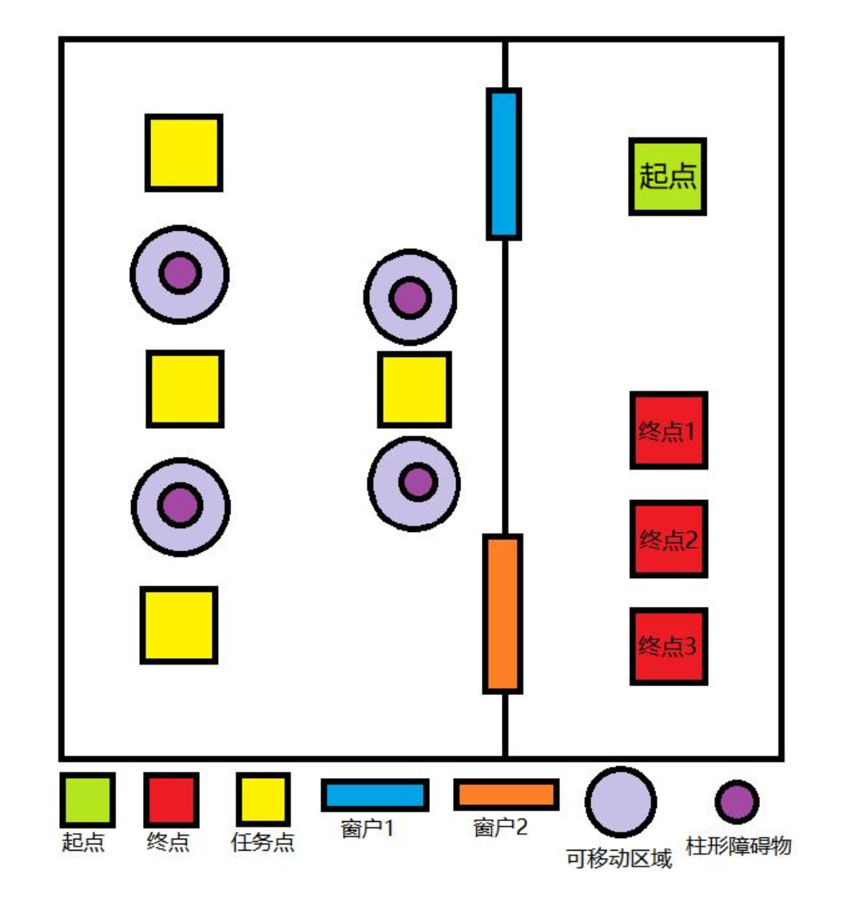

# 空中机器人任务挑战赛
## 比赛要求

轴距不低于**450**mm

长距离点状激光聚焦模块

## 比赛场地

### 地图

机器人进入场地后，需要在出发区起飞依次穿越窗户 1、分别导航到 4 个任务点
进行识别，识别出正确的任务点并进行灯光提示，躲避柱形障碍物到达窗户 2 附近，
穿越窗户 2 进入终点区域，选择与自己队伍任务要求相同的终点进入。进入终点时，
机器人在地面投影完全进入终点便算到达，到达终点着地后比赛结束。

### 识别区域

4个任务点，每个任务点为35✖️35cm，中心贴有识别标志

### 窗户
1m✖️0.75m 下沿离地0.4m

## 得分

| 任务描述                          | 分值 |
|-----------------------------------|------|
| 穿过窗户 1                        | (20) |
| 识别到第一个目标并进行灯光定位    | (10) |
| 识别到第二个目标并进行灯光定位    | (10) |
| 识别到第三个目标并进行灯光定位    | (10) |
| 识别到第四个目标并进行灯光定位    | (10) |
| 穿过窗户 2                        | (20) |
| 识别到正确的终点并进行灯光定位    | (10) |
| 降落在正确的终点区域              | (10) |
| 技术文档或现场答辩                | (10) |