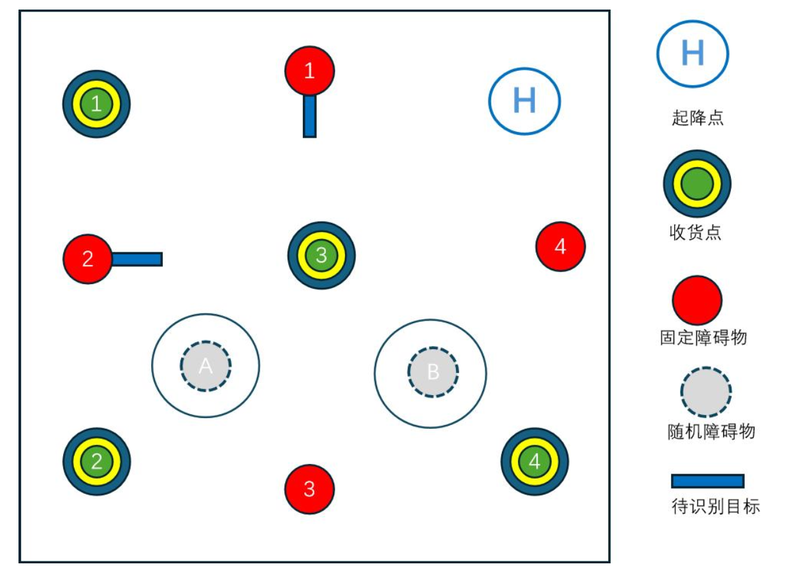
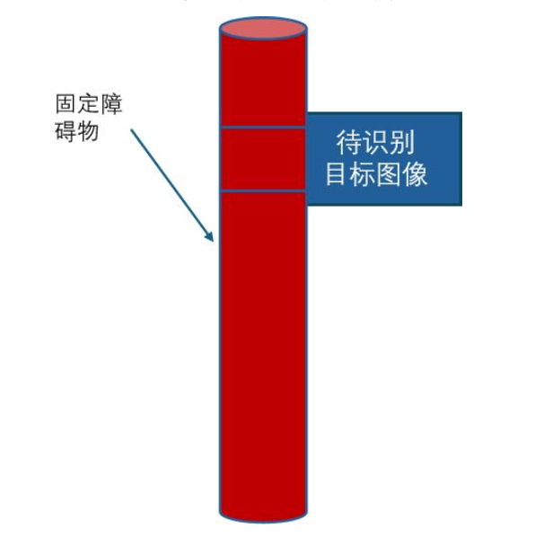
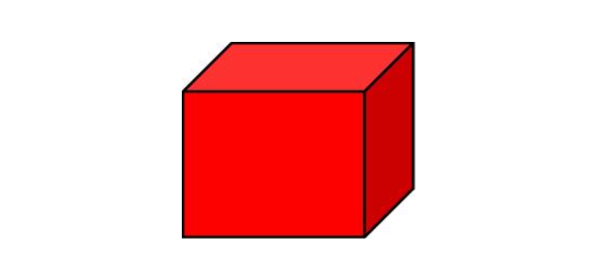

# 空中机器人物流搬运任务挑战赛
## 比赛要求

轴距不低于**450**mm

四个50✖️50✖️50 mm 正方形物流模块

## 比赛场地

### 地图

机器人进入场地后，需要在起飞区依次导航到 1-2-3-4 投放点进行投放，识别出
正确的投放点并进行投放正确的物流块，识别到待识别目标并且降低高度飞行，投放
完毕进入降落点区域，机器人落地后，脚架全部进入起降点的边线内算降落成功。

### 识别下降避障

待识别目标图像离地面距离不低于 1.2m，无人机识别到图像后要做出明显的下降动作
来避开待识别目标，并保持下降后的高度继续飞行任务。

**识别到待识别目标并下降 20cm 高度**

### 收货点圆环

外环直径为 60cm、中环直径为35cm，内环直径为 15cm

**投中内环计 15 分、中环 10 分、外环 5 分**

每支队伍的投放顺序由比赛前一天公布，例如“白-黑-红-黄”、“红-黑-白-黄”等

## 得分
| 任务描述                          | 分值 |
|-----------------------------------|------|
| 1. 将正确的物流块投放到 1 号收货点 | (15) |
| 2. 将正确的物流块投放到 2 号收货点 | (15) |
| 3. 将正确的物流块投放到 3 号收货点 | (15) |
| 4. 将正确的物流块投放到 4 号收货点 | (15) |
| 5. 识别到待识别目标并下降 20cm 高度 | (20) |
| 6. 降落在终点区域                | (10) |
| 7. 技术文档或现场答辩            | (10) |